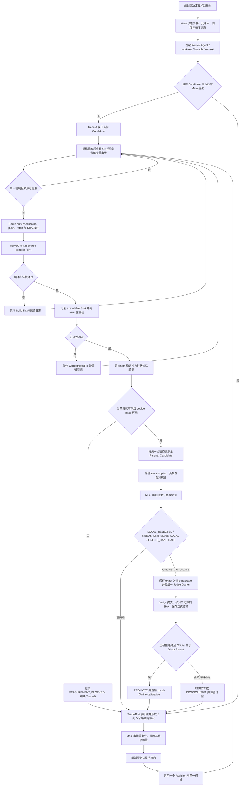

# Phase4 项目实验手册

本手册统一 Phase4 的路线治理、实验执行、证据留存与结果判定。它汇总现有项目规则，不替代测时细节文件。

## 执行入口

任何 Route 操作前，按顺序读取：

1. `phase4/control/project-experiment-playbook.md`
2. `phase4/control/execution-contract.md`
3. `phase4/control/local-timing-protocol.md`
4. 当前 `scheduler.tsv`、`online-candidate-pool.tsv`、`local-online-calibration.tsv` 和 `server3-device-leases.tsv`

Main 与 Route Agent 以 canonical 仓库和上述共享控制文件为事实来源。本文规定职责与流程；源码身份、构建、测时和共享状态的操作细节以对应文件为准。

## A. 路线治理权限

规划层统一决定技术路线树以及路线的 KEEP、MERGE、PARK、REPLACE、新开或关闭。Main 与 Agent 可以提出证据、风险和建议，不得自行改变路线树、恢复冲突路线、合并路线或选择替代方向。发现 ownership 冲突时，只暂停受影响路线并报告。

Main 负责调度、差异审阅、Git 集成、证据登记、源码溯源、本地结果分类、线上候选准备、统一 Judge 协调和路线建议。Main 不编辑 Candidate 的 `.asc`、`.cpp`、`.h`、`.hpp`、CMake、Kernel、runner 或 host wrapper。实现修改交由所属 Route Agent。

## B. Route 隔离与长期归属

```text
1 Route = 1 Agent = 1 worktree = 1 branch = 1 context
```

Agent 只操作自己的路线，不读取或修改未授权路线的 Candidate，不与其他 Agent 共用可写 Candidate 工作树。同一路线后续 Revision 由原 Agent 继续。只有原 Agent 确认不可恢复时，replacement worker 才可继承同一路线、工作树、分支、Revision 与证据；不得借机换路线。

## C. Track-A / Track-B

- `Track-A` 处置当前 Candidate：核实父版本与来源，完成构建、正确性、可比测量及 Main Review。
- `Track-B` 在同一路线内持续做只读研究，形成 3–5 个不同的后续假设，记录瓶颈、目标形状、预期收益、失败原因、Ascend C 可行性、UB/核/DMA/同步影响、精度风险、重复性、最小单变量差异和证伪测试。
- Candidate 等设备或 Judge 时，Track-B 继续；不得在未得到 Main 对当前 Candidate 的明确结论前叠加新的性能 Revision。
- Main 一次只批准一个假设。路线级 KEEP / PARK / MERGE / REPLACE 仍由规划层决定。

## D. Revision 声明

性能代码修改前，先记录：

```text
ROUTE
REVISION
DIRECT_PARENT
PARENT_SOURCE_SHA
PARENT_SCORE
SINGLE_HYPOTHESIS
CONTEXT_CLASS
WHY_NOT_DUPLICATE
```

组合历史机制时另记 `WHY_THIS_COMBINATION_IS_NEW`。版本号顺序本身不能证明父版本。新的独立假设从最新 Best 或已 PROMOTE 版本开始。

## E. OFAT / SINGLE_CHANGE_AUDIT

一个性能 Revision 只验证一个概念性机制。多处编辑只有在共同实现同一假设时才合规。发现两个独立性能机制时记 `SINGLE_CHANGE_AUDIT=FAIL`，不得进入线上候选。

## F. 每次修改后的 Git checkpoint

每次代码修改后立即查看 `git status` 与该路线的 `git diff`，核对单变量范围，计算源码 SHA，然后只暂存该 Route 的源码或证据文件并 commit、push。fetch 后确认本地分支与该路线远端分支一致。Candidate 源码、测量证据和 shared control 分开提交；禁止 `git add .`、force push、blind reset、clean 或覆盖已有证据。

## G. Exact-source SHA

每个 Revision 的源码、sidecar、父版本差异、构建记录和测量输入都须指向同一份可追溯来源。提交到 server3 前计算本地 SHA；server3 收到的源码 SHA 必须相同。线上提交还须满足 `LOCAL_SHA = SIDECAR_SHA = REMOTE_SHA`，否则记为 `INPUT_IDENTITY_MISMATCH`，不得当作正式结果。

## H. server3 编译与链接

按项目现有 CANN、SoC、编译命令和 wrapper/object/alink 链路执行。记录源码 SHA、环境、命令、完整编译日志、链接结果及 executable SHA。编译或链接失败只说明当前实现/环境未通过该阶段，不单独证明性能架构无效。

## I. Build Fix / Correctness Fix

Build Fix 或 Correctness Fix 只能处理编译、ABI、API 使用、对齐、同步、正确性或构建兼容问题；可留在原假设及 Revision 内。禁止借 FIX 引入新性能机制。性能假设不变时，按项目记录方式保留每次修复的差异和来源。

## J. NPU correctness

编译与链接通过后，使用 exact source 和对应 executable 完成目标 NPU 正确性。记录用例、返回码、误差、日志以及源码/executable 身份。正确性未 PASS 的 Candidate 不得测性能或提交线上。

## K. Same-binary qualification

Parent 在与 Candidate 相同的设备、形状、dtype、runner、进程方式及计时边界下先做自身稳定性验证。必须满足 `local-timing-protocol.md` 对该形状的资格条件；一个形状或路线的 PASS 不外推到其他形状、dtype、设备或 executable。失败时记 `MEASUREMENT_BLOCKED`，不测 Parent/Candidate。

## L. Performance device lease

所有性能测量使用 `phase4/control/server3-device-leases.tsv`。同一 device 同一时段只运行一条性能路线，不跨 Main 重叠。开测前实时读取设备、HBM、AICore 和进程；结束后记录并释放 lease。若没有合格设备，不强测，其他可并行的构建、正确性和 Track-B 工作继续。

## M. Parent/Candidate paired timing

使用同设备、同形状、同 dtype、同 runner、相邻时间窗的交错 P/C。计时边界、warmup、采样数、统计量、顺序和原始记录均遵循 `phase4/control/local-timing-protocol.md`。保留全部 raw samples、Parent jitter、Candidate jitter、paired delta、方向一致性、设备/HBM/AICore/进程快照和负载分类；不得事后按结果删样本或改 outlier 规则。

## N. Local result classification

本地百分比和 proxy 不是 Official Score。Main 根据正确性、身份、Same-binary、paired comparability、noise floor 与负载情况分类：

- `LOCAL_REJECTED`：稳定退化或正确性失败。
- `NEEDS_ONE_MORE_LOCAL`：方向混合、证据不足或差异落在噪声范围内。
- `ONLINE_CANDIDATE`：各项前提通过，且配对改善明显超过噪声。
- `MEASUREMENT_BLOCKED`：设备、负载、同 binary 稳定性或身份不满足测量条件；不把缺少测量当作零收益。

负载污染的数据保留为污染证据，不用于强性能结论。

## O. 进入 ONLINE_CANDIDATE 的条件

必须同时具备 Correctness PASS、`SINGLE_CHANGE_AUDIT=PASS`、来源与 executable 身份可核验、Same-binary PASS、可信 Parent/Candidate 配对改善超过 noise floor，且 `LOAD_QUALITY` 非污染。Main 完成差异、父版本、重复机制、可比性和 provenance 审阅后，才可标为 `ONLINE_CANDIDATE`。

## P. Exact Online package

每次正式提交单独保存在 `phase4/online/<ROUTE>/<REVISION>/`，至少包括：

```text
submission.asc
submission.sha256
result.json
source-meta.json
diff.patch
```

元数据记录路线、Revision、直接父版本及 SHA/分数、单一假设、context class、来源 commit/path、submission ID、本地与远端 SHA、Official Score 和 decision。已有证据的目录不覆盖。

## Q. Unified Judge Owner

Child 不得线上提交。多 Main 只有统一指定的 Judge Owner 执行正式提交；其他 Main 只保留 exact source、更新候选池必要信息并 handoff，禁止重复提交。正式入口为：

```bash
npm run cannjudge:submit -- --yes --source <exact-file>
```

禁止 clipboard、paste 和 stdin。

## R. 三方源码身份

正式结果必须证明 `LOCAL_SHA = SIDECAR_SHA = REMOTE_SHA`。不一致时记录 `INPUT_IDENTITY_MISMATCH`、`formalResultEligible=false`，并排除出正式比较；不得用 submission client 自报值代替 Judge 返回源码的核验。

## S. Official Promote / Reject

Candidate 只与其 Direct Parent 比。只有 Correctness PASS 且 Official Score 高于 Direct Parent 才能 `PROMOTE`。低于父版本或正确性失败记 `REJECT`；必要证据缺失时记 `INCONCLUSIVE`。新独立假设从最新 Best / Promoted Parent 开始，不在 regression 上叠加无关优化。

## T. Local ↔ Online calibration

每个正式结果都在 `phase4/control/local-online-calibration.tsv` 追加一行，比较本地与 Official 的方向、幅度、形状、dtype、context、false positive 和 false negative。Official 是最终结果，本地数据只用于筛选。

## U. Local evaluator versioning

不得因单个线上样本临时改评分器。先积累重复校准证据并确认系统性偏差，再提出带版本号的 evaluator 变更；使用历史 Online 样本回放，只有误判下降且记录可复现时才接受新版本。旧版本和回放结果保留。

## V. Route lifecycle / PARK

Main 可根据实验数、正确性进展、本地信号、信息增量和 Online 结果提出 KEEP / PARK / MERGE / REPLACE 建议；最终路线树由规划层决定。PARK 前保留源码、SHA、构建/正确性/测量结果、raw data、差异和 handoff。释放 slot 或分配替代路线须由规划层确认；旧 Agent 不直接转去无关路线。

## W. Failure evidence retention

失败、Rejected、Inconclusive、工具失败及来源身份不一致的实验都保留。保存源码、父版本差异、声明、构建/链接/正确性日志、executable 身份、raw timing、设备快照、handoff 与 Main Review。每个 Revision 目录只写一次，不覆盖已产生证据的版本。

## X. Git / shared-control rules

Canonical 集成仓库为 `/Users/sunyiyang/Desktop/Project/cann`。实验分支以实际 Git 状态为准。Route 分支只提交该 Route 文件；shared control 只做最小行级改动，且只能更新本 Main 所有路线的行。修改前重新读取最新 HEAD 和文件内容。

`scheduler.tsv`、`online-candidate-pool.tsv`、`local-online-calibration.tsv`、`server3-device-leases.tsv` 属于多 Main 共享状态。其他 Main 更新非本 Main 路线时接受最新值；本 Main 路线 ownership 被改时，只暂停受影响路线并报告 `OWNERSHIP_CONFLICT`；其他路线的状态或设备字段不覆盖。Route push 与 canonical control commit 分开进行。

## 中文总流程


