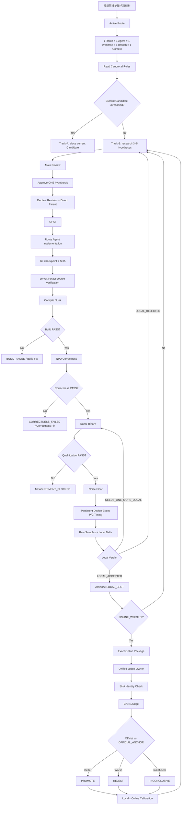
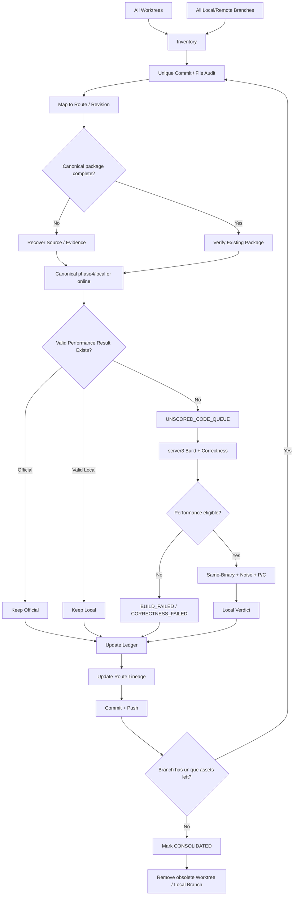

# Phase4 Route Exploration Map

Canonical: `/Users/sunyiyang/Desktop/Project/cann`
Rebuilt: 2026-09-28 (MAIN-1 consolidation phase)

Lineage is reconstructed from `source-meta.json` `direct_parent` / `parent_source_sha`,
`main1-revision-ledger.tsv`, online `result.json`, and route-branch diffs.
Version order alone is **not** parent evidence.

## Experiment flow (canonical)

## Consolidation flow

## Overall champion / exploit

| Route | Best revision | Official | Source SHA | Parent (proven) |
|---|---|---|---|---|
| R31B | V011 | **45.16** | `a8c19a19…b15e3` | V010 (source-meta) |
| R31A | V016 | 45.00 | `dd130938…4fa0` | see ledger |
| MIX-A | V003 | 44.69 | `1a1857a9…c706` | V002 (WA parent) |

## MAIN-1 explore lanes (protected worktrees)

| Lane | Focus | Current candidate | Notes |
|---|---|---|---|
| R31B exploit | aggressive multimode | V016 (lowp wide tile) | Official best V011 |
| R31A exploit | conservative evolution | V021 fence-placement | Official best V016 |
| MIX-A | hybrid / sync | V007 SyncVToMTE2 removal | Official best V003 |
| WIDE-X-FRESH4 | wide-D specialist | V001 tile 2048→4096 | provenance hold |
| MODE-X-R015C | multi-row / rows-per-block | r4 1 row/block | |
| DTYPE-SPECIAL-X | dtype-specific paths | V001 FP32 aligned copy | |

## MAIN-2 explore lanes (R2, frozen R31B-V011 lineage)

Parent for all R2 routes: `FROZEN_R31B_V011` `a8c19a19…b15e3` Official 45.16.

| Route | Mechanism | Disposition | LOCAL_BEST |
|---|---|---|---|
| SCHED-CHAMPION-X | group-aligned row ownership | PARK (structural ceiling; Official 41.93 stack REJECT) | V002 local-only |
| REDUCE-HIER-X | RMS reduction topology | PARK (3 variants, reduction not bottleneck) | none |
| EPILOGUE-FUSE-X | epilogue arithmetic | PARK (SCALE-FOLD/VMLA in noise or regression) | none |
| COEFF-LOCALITY-X | gamma/bias load | PARK (H1 regressed, H2 no UB) | none |
| VECTOR-MATH-X | scalar/vector denominator | V002 MEASUREMENT_BLOCKED | none |
| STORE-EPILOGUE-X | single-row writeback merge | **LOCAL_ACCEPTED V002** | V002 −5.62% large |
| INTEGRATION-X | SCHED+VECTOR stack | Online REJECT 41.93 | — |

## Historical / parked (evidence donors only)

SCHED-ROWGROUP-X (Official 22.27 on weak parent), UB-LIVENESS-X (JUDGE_READY V003),
ALIGN-TAIL-X, BATCH-RESIDENT-X, ASYNC-TRIPLE-X, REDUCE-INVSCALE-X, EPI-X-FRESH, EXT-ASCEND-X.

## Unscored code queue

See `phase4/control/unscored-code-queue.tsv` (maintained during consolidation).

## Consolidation results (2026-09-28)

### Unscored-code validation — all 11 terminal

| Route | Revision | Verdict | Note |
|---|---|---|---|
| R31B | V016 | **LOCAL_ACCEPTED** | fp16-wide −6.7%~−7.0% 15/16+16/18; bf16-wide not established |
| R31A | V020 | CORRECTNESS_FAILED | 507035 at D=32768; parent passes |
| R31A | V021 | NEEDS_ONE_MORE_LOCAL | mixed P/C within noise |
| WIDE-X-FRESH4 | V001 | **LOCAL_ACCEPTED** | tile 2048→4096, −17% mean, 4/4 both shapes |
| WIDE-X-FRESH4 | BUILD-FIX-001 | BUILD_FIX | no performance mechanism |
| WIDE-X-FRESH4 | CURRENT | BUILD_FAILED | sqrtf + DataCopyPad narrowing |
| MODE-X-R015C | R015C-r3 | VALID_CORRECTNESS_BASELINE | parent r2 correctness-failing |
| MODE-X-R015C | R015C-r4 | CORRECTNESS_FAILED | AddRmsNormBias 3/3 FAIL |
| EXT-ASCEND-X | V001 | CORRECTNESS_FAILED | FP32 27/27 FAIL |
| REDUCE-INVSCALE-X | V001 | CORRECTNESS_FAILED | D>6144 inherited R006 defect |
| REDUCE-INVSCALE-X | V002 | MEASUREMENT_BLOCKED | correctness PASS 16/16; same-binary unqualified |

### LOCAL_ACCEPTED candidates (future Online consideration)

1. **R31B V016** — fp16-wide change-domain win on champion lineage
2. **WIDE-X-FRESH4 V001** — wide tile 2048→4096, −17% on both wide shapes
3. **STORE-EPILOGUE-X V002** — large-shape writeback merge −5.62% (from MAIN-2 R2)

No new Online submissions this phase (per task pause).
