# 外部对话中的「探索流程与要求」一比一复述

> 来源：ChatGPT 分享对话《编译并修复》 → https://chatgpt.com/share/6aab9d72-9a7c-83e8-93b7-672911dfe8d2
> 本文件**逐字搬运**对话原文：不改写、不归纳、不补推断。每个小节标注对话节点号与时间，便于回原对话核对。
> 我写的只有每节开头那行「对应提问」和本节末尾的归档说明，其余全部是对话原文。

## 来源节点索引

| 节点 | 时间 | 内容 |
| ---: | --- | --- |
| 250 | 2026-09-16 13:55 | 自动搜索系统设计：8 个性能轴、Successive Halving、贪心组合、7 个角色、提交时机（18 节，ASCII 图） |
| 255 | 2026-09-16 14:03 | 总目标 / 多子代理协同 / 候选筛选流程 / 优先顺序 / 单因素实验 / 组合优化 / 分档 / 何时提交（10 张流程图） |
| 271 | 2026-09-16 14:04 | 多支线自治锦标赛：子代理内部自动循环、服务器分资源、失败不停、交叉消融、汇报条件（9 张流程图） |
| 277 | 2026-09-16 14:09 | Route-isolated evolutionary search：独立 branch、原子修改、失败必留记录、路线停止条件、两阶段结构（9 张流程图 + gitGraph） |
| 283 | 2026-09-16 14:11 | 最终架构与完整闭环，含对用户方案的逐条客观评价与三条风险（6 张流程图 + gitGraph） |
| 681 | 2026-09-17 00:04 | 可直接交给新 Agent 的完整提示词：21 节（目标/口径/Reference/实验方法/工作流/证据层级/已有路线/Champion/本轮任务/禁止项/正确性检查/性能评价/输出要求/多 Agent/Git 纪律/文件清单/provenance/哲学/交付物） |
| 1100 | 2026-09-17 15:36 | 广度优先的五阶段固定流程与各支线探索状态（2 张流程图） |
| 1119 | 2026-09-17 15:47 | 并行两条独立支线的提交方案与树（1 张流程图；两份候选源码已单独归档，此处不重复） |


---

## 节点 0250｜2026-09-16 13:55

> 对应提问（节点 0241，2026-09-16 13:55）：自动搜索系统设计：8 个性能轴、Successive Halving、贪心组合、7 个角色、提交时机（18 节，ASCII 图）

### 对话原文（逐字）

message_reaction👍明白。你的目标不是“人工按 R001→R029 一条条顺序试”，而是建立一个**自动化性能搜索系统**：

> 多个 Codex 子代理并行探索不同优化支线 → 每次严格只改变一个变量 → 在你的 Ascend 服务器自动编译、正确性验证、性能测试 → 自动淘汰差方案 → 保留当前 Champion → 再围绕 Champion 做交叉组合 → 只有出现明显优于当前版本的候选时才告诉你，你再提交线上。

这个方向是对的，而且比直接让一个 Agent 不断“凭感觉优化”可靠得多。

你的文档本身已经要求“一版只验证一个主要假设”、同一源码不能被多个 Agent 同时改写，并且服务器实测和平台提交分层记录。fileciteturn5file0L510-L516 文档也已经定义了资料/数值/Kernel 三类 Agent，只是现在可以把它进一步升级成**自动锦标赛式搜索**。fileciteturn5file0L471-L483

# 一、不要真的搜索 29 条路线

29 条里面很多根本不是性能候选。

当前 D 已经 15/15 Pass，因此下面这些应该**冻结**：

```text
R003 纯 Ascend C 直调
R009 DataCopyPad
R012 32B 行组
R016 按行分核
R017 FP32 全中间
R018 CAST_RINT
R020 Sqrt
R023 工程规范
```

还有这些暂时不碰：

```text
R004 低精度中间       已经属于否决路线
R008 Tile 跨核         当前否决
R010 手工尾块          只是 DataCopyPad 失败后的后备
R021~R027              大部分是环境、验证、研究支撑
```

你的文档也明确把 R004/R008 归为默认不采用、R010 为后备、R011 为与 ReduceSum 竞争的实验路线。fileciteturn5file0L117-L128

真正值得搜索的性能空间大约只有：

```text
R002 单遍 y 驻留
R005 Tile 大小 / 分档
R011 手工归约
R013 双缓冲
R014 Gamma/Bias 驻留
R015 多行合并 DMA
R019 Div ↔ reciprocal*Muls
R028 标量同步削减
R029 根据 D/outer 动态分档
```

所以不是 29 选 1，而是大约 **8 个性能轴**。

---

# 二、最快的方法不是“所有组合穷举”

8 个轴如果全部做有/无组合：

```text
2^8 = 256
```

再加：

```text
tile size
batch size
D threshold
dtype
```

很快就上千版本。

没必要。

我建议用：

> **并行单因素筛选 → Successive Halving → Champion/Challenger → 贪心交叉组合**

这是最适合你这个任务的。

---

# 三、建立一个永远不动的 Baseline

现在的 **D 版本冻结**：

```text
BASELINE-D

15/15 Pass
8192 tile
两遍扫描
residualFp32 复用
FP32 全中间
ReduceSum
DataCopyPad
Div + Sqrt
```

以后任何 Agent 都不能直接改 D。

所有实验：

```text
D
├── branch-R002
├── branch-R014
├── branch-R015
├── branch-R028
├── branch-R013
├── branch-R011
└── branch-R019
```

独立进行。

最好直接 Git：

```text
baseline-d
experiments/r002
experiments/r014
experiments/r015
...
```

或者临时 `git worktree`。

这样绝对不会发生：

> Agent A 改了一半，Agent B 又在同一个 kernel.asc 上覆盖。

---

# 四、第一阶段：6 个 Agent 并行做“单因素筛选”

第一轮我会这样分配。

| Agent | 路线 | 唯一问题 |
|---|---|---|
| A1 | R002 | 小 D 保存 y，取消第二次 x/residual GM 读取 |
| A2 | R014 | 每 Core 缓存 gamma/bias 是否值得 |
| A3 | R015 | 小 D 多行合并 DMA |
| A4 | R028 | 多行合并 V↔S scalar synchronization |
| A5 | R013 | 双缓冲能否隐藏 MTE2/MTE3 |
| A6 | R019 | `Div(y,rms)` vs `Muls(y,1/rms)` |

暂时**不让 R011 手工归约参加第一轮**。

因为现在 `ReduceSum` 已经正确，而且手写归约改动较大。先看高收益方向。

文档本来也把单遍驻留、双缓冲、gamma/bias 驻留、多行 DMA 和同步削减作为不同的性能实验轴。fileciteturn5file0L296-L310 fileciteturn5file0L321-L324

---

# 五、每个 Agent 内部也不要只产生一个版本

例如 R002。

不是只试：

```cpp
if (D <= 4096)
```

而是让这个 Agent 自动做一个小参数 sweep：

```text
R002-V1   D <= 1024
R002-V2   D <= 2048
R002-V3   D <= 4096
R002-V4   D <= 8192
```

但是：

> **V1 → V2 每次 diff 仍然只有 threshold 一个变量。**

同理 R015：

```text
batchRows = 2
batchRows = 4
batchRows = 8
```

R028：

```text
scalar batch = 2
scalar batch = 4
scalar batch = 8
```

R013：

```text
single buffer
→ double buffer
```

不要在一个版本里同时调五个参数。

---

# 六、用 Successive Halving，不要每个版本都跑完整大矩阵

这是加快迭代最重要的一点。

### Stage 1：快速淘汰

每个候选：

```text
编译
↓
几个 correctness smoke cases
↓
3~5 个代表性性能 case
↓
每个运行 5~10 次
```

只要：

```text
编译失败
精度失败
性能比 D 慢 >5%
```

直接淘汰。

比如一个 Agent 产生 8 个候选：

```text
8
↓
快速跑
↓
留 4
↓
中等矩阵
↓
留 2
↓
完整矩阵
↓
留 1
```

这就是 Successive Halving。

比：

```text
8 个候选 × 完整矩阵 × 50 次
```

快很多。

---

# 七、真正的性能比较必须串行

这一点非常重要。

**Codex Agent 可以并行写代码、分析和编译。**

但是：

> 如果只有一张 NPU，多个 Agent 不能同时跑性能测试。

否则：

```text
Agent A kernel
Agent B kernel
系统负载
DVFS
内存带宽争用
```

会把微秒级结果全部污染。

因此架构应该是：

```text
            ┌─ Agent R002 ─ compile ─┐
            ├─ Agent R014 ─ compile ─┤
Orchestrator├─ Agent R015 ─ compile ─┼── Benchmark Queue
            ├─ Agent R028 ─ compile ─┤         │
            └─ Agent R013 ─ compile ─┘         ▼
                                          单独占用 NPU
                                              │
                                              ▼
                                            results
```

即：

### 可以并行

```text
代码生成
静态检查
CPU reference
CANN 编译
日志分析
```

### 必须串行

```text
NPU performance benchmark
```

除非你的服务器有多张相互独立的 NPU。

---

# 八、不要用“单次最快时间”选择 Champion

本地建议：

```text
warmup = 10
measurement = 30
```

记录：

```text
min
median
p90
```

真正用于排序：

> **median 为主，min 为辅。**

因为：

```text
3.91 μs vs 3.95 μs
```

这种完全可能只是噪声。

建议规定：

```text
< 3%      = 当作无差异
3%~8%     = 可疑，增加重复次数
> 8%      = 值得保留
> 15%     = 明显优化
```

---

# 九、建立一个统一的 Local Score

不要让 Agent 看见某一个 case 快就说“赢了”。

假设本地有 N 个代表 workload：

\[
S=\exp\left(
\frac1N\sum_i
\log\frac{T_{baseline,i}}{T_{candidate,i}}
\right)
\]

也就是**几何平均加速比**。

简单理解：

```text
S = 1.00   无提升
S = 1.10   整体约快 10%
S = 1.50   整体约快 50%
S = 2.00   整体约 2×
```

同时设置硬约束：

```text
正确性必须 100%
任何核心 workload 不允许退化 >10%
```

这样不会出现：

```text
case 4 快 3×
但其他 10 个 case 慢 40%
```

还被错误选成 Champion。

---

# 十、本地 benchmark 矩阵不要一开始搞得巨大

建议分成三个集合。

### Fast Set

专门用来筛枝：

```text
small D + large outer
medium D + medium outer
large D
FP16
BF16
FP32
non-32B aligned D
```

大约：

```text
6~10 cases
```

### Full Set

大约：

```text
30~60 cases
```

覆盖：

```text
dtype
D
outer
rank
对齐/非对齐
```

### Stress Set

只验证安全性：

```text
D=1
D=31
D=33
D=127
D=129
D=8192
D=32768
极大 outer
```

Champion 必须：

```text
Fast → Full → Stress
```

全部通过。

---

# 十一、第一轮结束后不要马上把所有赢家混起来

比如结果：

```text
R002    +18%
R014    +25%
R015    +70%
R028    +40%
R013     +3%
R019     +8%
```

不能直接：

```text
R002 + R014 + R015 + R028 + R019
```

因为可能存在冲突。

例如：

```text
R002 保存 y
```

会占 UB。

```text
R014 保存 gamma/bias
```

也占 UB。

它们单独都很好：

```text
18%
25%
```

组合以后可能：

```text
UB 不够
```

或者性能反而变差。

---

# 十二、第二阶段采用“贪心前向组合”

假设第一轮最好的是：

```text
R015 = 1.70×
```

那么：

```text
Champion = D + R015
```

接下来再开几个并行 Challenger：

```text
C1 = Champion + R028
C2 = Champion + R014
C3 = Champion + R002
```

测：

```text
C1  2.10×
C2  1.85×
C3  1.62×
```

那么：

```text
Champion = D + R015 + R028
```

下一轮：

```text
Champion + R014
Champion + R002
Champion + R013
```

如此迭代。

这叫：

> **Greedy Forward Selection**

对于你这种 Kernel 优化，非常实用。

---

# 十三、同时保留一条“纯支线冠军”

还有一个细节。

不能只保留总 Champion。

应该维护：

```text
Global Champion

Small-D Champion
Medium-D Champion
Wide-D Champion
```

因为最后很可能不是一个算法吃掉所有场景，而是：

```cpp
if (D <= threshold1) {
    SmallPath();
} else if (D <= threshold2) {
    MediumPath();
} else {
    WidePath();
}
```

这正是你文档里 R029 的作用：根据 `D / outer / UB / core` 做运行时分档。fileciteturn5file0L323-L324

所以最终目标很可能不是：

> 找到唯一一个最快 kernel。

而是：

> 找到 2~4 个局部最快路径，然后构成一个 dispatcher。

这也是那个参考高性能版本为什么会有：

```text
widePath
wideFp32BatchPath
cachedRowPath
small-row batch
```

这么多分支。

---

# 十四、我建议实际搜索顺序

整体可以压缩成：

```text
                  D baseline
                       │
          ┌────────────┼────────────┐
          │            │            │
        R002         R014         R015
          │            │            │
          ├────────────┼────────────┤
          │            │            │
        R028         R013         R019
          │            │            │
          └───── 单因素锦标赛 ──────┘
                       │
                  Top 2~3 axes
                       │
             Greedy pair combination
                       │
                New Champion
                       │
          再加入剩余独立性能轴
                       │
                 Local Champion
                       │
                      R029
              D/outer 分档整合
                       │
                 Full + Stress
                       │
              ┌────────┴────────┐
              │ local > 10%?    │
              └────────┬────────┘
                       │ yes
                       ▼
                  告诉你提交
                       │
                       ▼
                 Online result
                       │
                       ▼
               反馈给搜索系统
```

---

# 十五、什么时候才通知你提交线上

不要每一轮都找你。

让 Codex 自己循环：

```text
生成
→ 编译
→ correctness
→ benchmark
→ 淘汰
→ 下一候选
```

只有满足：

```text
1. 完整正确性全部通过
2. Full Set 全通过
3. Stress Set 全通过
4. 相对当前线上 Champion：
   local geometric-mean speedup >= 10%
5. 至少一个当前主要瓶颈 workload >= 15% 提升
6. 没有明显性能倒退
```

才停止自动搜索并告诉你：

```text
发现新 Champion
baseline: D
candidate: Hxxx/Vxxx

Local:
GM speedup +xx%
Small D +xx%
Medium D +xx%
Wide D +xx%

Correctness: all pass

建议线上提交。
```

你再手工提交。

---

# 十六、线上结果必须反过来训练“本地筛选规则”

这是非常关键的闭环。

例如：

```text
本地：
Candidate X 比 D 快 30%

线上：
Case 4/6/7 快
Case 14 反而慢
```

那么不能简单说 X 失败。

应该记录：

```text
online behavior
       ↓
推测本地缺少某种 workload family
       ↓
扩充 Full Set
       ↓
重新比较
```

几轮以后，你的本地 benchmark 会越来越接近线上。

最终可能做到：

> Codex 在服务器上自动筛 50~100 个版本，你只需要提交本地前两名。

这就会大幅降低线上实验次数。

---

# 十七、我会把 Codex 调度设计成 7 个角色

不是让 20 个 Agent 全部乱改代码。

```text
1 × Orchestrator
    维护 Champion、实验表、分配任务

4 × Explorer
    并行做不同性能路线

1 × Correctness Judge
    统一运行 correctness matrix

1 × Benchmark Judge
    独占 NPU，串行性能测试
```

关键是：

> **Explorer 没有资格宣布自己赢。**

只有 Benchmark Judge 的统一测试结果可以进入排名。

Orchestrator 根据结果选择：

```text
promote
reject
retry
combine
```

---

# 十八、每一个候选只保存“补丁”，不要复制整套工程

比如：

```text
experiment_id: E-R002-T4096
parent: D
route: R002
change:
    cache_y_threshold 0 -> 4096

compile: pass
correctness: pass
GM_speedup: 1.18
max_regression: 1.02
decision: keep
```

对应 Git diff 可能只有几十行。

这样即使 Codex 自动跑 100 个版本，也能知道：

> 到底是哪一个改变造成性能变化。

文档本身也是这样要求版本记录和实验证据的。fileciteturn5file0L550-L576

---

## 我建议你现在采用的整体策略

可以概括成一句：

> **并行探索，串行裁决；单因素筛选，贪心组合；局部冠军分档，线上只验证本地冠军。**

第一轮我建议同时让 Codex 启动：

```text
A1 → R002 单遍 y 驻留
A2 → R014 gamma/bias 驻留
A3 → R015 多行 DMA
A4 → R028 标量同步削减
A5 → R013 双缓冲
A6 → R019 reciprocal/Muls
```

每条支线内部自动做小规模参数 sweep，然后统一进入同一个 NPU benchmark queue。

**第一轮只选 Top 3，不做任何组合。**

第二轮再从 Top 3 做：

```text
best
best + second
best + third
```

第三轮继续：

```text
new champion + 下一候选
```

最后才用 R029 把不同 `D/outer` 下的局部冠军组合成一个多路径 kernel。

这会比“按 29 条路线逐个试”快很多，也比“多 Agent 同时随意改一个 kernel”更容易得到真正可解释、可复现的最优版本。


---

## 节点 0255｜2026-09-16 14:03

> 对应提问（节点 0251，2026-09-16 14:02）：总目标 / 多子代理协同 / 候选筛选流程 / 优先顺序 / 单因素实验 / 组合优化 / 分档 / 何时提交（10 张流程图）

### 对话原文（逐字）

可以，我用**几个流程图 + 极简说明**来重新整理。你直接看图就行。

---

# 1）总目标：怎么最快找到更优方案

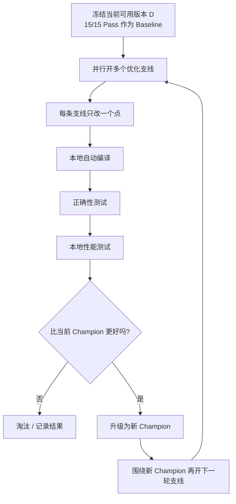

### 这张图表达的意思
你现在不是“手工一个一个试”，而是：

- 先固定一个**基线版本 D**
- 并行开多个支线
- **每个支线只改一个变量**
- 自动测试
- 优胜者成为新的 Champion
- 再继续迭代

---

# 2）整体架构：Codex 多子代理怎么协同

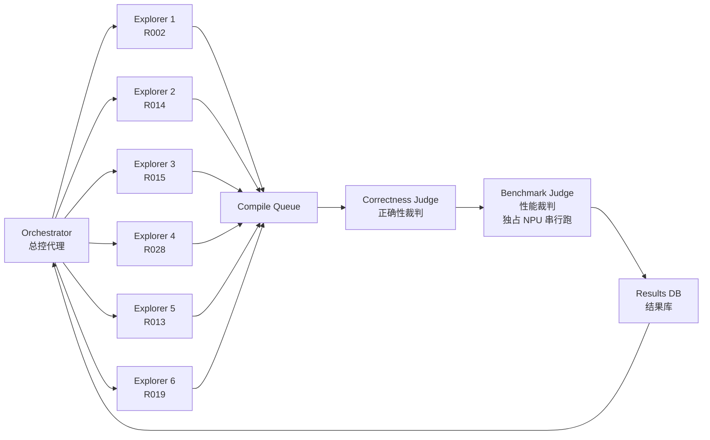

### 角色含义
- **Orchestrator**：调度器，只负责任务分发、保留冠军、决定下一轮方向
- **Explorer**：每个子代理负责一条路线
- **Correctness Judge**：统一跑精度/正确性
- **Benchmark Judge**：统一跑性能  
  > 注意：**性能测试必须串行**，不要多个 agent 同时抢 NPU

---

# 3）一次候选版本的筛选流程

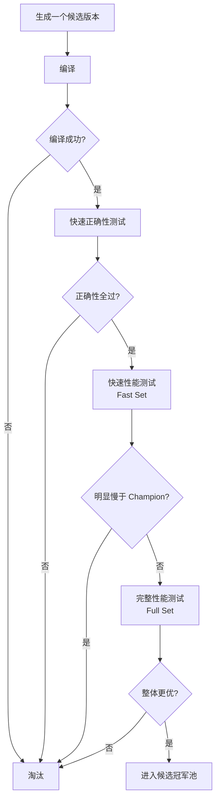

---

# 4）你现在最适合探索的路线

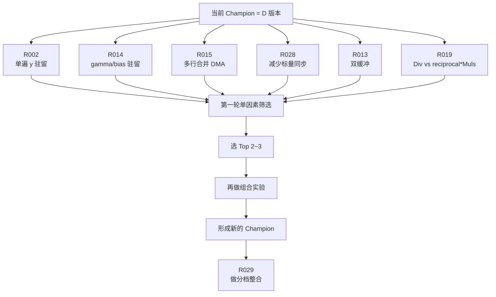

---

# 5）推荐的优先顺序

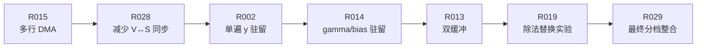

### 为什么这个顺序比较合理
因为你现在最慢的是大 outer / 小 D 这类场景，通常瓶颈更可能来自：

- 每行固定开销太大
- DMA 太碎
- 标量同步太频繁

所以优先试：

1. **R015 多行合并 DMA**
2. **R028 减少标量同步**
3. **R002 单遍 y 驻留**

---

# 6）单因素实验怎么做（最关键）

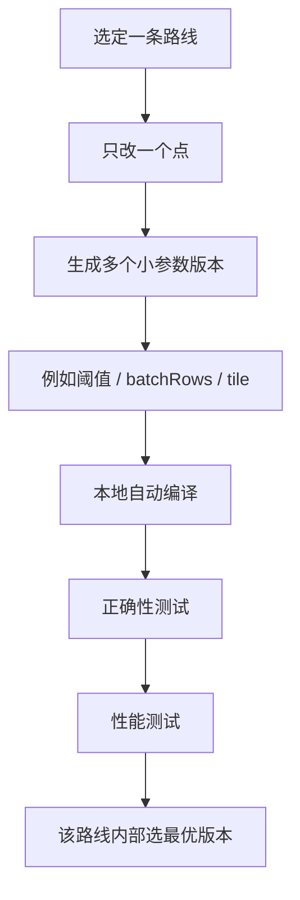

### 例如
## R002 单遍 y 驻留
不要一下子写死一个版本，可以自动试：

- `D <= 1024`
- `D <= 2048`
- `D <= 4096`
- `D <= 8192`

然后在这条支线内部选最优的一个。

---

# 7）第二阶段：怎么做“组合优化”

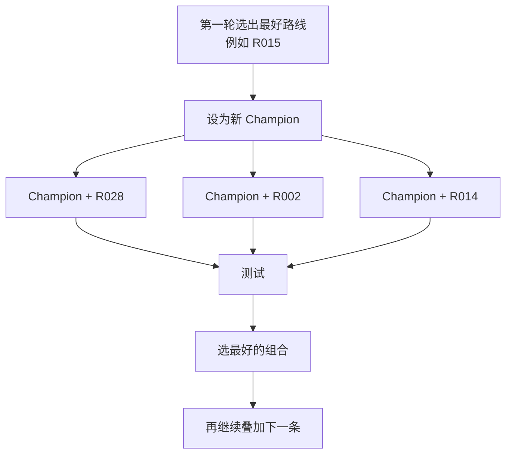

### 核心原则
不是一上来就把所有优化糅在一起，而是：

- 先找**单因素冠军**
- 再把其他路线**一个一个叠加**
- 每次都对比是否真的变快

---

# 8）最终形态：不是一个 kernel 吃天下，而是“分档”

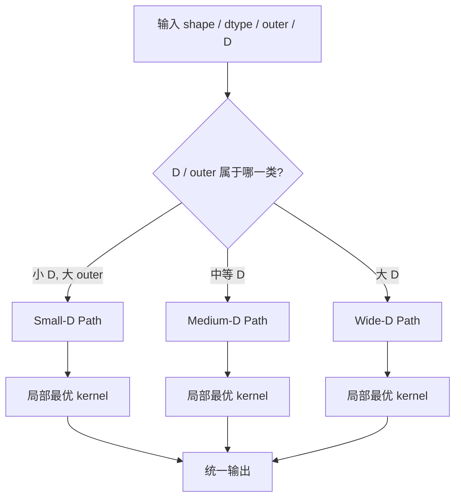

### 这就是最终目标
你不一定会找到“唯一最优解”，更可能是：

- 小 D 最优一套
- 中等 D 最优一套
- 大 D 最优一套

最后统一通过 `dispatch` 选择。

---

# 9）什么时候才值得提交线上

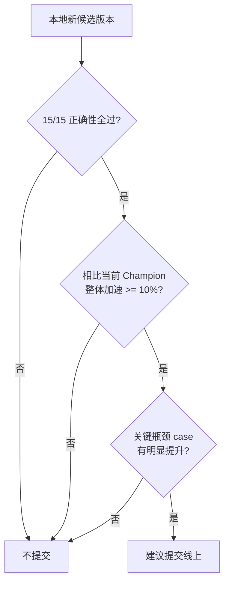

---

# 10）你现在可以直接照着执行的落地方案

## 第 1 轮：并行 6 条单因素路线
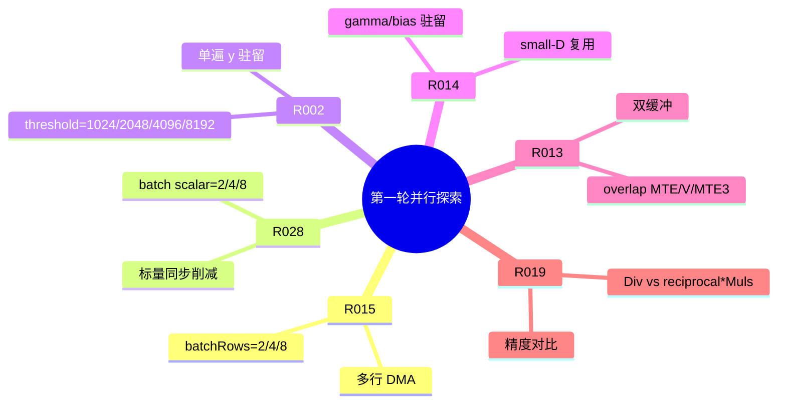

---

# 11）一句话总结版

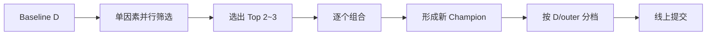

---

如果你愿意，我下一条可以继续直接给你：

## 版本 A：**“Codex 多子代理并行搜索的执行框架图”**
或者  
## 版本 B：**“你本地服务器上的目录结构 + 脚本流程图”**

我可以继续画成更偏“工程落地”的可视化版本。


---

## 节点 0271｜2026-09-16 14:04

> 对应提问（节点 0256，2026-09-16 14:04）：多支线自治锦标赛：子代理内部自动循环、服务器分资源、失败不停、交叉消融、汇报条件（9 张流程图）

### 对话原文（逐字）

明白，而且你现在的想法比我上一版更具体：

> **不是“多个 Agent 各做一个候选然后结束”，而是让服务器三上的多个子代理各自承包一组相关技术路线，在各自支线上持续“小步修改 → 编译 → NPU 运行 → 性能比较 → 再修改”，直到每条支线得到自己的局部最优。最后主 Agent 比较这些支线冠军；只有出现明显优于当前 Champion 的版本时才通知你。**

你文档现有机制已经规定了“多 Agent 探索 → CANN/NPU 实测 → 记录结果 → 再决策”的闭环。fileciteturn6file1L81-L92 也明确要求每版只验证一个主要假设，避免多个改动混在一起无法归因。fileciteturn6file1L102-L108  
当前这份汇总里没有直接出现“服务器三”这个名称，但服务器 CANN/NPU 实测环节是明确存在的。fileciteturn6file2L197-L207

## 我建议改成这种“多支线自治锦标赛”

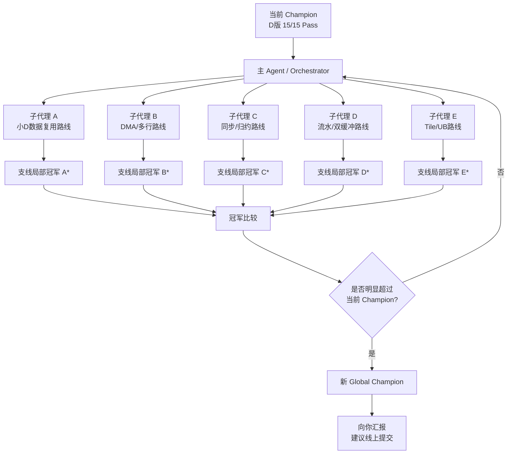

这才是最适合你服务器三的模式。

---

## 每个子代理不是只试“一条路线”

应该给每个 Agent 一个**相互相关的路线族**。

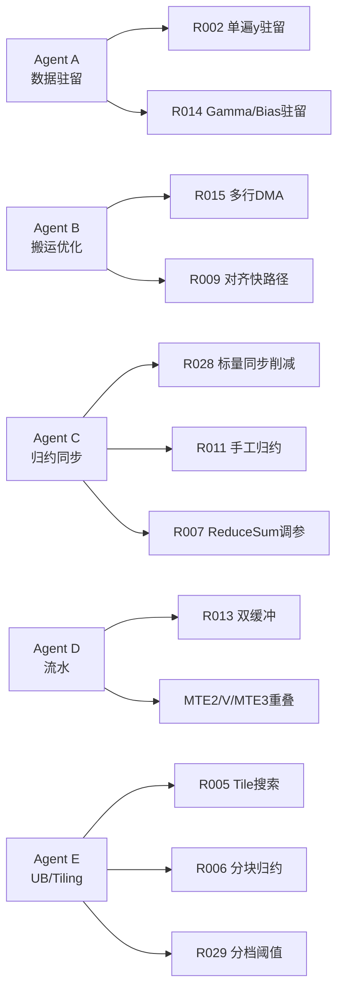

这样比“R002 一个 Agent、R014 一个 Agent”更好，因为同一类优化往往共享分析结果。

---

# 一个子代理内部怎么自动跑

以 Agent A 为例：

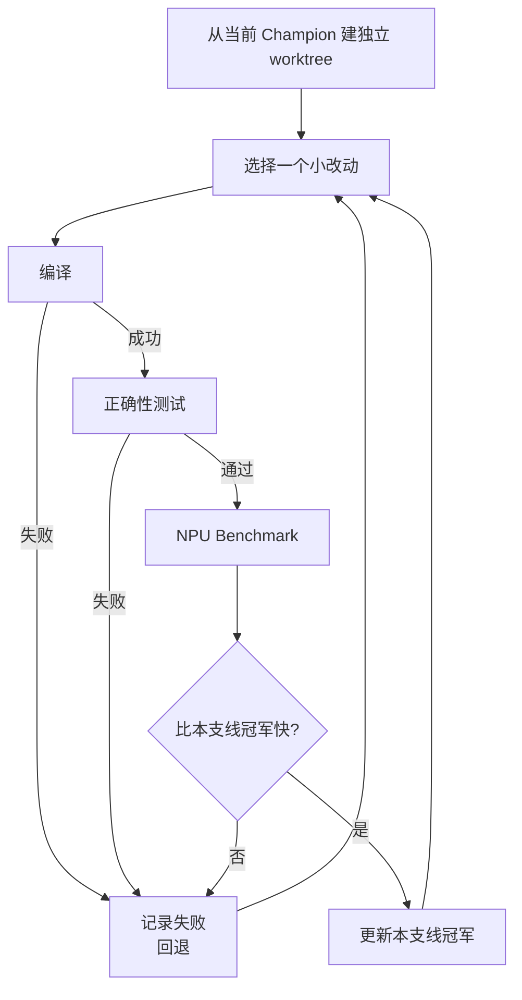

也就是说 Agent A 可以自己循环：

```text
D
→ y驻留 D≤1024
→ D≤2048
→ D≤4096
→ D≤8192
→ y驻留 + 某种安全的参数驻留
→ …
```

但是**任意相邻两个版本仍然只能有一个主要变化**。

---

# 服务器三最适合这样分资源

既然你说服务器三可以真正支持多个子代理同时验证，我会让每个 Agent 拥有：

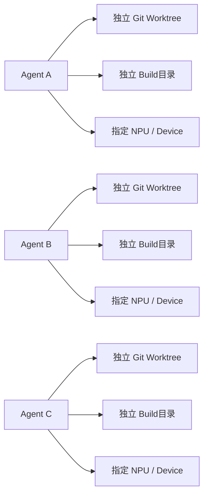

核心是：

**绝对不能让多个 Agent 改同一份 `kernel.asc`。**

每个 Agent：

```text
worktrees/agent-a/
worktrees/agent-b/
worktrees/agent-c/
...
```

最终只由主 Agent 合并冠军。

如果服务器三的并行能力来自多个独立 NPU/Device，那么性能测试也可以真正并行；如果实际上只是同一张 NPU 上跑多个进程，那就只能并行开发/编译，正式性能 benchmark 仍应加设备锁，否则数据会互相污染。

---

# 最重要的：Agent 不要一失败就停止

我建议每条支线给一个“搜索预算”。

例如：

```text
每个 Agent：
最多尝试 10~20 个有效版本
或
连续 5 个版本没有 >3% 改善时停止
```

于是第一轮可能是：

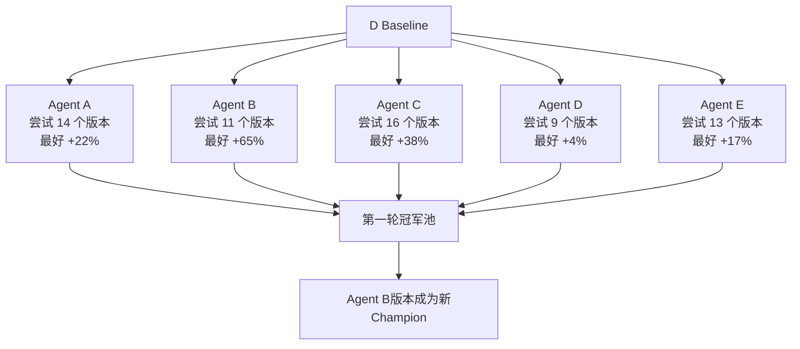

此时**不需要你介入**。

---

# 然后自动进行第二阶段：交叉消融

假设第一轮：

```text
DMA支线       +65%
同步支线      +38%
驻留支线      +22%
Tile支线      +17%
双缓冲         +4%
```

主 Agent 自动启动：

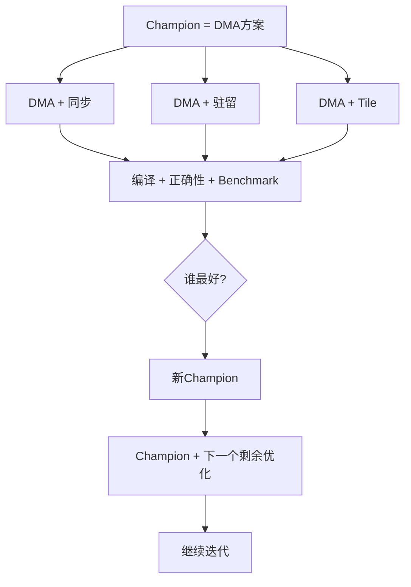

这就是你说的：

> **多支线先各自找优点，再把真正有效的路线做混合。**

而不是一开始就乱组合。

---

# 什么时候才给你汇报

我建议主 Agent平时**静默迭代**。

只有下面三种情况找你：

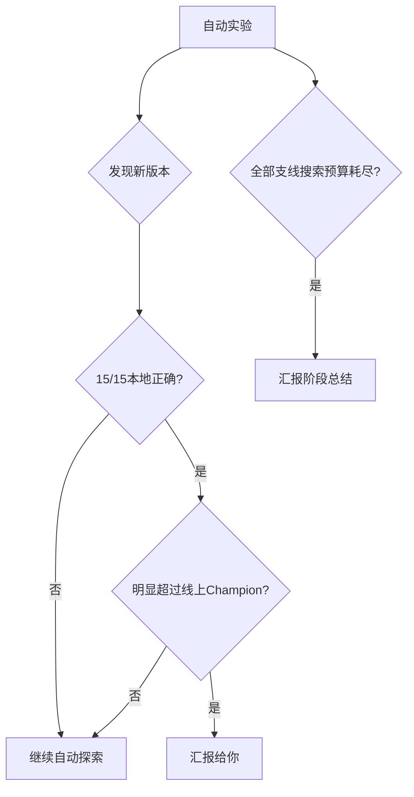

汇报内容也不用很长，只需要：

```text
发现新的本地 Champion

父版本：D
主要路线：R015 + R028
本地正确性：全部通过

相对 D：
整体：+43%
小 D：+91%
中 D：+28%
大 D：+6%

目前最佳版本：V017
建议进行一次线上提交。
```

然后你把线上 15 点结果发回来。

---

# 线上结果再反馈给所有 Agent

这是下一层关键闭环：

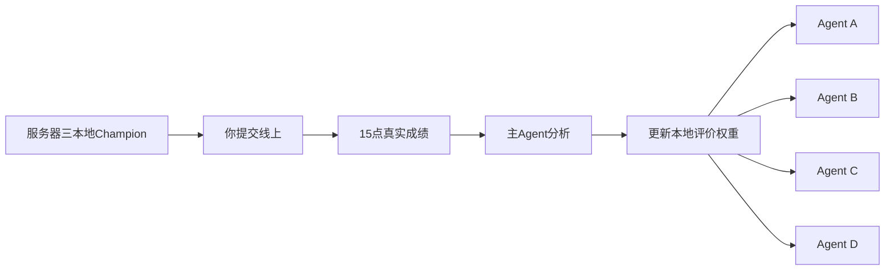

比如服务器三认为：

```text
V017 很快
```

但线上发现：

```text
Case 14 提升巨大
Case 15 退化
```

下一轮主 Agent 就会告诉各子代理：

> 优先寻找“保住 Case 14 优势同时修复大 D”的分档方案。

最后自然会演化到：

```text
small-D champion
medium-D champion
wide-D champion
```

然后用 R029 组合。

---

# 整个系统最终就是这样

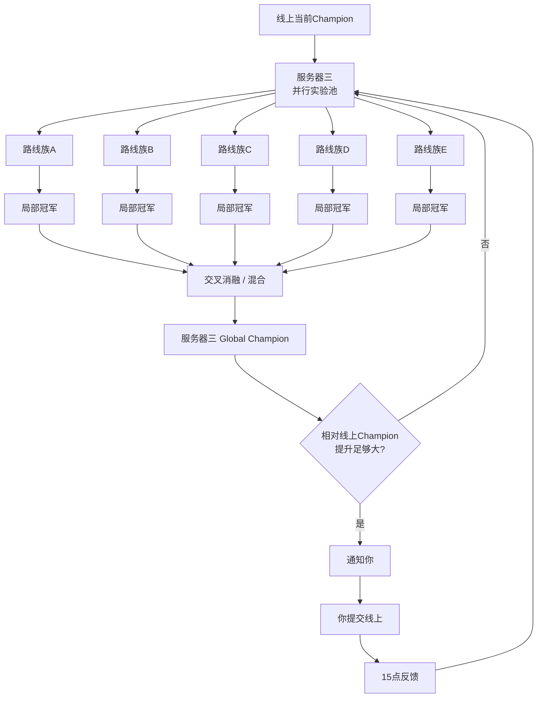

## 所以你的思路，我建议明确成一句话

> **服务器三作为自动化“进化场”：多个子代理分别经营不同技术路线族，各自在隔离环境中反复做单变量迭代；主代理持续维护局部冠军和全局冠军，并自动进行优胜路线的交叉消融。只有服务器三产生一个明显优于当前线上版本的新全局冠军时，才中断并向你汇报，由你进行线上提交。**

这个规划比我们之前讨论的“每条路线人工依次测试”更符合你现在的硬件条件，也能充分利用 Codex 多子代理能力。memcite


---

## 节点 0277｜2026-09-16 14:09

> 对应提问（节点 0272，2026-09-16 14:09）：Route-isolated evolutionary search：独立 branch、原子修改、失败必留记录、路线停止条件、两阶段结构（9 张流程图 + gitGraph）

### 对话原文（逐字）

message_reaction👍对，你这个修正更合理。核心不是“所有路线最后只选一个本地总冠军再提交”，而是：

> **每条技术路线都要独立维护自己的分支、独立迭代出该路线的局部最优版本；每条路线的局部最优都要提交线上，因为最终裁决以线上结果为准。**

而且每个子代理的行为要非常严格：**一次只改一个点 → 本地编译 → 本地运行/性能 → 判断 → 记录 → Git 提交 → 下一次只改一个点。**

---

# 1. 总体结构应该改成这样

```mermaid
flowchart TD
    B[当前稳定基线 D<br/>15/15 Pass] --> M[主 Agent]

    M --> R2[Agent-R002<br/>branch/r002]
    M --> R5[Agent-R005<br/>branch/r005]
    M --> R11[Agent-R011<br/>branch/r011]
    M --> R13[Agent-R013<br/>branch/r013]
    M --> R14[Agent-R014<br/>branch/r014]
    M --> R15[Agent-R015<br/>branch/r015]
    M --> R19[Agent-R019<br/>branch/r019]
    M --> R28[Agent-R028<br/>branch/r028]

    R2 --> L2[R002 局部最优]
    R5 --> L5[R005 局部最优]
    R11 --> L11[R011 局部最优]
    R13 --> L13[R013 局部最优]
    R14 --> L14[R014 局部最优]
    R15 --> L15[R015 局部最优]
    R19 --> L19[R019 局部最优]
    R28 --> L28[R028 局部最优]

    L2 --> O[线上分别提交]
    L5 --> O
    L11 --> O
    L13 --> O
    L14 --> O
    L15 --> O
    L19 --> O
    L28 --> O
```

这里**没有“本地总冠军决定谁能上线上”这一层**。

本地只是筛掉明显错误或明显退化版本。

线上才是真正的路线排名。

---

# 2. 每一条技术路线 = 一个独立长期分支

例如：

```text
main
└── baseline-D

experiment/R002-single-pass
experiment/R005-tile
experiment/R011-reduction
experiment/R013-double-buffer
experiment/R014-gamma-bias-cache
experiment/R015-multirow-dma
experiment/R019-normalize
experiment/R028-sync
```

每个子代理只拥有自己的 branch：

```mermaid
flowchart LR
    A[Agent R002] --> B[experiment/R002]
    C[Agent R014] --> D[experiment/R014]
    E[Agent R015] --> F[experiment/R015]
    G[Agent R028] --> H[experiment/R028]
```

**禁止 Agent-R002 去修改 R015 分支。**

**禁止两个 Agent 同时改一个 branch。**

这正符合你原文中“同一源码文件不能被多个 Agent 同时改写”的实验约束。fileciteturn6file1L102-L108

---

# 3. 一个子代理内部的正确循环

你说的这个流程我建议严格固化：

```mermaid
flowchart TD
    S[路线当前最佳版本] --> A[只修改一个点]
    A --> B[本地 CANN 编译]

    B -->|失败| F1[记录 Compile Fail]
    F1 --> RB1[回退到修改前版本]
    RB1 --> G1[Git 提交实验记录]
    G1 --> A

    B -->|成功| C[正确性测试]

    C -->|失败| F2[记录 Precision / Runtime Fail]
    F2 --> RB2[回退]
    RB2 --> G2[Git 提交实验记录]
    G2 --> A

    C -->|通过| D[NPU 性能测试]

    D --> E{比该路线当前最佳更好?}

    E -->|否| F3[记录性能无收益]
    F3 --> RB3[回退]
    RB3 --> G3[Git 提交实验记录]
    G3 --> A

    E -->|是| W[升级为该路线新局部最佳]
    W --> G4[Git 提交新版本 + 结果]
    G4 --> A
```

这就是你说的：

> 改一点 → 编译 → 验证 → 不行就回退 → 记录“不行” → 再试下一个点。

---

# 4. Git 应该记录“失败实验”，不能把失败历史丢掉

这里很重要。

如果只是：

```bash
git reset --hard
```

然后什么都不记录，过几天 Agent 又可能重新试同一个失败点。

所以推荐每个实验都有 ID：

```text
R015-E001
R015-E002
R015-E003
...
```

例如：

```text
R015-E007
修改：
batchRows 4 -> 8

Compile:
PASS

Correctness:
PASS

Performance:
local median -2.1%

Decision:
REJECT

Reason:
无明显收益

Parent:
R015-E005
```

然后再回退代码。

---

# 5. Git 提交可以这样设计

你说“每一次完整流程结束后都进行一次 Git 提交”，我建议就是这样。

## 成功实验

```text
perf(R015-E008): batchRows 4 improves multi-row DMA

compile: pass
correctness: pass
median speedup: +18.4%
decision: promote
```

代码 + 结果文件一起 commit。

---

## 失败实验

如果代码要回退，可以保留一个**实验记录 commit**：

```text
exp(R015-E009): reject batchRows 8

change tested:
batchRows 4 -> 8

compile: pass
correctness: pass
performance: -7.3%

decision: rejected
code reverted to E008
```

最终 branch HEAD 仍然是可运行版本，但历史里有：

```text
E008  GOOD
E009  REJECTED
E010  GOOD
E011  REJECTED
```

这样 Codex 不会重复踩坑。

---

# 6. 每条路线内部有自己的“局部最佳”

例如 R015：

```mermaid
flowchart LR
    B[D Baseline] --> E1[E001<br/>batch=2]
    E1 -->|+8%| E2[E002<br/>batch=4]
    E2 -->|+21%| BEST[R015 Local Best]
    E2 --> E3[E003<br/>batch=8]
    E3 -->|退化| X1[Reject]
    E2 --> E4[E004<br/>调整DMA块]
    E4 -->|+27%| BEST2[R015 新 Local Best]
```

R028 同时独立跑：

```mermaid
flowchart LR
    B[D Baseline] --> E1[E001<br/>减少一次Sync]
    E1 -->|+6%| E2[E002<br/>batch scalar=2]
    E2 -->|+15%| E3[E003<br/>batch scalar=4]
    E3 -->|+24%| BEST[R028 Local Best]
```

这两个互不影响。

---

# 7. 然后每一条路线的局部最佳都上线上

这是你刚才纠正我的关键点。

流程应该是：

```mermaid
flowchart TD
    A[R002 Local Best] --> A1[线上提交 R002]
    B[R005 Local Best] --> B1[线上提交 R005]
    C[R013 Local Best] --> C1[线上提交 R013]
    D[R014 Local Best] --> D1[线上提交 R014]
    E[R015 Local Best] --> E1[线上提交 R015]
    F[R019 Local Best] --> F1[线上提交 R019]
    G[R028 Local Best] --> G1[线上提交 R028]

    A1 --> R[线上15点真实结果表]
    B1 --> R
    C1 --> R
    D1 --> R
    E1 --> R
    F1 --> R
    G1 --> R
```

因为：

> **本地只能筛选，不能替代线上评价。**

这个原则与你文档里“CPU、CANN、本地 NPU、平台结果必须分开记录，不能互相替代”是一致的。fileciteturn6file2L139-L148

---

# 8. 第一阶段不要混合路线

先得到：

```text
D baseline          线上结果

R002-local-best     线上结果
R005-local-best     线上结果
R011-local-best     线上结果
R013-local-best     线上结果
R014-local-best     线上结果
R015-local-best     线上结果
R019-local-best     线上结果
R028-local-best     线上结果
```

这样你会得到一个非常珍贵的：

## 单路线消融表

| 路线 | 本地最好 | 线上结果 | 主要改善 Case | 主要退化 Case |
|---|---:|---:|---|---|
| D | baseline | baseline | — | — |
| R002 | +x% | +? | 1/4/14? | 15? |
| R013 | +x% | +? | 大 D? | 小 D? |
| R014 | +x% | +? | large outer | — |
| R015 | +x% | +? | small D | — |
| R028 | +x% | +? | 小行 | — |

这个表比“直接混合一堆优化”价值高得多。

---

# 9. 第二阶段才做混合路线

线上结果回来之后再决定组合。

例如：

```text
R015：
Case 4  +60%
Case 7  +55%
Case 14 +80%

R028：
Case 4  +25%
Case 6  +40%
Case 14 +35%

R013：
Case 13 +20%
Case 15 +18%
```

那么再创建：

```text
mix/R015+R028
mix/R015+R013
```

而不是一开始就混。

```mermaid
flowchart TD
    O[单路线线上结果] --> A[分析互补性]

    A --> B1[R015 + R028]
    A --> B2[R015 + R013]
    A --> B3[R028 + R014]

    B1 --> L1[本地迭代]
    B2 --> L2[本地迭代]
    B3 --> L3[本地迭代]

    L1 --> O1[线上提交]
    L2 --> O2[线上提交]
    L3 --> O3[线上提交]
```

---

# 10. 混合路线也必须有独立 branch

例如：

```text
experiment/R002
experiment/R005
experiment/R013
experiment/R014
experiment/R015
experiment/R019
experiment/R028

mix/R015-R028
mix/R015-R013
mix/R002-R014
```

混合路线不要直接污染原路线。

所以最后 Git 图大概是：

```mermaid
gitGraph
   commit id: "D baseline"

   branch R002
   checkout R002
   commit id: "R002-E001"
   commit id: "R002-E002 local-best"

   checkout main
   branch R015
   checkout R015
   commit id: "R015-E001"
   commit id: "R015-E002"
   commit id: "R015-E003 local-best"

   checkout main
   branch R028
   checkout R028
   commit id: "R028-E001"
   commit id: "R028-E002 local-best"
```

---

# 11. 主 Agent 的职责就非常简单

主 Agent不写大量代码。

它只做四件事：

```mermaid
flowchart LR
    A[分配路线] --> B[监控各 Agent]
    B --> C[收集局部最佳]
    C --> D[组织线上提交候选]
    D --> E[根据线上结果设计混合路线]
```

而每个路线 Agent：

```text
自己探索
自己编译
自己运行
自己回退
自己记录
自己 Git commit
自己维护 Local Best
```

---

# 12. 每条路线的停止条件

否则 Agent 会无限搜索。

我建议：

```text
连续 5 次单点修改
都没有超过当前 Local Best 3%
```

或者：

```text
路线累计完成 15~20 个有效实验
```

就暂时停止该路线。

然后把：

```text
Local Best
```

交给主 Agent。

---

# 13. 最终正确的两阶段实验结构

```mermaid
flowchart TD
    D[Baseline D] --> P1[阶段1<br/>单路线独立搜索]

    P1 --> R2[R002 branch]
    P1 --> R5[R005 branch]
    P1 --> R11[R011 branch]
    P1 --> R13[R013 branch]
    P1 --> R14[R014 branch]
    P1 --> R15[R015 branch]
    P1 --> R19[R019 branch]
    P1 --> R28[R028 branch]

    R2 --> L[各路线 Local Best]
    R5 --> L
    R11 --> L
    R13 --> L
    R14 --> L
    R15 --> L
    R19 --> L
    R28 --> L

    L --> ONLINE1[每条路线 Local Best<br/>分别线上提交]

    ONLINE1 --> TABLE[真实线上消融表]

    TABLE --> P2[阶段2<br/>选择互补路线混合]

    P2 --> M1[Mix branch 1]
    P2 --> M2[Mix branch 2]
    P2 --> M3[Mix branch 3]

    M1 --> ONLINE2[混合方案线上提交]
    M2 --> ONLINE2
    M3 --> ONLINE2
```

---

## 现在你的思路我会这样正式定义

> **Route-isolated evolutionary search**
>
> 每个技术路线由一个独立子代理、独立 Git branch 和独立实验记录维护；每次迭代只允许一个原子修改。修改后必须经过 CANN 编译、正确性、NPU 性能测试，完成后产生一次 Git 记录。失败则记录并回退，成功且优于本路线当前最好版本则升级为该路线 Local Best。第一阶段每个技术路线的 Local Best 都提交线上，以线上 15 点结果形成真实单路线消融表；第二阶段再依据线上互补性建立独立混合 branch，继续同样的单变量迭代和线上验证。

这个结构现在和你的想法是一致的。


---

## 节点 0283｜2026-09-16 14:11

> 对应提问（节点 0278，2026-09-16 14:11）：最终架构与完整闭环，含对用户方案的逐条客观评价与三条风险（6 张流程图 + gitGraph）

### 对话原文（逐字）

你的方案有价值，但我会做几处重要修改。核心不是否定“多 Agent + 多分支”，而是把它从“并行试很多版本”变成**可归因、可复现、可收敛的实验系统**。

你文档已经明确提出了多 Agent 探索、服务器 CANN/NPU 实测、单版本只验证一个主要假设，以及 CPU/CANN/NPU/平台结果分层记录。fileciteturn6file1L81-L92 fileciteturn6file1L102-L108 这些原则应该保留。

## 我对你方案的客观评价

| 设计 | 评价 | 建议 |
|---|---|---|
| 每条技术路线独立 branch | **应保留** | 非常利于归因和回退 |
| 多子代理并行探索 | **应保留** | 服务器资源允许时收益很大 |
| 每次只改一个点 | **必须保留** | 这是实验可解释性的核心 |
| 本地编译失败就回退 | **应保留** | 但失败代码本身也要可追溯 |
| 每轮都 Git 记录 | **应保留，但调整方式** | 不建议只记录最终代码，应记录候选 commit + 结果 |
| 每条路线 Local Best 都线上提交 | **原则可行，但不应无限提交** | 每条路线提交“阶段性最优 checkpoint”，不是每次局部提升都提交 |
| 本地最好才汇报 | **需要修改** | 应该按“路线阶段完成”汇报，而不是只看全局最好 |
| 所有路线最终直接混合 | **不建议** | 先做单路线线上消融，再做少量有依据的组合 |

最大的风险有三个。

第一，**如果每个 Agent 每得到 2% 的改善就提交线上，线上提交会成为整个系统的瓶颈**。线上是最终裁判没错，但不能替代本地搜索器。更合理的是每条路线在本地收敛到一个稳定 checkpoint 后再上线上。

第二，**Git 只保存“当前最好 + 一份失败说明”还不够**。如果失败候选的实际 diff 没有留存，以后很容易重复实验。

第三，**单路线最优并不能直接推出混合最优**。例如 R002 和 R014 都可能占 UB，它们单独优秀，组合后反而可能退化。所以混合阶段必须单独做交互实验。

---

# 我建议的完整架构

```mermaid
flowchart TD
    BASE[冻结 Baseline D<br/>15/15 Pass] --> ORCH[主 Agent / Orchestrator]

    ORCH --> R002[R002 独立 Agent<br/>独立 branch]
    ORCH --> R005[R005 独立 Agent<br/>独立 branch]
    ORCH --> R011[R011 独立 Agent<br/>独立 branch]
    ORCH --> R013[R013 独立 Agent<br/>独立 branch]
    ORCH --> R014[R014 独立 Agent<br/>独立 branch]
    ORCH --> R015[R015 独立 Agent<br/>独立 branch]
    ORCH --> R019[R019 独立 Agent<br/>独立 branch]
    ORCH --> R028[R028 独立 Agent<br/>独立 branch]

    R002 --> C2[路线 Checkpoint]
    R005 --> C5[路线 Checkpoint]
    R011 --> C11[路线 Checkpoint]
    R013 --> C13[路线 Checkpoint]
    R014 --> C14[路线 Checkpoint]
    R015 --> C15[路线 Checkpoint]
    R019 --> C19[路线 Checkpoint]
    R028 --> C28[路线 Checkpoint]

    C2 --> ONLINE[线上单路线消融]
    C5 --> ONLINE
    C11 --> ONLINE
    C13 --> ONLINE
    C14 --> ONLINE
    C15 --> ONLINE
    C19 --> ONLINE
    C28 --> ONLINE

    ONLINE --> MATRIX[线上真实路线效果矩阵]
    MATRIX --> MIX[第二阶段：路线组合实验]
    MIX --> ONLINE2[组合版本线上提交]
```

这里最重要的变化是：

> **Local Best 改成 Route Checkpoint。**

它不是“这条路线永远的最优”，而是：

> 当前搜索预算下已经稳定、正确、本地有明确收益，值得去线上获得真实反馈的版本。

这样更符合实验事实。

---

# 每个路线 Agent 内部应该怎么工作

这是整个系统最重要的一层。

```mermaid
flowchart TD
    B[本路线当前 Accepted Commit] --> H[提出一个原子假设]
    H --> CAND[只修改一个变量]
    CAND --> GC[创建 Candidate Commit]

    GC --> BUILD[CANN 编译]

    BUILD -->|失败| CF[记录 Compile Fail]
    CF --> REV1[git revert Candidate]
    REV1 --> NEXT[下一原子假设]

    BUILD -->|成功| COR[正确性矩阵]

    COR -->|失败| PF[记录 Precision / Runtime Fail]
    PF --> REV2[git revert Candidate]
    REV2 --> NEXT

    COR -->|通过| PERF[NPU Benchmark]

    PERF --> CMP{相对路线当前版本<br/>是否有效改善?}

    CMP -->|否| NF[记录 No Gain / Regression]
    NF --> REV3[git revert Candidate]
    REV3 --> NEXT

    CMP -->|是| ACCEPT[接受 Candidate<br/>更新路线当前版本]
    ACCEPT --> NEXT

    NEXT --> H
```

这里我建议和你原想法有一个区别：

### **先 commit 候选，再跑实验。**

而不是：

```text
修改
→ 测完
→ 最后才 git commit
```

因为如果编译过程中 Agent 又修改了一点，实验和源码就可能对不上。

更可靠的是：

```text
修改一个点
↓
git commit：R015-E007 candidate
↓
编译 / correctness / benchmark
↓
记录结果
↓
成功：继续从这个 commit 往前
失败：git revert
```

这样任何实验都有一个**唯一 commit SHA**。

---

# Git 历史应该长这样

```mermaid
gitGraph
   commit id: "D baseline"

   branch R015
   checkout R015

   commit id: "E001 batch=2"
   commit id: "E001 result PASS"

   commit id: "E002 batch=4"
   commit id: "E002 result BETTER"

   commit id: "E003 batch=8"
   commit id: "E003 result REGRESSION"
   commit id: "revert E003"

   commit id: "E004 dma-layout"
   commit id: "E004 result BETTER"
```

这会比单纯：

```text
改坏
→ reset --hard
→ 写一句失败了
```

强很多。

---

# 每次实验必须只有一个“自由变量”

例如 R015。

错误做法：

```text
batchRows 4→8
+
改 Tile
+
缓存 gamma
+
少一个 Sync
```

这无法归因。

正确做法：

```mermaid
flowchart LR
    E1[batchRows=2] --> E2[只改 batchRows=4]
    E2 --> E3[只改 batchRows=8]
    E2 --> E4[只改 DMA block size]
    E4 --> E5[只改 alignment threshold]
```

即使 Agent 是自动探索，也必须满足：

> `diff(candidate, parent)` 只有一个主要性能假设。

你的文档本身已经明确规定这一点。fileciteturn6file1L102-L108

---

# 本地筛选不应该只看一个总分

因为线上 15 个隐藏 workload 很可能属于不同 shape family。

建议每个 Agent同时维护：

```text
Overall
Small-D
Medium-D
Wide-D
Large-outer
FP16
BF16
FP32
Tail/non-aligned
```

然后得到类似：

| 版本 | Overall | Small D | Large D | Large outer | 结论 |
|---|---:|---:|---:|---:|---|
| Baseline D | 1.00× | 1.00× | 1.00× | 1.00× | 基线 |
| R015-E004 | 1.24× | **1.71×** | 0.99× | **1.82×** | 保留 |
| R013-E006 | 1.11× | 0.96× | **1.34×** | 1.03× | 保留 |

这样即使：

```text
R013 Overall < R015
```

R013 仍然值得线上提交，因为它可能专门改善大 D 隐藏点。

这也是为什么我不建议只选一个“Global Local Champion”。

---

# 什么时候一条路线应该提交线上

我建议不是“搜索到绝对最优才提交”，而是满足一个**路线 checkpoint**：

```mermaid
flowchart TD
    A[路线候选] --> B{正确性全过?}
    B -- 否 --> X[继续本地]
    B -- 是 --> C{结果可重复?}
    C -- 否 --> X
    C -- 是 --> D{至少一个 workload family<br/>有明显改善?}
    D -- 否 --> X
    D -- 是 --> E{连续若干实验<br/>没有更好版本?}
    E -- 否 --> X
    E -- 是 --> O[标记 Route Checkpoint<br/>交给用户线上提交]
```

这样每条路线最终都会有线上证据，但不会浪费提交次数。

---

# 线上结果回来以后不要只记总分

要建立一个真正的**在线消融矩阵**：

```mermaid
flowchart LR
    O[R002 Online] --> M[Online Route Matrix]
    A[R013 Online] --> M
    B[R014 Online] --> M
    C[R015 Online] --> M
    D[R028 Online] --> M

    M --> P[分析每条路线改善哪些 Case]
    P --> X[选择互补路线组合]
```

例如最终可能发现：

```text
R015 → Case 4 / 7 / 14 强
R013 → Case 13 / 15 强
R028 → Case 2 / 6 / 10 强
```

此时组合才有依据。

---

# 混合阶段不要做完全组合

假设线上真正有效的路线有 5 条。

全部组合需要：

```text
2^5 - 1 = 31
```

没必要。

我建议只做：

```mermaid
flowchart TD
    A[线上单路线结果] --> B[选互补性最高的 Top 3~4]

    B --> P1[R015 + R028]
    B --> P2[R015 + R013]
    B --> P3[R028 + R013]

    P1 --> T[线上 pairwise interaction]
    P2 --> T
    P3 --> T

    T --> BEST[选最佳 Pair]

    BEST --> T1[Best Pair + 第3路线]
    BEST --> T2[Best Pair + 第4路线]

    T1 --> FINAL[最终多路径候选]
    T2 --> FINAL
```

也就是：

> **单路线 → 两两交互 → 三路线组合**

而不是穷举所有组合。

---

# 服务器并行还有一个必须控制的问题

如果服务器三确实有多个可以独立跑算子的设备，那么每个 Agent 应绑定自己的 Device：

```text
Agent-R002 → Device 0
Agent-R015 → Device 1
Agent-R028 → Device 2
...
```

如果只是同一 NPU 上可以同时跑多个进程，则：

> **不能把同时跑出来的时间拿来做正式性能比较。**

编译和 correctness 可以并行，但 benchmark 应通过设备锁串行。

否则一个优化版本可能只是碰巧运行时其他 Agent 没占带宽。

---

# 最终推荐的完整闭环

```mermaid
flowchart TD
    D[Baseline D] --> INIT[为每条有效性能路线创建独立 branch + Agent]

    INIT --> LOOP[原子修改循环]

    LOOP --> COMMIT[Candidate Git Commit]
    COMMIT --> BUILD[CANN Build]
    BUILD --> CORRECT[Correctness]
    CORRECT --> PERF[NPU Performance]

    PERF --> DECIDE{该修改有效?}

    DECIDE -->|失败| REVERT[记录原因 + git revert]
    DECIDE -->|成功| PROMOTE[成为路线新的 Accepted Commit]

    REVERT --> LOOP
    PROMOTE --> LOOP

    LOOP --> STOP{路线达到停止条件?}

    STOP -->|否| LOOP
    STOP -->|是| CHECKPOINT[生成 Route Checkpoint]

    CHECKPOINT --> USER[汇报给你]
    USER --> ONLINE[线上提交]

    ONLINE --> RESULTS[15点真实结果]
    RESULTS --> ROUTEMATRIX[线上单路线消融矩阵]

    ROUTEMATRIX --> COMBINE[选择互补路线<br/>建立 mix branch]

    COMBINE --> LOOP2[混合路线继续<br/>相同的单变量实验循环]

    LOOP2 --> FINAL[最终线上版本]
```

## 我认为最合理的原则

可以压缩成这几个词：

**路线隔离、原子修改、先提交候选再实验、失败必留证据、路线级 checkpoint、线上单路线消融、最后才做交互组合。**

这样既能充分利用服务器三和 Codex 多子代理，也不会因为并行探索太多而失去实验可解释性。


---

## 节点 0681｜2026-09-17 00:04

> 对应提问（节点 0675，2026-09-17 00:04）：可直接交给新 Agent 的完整提示词：21 节（目标/口径/Reference/实验方法/工作流/证据层级/已有路线/Champion/本轮任务/禁止项/正确性检查/性能评价/输出要求/多 Agent/Git 纪律/文件清单/provenance/哲学/交付物）

### 对话原文（逐字）

可以。下面给你一个**可以直接交给新的子代理 / Agent 使用的完整提示词**。它既介绍整个项目，也规定实验流程、性能口径、当前进度和本轮版本任务。

我建议当前给子代理的版本任务就是：

> **`MIX-R014-R002-R019-V001`**
>
> 在当前 Champion `MIX-R014-R002-V001` 上，只加入已经独立验证过的 R019：`Div → scalar reciprocal + Muls`。

---

# 可直接复制给 Agent 的提示词

```text
你现在接手一个 Ascend C 算子性能优化项目。

项目名称：
AddRmsNormBias

你的职责不是随意重写 Kernel，而是按照严格的实验方法继续做“路线隔离 + 单变量消融 + 可追溯性能探索”。

请完整阅读下面的信息后再开始工作。

============================================================
一、项目目标
============================================================

我们正在优化一个 Ascend C 自定义算子：

AddRmsNormBias

数学语义：

x_f = x.astype(float32)
r_f = residual.astype(float32)
g_f = gamma.astype(float32)
b_f = bias.astype(float32)

y = x_f + r_f

rms = sqrt(
    mean(y * y, axis=-1, keepdims=True)
    + epsilon
)

out = y / rms * g_f + b_f

最后 cast 回原 dtype。

支持 dtype：

0 = float32
1 = float16
2 = bfloat16

正确性优先级最高。

任何性能优化版本首先必须保证 Online Judge correctness。

============================================================
二、项目性能评价口径
============================================================

特别注意：

后续所有“性能倍数”都不再以 D baseline 为基准。

用户已经给出一个高性能参考版本。

统一定义：

Perf× vs Ref
=
GeometricMean(
    reference_time[i] / current_time[i]
)

其中：

Reference = 1.000×

越大越好。

同时可以报告：

Gap× to Ref
=
GeometricMean(
    current_time[i] / reference_time[i]
)

越小越好。

D baseline 只用于技术路线的消融比较：

例如：

R019 vs D

用于判断某个独立优化机制有没有贡献。

但是树形图、项目总览、Champion 性能都必须使用：

Reference = 1.000×

============================================================
三、Reference 15 个测试点
============================================================

Reference：

Case 1   1.47 us
Case 2   2.16 us
Case 3   2.48 us
Case 4   6.66 us
Case 5   5.21 us
Case 6   11.66 us
Case 7   14.10 us
Case 8   30.64 us
Case 9   50.61 us
Case 10  47.35 us
Case 11  67.54 us
Case 12  76.68 us
Case 13  307.60 us
Case 14  3.75 ms
Case 15  8.51 ms

Reference 自身：

Perf× = 1.000×

============================================================
四、实验方法——必须严格遵守
============================================================

整个项目不是“不断修改当前最快代码”。

而是：

1. 每条技术路线独立建立。
2. 每个版本只验证一个主要 Hypothesis。
3. 独立路线先单独做 Online ablation。
4. 两条路线都被独立验证后，才能做组合实验。
5. 不允许一次把多个未经验证的优化全部叠加。
6. 每一个候选版本必须能够明确回答：

   “这一版本到底改了什么？”

7. 失败版本同样有价值，必须记录。
8. 不允许根据测试点耗时反推隐藏 shape/dtype 并当作事实。
9. 可以提出 shape 假设，但必须标注为 Hypothesis。
10. Online Judge 是最终权威性能结果。

============================================================
五、推荐 Agent 工作流程
============================================================

标准流程：

Main hypothesis
    ↓
阅读当前 Parent
    ↓
确认只改一个主要机制
    ↓
创建独立 Git branch
    ↓
修改 Kernel
    ↓
Git commit
    ↓
CANN Compile
    ↓
Server NPU correctness
    ↓
Server NPU performance
    ↓
Online Judge
    ↓
记录完整 15 Case
    ↓
计算：
    Perf× vs Ref
    Gap× to Ref
    vs Parent
    vs D（若有意义）
    ↓
决定：
    Reject
    Retain
    Checkpoint
    Champion
    ↓
更新文档和探索树

非常重要：

候选代码必须先 commit，再做正式测试。

实验结果需要绑定：

Experiment ID
Git SHA
Parent SHA
Source SHA256
Compile status
NPU status
Online status

不要使用：

git reset --hard

把失败实验直接抹掉。

失败版本应该保留 commit，再通过 revert 返回稳定状态。

============================================================
六、证据层级必须分开
============================================================

不要把下面几种状态混为一谈：

Level 1
静态检查

例如：
- brace 正确
- UB 粗估可行
- 代码逻辑看起来正确

这不代表 Compile Pass。

Level 2
CANN Compile

Compile Pass 只证明编译成功。

Level 3
Server NPU

包括：

correctness
runtime
profiling

Level 4
Online Judge

这是项目最终权威结果。

文档必须明确写：

Compile:
Pass / Fail / Not Tested

Server NPU:
Pass / Fail / Not Tested

Online:
15/15 / Runtime Error / Compile Error / Not Submitted

============================================================
七、当前已有的重要路线
============================================================

D baseline
----------------------------

稳定父版本。

核心特征：

Tile = 8192

两遍扫描：

Pass 1：
x/residual
→ FP32
→ y=x+residual
→ y²
→ ReduceSum
→ RMS

Pass 2：
重新读取 x/residual
→ FP32
→ y
→ normalize
→ gamma
→ bias
→ output

D 的作用：

它不是性能目标。

它是大多数独立技术路线的“控制组”。

------------------------------------------------------------
R002：retained-y
------------------------------------------------------------

核心思想：

对于能够整行放入 UB 的场景：

Pass 1 得到：

y = x + residual

之后保留 y。

RMS 求完以后：

不再重新读取：

x
residual

不再重新做：

Cast
x+residual

而是直接：

cached y
→ normalize
→ gamma
→ bias

R002-V001：

15/15 Pass。

单独收益不算巨大。

但是之后证明：

R002 与 R014 有非常强的组合价值。

------------------------------------------------------------
R014：Gamma/Bias Residency
------------------------------------------------------------

这是目前发现的最重要单路线。

核心观察：

原始实现每一行都重复从 GM 加载：

gamma
bias

而 gamma/bias 是跨行共享参数。

R014：

让 gamma/bias 在每个 AI Core 的 UB 中驻留并跨行复用。

R014-V001：

显著加速。

R014-V002：

进一步把低精度 gamma/bias 的 FP32 转换也只做一次。

目前：

R014-V002 是最强单路线之一。

------------------------------------------------------------
R014 + R002
------------------------------------------------------------

版本：

MIX-R014-R002-V001

这是目前真正的关键结果。

它同时：

R014：
消除 gamma/bias 重复 GM 流量

R002：
消除 x/residual 第二遍 GM 流量、Cast 和 Add

结果：

15/15 Pass

目前是：

Current Champion

Perf× vs Ref
≈ 0.287×

Gap
≈ 3.485×

虽然离 Reference 仍然很远，但明显优于其他已测路线。

非常重要：

R002 单独收益有限，

但是：

R014 + R002

相对 R014-V002 又获得了明显额外收益。

这证明：

不能只看“单路线收益大小”判断组合价值。

------------------------------------------------------------
R013：Double Buffer
------------------------------------------------------------

尝试：

MTE2 Tile N+1

和

Vector Tile N

流水重叠。

当前 R013-V001：

15/15 Pass

但整体性能没有提升。

结论：

当前实现 Reject。

不要直接把当前 R013 叠到 Champion。

------------------------------------------------------------
R019：Scalar Reciprocal + Vector Muls
------------------------------------------------------------

这是最新完成的独立路线。

D baseline 原本做：

rmsValue = scalar RMS

Duplicate(
    rmsVector,
    rmsValue,
    valid
)

Div(
    y,
    y,
    rmsVector,
    valid
)

R019 改成：

invRms = 1.0f / rmsValue

Muls(
    y,
    y,
    invRms,
    valid
)

也就是说：

删除：

一次大范围 Duplicate
一次 Vector Div

换成：

每 Row 一个 scalar reciprocal
每 Tile 一个 Vector Muls

R019-V001 Online：

15/15 Pass

结果：

Case1   3.68 us
Case2   12.15 us
Case3   8.80 us
Case4   91.80 us
Case5   15.02 us
Case6   117.92 us
Case7   224.79 us
Case8   382.33 us
Case9   190.37 us
Case10  308.44 us
Case11  248.08 us
Case12  193.72 us
Case13  734.62 us
Case14  119 ms
Case15  10.8 ms

正确性：

15/15 Pass

Perf× vs Ref：

约 0.186×

相对 D：

约 1.041×

即整体约：

+4.1%

因此当前结论：

R019 是：

弱正收益 / Retain

不是强路线。

因为历史上 Online timing 本身可能存在数个百分点波动。

但是 R019 有一个值得关注的信号：

Case 15：

D：
11.3 ms

R019：
10.8 ms

此前很多路线对 Case 15 完全没有变化。

所以：

R019 值得做一次与当前 Champion 的组合实验。

============================================================
八、当前 Champion
============================================================

当前全局已测 Champion：

MIX-R014-R002-V001

Correctness：

15/15 Pass

Perf× vs Ref：

约 0.287×

请注意：

下一版本不要从 D 重新开始。

当前任务是一个已经符合组合条件的实验：

R014 独立测过
R002 独立测过
R019 独立测过

所以现在允许：

R014 + R002 + R019

============================================================
九、你当前要做的版本
============================================================

Experiment ID：

MIX-R014-R002-R019-V001

Parent：

MIX-R014-R002-V001

不要重新设计整个 Kernel。

不要重新加入 R013。

不要改变 tiling。

不要改变 reduction。

不要改变 row scheduling。

不要改变参数缓存策略。

不要加入新的 API 机制。

这一版本：

唯一新增机制就是：

R019 normalization delta

也就是把当前 Parent 中：

const float rmsValue = rms.GetValue(0);

Duplicate(
    residualFp32,
    rmsValue,
    valid
);

Div(
    yFp32,
    yFp32,
    residualFp32,
    valid
);

替换为：

const float invRms =
    1.0f / rms.GetValue(0);

Muls(
    yFp32,
    yFp32,
    invRms,
    valid
);

============================================================
十、需要修改的路径
============================================================

Parent MIX 有两类执行路径：

1. R014 + R002 cached-row fast path
2. fallback D-style path

为了做完整的 R019 组合验证：

两条路径中的 normalization 都应该应用同一 R019 delta。

但是：

除了这一项之外，不允许改变任何其他行为。

============================================================
十一、本轮 Hypothesis
============================================================

Hypothesis：

R014 和 R002 主要减少 GM 数据流。

R019 主要减少 Vector normalization 计算成本。

因此：

R019 可能与 R014+R002 正交。

换句话说：

R014：
parameter GM traffic

R002：
second input GM traffic

R019：
vector Div cost

理论上它们针对不同瓶颈。

但不要假设组合必然成功。

必须通过 Online 结果验证。

============================================================
十二、本轮禁止修改
============================================================

以下内容全部保持 Parent：

Tile = 8192

R014 parameter residency

R014 FP32 parameter cache

R002 retained-y

ReduceSum

Sqrt

epsilon handling

FP32 accumulation

dtype behavior

output Cast

DataCopyPad

rowGroup

core allocation

block scheduling

UB buffer layout

不要：

修改 Tile

不要：

加 double buffer

不要：

换 reduction

不要：

增加新的 parameter cache

不要：

做 shape-specific heuristic

不要：

针对 Case 编号特判

============================================================
十三、正确性检查重点
============================================================

需要特别检查：

1.
invRms 是否在 Sqrt 完成后读取。

2.
V → S synchronization 是否仍正确。

3.
scalar：

1.0f / rms

是否只执行一次每 Row。

4.
是否仍然保持：

FP32 RMS

5.
FP16/BF16 是否只在最终输出阶段 cast。

6.
不要因为 residualFp32 不再承担 rms vector 而误改其他 liveness。

7.
cached y 在 normalize 前不能被覆盖。

8.
gamma/bias cache 不能被输入 load 覆盖。

============================================================
十四、性能评价
============================================================

第一指标：

Perf× vs Ref

Reference = 1.000×

但是本轮实验的最关键 A/B 对比是：

MIX-R014-R002-R019-V001

vs

MIX-R014-R002-V001

因为这是 Parent。

请计算：

Parent / New

的 Geomean speedup。

判据：

> 5%

明确正交收益。

升级为新的 Champion。

2% ~ 5%

可能有效。

考虑 Online timing noise。

建议至少复测一次。

0 ~ 2%

认为 R019 基本被 R014+R002 吸收。

保留 R019 独立路线证据，但不进入 Champion。

< 0%

组合负收益。

Reject combination。

============================================================
十五、必须输出的实验结果
============================================================

不要只给一个总分。

必须给完整 15 Case：

Case
Correctness
Error
Current time
Reference time
Parent time
vs Ref
vs Parent

同时计算：

Perf× vs Ref

Gap× to Ref

Geomean speedup vs Parent

如果有：

Compile
Server NPU
Online

三层状态都记录。

============================================================
十六、如果当前服务器允许多 Agent
============================================================

不要让多个 Agent 同时修改同一个 Kernel。

可以并行启动三个研究 Agent：

Agent A：
Ascend C API / Compile / Event / UB

检查：

R019 在 Parent 中的修改是否合法。

Agent B：
Numerical / Buffer Liveness

检查：

RMS
invRms
cached y
gamma/bias cache

是否正确。

Agent C：
Performance

分析：

Div -> Muls

在已经减少 GM 流量的 Parent 上是否可能变得更重要。

三个 Agent：

只提交分析。

不要同时编辑主 Kernel。

Main Agent 汇总后只维护一个 Candidate source。

============================================================
十七、Git 纪律
============================================================

建议：

git checkout -b exp/MIX-R014-R002-R019-V001

修改完成后：

git add kernel.asc

git commit -m \
"exp: combine R019 reciprocal normalization with R014+R002"

记录：

Candidate SHA

然后才：

compile
NPU
Online

============================================================
十八、当前项目文件
============================================================

如果你收到：

AddRmsNormBias_ALL_IN_ONE.zip

或者：

addrmsnormbias_route_exploration_HANDOFF_R019.zip

优先阅读：

START_HERE.md

handoff/AGENT_HANDOFF.md

handoff/NEXT_AGENT_CHECKLIST.md

docs/实验总记录_更新至R019-V001.md

docs/当前探索树.md

docs/各支线完整成绩.md

results/RESULTS.md

results/online_results_us.csv

code/README.md

audit/审查报告.md

============================================================
十九、源码 provenance
============================================================

非常重要：

部分历史源码是 reconstructed。

不要声称：

“这是线上提交的 byte-identical source”

除非真的有对应原始文件。

特别包括：

D baseline
MIX-R014-R002
R013
R019

部分版本是根据：

已知实验设计
共同 fallback path
对话中的完整代码

恢复的。

恢复代码可以继续用于实验，

但 provenance 必须诚实记录。

============================================================
二十、当前探索哲学
============================================================

整个项目必须始终遵守：

路线隔离

原子修改

候选先 commit 再实验

失败必留证据

线上单路线消融

路线级 checkpoint

组合前先独立验证

最后才做交互组合

不要因为一个路线单独收益低，就认为它没有组合价值。

R002 已经证明：

单独约小收益

但是与 R014 组合后产生了非常明显的额外收益。

============================================================
二十一、你的最终交付
============================================================

完成本轮后，请返回：

1.
最终 Kernel 完整源码。

2.
Git commit SHA。

3.
Compile 结果。

4.
Server NPU correctness。

5.
Server NPU timing。

6.
Online 15 Case 完整结果。

7.
Perf× vs Ref。

8.
Gap× to Ref。

9.
Geomean speedup vs Parent。

10.
逐 Case vs Parent 表。

11.
本次 Hypothesis：

支持 / 不支持 / 不确定。

12.
是否升级 Champion。

13.
更新后的探索树。

14.
更新后的实验记录。

15.
源码 provenance。

16.
下一步建议。

当前不要提前做下一路线。

先完成：

MIX-R014-R002-R019-V001

这一项严格的单变量组合实验。
```

---

## 我建议你怎么用这个提示词

如果是**主 Agent**，直接把上面整段给它，同时把：

`AddRmsNormBias_ALL_IN_ONE.zip`

一起给它。

然后它应该先自己读取交接包，再启动三个子代理：

```mermaid
flowchart TD
    M["主 Agent"]

    M --> READ["读取 ALL-IN-ONE<br/>理解当前状态"]

    READ --> A["子 Agent A<br/>API / 编译 / UB"]
    READ --> B["子 Agent B<br/>数值 / 生命周期"]
    READ --> C["子 Agent C<br/>性能 / Pipeline"]

    A --> M2["主 Agent 汇总"]
    B --> M2
    C --> M2

    M2 --> CODE["只实现<br/>MIX-R014-R002-R019-V001"]

    CODE --> COMMIT["Git Commit"]

    COMMIT --> CANN["CANN Compile"]
    CANN --> NPU["NPU"]
    NPU --> ONLINE["Online 15 Case"]

    ONLINE --> DOC["记录 + 更新探索树"]
```

如果你希望**子代理自己完成从分析到服务器测试的完整闭环**，也可以把其中“只提交分析”的限制改成：

> 每个子代理使用独立 branch 和独立 workspace，可以各自产生 candidate，但不得修改同一个工作目录；最终由主 Agent 决定哪个 candidate 进入正式 Online。

不过就你现在这个阶段，我仍然更推荐：

> **3 个子代理并行做研究与审查，1 个主 Agent 负责最终代码和实验。**

因为当前已经进入组合与微架构阶段，保持变量干净比“同时让三个 Agent 都写不同优化”更重要。


---

## 节点 1100｜2026-09-17 15:36

> 对应提问（节点 1097，2026-09-17 15:36）：广度优先的五阶段固定流程与各支线探索状态（2 张流程图）

### 对话原文（逐字）

message_reaction👍对，应该回到你最开始定的那套流程。**现在先做“广度探索”，不是继续深挖 R029。**

## 固定流程

```mermaid
flowchart LR
    A["阶段1<br/>每条支线至少独立跑1版"]
    --> B["记录 15 Case + 官方 Score + 基线提升"]

    B --> C["阶段2<br/>横向比较各支线"]
    --> D["选高分/高潜力支线"]

    D --> E["阶段3<br/>该支线内部继续 V002/V003 调优"]
    --> F["形成支线 Checkpoint"]

    F --> G["阶段4<br/>两两混合优化"]
    --> H["验证正交收益"]

    H --> I["阶段5<br/>多模式组合 / 最终路由"]
```

### 核心原则不变

```text
1个版本 = 1个主要假设
每条路线独立
先单路线在线验证
失败也必须记录
不因为当前 Champion 很强就跳过其他路线
所有主要路线跑过一轮后，再选高价值路线深挖
最后才做组合
```

---

# 当前应该停止继续 R029

最近：

```text
R029-V001  FP32 wide cached
R029-V002  FP16 wide cached
R029-V003  BF16 wide cached
R029-V004  FP16 + BF16
```

已经明显超过“每条支线先探索一次”的要求。

所以：

> **R029 暂时冻结为一个已有 checkpoint，后面横向比较时再回来。**

当前 R029 已知最好：

```text
R029-V004
官方 Score = 29.01
15/15 Pass
```

---

# 当前各支线探索状态

| 路线 | 状态 | 下一步 |
|---|---|---|
| R002 retained-y | 已测 | 冻结 |
| R005 Large Tile | 已有多档证据 | 冻结 |
| R011 Manual Reduction | 已测，性能差 | Reject/冻结 |
| R013 Double Buffer | 已测 | Reject/冻结 |
| R014 Parameter Residency | 已测，强正收益 | Checkpoint |
| R015 Multi-row DMA | 已测 | 冻结 |
| R019 Reciprocal+Muls | 已测，弱正 | 保留 |
| R028 Scalar Sync | 已测 | Reject |
| R029 Runtime/Wide Cached | 已测多个版本 | **现在冻结** |
| **R006 分块归约** | 尚未做纯独立性能版 | **待探索** |
| **R007 ReduceSum 变体** | 当前只是基础机制 | **待独立优化版** |
| **R009 DataCopyPad/搬运** | 正确性机制存在 | **待性能消融** |
| **R010 手工 Tail** | 未独立性能测 | 待探索 |
| **R012 32B 行块调度** | 未独立性能测 | 待探索 |
| **R016 分核策略** | 当前有基础实现 | **待独立调度实验** |
| **R020 Sqrt/Rsqrt** | Sqrt 基线存在 | **Rsqrt 独立实验待做** |
| **R030 宽行多行 Batch** | 新路线 | 待探索 |

工程/验证类 `R003/R021~R027` 不属于需要争性能分数的 Kernel 算法支线，不需要为了“每条路线”强行各提交一个性能版本。

---

# 建议接下来的广度探索顺序

我建议：

```text
R020  Rsqrt normalization
   ↓
R016  core scheduling
   ↓
R006  chunk/reduction structure
   ↓
R012  32B row scheduling
   ↓
R009  copy path
   ↓
R010  manual tail
   ↓
R030  wide multi-row parameter batch
```

原因不是预测哪条一定最快，而是尽量让每次实验覆盖**不同瓶颈轴**：

```text
数学指令
并行度
归约
调度
搬运
尾块
多行吞吐
```

这样最快建立完整“技术地图”。

---

## 后面的树要按这种结构记录

```mermaid
flowchart TD
    ROOT["AddRmsNormBias 路线探索"]

    ROOT --> ALG["计算/归约"]
    ROOT --> MOVE["搬运/尾块"]
    ROOT --> PAR["并行/调度"]
    ROOT --> UB["UB/缓存/流水"]
    ROOT --> NORM["归一化"]

    ALG --> R002["R002 ✓"]
    ALG --> R006["R006 待测"]
    ALG --> R007["R007 待测"]
    ALG --> R011["R011 ✗"]

    MOVE --> R009["R009 待测"]
    MOVE --> R010["R010 待测"]
    MOVE --> R012["R012 待测"]
    MOVE --> R015["R015 ✓/冻结"]

    PAR --> R016["R016 待测"]
    PAR --> R030["R030 待测"]

    UB --> R005["R005 ✓"]
    UB --> R013["R013 ✗"]
    UB --> R014["R014 ★ 强"]
    UB --> R029["R029 ★ Score 29.01<br/>暂时冻结"]

    NORM --> R019["R019 ✓ 弱正"]
    NORM --> R020["R020 Rsqrt 待测"]

    R002 --> MIX1["已验证组合<br/>R014+R002+R019"]
    R014 --> MIX1
    R019 --> MIX1
```

## 从现在开始执行规则

后续我会严格这样做：

> **未探索支线优先于已探索支线的 V002/V003。**

只有所有主要性能支线至少有一次线上结果后，才进入第二轮：

1. 按**官方 Score**横向排序；
2. 看各 Case 改善分布；
3. 选 2～4 条最有价值的支线继续内部调优；
4. 各自形成 checkpoint；
5. 再做 pairwise 混合；
6. 最后才构建多模式最终版本。

所以现在**不继续 R029-V005**。

下一版本应该直接切到一条尚未独立验证的支线。我建议下一条先做 **`R020-V001-RSQRT`**，只改 `Sqrt + reciprocal` 为独立的 `Rsqrt` 路径，其余全部保持 Parent 不动。下一条我可以直接给你完整代码。


---

## 节点 1119｜2026-09-17 15:47

> 对应提问（节点 1101，2026-09-17 15:37）：并行两条独立支线的提交方案与树（1 张流程图；两份候选源码已单独归档，此处不重复）

### 对话原文（逐字）

message_reaction👍可以一次探索多条支线，但**不要把两个尚未验证的机制先混进同一个 kernel**。否则如果分数变化，我们无法知道是谁造成的。

这一轮我建议直接**并行测试两条独立支线**，都从同一个 Parent：

```text
MIX-R014-R002-R019-V001
```

分别提交：

```text
A：R020-V001-RSQRT
   只探索归一化指令

B：R006-V001-PARTIALS
   只探索宽行分块归约
```

等 A、B 都拿到官方 Score 后，再决定是否做：

```text
R006 + R020
```

这样既比一条一条慢慢测快，又不破坏我们之前确定的“路线隔离”原则。

当前树变成：

```mermaid
flowchart TD
    P["MIX-R014-R002-R019-V001<br/>统一 Parent"]

    P --> A["R020-V001<br/>Rsqrt"]
    P --> B["R006-V001<br/>Partial Reduction"]

    A --> RA["独立 Online Score"]
    B --> RB["独立 Online Score"]

    RA --> CMP{"横向比较"}
    RB --> CMP

    CMP --> MIX["若二者均正收益<br/>再做 R006 + R020"]
```

下面两份都是**完整代码**。

---

# A. `R020-V001-RSQRT`

唯一改动：

```text
Sqrt
→ Scalar 1/rms
→ Muls
```

变为：

```text
Rsqrt
→ 直接读取 invRms
→ Muls
```

Tile、DMA、ReduceSum、缓存、分核全部不变。

```text
[此处为候选 R020-V001-RSQRT 的完整源码，已单独归档到 提交/外部轨道-ChatGPT编译并修复/源码/，本文件不复述]
```

---

# B. `R006-V001-PARTIALS`

这条只动宽行 fallback 的归约组织：

原来每个 tile：

```text
ReduceSum(tile)
→ Add(rms, partial)
→ 下一个 tile
```

改成：

```text
ReduceSum(tile0) → slot0
ReduceSum(tile1) → slot1
...
↓
最后一次 ReduceSum(slots)
```

激活范围先限制：

```text
8192 < D <= 65536
```

小 D、超大 D 全部保持 Parent。

```text
[此处为候选 R006-V001-PARTIALS 的完整源码，已单独归档到 提交/外部轨道-ChatGPT编译并修复/源码/，本文件不复述]
```

两份代码我也已经打包，方便你直接分别提交：

[下载 R006 + R020 并行探索包](sandbox:/mnt/data/AddRmsNormBias_PARALLEL_R006_R020.zip)

静态检查两份都是：

```text
brace balance = PASS
run_kernel    = present
device kernel = present
CANN Compile  = 未验证
Online        = 未验证
```

建议你现在**两份都提交**，把两条结果分别按：

```text
版本名
Pass/Fail
官方 Score
Case1~Case15
```

贴回来。下一轮我就能一次性把 **R006、R020 两条树枝同时落树**，然后立即切到下一组尚未探索的支线，而不是继续在其中一条上深挖。
