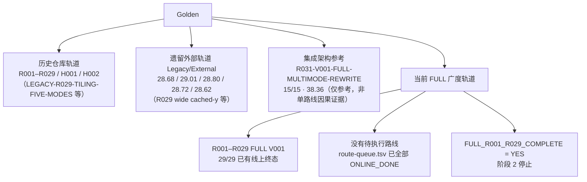

> 本文件是本地仓库当前状态唯一权威入口；历史 README、调研总结、workbuddy memory、对话归档不得覆盖本文件。

# 当前状态

- 日期：2026-09-19
- 活动分支：`exp/full-r005-large-tile-v001`
- 数据口径：FULL V001 的状态均以 CANNJudge 终态为准；本地编译和 NPU 运行只作为提交前证据。完整 29 路线矩阵见 `实验/local/FAST-BREADTH/online-baseline-matrix.tsv`，待执行队列见 `实验/local/FAST-BREADTH/route-queue.tsv`。
- 阶段状态：`FULL_R001_R029_COMPLETE = YES`；29 条路线均已取得一次 CANNJudge 线上终态。当前停止在 V001 广度阶段，不自动进入后续版本、组合或路由工作。

## 一、线上已确认结果总表

| 路线 / 版本 | 线上结果 | Official Score | 提交时间 | 状态 |
| --- | --- | --- | --- | --- |
| B0-PURE-V001 | 15/15 | 17.52 | 2026/09/17 19:52:39 | DONE |
| PURE-R012-V001-32B-ROWGROUP | 15/15 | 21.37 | 2026/09/17 20:39:00 | DONE / FROZEN |
| PURE-R009-V001-ALIGNED-DATACOPY | 15/15 | 17.64 | 2026/09/17 20:47:53 | DONE / FROZEN |
| PURE-R010-V001-MANUAL-TAIL | 15/15 | 17.37 | 2026/09/17 21:33:52 | DONE / FROZEN |
| R031-V001-FULL-MULTIMODE-REWRITE | 15/15 | 38.36（Official） | 2026/09/17 17:26:33 | DONE；仅作集成架构参考，不作为任何单路线的因果证据 |
| FULL-R006-V001-REDUCTION-ARCH | 1/15（Case1 Pass，Case2–15 WA） | — | upstream snapshot | DONE / FROZEN |
| FULL-R013-V001-DOUBLE-BUFFER-PIPELINE-ARCH | 15/15 | 18.76 | 6aacb325b0477ec41e1707d2 | DONE / FROZEN |
| FULL-R002-V001-RETAINED-Y | 14/15，Wrong Answer | — | 6aace5f8b0477ec41e33e210 | DONE / FROZEN |
| FULL-R005-V001-LARGE-TILE | 15/15 | 25.71 | 6aad349bb0477ec41e606254 | DONE / FROZEN |
| FULL-R015-V001-MULTI-ROW-DMA | 1/15，Runtime Error | — | 6aad46e5b0477ec41e6a178f | DONE / FROZEN |
| FULL-R019-V001-NORMALIZATION | 15/15 | 18.68 | 6aad5c03b0477ec41e73a5b7 | DONE / FROZEN |
| FULL-R029-V001-WIDE-CACHED-ROW | 4/15，Runtime Error | — | 6aad7849b0477ec41e7fd3b1 | DONE / FROZEN |
| FULL-R030-V001-WIDE-PARAM-REUSE | 4/15，Runtime Error | — | 6aae421ab0477ec41ecde49f | DONE / FROZEN；新候选本地宽行通过，线上 Case 5 运行错误 |
| FULL-R009-V001-COPY-CENTRIC | 15/15 | 18.61 | 6aad748eb0477ec41e7e6b20 | DONE / FROZEN |
| FULL-R010-V001-TAIL-CENTRIC | 15/15 | 17.66 | 6aad6c97b0477ec41e7b50df | DONE / FROZEN |
| FULL-R012-V001-ALIGNMENT-ROWGROUP | 15/15 | 22.96 | 6aad70a5b0477ec41e7cf41b | DONE / FROZEN；源码 SHA 绑定差异已记录 |
| FULL-R014-V001-PARAMETER-RESIDENCY-ARCH | 15/15 | 20.09 | upstream snapshot | DONE / FROZEN |
| FULL-R016-V001-SCHEDULING-ARCH | Compile Error → CompileFix-A → 15/15 | 17.14 | upstream snapshot | DONE / FROZEN |
| FULL-R007-V001-REDUCE-SUM | 15/15 | 20.91 | 6aae32e4b0477ec41ec37a64 | DONE / FROZEN |
| FULL-R008-V001-TILE-CROSS-CORE | 15/15 | 21.73 | 6aae33a6b0477ec41ec3e2f1 | DONE / FROZEN |
| FULL-R011-V001-MANUAL-VECTOR-REDUCTION | 15/15 | 16.18 | 6aae2edab0477ec41ec128fc | DONE / FROZEN |
| FULL-R017-V001-FP32-ALL-MIDDLE | 15/15 | 27.16 | 6aae2fceb0477ec41ec1a82c | DONE / FROZEN |
| FULL-R018-V001-CAST-RINT-OUTPUT | 15/15 | 23.42 | 6aae30acb0477ec41ec2283b | DONE / FROZEN |
| FULL-R020-V001-SQRT-NORMALIZATION | 15/15 | 23.41 | 6aae31cbb0477ec41ec2dcb4 | DONE / FROZEN |
| FULL-R021-V001-CANN9-BUILD-CHAIN | 15/15 | 24.01 | 6aae26f0b0477ec41ebcb50d | DONE / FROZEN |
| FULL-R022-V001-AUTO-CODEGEN | 15/15 | 24.11 | 6aae2922b0477ec41ebe0671 | DONE / FROZEN |
| FULL-R023-V001-ENGINEERING-CONVENTION | 15/15 | 24.04 | 6aae2d7fb0477ec41ec0638b | DONE / FROZEN |
| FULL-R025-V001-SUBMISSION-INTEGRITY | 15/15 | 25.73 | 6aae3c14b0477ec41ec89958 | DONE / FROZEN |
| FULL-R026-V001-PERFORMANCE-MEASUREMENT | 15/15 | 25.65 | 6aae3d6db0477ec41ec974fe | DONE / FROZEN |
| FULL-R027-V001-GPU-MIGRATION-REFERENCE | 2/15，Wrong Answer | — | 6aae3f98b0477ec41ecac90c | DONE / FROZEN |
| FULL-R028-V001-SCALAR-SYNC-REDUCTION | 15/15 | 25.06 | 6aae40ffb0477ec41ecd02bc | DONE / FROZEN |
| FULL-R024-V001-CPU-VALIDATION-MATRIX | 15/15 | 22.89 | 6aae4901b0477ec41ed222a1 | DONE / FROZEN |

## 二、命名口径（必须遵守）

- 历史编号 R013 / R014 / R016 / R006 与 `FULL-*` 代是不同路线，禁止混用、禁止互相继承成绩。
- 本仓库旧 R029（官方 Tiling 五模式）今后一律写作 **LEGACY-R029-TILING-FIVE-MODES**。
- 外部旧 R029（wide cached-y，28.68 / 29.01）属于 **LEGACY / EXTERNAL**，禁止与未来的 `FULL-R029-WIDE-CACHED-ROW` 混淆。
- 旧 R016 官方分 28.72 属于外部/历史轨道，**不等于** `FULL-R016` 的 17.14。
- H001 / V005 是本仓库独立的实验轨道（混合方案），**不是**当前 FULL 线上主线。
- 遗留外部官方分 28.68 / 29.01 / 28.80 / 28.72 / 28.62 一律标注为 legacy external evidence，只作历史对照。

## 三、FULL-R001–R029 线上覆盖状态

按当前 R001–R029 范围，29 条均已取得线上终态：

- PASS：R001、R003、R005、R007、R008、R009、R010、R011、R012、R013、R014、R016、R017、R018、R019、R020、R021、R022、R023、R024、R025、R026、R028
- Wrong Answer：R002、R004、R006、R027
- Runtime Error：R015、R029

`BREADTH_COMPLETE = YES`；`FULL_R001_R029_COMPLETE = YES`，覆盖率为 `29/29`。R030 已有线上终态，但属于额外路线，不计入 29 条分母。

阶段 2 在此停止，不开始任何路线的 V002/V003、Mix、Router 或已完成路线深挖。

## 四、线上证据与未绑定事项

- 上游线上快照已保存至 `实验/online/upstream-2026-09-18/`，包含 10 份 exact 源码、13 份结果 JSON 和 `UPSTREAM_STATE.json`；快照内容后续不得直接修改。
- R013 线上源码与活动候选逐字节一致，SHA-256 为 `8e00792c69af079f99f83bd57be1ac74c6c560c44ed2f0bf1b544ef88db9f7`；线上记录已同步到活动分支。
- R030 新代表候选为 `exp/full-r030-wide-param-reuse-v001` 的 `e7809e9`，线上源码 SHA-256 为 `4854f29285f5bd9ad211d08b33de46f745826bd39f0a118cc7265ec639b47ea5`，submission `6aae421ab0477ec41ecde49f` 返回 Runtime Error，4/15；Case 5 触发运行错误，Cases 6–15 跳过。
- R002 线上记录已同步到活动分支；R012 线上结果保留，但线上源码 SHA 与当前候选 commit 文件 SHA 不一致，已在矩阵中单列。
- R024 线上记录为 submission `6aae4901b0477ec41ed222a1`，15/15 Pass，Official Score `22.89`；CPU 矩阵为 1080/1080 PASS，本地 NPU 运行因设备占用记为 UNKNOWN。
- R031 的 `38.36` 仍是集成架构参考，不归因于任何独立 FULL 路线；历史 R013 / R014 / R016 / R029、H001/V005 与 Legacy/External 继续按原目录保留。
- upstream 导入的 FULL-R006、FULL-R014、FULL-R016 记录没有 submission id；FAST-BREADTH 新记录已尽量绑定源码 SHA、Git commit 和 submission id。FULL-R016 初始 Compile Error 没有编译日志，FULL-R006 的对齐原因仍是未验证假设。详见 [代码与结果溯源](代码与结果溯源.md)。

## 五、Golden 轨道图

## 六、阅读顺序

本目录五份权威文档的阅读顺序见 [文档/README](README.md)：当前状态 → 路线树 → 实验纪律 → CANNJudge流程 → 代码与结果溯源。
