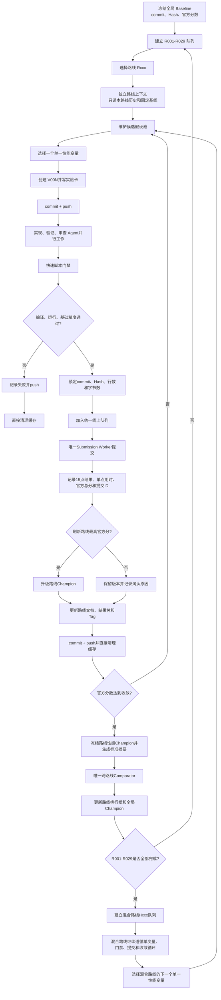
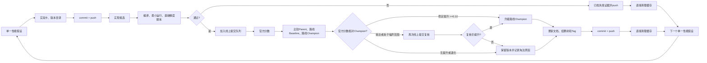
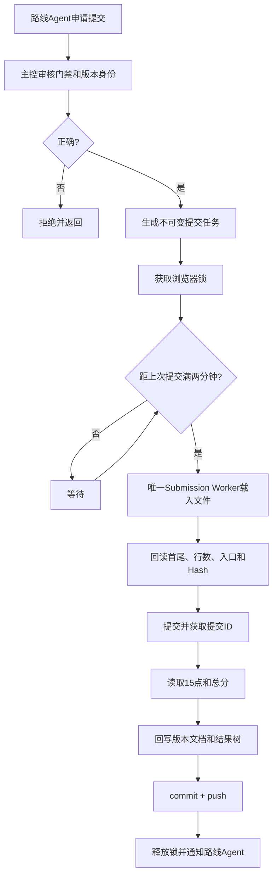
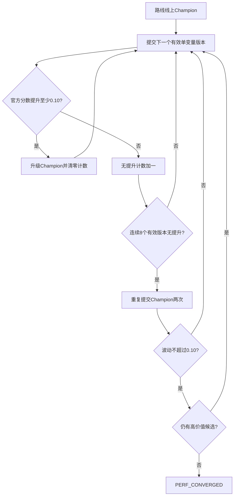
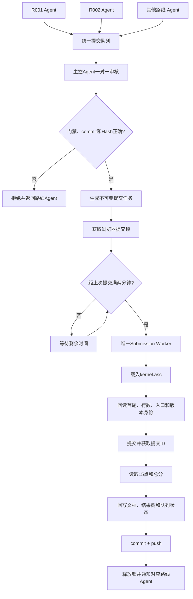
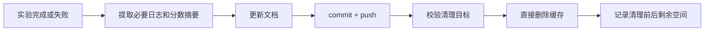

# AddRmsNormBias 统一探索、性能收敛与线上提交流程

> 本文件是后续路线探索、版本比较、CANNJudge 提交、多 Agent 协调、Git 管理和缓存清理的唯一流程事实源。历史实验事实和原始日志保留；若历史说明与本文件冲突，以本文件为准。

## 1. 统一口径

- R001-R029 每条路线都要独立探索，路线内部允许大量版本迭代，不预设版本数量上限。
- 每个版本只能包含一个明确的性能变量变化。
- 编译、运行和基础精度是线上提交门禁，不是性能收敛指标。
- 性能收敛只依据 CANNJudge 有效官方分数。本地单点时间和 msprof 只用于筛选和诊断。
- 路线 Agent 只比较本路线 Baseline、Parent 和路线 Champion；跨路线由唯一 Comparator 读取标准摘要。
- 多个路线 Agent 可以并行研究，但线上提交由统一队列和唯一 Submission Worker 串行执行。
- 每个检查点及时写文档、commit、push；提交任务必须绑定已推送的 commit 和源码 SHA-256。
- 编译和测试缓存提取摘要后直接删除，不放入回收站，不进入 Git。

## 2. 目录和角色

```text
cann/
├── 文档/统一探索收敛与线上提交流程.md
├── 管理/{templates,路线状态,提交队列,跨路线比较}/
├── scripts/                  # 机械门禁、打包、记录、清理脚本契约
├── 提交/单方案/Rxxx-名称/V00N/
├── 提交/混合方案/Hxxx-名称/V00N/
├── 实验/Rxxx/V00N/{工程,日志,精度,性能}/
├── 调研/
└── 源码/
```

路线 Agent 负责一个 Rxxx 的版本和 Champion；主控 Agent 独占提交队列、全局结果树和全局 Champion；Comparator 只读取路线摘要；Submission Worker 独占浏览器提交锁。

## 3. 基线与 Champion

| 对象 | 用途 |
| --- | --- |
| 全局 Baseline | 观察整个项目分数变化 |
| 路线 Baseline | 计算一条路线相对起点的净贡献 |
| Parent | 当前版本直接继承的上一版本 |
| 路线 Champion | 当前路线官方分数最高的有效版本 |
| 全局 Champion | 所有已比较路线官方分数最高的版本 |

所有对象必须绑定 Git commit、源码 SHA-256、行数和字节数，禁止使用“当前最新文件”作为提交目标。

## 4. 总探索流程



## 5. 路线内版本循环

每条路线可以有任意多个版本，但每版只能有一个单一提升点：

```text
R002/V001 基础 y 驻留
R002/V002 只改变驻留宽度
R002/V003 只改变 cached/fallback 分界
R002/V004 只改变 UB 布局
R002/V005 只减少一个同步点
```



### 5.1 机械脚本边界

模型只提出单一优化假设、解释异常和判断是否继续；可确定、可重复的工作由脚本完成。脚本接口约定如下：

```text
scripts/
├── route_new_version.py   # 创建版本目录、实验卡和元数据，不修改算法代码
├── route_fast_gate.sh     # 编译、最小运行、基础精度门禁，返回明确状态码
├── route_package.py       # 校验首尾、入口、行数、字节数和 SHA-256，生成不可变包
├── submit_enqueue.py      # 只接受已推送 commit 且门禁通过的版本，生成队列任务
├── submit_worker.py       # 唯一线上 Worker，持有浏览器锁并执行两分钟限流
├── score_record.py        # 记录 15 点用时、提交 ID、官方总分和分数变化
├── score_compare.py       # 只读取标准摘要，比较路线和全局 Champion
├── route_convergence.py   # 根据配置阈值判断性能收敛，不读取本地 profiler 代替分数
├── git_checkpoint.sh      # 执行检查点前的状态、路径和提交校验
└── cleanup_experiment.sh  # 校验当前版本绝对路径后直接清理生成缓存
```

当前仓库已登记上述脚本契约，但这些执行脚本尚未实现；在脚本落地前不得把目录清单当作可执行入口。任何清理脚本都不得接收仓库根目录、用户根目录、公共工具链或未解析的宽泛变量作为删除目标。

## 6. 线上提交与分数记录

只有以下版本才计入性能收敛序列：单一变量、本地门禁通过、文件身份已锁定、CANNJudge 15/15 通过并返回有效官方分数。Compile Error、Runtime Error、Precision Error、上传截断和无法确认源码身份的提交不计入收敛序列。

平台公式：

```text
s_i = 100 / (1 + log_1.5(t_i / T_i))
S = (s_1 + ... + s_15) / 15
```

版本详细文档保留 15 个单点用时；路线主树记录官方总分、分数变化、提交 ID、commit 和 Hash。每个版本必须记录 `score`、`delta_parent`、`delta_route_baseline`、`delta_previous_champion`、`passed_cases`、`submission_id`、`submitted_at`、`git_commit`、`sha256` 和 `case_times`。



固定像素只能由唯一 Worker 使用，优先级为官方 API > DOM/元素定位 > 图像/文本定位 > 固定像素。任何页面布局、登录或弹窗异常都必须停止任务。

## 7. 性能收敛判据

路线收敛只看线上官方分数，不看本地 profiling 是否进入平台期。默认条件和两分钟限流配置见 `管理/config.json`：最近连续 8 个有效线上单变量版本均未稳定提升至少 `0.10` 分；当前 Champion 至少重复提交 2 次且分数波动不超过 `0.10` 分；候选池没有预期提升至少 `0.10` 分的高价值假设。阈值可由主控根据线上波动调整，并必须在配置和检查点中留痕。



收敛后发现新 API、新调度、新 Case 瓶颈或其他路线可迁移技巧时，可将状态重新打开为 `REOPENED`。

## 8. 多 Agent 协调与线上提交

路线 Agent 只能申请提交，不能直接操作浏览器。所有线上动作通过统一队列和唯一 Worker：



## 9. Git 和检查点

建议分支：`main`、`route/Rxxx`、`exp/Rxxx-Vxxx-agent-y`、`mix/Hxxx`。

```text
创建版本和实验假设   -> commit + push
代码和快速门禁完成   -> commit + push
线上结果返回         -> commit + push
升级路线Champion     -> commit + tag + push
路线性能收敛         -> commit + tag + push
跨路线排行榜更新     -> commit + push
```

当前 `cann` 若无 `.git`，必须先恢复并验证远程历史与现有文件关系；恢复完成前不得声称已经推送。禁止覆盖现有实验和其他工作树。

Submission Worker 只能提交已经推送且已绑定不可变 commit、源码 SHA-256、行数和字节数的版本；不能提交“当前最新文件”。

## 10. 缓存和磁盘清理

只保留源码、实验卡、结果摘要、必要文本日志、15点用时摘要、官方分数、提交 ID、commit/Hash 和清理前后空间。摘要提交完成后，直接删除当前版本生成的 `build/`、`build-*/`、`input/`、`output/`、`prof_out/`、`PROF_*/`、对象文件、临时可执行文件和可重建测试张量；不放入回收站、不提交 Git。删除前必须校验目标是当前版本目录内的明确路径，禁止删除公共工具链或其他用户数据。



## 11. 历史分数口径

无可确认的 15/15 官方有效结果时统一记录“无有效分数”，不由本地耗时推算：H001/V001、H001/V002 为平台 Compile Error；H001/V003 未提交；H001/V005 为本地编译和 NPU 验证通过但尚无可确认官方分数；MIX-R014-R002-R019-V001 编译/运行返回成功但大 `D` FP16 精度门禁失败，待修复后才可申请提交。无法证明与本地 commit 和 Hash 一致的历史提交，只归档为提交通道异常。
