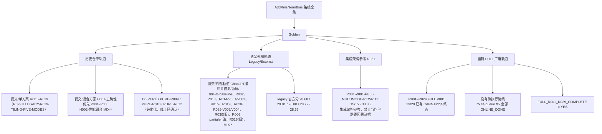

# 路线树

本文件给出全仓库路线编号的统一树形视图。分数与状态以 [当前状态](当前状态.md) 为唯一权威；本文件只负责“谁属于哪条轨道、编号怎么叫”。

## 四条 Golden 轨道

## 命名规则（同名不同代，必须区分）

| 写法 | 含义 | 禁止事项 |
| --- | --- | --- |
| `FULL-Rxxx-…` | 当前广度轨道，每条 V001 都是一次实质性架构重写 | 与任何旧同号路线互抄成绩 |
| `LEGACY-R029-TILING-FIVE-MODES` | 本仓库旧 R029（官方 Tiling 五模式资料） | 禁止再用裸 `R029` 指代它 |
| `LEGACY/EXTERNAL` 旧 R029 | 外部 wide cached-y（28.68 / 29.01） | 禁止与 `FULL-R029-WIDE-CACHED-ROW` 混淆 |
| 旧 R016（28.72） | 外部/历史轨道 | 禁止写成 `FULL-R016` 的成绩 |
| 旧 R013 / R014 / R006 | 外部/历史轨道 | 均 ≠ `FULL-R013` / `FULL-R014` / `FULL-R006` |
| `H001 / V005` | 本仓库混合方案实验轨道 | 禁止当作 FULL 线上主线 |
| `B0-PURE / PURE-Rxxx` | 纯化代线上版本 | 单独成组，不并入 FULL |

## FULL V001 线上覆盖

见 [当前状态 · 第三节](当前状态.md) 和 `实验/local/FAST-BREADTH/online-baseline-matrix.tsv`。要点：

- R013、R002 的线上记录已同步到活动分支；R030 新 V001 候选已完成线上提交并返回 Runtime Error，4/15。
- R001–R029 中 29 条 FULL V001 已完成线上覆盖，`实验/local/FAST-BREADTH/route-queue.tsv` 已全部标为 `ONLINE_DONE`。
- `BREADTH_COMPLETE = YES`；当前总状态为 `FULL_R001_R029_COMPLETE = YES`。
- `29/29` 前不开始 V002/V003、pairwise mix、final multimode 或已完成路线深挖。
- FULL-R015 的对外名称是 `FULL-R015-MULTI-ROW-DDMA`，目录与源码使用 `FULL-R015-MULTI-ROW-DMA`。

## 当前导入快照

- 线上快照：`实验/online/upstream-2026-09-18/`，10 份源码、13 份结果和 `UPSTREAM_STATE.json`。
- 当前活动候选：`提交/单方案/FULL-R013-DOUBLE-BUFFER-PIPELINE/V001/kernel.txt`。
- R013 SHA-256：`8e00792c69af079f99f83bd57be1ac74c6c4c560c44ed2f0bf1b544ef88db9f7`。
- 本轮完成后仍不自动开始 V002、V003、pairwise mix 或 final multimode。

## 已封存路线（有首次线上终态，不再扩展）

| 路线 | 线上结果 | 说明 |
| --- | --- | --- |
| FULL-R006-REDUCTION-ARCH | 1/15（Case1 Pass，Case2–15 WA） | 广度封存 |
| FULL-R014-PARAMETER-RESIDENCY-ARCH | 15/15 · 20.09 | 2026/09/18 00:24:36 提交 |
| FULL-R016-SCHEDULING-ARCH | CE → COMPILEFIX-A → 15/15 · 17.14 | 2026/09/18 02:20:54 提交；CE 后修复仍算同一路线 V001 |
| FULL-R013-DOUBLE-BUFFER-PIPELINE | 15/15 · 18.76 | submission `6aacb325b0477ec41e1707d2` |
| FULL-R002-RETAINED-Y | Wrong Answer，14/15 | submission `6aace5f8b0477ec41e33e210` |
| FULL-R005-LARGE-TILE | 15/15 · 25.71 | submission `6aad349bb0477ec41e606254` |
| FULL-R015-MULTI-ROW-DMA | Runtime Error，1/15 | submission `6aad46e5b0477ec41e6a178f` |
| FULL-R019-NORMALIZATION | 15/15 · 18.68 | submission `6aad5c03b0477ec41e73a5b7` |
| FULL-R029-WIDE-CACHED-ROW | Runtime Error，4/15 | submission `6aad7849b0477ec41e7fd3b1` |
| FULL-R027-GPU-MIGRATION-REFERENCE | Wrong Answer，2/15 | submission `6aae3f98b0477ec41ecac90c` |
| FULL-R028-SCALAR-SYNC-REDUCTION | 15/15 · 25.06 | submission `6aae40ffb0477ec41ecd02bc` |
| FULL-R024-CPU-VALIDATION-MATRIX | 15/15 · 22.89 | submission `6aae4901b0477ec41ed222a1` |
| FULL-R030-WIDE-PARAM-REUSE | Runtime Error，4/15 | submission `6aae421ab0477ec41ecde49f`；Case 5 运行错误 |
| FULL-R009-COPY-CENTRIC | 15/15 · 18.61 | submission `6aad748eb0477ec41e7e6b20` |
| FULL-R010-TAIL-CENTRIC | 15/15 · 17.66 | submission `6aad6c97b0477ec41e7b50df` |
| FULL-R012-ALIGNMENT-ROWGROUP | 15/15 · 22.96 | submission `6aad70a5b0477ec41e7cf41b`；源码绑定差异已记录 |
