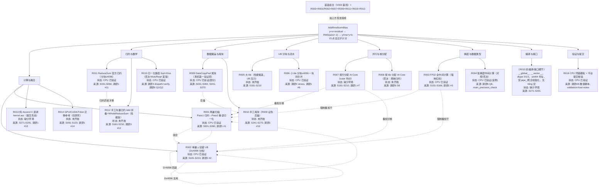

# 技术路线流程图（AddRmsNormBias CANN 挑战赛资料汇总）

> 本次汇总编号：**汇总__**（2026-09-12）
> 汇总入口：`调研/汇总/汇总__/技术路线总报告.md`
> 本图与总报告的 Rxxx 路线编号、实验状态、来源组编号完全一致。
> 状态口径：CPU=CPU 参考验证；未开始=仅静态分析/资料核对；缺少环境=无 CANN/NPU 无法验证。

## 路线树

## 图例

- `Rxxx`：归并技术路线编号，与 `技术路线总报告.md` §5 完全一致。
- `Sxxx` / `调研N #N`：来源组编号（调研6 的 S001–S291 分段体系 / 调研1 的路线编号），逐条登记在各轮 `sources.md` 与总报告 §6。
- 状态：`CPU 已验证`（numpy 同链模拟/反例，非 NPU）、`未开始`（静态分析/资料核对）、`缺少环境`（无 CANN/NPU，无法验证）。
- `R013b`：R013 的编译/接口子节点，不独立编号，对应总报告 R013 的实施要点。
- 同一 `Rxxx` 的不同实现（如 R009 的逐字段赋值/对齐双轨、R015 的 Divs/Muls/Rsqrt、R002 的 D 分档）在总报告中作为"变体"说明，不在图中单列。
- 实线子节点=类别归属；虚线/`-. ` 标注=路线间组合、回退或叠加关系。
- 组合关系：首选组合=V003 基线（正确性优先）；性能版=在此基础上叠加 R012+R005+双缓冲+gamma/bias 常驻（见总报告 §8）。