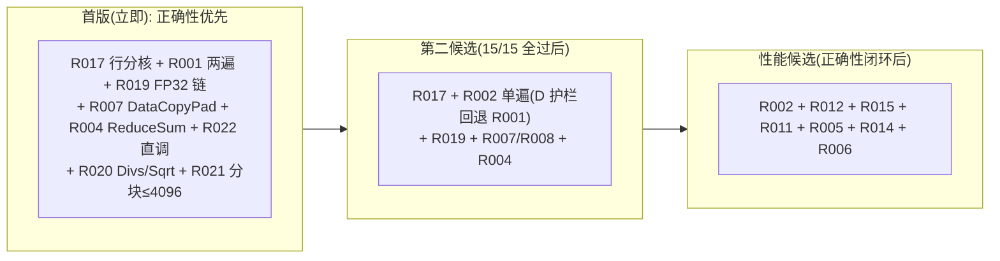

# AddRmsNormBias 技术路线流程图

【本次汇总编号：汇总2】

与《技术路线总报告.md》配套；`Rxxx` 归并路线编号、`Sxxx` 来源编号与总报告完全一致。所有实验状态为 CPU 模拟/静态分析口径，无真机验证。

```mermaid
flowchart TD
    ROOT["AddRmsNormBias<br/>(CANN 9.0.0 直调 · kernel.asc)"] --> CAT1["计算与融合"]
    ROOT --> CAT2["归约与数学"]
    ROOT --> CAT3["数据搬运与尾块"]
    ROOT --> CAT4["UB 分块与流水"]
    ROOT --> CAT5["并行与核分配"]
    ROOT --> CAT6["精度与数据类型"]
    ROOT --> CAT7["编译与接口"]
    ROOT --> CAT8["验证与提交"]

    CAT1 --> R001["R001 两遍扫描<br/>Pass1 平方和 + Pass2 归一化<br/>状态: CPU 已验证<br/>来源: S036 S046"]
    CAT1 --> R002["R002 单遍 UB 暂存 y<br/>y 驻留 UB 直接输出<br/>状态: CPU 已验证(链路)<br/>来源: S046 S094"]
    CAT1 --> R003["R003 低精度中间(否决对照)<br/>16bit 域累加<br/>状态: CPU 已验证(证否)<br/>来源: S066 S067"]

    CAT2 --> R004["R004 ReduceSum 接口<br/>count 版 + 分块 ≤4096<br/>状态: CPU 已验证(链路)<br/>来源: S007 S012 S058"]
    CAT2 --> R005["R005 手工向量归约<br/>Add 折叠 + WholeReduceSum/二分累加<br/>状态: 未开始<br/>来源: S026 S035 S050"]
    CAT2 --> R006["R006 标量同步削减<br/>行末一次 GetValue / 多行合并取数<br/>状态: 未开始<br/>来源: S014 S052"]

    CAT3 --> R007["R007 DataCopyPad 尾块<br/>补 0 搬入 + 精确字节搬出<br/>状态: CPU 已验证 / 写方向未验证<br/>来源: S005 S010 S097"]
    CAT3 --> R008["R008 手工尾块<br/>DataCopyCustom / Duplicate+mask / VF UpdateMask<br/>状态: 未开始<br/>来源: S037 S035"]
    CAT3 --> R009["R009 对齐双分支搬运<br/>对齐 DataCopy 快路径 + 尾块慢路径<br/>状态: 未开始<br/>来源: S011 S103"]
    CAT3 --> R010["R010 跨核 32B 写回防御<br/>k·D·s≡0 (mod 32) / 行 stride 补齐<br/>状态: 未开始<br/>来源: S097 S084"]
    CAT3 --> R011["R011 多行合并 DMA<br/>blockCount 多行 + UB 行间 padding<br/>状态: 未开始<br/>来源: S035 S036"]

    CAT4 --> R012["R012 大 tile<br/>tile 逼近 UB 上限<br/>状态: 未开始<br/>来源: S046"]
    CAT4 --> R013["R013 小 tile<br/>512~1024 多轮循环<br/>状态: CPU 已验证(精度)<br/>来源: S046"]
    CAT4 --> R014["R014 gamma/bias 驻留<br/>整体驻留 / 分时复用<br/>状态: 未开始<br/>来源: S035"]
    CAT4 --> R015["R015 双缓冲流水<br/>BUFFER_NUM=2<br/>状态: 未开始<br/>来源: S051"]
    CAT4 --> R016["R016 官方 Tiling 五模式<br/>SPLIT_D/MERGE_N/SINGLE_N/MULTI_N/NORMAL<br/>状态: 未开始(源码级 A)<br/>来源: S035"]

    CAT5 --> R017["R017 按行均分多核<br/>尾核余数 + uint64 基址<br/>状态: 未开始<br/>来源: S035 S036 S098"]
    CAT5 --> R018["R018 按 tile 跨核分配(否决)<br/>跨核归约无对应原语<br/>状态: 未开始<br/>来源: S036"]

    CAT6 --> R019["R019 FP32 全中间链<br/>CAST_NONE 升 FP32 + CAST_RINT 回<br/>状态: CPU 已验证<br/>来源: S006 S019 S048"]
    CAT6 --> R020["R020 归一化数学路径<br/>Sqrt + Divs(乘倒数/RSQRT 为风险变体)<br/>状态: CPU 已验证(Divs 逐位一致)<br/>来源: S008 S060 S064"]
    CAT6 --> R021["R021 归约分块与累加顺序<br/>chunk ≤4096 / 树形 vs 顺序<br/>状态: CPU 已验证<br/>来源: S066 S068"]

    CAT7 --> R022["R022 纯 Ascend C 手写直调<br/>run_kernel + __global__ __vector__<br/>状态: CANNJudge 已提交(V001/V002 均 CE)<br/>来源: S001 S002 S018 S107"]
    CAT7 --> R023["R023 GPU/编译器迁移参考<br/>算法可迁 / 机制不可照搬<br/>状态: 未开始(仅研究)<br/>来源: S084 S085 S086 S087"]
    CAT7 --> R024["R024 真机环境与编译链路<br/>CANN 9.0.0 + dav-2201 + set_env<br/>状态: 无法验证: 缺少环境<br/>来源: S009 S070"]

    CAT8 --> R025["R025 CPU 同链验证与测试矩阵<br/>数值参考脚本 + dtype×rank×D×outer<br/>状态: CPU 已验证(117+21+39+36 组)<br/>来源: S104 S105 S106"]
    CAT8 --> R026["R026 提交策略与版本管理<br/>V00N + 首提验证通道 + 上传回读<br/>状态: CANNJudge 已提交(均 CE)<br/>来源: S096 S107 S108 S109"]
    CAT8 --> R027["R027 性能测量与 profiling<br/>msKPP→msOpST→msprof→msopprof<br/>状态: 未开始<br/>来源: S050 S057"]

    R001 -.首版组合.-> R017
    R001 -.首版组合.-> R019
    R001 -.首版组合.-> R007
    R001 -.首版组合.-> R004
    R002 -.超 D 回退.-> R001
    R019 -.强制前提.-> R001
    R019 -.强制前提.-> R002
    R020 -.归一化路径.-> R001
    R007 -.尾块兜底.-> R008
    R016 -.模式框架.-> R011
    R022 -.唯一合法载体.-> ROOT
```

## 推荐组合（与总报告第 8 章一致）

## 图例

- `Rxxx`：归并技术路线编号（R001–R027），定义、变体、来源与原始位置见《技术路线总报告.md》第 4、5 章。
- `Sxxx`：来源编号，对应总报告第 6 章来源索引（与六轮原始 `sources.md` 编号不同，经"轮次+文件+章节"可回溯）。
- 状态：实验验证状态，取值为 `未开始` / `CPU 已验证` / `普通编译已验证` / `CANN 编译已验证` / `真实 NPU 精度已验证` / `真实 NPU 性能已验证` / `CANNJudge 已提交` / `结果待补充` / `无法验证：缺少环境`；本图所有"CPU 已验证"均为 numpy/ml_dtypes 参考计算，非 NPU 实测。
- 实线 `-->`：类别归属；虚线 `-.->`：路线组合或回退关系。
- 同一 `Rxxx` 的不同实现（如 R008 的 DataCopyCustom / Duplicate+mask / VF UpdateMask，R020 的 Muls/Rsqrt 风险变体，R002 的 D 分水岭多口径）在总报告中作为变体说明，图中不重复展开。
- R003、R018 为否决保留路线；R023 仅作研究参考，不可作为提交方案。
