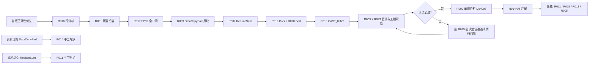
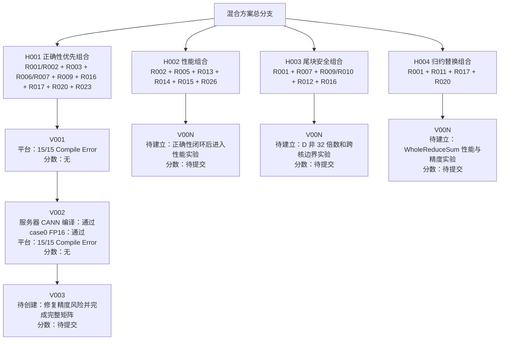

# AddRmsNormBias 技术路线流程图（汇总2）

> **本次汇总编号：汇总2**  
> 与 `技术路线总报告.md` 配套；编号 R001–R026 与总报告 §5 末表一致。  
> 实验状态取值见总报告。来源编号 Sxxx 见总报告 §6。

## 路线树

```mermaid
flowchart TD
    ROOT[AddRmsNormBias] --> CAT_A[计算与融合]
    ROOT --> CAT_B[归约与数学]
    ROOT --> CAT_C[数据搬运与尾块]
    ROOT --> CAT_D[UB分块与流水]
    ROOT --> CAT_E[并行与核分配]
    ROOT --> CAT_F[精度与数据类型]
    ROOT --> CAT_G[编译与接口]
    ROOT --> CAT_H[验证与提交]

    CAT_A --> R001[R001 两遍扫描<br/>Pass1 平方和 + Pass2 归一化<br/>状态: CPU 已验证<br/>来源: S001 S006 S007]
    CAT_A --> R002[R002 单遍 y 驻留<br/>UB 留 y 再仿射<br/>状态: CPU 已验证<br/>来源: S009 S010]
    CAT_A --> R003[R003 纯 Ascend C 直调<br/>唯一提交形态<br/>状态: CANNJudge 已提交<br/>来源: S001 S002]
    CAT_A --> R004[R004 低精度中间<br/>16bit 域累加<br/>状态: CPU 已验证证否<br/>来源: S011 S021]

    CAT_B --> R007[R007 ReduceSum count 版<br/>官方归约 + GetValue<br/>状态: CPU 已验证<br/>来源: S004 S013]
    CAT_B --> R011[R011 手工向量归约<br/>折叠 + WholeReduceSum<br/>状态: 无法验证缺少环境<br/>来源: S013 S020]
    CAT_B --> R019[R019 Divs 先除归一化<br/>禁 Muls 1/rms 作首版<br/>状态: CPU 已验证<br/>来源: S012 S021]
    CAT_B --> R020[R020 Sqrt 非 Rsqrt<br/>首版 Sqrt+Divs<br/>状态: CPU 已验证<br/>来源: S021]

    CAT_C --> R009[R009 DataCopyPad 尾块<br/>补0搬入 + 真实字节搬出<br/>状态: CPU 已验证补零<br/>来源: S003 S019]
    CAT_C --> R010[R010 手工尾块<br/>Mask / SetValue / UpdateMask<br/>状态: 未开始<br/>来源: S023 S008]
    CAT_C --> R012[R012 32B 行块对齐<br/>防跨核 cache line 踩踏<br/>状态: 无法验证缺少环境<br/>来源: S022]

    CAT_D --> R005[R005 大 tile<br/>贴 UB 减 DMA 轮次<br/>状态: 未开始<br/>来源: S013]
    CAT_D --> R006[R006 分块≤4096<br/>块间 FP32 合并<br/>状态: CPU 已验证<br/>来源: S011 S021]
    CAT_D --> R013[R013 双缓冲<br/>BUFFER_NUM=2<br/>状态: 无法验证缺少环境<br/>来源: S013]
    CAT_D --> R014[R014 gamma/bias 驻留<br/>减 GM 重读<br/>状态: 未开始<br/>来源: S013]
    CAT_D --> R015[R015 多行合并 DMA<br/>对齐双轨 + 可选 L2 bypass<br/>状态: 未开始<br/>来源: S013]

    CAT_E --> R016[R016 按行分配 AI Core<br/>尾核余数<br/>状态: CPU 已验证逻辑<br/>来源: S006 S007]
    CAT_E --> R008[R008 按 tile 跨核<br/>默认不建议<br/>状态: 未开始<br/>来源: S006]

    CAT_F --> R017[R017 FP32 全中间<br/>强制红线<br/>状态: CPU 已验证<br/>来源: S005 S011]
    CAT_F --> R018[R018 CAST_RINT 输出<br/>TRUNC 失配约40%<br/>状态: CPU 已验证<br/>来源: S021]

    CAT_G --> R021[R021 环境构建链路<br/>CANN 9.0.0 + run.sh<br/>状态: 无法验证缺少环境<br/>来源: S015]
    CAT_G --> R022[R022 自动代码生成<br/>仅研究参考<br/>状态: 未开始不采用<br/>来源: S016]
    CAT_G --> R023[R023 工程规范<br/>pipe_/uint64/同步/TPipe<br/>状态: CPU 已验证静态<br/>来源: S017 S023]

    CAT_H --> R024[R024 CPU 验证矩阵<br/>dtype×D×outer<br/>状态: CPU 已验证<br/>来源: S011 S021 S024]
    CAT_H --> R025[R025 提交通道双闸门<br/>静态核对 + 平台回读<br/>状态: CANNJudge 已提交失败<br/>来源: S018]
    CAT_H --> R026[R026 性能测量<br/>msopst / msprof op<br/>状态: 无法验证缺少环境<br/>来源: S013 S015]
```



## 推荐组合与分支



## 混合方案分支

混合方案单独记录多个路线的组合关系，版本沿同一条链追加；平台分数以 CANNJudge 返回为准，服务器结果单独记录，不能互相替代。



### 混合方案版本链

```text
H001 正确性优先组合
└── V001：平台 15/15 Compile Error，分数无
    └── V002：服务器 CANN 编译通过，case0 通过；平台 15/15 Compile Error，分数无
        └── V003：待创建，修复完成后再验证和提交

H002 性能组合
└── 暂无版本

H003 尾块安全组合
└── 暂无版本

H004 归约替换组合
└── 暂无版本
```

V002 当前归入 `H001`，但它仍包含部分宽行低精度计算风险，因此 `H001` 只是当前版本归档归属，不代表该组合已经达到完整题面要求。

## 图例

- `Rxxx`：归并技术路线编号（与总报告一致）。
- `Sxxx`：来源编号（总报告 §6）。
- 状态：实验验证状态（总报告 §1 取值）。
- 同一 `Rxxx` 的不同实现（如 split_d、UpdateMask、Block+Whole）在总报告中作为变体说明，不另占编号。
- R004、R008、R022 为否决或仅研究参考，不进入首版组合。
- 全图无「CANN 编译已验证 / 真实 NPU 精度已验证 / 真实 NPU 性能已验证」节点。
