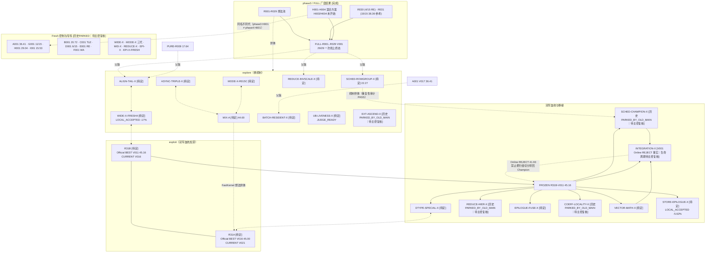

# 技术路线图

本文件是唯一的人类可读版本树和 Markdown 全版本表，同时保留技术路线空间与状态证据。结构化事实唯一来自：`技术路线/全版本记录.tsv`、`技术路线/路线成绩表.tsv`、`调度/当前任务.tsv`、`调度/线上候选.tsv`、`调度/本地线上校准.tsv` 及已记录证据路径。

## 当前执行入口

本文件不定义执行规则。

唯一入口：`.agents/skills/cann-route-executor/SKILL.md`

`ONE CHANGE → COMPILE → CORRECTNESS → LOCAL → RESULT → COMMIT → NEXT ONE CHANGE`

`VERSION_RECORD_EVENT → Record Owner async update`

记录不是 execution gate。

---

## (a) 当前执行入口关系

以下只表示角色之间的事件流，不重复角色 Skill 的执行正文：

`Planning / Review → Route Agent → Main C2C → Record Owner async update`

---

## (b) 全局版本树

节点和边按 TSV 的 `ROUTE`、`REVISION`、`DIRECT_PARENT` 原样取值。存在对应记录的 Direct Parent 直接连接到该版本节点；没有可对应记录的 Direct Parent 保留为外部 parent 节点；不按版本号推断父子关系。记录行数：161。

```mermaid
flowchart LR
    v1["ASYNC-TRIPLE-X V001<br/>HISTORICAL_ONLY"]
    v2["EXT-ASCEND-X V001<br/>CORRECTNESS_FAILED"]
    v3["WIDE-X-FRESH4 CURRENT<br/>BUILD_FAILED"]
    v4["WIDE-X-FRESH4 BUILD-FIX-001<br/>HISTORICAL_ONLY"]
    v5["WIDE-X-FRESH4 V001<br/>OFFICIAL_RESULT_RETAINED"]
    v6["MODE-X-R015C CURRENT-UNNUMBERED<br/>NEEDS_REMEASUREMENT"]
    v7["MODE-X-R015C r1 (gap placeholder)<br/>MISSING_NOT_REVISION"]
    v8["MODE-X-R015C r2<br/>CORRECTNESS_FAILED"]
    v9["MODE-X-R015C r3<br/>NEEDS_REMEASUREMENT"]
    v10["MODE-X-R015C r4<br/>CORRECTNESS_FAILED"]
    v11["MIX-A V001<br/>CORRECTNESS_FAILED"]
    v12["MIX-A V002<br/>CORRECTNESS_FAILED"]
    v13["MIX-A V003<br/>NEEDS_REMEASUREMENT"]
    v14["MIX-A V004<br/>ONLINE_REJECTED"]
    v15["MIX-A V005<br/>ONLINE_REJECTED"]
    v16["MIX-A V006<br/>NEEDS_REMEASUREMENT"]
    v17["MIX-A V007<br/>NEEDS_ONE_MORE_LOCAL"]
    v18["DTYPE-SPECIAL-X V001<br/>OFFICIAL_RESULT_RETAINED"]
    v19["R31B V001<br/>HISTORICAL_ONLY"]
    v20["R31B V002<br/>ONLINE_PROMOTED"]
    v21["R31B V003<br/>ONLINE_REJECTED"]
    v22["R31B V004<br/>ONLINE_REJECTED"]
    v23["R31B V005<br/>ONLINE_REJECTED"]
    v24["R31B V006<br/>ONLINE_PROMOTED"]
    v25["R31B V007<br/>ONLINE_REJECTED"]
    v26["R31B V008<br/>ONLINE_REJECTED"]
    v27["R31B V009<br/>ONLINE_REJECTED"]
    v28["R31B V010<br/>ONLINE_REJECTED"]
    v29["R31B V011<br/>ONLINE_PROMOTED"]
    v30["R31B V012<br/>ONLINE_REJECTED"]
    v31["R31B V013<br/>ONLINE_REJECTED"]
    v32["R31B V014<br/>NEEDS_REMEASUREMENT"]
    v33["R31B V015<br/>MEASUREMENT_BLOCKED"]
    v34["R31B V016<br/>TIMING_ONLY_BLOCKED; FP32 D16384 is a common baseline/reference failure, not a Candidate regression;"]
    v35["R31A V001<br/>BUILD_FAILED"]
    v36["R31A V002<br/>HISTORICAL_ONLY"]
    v37["R31A V003<br/>ONLINE_REJECTED"]
    v38["R31A V004<br/>HISTORICAL_ONLY"]
    v39["R31A V005<br/>ONLINE_REJECTED"]
    v40["R31A V006<br/>ONLINE_REJECTED"]
    v41["R31A V007<br/>ONLINE_REJECTED"]
    v42["R31A V008<br/>ONLINE_REJECTED"]
    v43["R31A V009<br/>ONLINE_REJECTED"]
    v44["R31A V010<br/>ONLINE_PROMOTED"]
    v45["R31A V011<br/>ONLINE_REJECTED"]
    v46["R31A V012<br/>ONLINE_REJECTED"]
    v47["R31A V013<br/>ONLINE_PROMOTED"]
    v48["R31A V014<br/>ONLINE_REJECTED"]
    v49["R31A V015<br/>ONLINE_PROMOTED"]
    v50["R31A V016<br/>ONLINE_PROMOTED"]
    v51["R31A V017<br/>ONLINE_REJECTED"]
    v52["R31A V018<br/>HISTORICAL_ONLY"]
    v53["R31A V019<br/>CORRECTNESS_FAILED"]
    v54["R31A V020<br/>CORRECTNESS_FAILED"]
    v55["R31A V021<br/>NEEDS_ONE_MORE_LOCAL"]
    v56["BATCH-RESIDENT-X V001<br/>HISTORICAL_ONLY"]
    v57["SCHED-ROWGROUP-X V001<br/>OFFICIAL_RESULT_RETAINED"]
    v58["ALIGN-TAIL-X V001<br/>HISTORICAL_ONLY"]
    v59["REDUCE-INVSCALE-X V001<br/>CORRECTNESS_FAILED"]
    v60["REDUCE-INVSCALE-X V002<br/>OFFICIAL_RESULT_RETAINED"]
    v61["UB-LIVENESS-X V001<br/>CORRECTNESS_FAILED"]
    v62["UB-LIVENESS-X V002<br/>CORRECTNESS_FAILED"]
    v63["UB-LIVENESS-X V003<br/>ONLINE_REJECTED"]
    v64["SCHED-CHAMPION-X V001<br/>HISTORICAL_ONLY"]
    v65["SCHED-CHAMPION-X V002<br/>OFFICIAL_RESULT_RETAINED"]
    v66["SCHED-CHAMPION-X V003<br/>HISTORICAL_ONLY"]
    v67["REDUCE-HIER-X V001<br/>HISTORICAL_ONLY"]
    v68["REDUCE-HIER-X V002<br/>LOCAL_REJECTED"]
    v69["REDUCE-HIER-X V003<br/>OFFICIAL_RESULT_RETAINED"]
    v70["EPILOGUE-FUSE-X V001<br/>HISTORICAL_ONLY"]
    v71["EPILOGUE-FUSE-X V002<br/>LOCAL_REJECTED"]
    v72["COEFF-LOCALITY-X V001<br/>OFFICIAL_RESULT_RETAINED"]
    v73["COEFF-LOCALITY-X V002<br/>HISTORICAL_ONLY"]
    v74["VECTOR-MATH-X V001<br/>OFFICIAL_RESULT_RETAINED"]
    v75["VECTOR-MATH-X V002<br/>MEASUREMENT_BLOCKED"]
    v76["STORE-EPILOGUE-X V001<br/>HISTORICAL_ONLY"]
    v77["STORE-EPILOGUE-X V002<br/>ONLINE_PROMOTED"]
    v78["INTEGRATION-X V001<br/>ONLINE_REJECTED"]
    v79["EPI-X-FRESH CURRENT<br/>HISTORICAL_ONLY"]
    v80["REDUCE-HIER-X V004<br/>LOCAL_REJECTED"]
    v81["ASYNC-OVERLAP-CHAMPION-X V001<br/>ONLINE_REJECTED"]
    v82["MULTIROW-DMA-CHAMPION-X V001<br/>LOCAL_REJECTED"]
    v83["COEFF-LOCALITY-X V003<br/>LOCAL_REJECTED"]
    v84["REDUCE-HIER-X V005<br/>LOCAL_REJECTED"]
    v85["MULTIROW-DMA-CHAMPION-X V002<br/>NEEDS_ONE_MORE_LOCAL"]
    v86["ASYNC-OVERLAP-CHAMPION-X V002<br/>NEEDS_ONE_MORE_LOCAL"]
    v87["ASYNC-OVERLAP-CHAMPION-X V003<br/>NEEDS_ONE_MORE_LOCAL"]
    v88["COEFF-LOCALITY-X V004<br/>NEEDS_ONE_MORE_LOCAL"]
    v89["ASYNC-OVERLAP-CHAMPION-X V004<br/>NEEDS_ONE_MORE_LOCAL"]
    v90["VECTOR-MATH-X V003<br/>NEEDS_ONE_MORE_LOCAL"]
    v91["R31A V024<br/>LOCAL_ACCEPTED"]
    v92["R31A V025<br/>LOCAL_ACCEPTED"]
    v93["R31A V026<br/>LOCAL_ACCEPTED"]
    v94["EPILOGUE-ARITH-CHAMPION-X V001<br/>LOCAL_ACCEPTED"]
    v95["R31A V027<br/>NEEDS_ONE_MORE_LOCAL"]
    v96["R31B V017<br/>LOCAL_ACCEPTED"]
    v97["R31A V028<br/>LOCAL_ACCEPTED"]
    v98["EPILOGUE-ARITH-CHAMPION-X V002<br/>ONLINE_CLOSED"]
    v99["R31B V020<br/>INFEASIBLE"]
    v100["STORE-EPILOGUE-X V003<br/>LOCAL_ACCEPTED"]
    v101["SYNC-TOPOLOGY-CHAMPION-X V001<br/>PERFORMANCE_CANDIDATE"]
    v102["STORE-EPILOGUE-W2-X V001<br/>PERFORMANCE_CANDIDATE"]
    v103["EPI-ARITH-CHAMPION-W2-X V001<br/>NOT_SUBMITTED"]
    v104["SMALLMID-DATAFLOW-CHAMPION-X V001<br/>PERFORMANCE_CANDIDATE"]
    v105["TINY-FIXED-OVERHEAD-CHAMPION-X V001<br/>PERFORMANCE_CANDIDATE"]
    v106["CASE47-SMALL-CLUSTER-CHAMPION-X V001<br/>PERFORMANCE_CANDIDATE"]
    v107["SELECTIVE-FASTPATH-CHAMPION-X V001<br/>PERFORMANCE_CANDIDATE; Judge data_utils and testcase input metadata mapping the three donor proxies "]
    v111["ADAPTIVE-CORE-OWNERSHIP-CHAMPION-X V017<br/>LOCAL_COMPLETE; NOT_PROMOTED<br/>VERSION_RECORD_EVENT SENT; RECORD_OWNER_RECEIPT UNKNOWN"]
    v112["ADAPTIVE-CORE-OWNERSHIP-CHAMPION-X V018<br/>LOCAL_COMPLETE; NOT_PROMOTED<br/>VERSION_RECORD_EVENT SENT; RECORD_OWNER_RECEIPT UNKNOWN"]
    v113["ADAPTIVE-CORE-OWNERSHIP-CHAMPION-X V019<br/>LOCAL_COMPLETE; NOT_PROMOTED<br/>VERSION_RECORD_EVENT SENT; RECORD_OWNER_RECEIPT UNKNOWN"]
    v114["ADAPTIVE-CORE-OWNERSHIP-CHAMPION-X V020<br/>LOCAL_COMPLETE; TARGET_BEST; HOLD<br/>VERSION_RECORD_EVENT SENT; RECORD_OWNER_RECEIPT UNKNOWN"]
    v115["ADAPTIVE-CORE-OWNERSHIP-CHAMPION-X V021<br/>LOCAL_COMPLETE; NOT_PROMOTED<br/>VERSION_RECORD_EVENT SENT; RECORD_OWNER_RECEIPT UNKNOWN"]
    v116["ADAPTIVE-CORE-OWNERSHIP-CHAMPION-X V022<br/>LOCAL_COMPLETE; NOT_PROMOTED<br/>VERSION_RECORD_EVENT SENT; RECORD_OWNER_RECEIPT UNKNOWN"]
    v117["ADAPTIVE-CORE-OWNERSHIP-CHAMPION-X V023<br/>LOCAL_COMPLETE; NOT_PROMOTED<br/>VERSION_RECORD_EVENT SENT; RECORD_OWNER_RECEIPT UNKNOWN"]
    v118["ADAPTIVE-CORE-OWNERSHIP-CHAMPION-X V024<br/>LOCAL_COMPLETE; NOT_PROMOTED<br/>VERSION_RECORD_EVENT SENT; RECORD_OWNER_RECEIPT UNKNOWN"]
    v119["ADAPTIVE-CORE-OWNERSHIP-CHAMPION-X V025<br/>LOCAL_COMPLETE; NOT_PROMOTED<br/>VERSION_RECORD_EVENT SENT; RECORD_OWNER_RECEIPT UNKNOWN"]
    v120["ADAPTIVE-CORE-OWNERSHIP-CHAMPION-X V026<br/>LOCAL_COMPLETE; NOT_PROMOTED<br/>VERSION_RECORD_EVENT SENT; RECORD_OWNER_RECEIPT UNKNOWN"]
    v121["ADAPTIVE-CORE-OWNERSHIP-CHAMPION-X V027<br/>LOCAL_COMPLETE; NOT_PROMOTED<br/>VERSION_RECORD_EVENT SENT; RECORD_OWNER_RECEIPT UNKNOWN"]
    v122["ADAPTIVE-CORE-OWNERSHIP-CHAMPION-X V028<br/>LOCAL_COMPLETE; NOT_PROMOTED<br/>VERSION_RECORD_EVENT SENT; RECORD_OWNER_RECEIPT UNKNOWN"]
    v123["ADAPTIVE-CORE-OWNERSHIP-CHAMPION-X V029<br/>LOCAL_COMPLETE; NOT_PROMOTED<br/>VERSION_RECORD_EVENT SENT; RECORD_OWNER_RECEIPT UNKNOWN"]
    v124["ADAPTIVE-CORE-OWNERSHIP-CHAMPION-X V030<br/>LOCAL_COMPLETE; NOT_PROMOTED<br/>VERSION_RECORD_EVENT SENT; RECORD_OWNER_RECEIPT UNKNOWN"]
    v125["ADAPTIVE-CORE-OWNERSHIP-CHAMPION-X V031<br/>LOCAL_COMPLETE; NOT_PROMOTED<br/>VERSION_RECORD_EVENT SENT; RECORD_OWNER_RECEIPT UNKNOWN"]
    v126["ADAPTIVE-CORE-OWNERSHIP-CHAMPION-X V032<br/>LOCAL_COMPLETE; NOT_PROMOTED<br/>VERSION_RECORD_EVENT SENT; RECORD_OWNER_RECEIPT UNKNOWN"]
    v127["ADAPTIVE-CORE-OWNERSHIP-CHAMPION-X V033<br/>LOCAL_COMPLETE; NOT_PROMOTED<br/>VERSION_RECORD_EVENT SENT; RECORD_OWNER_RECEIPT UNKNOWN"]
    v128["ADAPTIVE-CORE-OWNERSHIP-CHAMPION-X V034<br/>LOCAL_COMPLETE; NOT_PROMOTED<br/>VERSION_RECORD_EVENT SENT; RECORD_OWNER_RECEIPT UNKNOWN"]
    v129["ADAPTIVE-CORE-OWNERSHIP-CHAMPION-X V035<br/>LOCAL_COMPLETE; NOT_PROMOTED<br/>VERSION_RECORD_EVENT SENT; RECORD_OWNER_RECEIPT UNKNOWN"]
    v130["ADAPTIVE-CORE-OWNERSHIP-CHAMPION-X V036<br/>LOCAL_COMPLETE; NOT_PROMOTED<br/>VERSION_RECORD_EVENT SENT; RECORD_OWNER_RECEIPT UNKNOWN"]
    v131["ADAPTIVE-CORE-OWNERSHIP-CHAMPION-X V037<br/>LOCAL_COMPLETE; NOT_PROMOTED<br/>VERSION_RECORD_EVENT SENT; RECORD_OWNER_RECEIPT UNKNOWN"]
    v132["ADAPTIVE-CORE-OWNERSHIP-CHAMPION-X V038<br/>LOCAL_COMPLETE; NOT_PROMOTED<br/>VERSION_RECORD_EVENT SENT; RECORD_OWNER_RECEIPT UNKNOWN"]
    v133["ADAPTIVE-CORE-OWNERSHIP-CHAMPION-X V039<br/>LOCAL_COMPLETE; NOT_PROMOTED<br/>VERSION_RECORD_EVENT SENT; RECORD_OWNER_RECEIPT UNKNOWN"]
    v134["ADAPTIVE-CORE-OWNERSHIP-CHAMPION-X V040<br/>LOCAL_COMPLETE; NOT_PROMOTED<br/>VERSION_RECORD_EVENT SENT; RECORD_OWNER_RECEIPT UNKNOWN"]
    v135["MULTIROW-PANEL-RMS-CHAMPION-X V014<br/>LOCAL_BEST<br/>VERSION_RECORD_EVENT SENT; RECORD_OWNER_RECEIPT UNKNOWN"]
    v136["MULTIROW-PANEL-RMS-CHAMPION-X V015<br/>LOCAL_NO_PROMOTION<br/>VERSION_RECORD_EVENT SENT; RECORD_OWNER_RECEIPT UNKNOWN"]
    v137["MULTIROW-PANEL-RMS-CHAMPION-X V016<br/>LOCAL_NO_PROMOTION<br/>VERSION_RECORD_EVENT SENT; RECORD_OWNER_RECEIPT UNKNOWN"]
    v138["MULTIROW-PANEL-RMS-CHAMPION-X V017<br/>CORRECTNESS_FAILED<br/>VERSION_RECORD_EVENT SENT; RECORD_OWNER_RECEIPT UNKNOWN"]
    v139["MULTIROW-PANEL-RMS-CHAMPION-X V018<br/>LOCAL_NO_PROMOTION<br/>VERSION_RECORD_EVENT SENT; RECORD_OWNER_RECEIPT UNKNOWN"]
    v140["MULTIROW-PANEL-RMS-CHAMPION-X V019<br/>LOCAL_NO_PROMOTION<br/>VERSION_RECORD_EVENT SENT; RECORD_OWNER_RECEIPT UNKNOWN"]
    v141["MULTIROW-PANEL-RMS-CHAMPION-X V020<br/>LOCAL_BEST; OFFICIAL 33.80; PASS 15/15; CALIBRATION_RECORDED YES<br/>VERSION_RECORD_EVENT SENT; RECORD_OWNER_RECEIPT UNKNOWN"]
    v142["MULTIROW-PANEL-RMS-CHAMPION-X V021<br/>LOCAL_NO_PROMOTION<br/>VERSION_RECORD_EVENT SENT; RECORD_OWNER_RECEIPT UNKNOWN"]
    v143["MULTIROW-PANEL-RMS-CHAMPION-X V022<br/>LOCAL_NO_PROMOTION<br/>VERSION_RECORD_EVENT SENT; RECORD_OWNER_RECEIPT UNKNOWN"]
    v144["MULTIROW-PANEL-RMS-CHAMPION-X V023<br/>LOCAL_NO_PROMOTION<br/>VERSION_RECORD_EVENT SENT; RECORD_OWNER_RECEIPT UNKNOWN"]
    v145["MULTIROW-PANEL-RMS-CHAMPION-X V024<br/>LOCAL_NO_PROMOTION<br/>VERSION_RECORD_EVENT SENT; RECORD_OWNER_RECEIPT UNKNOWN"]
    v146["MULTIROW-PANEL-RMS-CHAMPION-X V025<br/>LOCAL_NO_PROMOTION<br/>VERSION_RECORD_EVENT SENT; RECORD_OWNER_RECEIPT UNKNOWN"]
    v147["MULTIROW-PANEL-RMS-CHAMPION-X V026<br/>LOCAL_NO_PROMOTION<br/>VERSION_RECORD_EVENT SENT; RECORD_OWNER_RECEIPT UNKNOWN"]
    v148["MULTIROW-PANEL-RMS-CHAMPION-X V027<br/>CORRECTNESS_FAILED_507035<br/>VERSION_RECORD_EVENT SENT; RECORD_OWNER_RECEIPT UNKNOWN"]
    v149["MULTIROW-PANEL-RMS-CHAMPION-X V028<br/>LOCAL_NO_PROMOTION<br/>VERSION_RECORD_EVENT SENT; RECORD_OWNER_RECEIPT UNKNOWN"]
    v150["MULTIROW-PANEL-RMS-CHAMPION-X V029<br/>LOCAL_NO_PROMOTION<br/>VERSION_RECORD_EVENT SENT; RECORD_OWNER_RECEIPT UNKNOWN"]
    v151["MULTIROW-PANEL-RMS-CHAMPION-X V030<br/>LOCAL_NO_PROMOTION<br/>VERSION_RECORD_EVENT SENT; RECORD_OWNER_RECEIPT UNKNOWN"]
    v152["MULTIROW-PANEL-RMS-CHAMPION-X V031<br/>LOCAL_NO_PROMOTION<br/>VERSION_RECORD_EVENT SENT; RECORD_OWNER_RECEIPT UNKNOWN"]
    v153["CROSSROW-FULL-PIPELINE-CHAMPION-X V017<br/>LOCAL_UNSTABLE; failed Compile attempts retained<br/>VERSION_RECORD_EVENT SENT; RECORD_OWNER_RECEIPT UNKNOWN"]
    v154["CROSSROW-FULL-PIPELINE-CHAMPION-X V018<br/>LOCAL_NO_PROMOTION; final Correctness pass on attempt 03; earlier Correctness failures retained, attempt 03 passed<br/>VERSION_RECORD_EVENT SENT; RECORD_OWNER_RECEIPT UNKNOWN"]
    v155["CROSSROW-FULL-PIPELINE-CHAMPION-X V019<br/>LOCAL_NO_PROMOTION; final Compile pass after retries; failed Compile attempts retained<br/>VERSION_RECORD_EVENT SENT; RECORD_OWNER_RECEIPT UNKNOWN"]
    v156["CROSSROW-FULL-PIPELINE-CHAMPION-X V020<br/>LOCAL_NO_PROMOTION<br/>VERSION_RECORD_EVENT SENT; RECORD_OWNER_RECEIPT UNKNOWN"]
    v157["CROSSROW-FULL-PIPELINE-CHAMPION-X V021<br/>LOCAL_NO_PROMOTION<br/>VERSION_RECORD_EVENT SENT; RECORD_OWNER_RECEIPT UNKNOWN"]
    v158["CROSSROW-FULL-PIPELINE-CHAMPION-X V022<br/>LOCAL_NO_PROMOTION<br/>VERSION_RECORD_EVENT SENT; RECORD_OWNER_RECEIPT UNKNOWN"]
    v159["CROSSROW-FULL-PIPELINE-CHAMPION-X V023<br/>LOCAL_NO_PROMOTION<br/>VERSION_RECORD_EVENT SENT; RECORD_OWNER_RECEIPT UNKNOWN"]
    v160["CROSSROW-FULL-PIPELINE-CHAMPION-X V024<br/>LOCAL_NO_PROMOTION<br/>VERSION_RECORD_EVENT SENT; RECORD_OWNER_RECEIPT UNKNOWN"]
    v161["CROSSROW-FULL-PIPELINE-CHAMPION-X V025<br/>LOCAL_NO_PROMOTION<br/>VERSION_RECORD_EVENT SENT; RECORD_OWNER_RECEIPT UNKNOWN"]
    v162["CROSSROW-FULL-PIPELINE-CHAMPION-X V026<br/>LOCAL_NO_PROMOTION<br/>VERSION_RECORD_EVENT SENT; RECORD_OWNER_RECEIPT UNKNOWN"]
    v163["CROSSROW-FULL-PIPELINE-CHAMPION-X V027<br/>LOCAL_NO_PROMOTION<br/>VERSION_RECORD_EVENT SENT; RECORD_OWNER_RECEIPT UNKNOWN"]
    v164["CROSSROW-FULL-PIPELINE-CHAMPION-X V028<br/>LOCAL_NO_PROMOTION<br/>VERSION_RECORD_EVENT SENT; RECORD_OWNER_RECEIPT UNKNOWN"]
    v165["ADAPTIVE-CORE-OWNERSHIP-CHAMPION-X V015<br/>LOCAL_ROBUST_BEST; OFFICIAL 34.03; PASS 15/15; CALIBRATION_RECORDED YES"]
    v166["CROSSROW-FULL-PIPELINE-CHAMPION-X V012<br/>LOCAL_BEST; OFFICIAL 31.08; PASS 15/15; CALIBRATION_RECORDED YES"]
    p1["DIRECT_PARENT: R013-derived route seed"]
    p2["DIRECT_PARENT: CURRENT (SHA bc4608dcb1028b61de50fc8a74d4a72661945c02c3caccb8b60dd543bdf6677c)"]
    p3["DIRECT_PARENT: BUILD-FIX-001 (SHA 5d0ee01165e46a281cbb7d1605feba3605ad59883845400a063e97704f27f2be)"]
    p4["DIRECT_PARENT: MISSING; PARENT_UNRESOLVED"]
    p5["DIRECT_PARENT: r2 (SHA 9471d7c2…; source missing)"]
    p6["DIRECT_PARENT: r3 (SHA e1786bec2673519f41887fdffa0e11751f515a81037d854c88ae7edc0e4af903)"]
    p7["DIRECT_PARENT: R31A-V010 + A001-V017 (declared; parent bytes not reviewed)"]
    p8["DIRECT_PARENT: V001 (SHA 74feede81c1dda89f5228e0a52fcb55702527dea74022e725e10407096dbdac2; official WA)"]
    p9["DIRECT_PARENT: V002 (SHA 2ba68ce79a6096cd89fba5a3fb35c85c9cd9b3a47664f9b491bc798d78a9e6cc; parent WA)"]
    p10["DIRECT_PARENT: V003 (SHA 1a1857a945ce1f04e3877437882b21a3d5071dddcd697103d7b539a0feb5c706; 44.69)"]
    p11["DIRECT_PARENT: R31B-V011"]
    p12["DIRECT_PARENT: R031-derived seed; exact SHA missing"]
    p13["DIRECT_PARENT: V001 (source description)"]
    p14["DIRECT_PARENT: V002"]
    p15["DIRECT_PARENT: V003"]
    p16["DIRECT_PARENT: V004 (correctness repair)"]
    p17["DIRECT_PARENT: V003 (source description: pure V003 plus MTE3 change)"]
    p18["DIRECT_PARENT: V006"]
    p19["DIRECT_PARENT: V010"]
    p20["DIRECT_PARENT: V011 (parent metadata missing; source diff supports)"]
    p21["DIRECT_PARENT: V011 (source comment)"]
    p22["DIRECT_PARENT: V011"]
    p23["DIRECT_PARENT: V000 seed; SHA missing"]
    p24["DIRECT_PARENT: V001"]
    p25["DIRECT_PARENT: V003 (diff changes comment only)"]
    p26["DIRECT_PARENT: V012"]
    p27["DIRECT_PARENT: V013"]
    p28["DIRECT_PARENT: V015"]
    p29["DIRECT_PARENT: V016"]
    p30["DIRECT_PARENT: A001-V017 (SHA c906bc45c0bfa0a1fb35710abac637a7c784b265d2658a66daa1d739da4054c3; score 36.41)"]
    p31["DIRECT_PARENT: R016-V001-COMPILEFIX-A-SCHEDULING-ARCH (FULL-R016, SHA 62de32dfc56a2b258704f658115fd01c8b224c6b814c106c049fd8cc9070c216; score 17.14)"]
    p32["DIRECT_PARENT: PURE-R009-V001-ALIGNED-DATACOPY (SHA c8d0f010f8fc68b90d69c6d2bcbf76ec7bb927bd9dc4f0fcac32425e5288c63c; score 17.64)"]
    p33["DIRECT_PARENT: FULL-R006-V001-REDUCTION-ARCH (SHA 94ab0ef96a1a907fa187797b6c72361b2bdacfe6faf7a95d6471bd537a913266; formal 1/15 Correctness Fail, no score)"]
    p34["DIRECT_PARENT: REDUCE-INVSCALE-X-V001 (SHA f017935d840bea5a81268d9fe137f1567df0982f4f71718f65f4672ad8da8023)"]
    p35["DIRECT_PARENT: NONE (fresh route; PARENT_SEED ae46d7c; PARENT_UNRESOLVED=true)"]
    p36["DIRECT_PARENT: UB-LIVENESS-X-V001 (SHA 1a6ae30a5eff8f839d08a741c412378acabc936466fb5a07d95502ec69c18c8d)"]
    p37["DIRECT_PARENT: UB-LIVENESS-X-V002 (SHA 888bd60c1efbde1c5f90b1fa13daaaee59a057673315caa8437d16c2b23e3929)"]
    p38["DIRECT_PARENT: FROZEN_R31B_V011 (SHA a8c19a1972207acc67e3fb0cd393cc70b0a4b183d1eaf5610edf80c2879b15e3; Official 45.16)"]
    p39["DIRECT_PARENT: NONE (fresh route; parent_revision=null)"]
    p40["DIRECT_PARENT: R31B-V011 (SHA a8c19a1972207acc67e3fb0cd393cc70b0a4b183d1eaf5610edf80c2879b15e3; Official 45.16)"]
    p41["DIRECT_PARENT: FROZEN_R31B_V011 (SHA a8c19a19…)"]
    p42["DIRECT_PARENT: FROZEN_R31B_V011 (a8c19a19…)"]
    p43["DIRECT_PARENT: R31B-V011 (a8c19a19…)"]
    p44["DIRECT_PARENT: V024"]
    p45["DIRECT_PARENT: V025"]
    p46["DIRECT_PARENT: V026"]
    p47["DIRECT_PARENT: V017"]
    p49["DIRECT_PARENT: R4 V009"]
    p51["DIRECT_PARENT: R2 V002"]
    p52["DIRECT_PARENT: R5 V001"]
    p1 --> v1
    p2 --> v4
    p3 --> v5
    p4 --> v6
    p5 --> v9
    p6 --> v10
    p7 --> v11
    p8 --> v12
    p9 --> v13
    p10 --> v14
    p10 --> v15
    p10 --> v16
    p10 --> v17
    p11 --> v18
    p12 --> v19
    p13 --> v20
    p14 --> v21
    p15 --> v22
    p16 --> v23
    p17 --> v24
    p18 --> v25
    p18 --> v26
    p18 --> v27
    p18 --> v28
    p19 --> v29
    p20 --> v30
    p20 --> v31
    p21 --> v32
    p21 --> v33
    p22 --> v34
    p23 --> v35
    p24 --> v36
    p14 --> v37
    p25 --> v38
    p14 --> v39
    p14 --> v40
    p14 --> v41
    p18 --> v42
    p14 --> v43
    p14 --> v44
    p19 --> v45
    p19 --> v46
    p26 --> v47
    p27 --> v48
    p27 --> v49
    p28 --> v50
    p29 --> v51
    p29 --> v52
    p29 --> v53
    p29 --> v54
    p29 --> v55
    p30 --> v56
    p31 --> v57
    p32 --> v58
    p33 --> v59
    p34 --> v60
    p35 --> v61
    p36 --> v62
    p37 --> v63
    p38 --> v64
    p38 --> v65
    p38 --> v66
    p38 --> v67
    p38 --> v68
    p38 --> v69
    p38 --> v70
    p38 --> v71
    p38 --> v72
    p38 --> v73
    p38 --> v74
    p38 --> v75
    p38 --> v76
    p38 --> v77
    p38 --> v78
    p39 --> v79
    p38 --> v80
    p40 --> v81
    p40 --> v82
    p41 --> v83
    p42 --> v84
    p42 --> v85
    p43 --> v86
    p43 --> v87
    p42 --> v88
    p43 --> v89
    p42 --> v90
    p29 --> v91
    p44 --> v92
    p45 --> v93
    p11 --> v94
    p46 --> v95
    p29 --> v96
    p46 --> v97
    p24 --> v98
    p47 --> v99
    p14 --> v100
    v29 --> v101
    v77 --> v102
    p11 --> v103
    v29 --> v104
    p11 --> v105
    p11 --> v106
    p11 --> v107
    p51 --> v165
    v165 --> v111
    v165 --> v112
    v165 --> v113
    v165 --> v114
    v114 --> v115
    v114 --> v116
    v114 --> v117
    v114 --> v118
    v114 --> v119
    v114 --> v120
    v114 --> v121
    v114 --> v122
    v114 --> v123
    v114 --> v124
    v114 --> v125
    v114 --> v126
    v114 --> v127
    v114 --> v128
    v114 --> v129
    v114 --> v130
    v114 --> v131
    v114 --> v132
    v114 --> v133
    v114 --> v134
    p49 --> v135
    v135 --> v136
    v135 --> v137
    v135 --> v138
    v135 --> v139
    v135 --> v140
    v135 --> v141
    v141 --> v142
    v141 --> v143
    v141 --> v144
    v141 --> v145
    v141 --> v146
    v141 --> v147
    v141 --> v148
    v141 --> v149
    v141 --> v150
    v141 --> v151
    v141 --> v152
    p52 --> v166
    v166 --> v153
    v166 --> v154
    v166 --> v155
    v166 --> v156
    v166 --> v157
    v166 --> v158
    v166 --> v159
    v166 --> v160
    v166 --> v161
    v166 --> v162
    v166 --> v163
    v166 --> v164
    subgraph W3["ACTIVE PORTFOLIO W3"]
        direction TB
        W3_R1["R1 UB-BANK-LAYOUT-CHAMPION-X<br/>LATEST V010; NO STABLE LOCAL BEST; PARK<br/>ONLINE PAUSED; OFFICIAL NONE"]
        W3_R2["R2 ADAPTIVE-CORE-OWNERSHIP-CHAMPION-X<br/>LATEST V040; ROBUST LOCAL BEST V015 (Target -18.0207%; Control -19.7413%); TARGET LOCAL BEST V020 (Target -26.0539%; Control +3.68346%)<br/>OFFICIAL V015 34.03 (15/15; delta -11.13 vs 45.16); HOLD_FOR_OFFICIAL; ONLINE PAUSED"]
        W3_R3["R3 TINY-MINIMAL-KERNEL-CHAMPION-X<br/>LATEST V010; NO STABLE LOCAL BEST; PARK<br/>ONLINE PAUSED; OFFICIAL NONE"]
        W3_R4["R4 MULTIROW-PANEL-RMS-CHAMPION-X<br/>LATEST V031; LOCAL BEST V020 15.920000 us; OFFICIAL V020 33.80 (15/15; delta -11.36 vs 45.16)<br/>HOLD_FOR_OFFICIAL; ONLINE PAUSED"]
        W3_R5["R5 CROSSROW-FULL-PIPELINE-CHAMPION-X<br/>LATEST V028; LOCAL BEST V012 10.040 us; paired delta -2.994%; OFFICIAL V012 31.08 (15/15; delta -14.08 vs 45.16)<br/>PARK_FOR_OFFICIAL; ONLINE PAUSED"]
    end
```

## (c) 全版本表

字段映射：`Single Change` 使用账本 `HYPOTHESIS`；`Local Score` 使用 `LOCAL_CANDIDATE_METRIC`（R5 V017 双轮方向相反，记 `NONE`）；`Local Delta` 使用 `LOCAL_DELTA`；`Compile` 汇总 `BUILD_STATUS/COMPILE_RC/LINK_RC`；`Online State` 汇总线上状态字段；`Focus Axis`、`Focus Value` 缺少可证值时记 `UNKNOWN`；`Push` 表示 Route 分支已同步，不表示逐 commit 单独确认。完整 `NOTES` 和所有旧字段继续保留在 TSV，表中 `Evidence / Note` 保留证据路径。

| Route | Revision | Direct Parent | Single Change | Focus Axis | Focus Value | Compile | Correctness | Local Score | Local Delta | Local Best | Official Score | Online State | Git Commit | Push | Branch | Status | Evidence / Note | Date | Official Delta |
|---|---|---|---|---|---|---|---|---|---|---|---|---|---|---|---|---|---|---|---|
| ADAPTIVE-CORE-OWNERSHIP-CHAMPION-X | V015 | R2-V002 | UNKNOWN | UNKNOWN | UNKNOWN | PASS | PASS (two proxies; P/C failures 0) | Target 17.71 us (16x2048); Control 16.75 us (16x2056) | Target -18.0207%; Control -19.7413% | V015 (robust best) | 34.03 | PAUSED; PASS 15/15; CALIBRATION_RECORDED=YES | 48fb4dcfe00ebd9ddf311160ea95cf275fbe221b | YES (route branch synchronized) | w3/m1/adaptive-core-ownership | LOCAL_ROBUST_BEST; OFFICIAL_RESULT_RECORDED; SubmissionID=6ac63990694b590c3c0c562c | worktrees/w3/m1/adaptive-core-ownership/本地实验/ADAPTIVE-CORE-OWNERSHIP-CHAMPION-X/V015/logs/; 线上结果/ADAPTIVE-CORE-OWNERSHIP-CHAMPION-X/V015/official-result.json | UNKNOWN | -11.13 |
| ADAPTIVE-CORE-OWNERSHIP-CHAMPION-X | V017 | R2-V015 | ownerBlock = blockIdx XOR 3 | UNKNOWN | UNKNOWN | PASS | PASS | Target 23.22 us; Control 23.56 us | Target -17.5227%; Control -16.8555% | V015 (robust) | NONE | PAUSED | UNKNOWN | YES (route branch synchronized; not per-commit confirmation) | w3/m1/adaptive-core-ownership | LOCAL_COMPLETE; NOT_PROMOTED; VERSION_RECORD_EVENT=SENT; Record Owner receipt=UNKNOWN | worktrees/w3/m1/adaptive-core-ownership/本地实验/ADAPTIVE-CORE-OWNERSHIP-CHAMPION-X/V017/ | UNKNOWN | NONE |
| ADAPTIVE-CORE-OWNERSHIP-CHAMPION-X | V018 | R2-V015 | ownerBlock = blockIdx XOR 7 | UNKNOWN | UNKNOWN | PASS | PASS | Target 16.05 us; Control 14.86 us | Target -2.3558%; Control +1.10588% | V015 (robust) | NONE | PAUSED | UNKNOWN | YES (route branch synchronized; not per-commit confirmation) | w3/m1/adaptive-core-ownership | LOCAL_COMPLETE; NOT_PROMOTED; VERSION_RECORD_EVENT=SENT; Record Owner receipt=UNKNOWN | worktrees/w3/m1/adaptive-core-ownership/本地实验/ADAPTIVE-CORE-OWNERSHIP-CHAMPION-X/V018/ | UNKNOWN | NONE |
| ADAPTIVE-CORE-OWNERSHIP-CHAMPION-X | V019 | R2-V015 | ownerBlock = blockIdx XOR 5 | UNKNOWN | UNKNOWN | PASS | PASS | Target 18.64 us; Control 8.81 us | Target +0.434316%; Control -0.477027% | V015 (robust) | NONE | PAUSED | UNKNOWN | YES (route branch synchronized; not per-commit confirmation) | w3/m1/adaptive-core-ownership | LOCAL_COMPLETE; NOT_PROMOTED; VERSION_RECORD_EVENT=SENT; Record Owner receipt=UNKNOWN | worktrees/w3/m1/adaptive-core-ownership/本地实验/ADAPTIVE-CORE-OWNERSHIP-CHAMPION-X/V019/ | UNKNOWN | NONE |
| ADAPTIVE-CORE-OWNERSHIP-CHAMPION-X | V020 | R2-V015 | ownerBlock = blockIdx XOR 6 | UNKNOWN | UNKNOWN | PASS | PASS | Target 7.66 us; Control 8.66 us | Target -26.0539%; Control +3.68346% | V015 (robust); V020 (target) | NONE | PAUSED | UNKNOWN | YES (route branch synchronized; not per-commit confirmation) | w3/m1/adaptive-core-ownership | HOLD; LOCAL_COMPLETE; TARGET_BEST; VERSION_RECORD_EVENT=SENT; Record Owner receipt=UNKNOWN | worktrees/w3/m1/adaptive-core-ownership/本地实验/ADAPTIVE-CORE-OWNERSHIP-CHAMPION-X/V020/ | UNKNOWN | NONE |
| ADAPTIVE-CORE-OWNERSHIP-CHAMPION-X | V021 | R2-V020 | Use bit-reversal ownership for power-of-two block counts. | UNKNOWN | UNKNOWN | PASS | PASS | Target 11.80 us; Control 11.05 us | Target -0.13835%; Control -8.92155% | V015 (robust); V020 (target) | NONE | PAUSED | UNKNOWN | YES (route branch synchronized; not per-commit confirmation) | w3/m1/adaptive-core-ownership | LOCAL_COMPLETE; NOT_PROMOTED; VERSION_RECORD_EVENT=SENT; Record Owner receipt=UNKNOWN | worktrees/w3/m1/adaptive-core-ownership/本地实验/ADAPTIVE-CORE-OWNERSHIP-CHAMPION-X/V021/ | UNKNOWN | NONE |
| ADAPTIVE-CORE-OWNERSHIP-CHAMPION-X | V022 | R2-V020 | Use ownership stride 3 for power-of-two core counts. | UNKNOWN | UNKNOWN | PASS | PASS | Target 7.86 us; Control 7.80 us | Target +3.62407%; Control -5.45455% | V015 (robust); V020 (target) | NONE | PAUSED | UNKNOWN | YES (route branch synchronized; not per-commit confirmation) | w3/m1/adaptive-core-ownership | LOCAL_COMPLETE; NOT_PROMOTED; VERSION_RECORD_EVENT=SENT; Record Owner receipt=UNKNOWN | worktrees/w3/m1/adaptive-core-ownership/本地实验/ADAPTIVE-CORE-OWNERSHIP-CHAMPION-X/V022/ | UNKNOWN | NONE |
| ADAPTIVE-CORE-OWNERSHIP-CHAMPION-X | V023 | R2-V020 | Use ownership stride 5 for power-of-two core counts. | UNKNOWN | UNKNOWN | PASS | PASS | Target 14.95 us; Control 13.69 us | Target -3.03543%; Control -13.1737% | V015 (robust); V020 (target) | NONE | PAUSED | UNKNOWN | YES (route branch synchronized; not per-commit confirmation) | w3/m1/adaptive-core-ownership | LOCAL_COMPLETE; NOT_PROMOTED; VERSION_RECORD_EVENT=SENT; Record Owner receipt=UNKNOWN | worktrees/w3/m1/adaptive-core-ownership/本地实验/ADAPTIVE-CORE-OWNERSHIP-CHAMPION-X/V023/ | UNKNOWN | NONE |
| ADAPTIVE-CORE-OWNERSHIP-CHAMPION-X | V024 | R2-V020 | Use cyclic block ownership offset 1 for power-of-two counts. | UNKNOWN | UNKNOWN | PASS | PASS | Target 8.61 us; Control 8.28 us | Target -3.84875%; Control -1.71724% | V015 (robust); V020 (target) | NONE | PAUSED | UNKNOWN | YES (route branch synchronized; not per-commit confirmation) | w3/m1/adaptive-core-ownership | LOCAL_COMPLETE; NOT_PROMOTED; VERSION_RECORD_EVENT=SENT; Record Owner receipt=UNKNOWN | worktrees/w3/m1/adaptive-core-ownership/本地实验/ADAPTIVE-CORE-OWNERSHIP-CHAMPION-X/V024/ | UNKNOWN | NONE |
| ADAPTIVE-CORE-OWNERSHIP-CHAMPION-X | V025 | R2-V020 | Use cyclic block ownership offset 7 for power-of-two counts. | UNKNOWN | UNKNOWN | PASS | PASS | Target 14.88 us; Control 13.79 us | Target -3.08194%; Control +57.8266% | V015 (robust); V020 (target) | NONE | PAUSED | UNKNOWN | YES (route branch synchronized; not per-commit confirmation) | w3/m1/adaptive-core-ownership | LOCAL_COMPLETE; NOT_PROMOTED; VERSION_RECORD_EVENT=SENT; Record Owner receipt=UNKNOWN | worktrees/w3/m1/adaptive-core-ownership/本地实验/ADAPTIVE-CORE-OWNERSHIP-CHAMPION-X/V025/ | UNKNOWN | NONE |
| ADAPTIVE-CORE-OWNERSHIP-CHAMPION-X | V026 | R2-V020 | Use cyclic block ownership offset 4 for power-of-two counts. | UNKNOWN | UNKNOWN | PASS | PASS | Target 26.74 us; Control 30.71 us | Target +9.44523%; Control +80.443% | V015 (robust); V020 (target) | NONE | PAUSED | UNKNOWN | YES (route branch synchronized; not per-commit confirmation) | w3/m1/adaptive-core-ownership | LOCAL_COMPLETE; NOT_PROMOTED; VERSION_RECORD_EVENT=SENT; Record Owner receipt=UNKNOWN | worktrees/w3/m1/adaptive-core-ownership/本地实验/ADAPTIVE-CORE-OWNERSHIP-CHAMPION-X/V026/ | UNKNOWN | NONE |
| ADAPTIVE-CORE-OWNERSHIP-CHAMPION-X | V027 | R2-V020 | Use cyclic block ownership offset 2 for power-of-two counts. | UNKNOWN | UNKNOWN | PASS | PASS | Target 16.13 us; Control 17.42 us | Target -1.13852%; Control -0.0483155% | V015 (robust); V020 (target) | NONE | PAUSED | UNKNOWN | YES (route branch synchronized; not per-commit confirmation) | w3/m1/adaptive-core-ownership | LOCAL_COMPLETE; NOT_PROMOTED; VERSION_RECORD_EVENT=SENT; Record Owner receipt=UNKNOWN | worktrees/w3/m1/adaptive-core-ownership/本地实验/ADAPTIVE-CORE-OWNERSHIP-CHAMPION-X/V027/ | UNKNOWN | NONE |
| ADAPTIVE-CORE-OWNERSHIP-CHAMPION-X | V028 | R2-V020 | Use cyclic block ownership offset 3 for power-of-two counts. | UNKNOWN | UNKNOWN | PASS | PASS | Target 11.11 us; Control 14.33 us | Target -8.19609%; Control +4.41457% | V015 (robust); V020 (target) | NONE | PAUSED | UNKNOWN | YES (route branch synchronized; not per-commit confirmation) | w3/m1/adaptive-core-ownership | LOCAL_COMPLETE; NOT_PROMOTED; VERSION_RECORD_EVENT=SENT; Record Owner receipt=UNKNOWN | worktrees/w3/m1/adaptive-core-ownership/本地实验/ADAPTIVE-CORE-OWNERSHIP-CHAMPION-X/V028/ | UNKNOWN | NONE |
| ADAPTIVE-CORE-OWNERSHIP-CHAMPION-X | V029 | R2-V020 | Use cyclic block ownership offset 6 for power-of-two counts. | UNKNOWN | UNKNOWN | PASS | PASS | Target 13.23 us; Control 13.88 us | Target -20.4971%; Control -2.84503% | V015 (robust); V020 (target) | NONE | PAUSED | UNKNOWN | YES (route branch synchronized; not per-commit confirmation) | w3/m1/adaptive-core-ownership | LOCAL_COMPLETE; NOT_PROMOTED; VERSION_RECORD_EVENT=SENT; Record Owner receipt=UNKNOWN | worktrees/w3/m1/adaptive-core-ownership/本地实验/ADAPTIVE-CORE-OWNERSHIP-CHAMPION-X/V029/ | UNKNOWN | NONE |
| ADAPTIVE-CORE-OWNERSHIP-CHAMPION-X | V030 | R2-V020 | Use cyclic block ownership offset 5 for power-of-two counts. | UNKNOWN | UNKNOWN | PASS | PASS | Target 9.06 us; Control 10.60 us | Target +21.4588%; Control +12.8307% | V015 (robust); V020 (target) | NONE | PAUSED | UNKNOWN | YES (route branch synchronized; not per-commit confirmation) | w3/m1/adaptive-core-ownership | LOCAL_COMPLETE; NOT_PROMOTED; VERSION_RECORD_EVENT=SENT; Record Owner receipt=UNKNOWN | worktrees/w3/m1/adaptive-core-ownership/本地实验/ADAPTIVE-CORE-OWNERSHIP-CHAMPION-X/V030/ | UNKNOWN | NONE |
| ADAPTIVE-CORE-OWNERSHIP-CHAMPION-X | V031 | R2-V020 | Use identity block ownership for power-of-two core counts. | UNKNOWN | UNKNOWN | PASS | PASS | Target 10.75 us; Control 10.47 us | Target -2.67727%; Control -1.27629% | V015 (robust); V020 (target) | NONE | PAUSED | UNKNOWN | YES (route branch synchronized; not per-commit confirmation) | w3/m1/adaptive-core-ownership | LOCAL_COMPLETE; NOT_PROMOTED; VERSION_RECORD_EVENT=SENT; Record Owner receipt=UNKNOWN | worktrees/w3/m1/adaptive-core-ownership/本地实验/ADAPTIVE-CORE-OWNERSHIP-CHAMPION-X/V031/ | UNKNOWN | NONE |
| ADAPTIVE-CORE-OWNERSHIP-CHAMPION-X | V032 | R2-V020 | Use affine ownership stride 7 for power-of-two core counts. | UNKNOWN | UNKNOWN | PASS | PASS | Target 25.09 us; Control 18.52 us | Target -3.27640%; Control -3.96393% | V015 (robust); V020 (target) | NONE | PAUSED | UNKNOWN | YES (route branch synchronized; not per-commit confirmation) | w3/m1/adaptive-core-ownership | LOCAL_COMPLETE; NOT_PROMOTED; VERSION_RECORD_EVENT=SENT; Record Owner receipt=UNKNOWN | worktrees/w3/m1/adaptive-core-ownership/本地实验/ADAPTIVE-CORE-OWNERSHIP-CHAMPION-X/V032/ | UNKNOWN | NONE |
| ADAPTIVE-CORE-OWNERSHIP-CHAMPION-X | V033 | R2-V020 | Use reverse ownership: coreCount - 1 - blockIdx. | UNKNOWN | UNKNOWN | PASS | PASS | Target 9.31 us; Control 8.86 us | Target +0.120193%; Control +1.42313% | V015 (robust); V020 (target) | NONE | PAUSED | UNKNOWN | YES (route branch synchronized; not per-commit confirmation) | w3/m1/adaptive-core-ownership | LOCAL_COMPLETE; NOT_PROMOTED; VERSION_RECORD_EVENT=SENT; Record Owner receipt=UNKNOWN | worktrees/w3/m1/adaptive-core-ownership/本地实验/ADAPTIVE-CORE-OWNERSHIP-CHAMPION-X/V033/ | UNKNOWN | NONE |
| ADAPTIVE-CORE-OWNERSHIP-CHAMPION-X | V034 | R2-V020 | Use Gray-code ownership for power-of-two core counts. | UNKNOWN | UNKNOWN | PASS | PASS | Target 13.72 us; Control 14.47 us | Target -0.989383%; Control -1.98931% | V015 (robust); V020 (target) | NONE | PAUSED | UNKNOWN | YES (route branch synchronized; not per-commit confirmation) | w3/m1/adaptive-core-ownership | LOCAL_COMPLETE; NOT_PROMOTED; VERSION_RECORD_EVENT=SENT; Record Owner receipt=UNKNOWN | worktrees/w3/m1/adaptive-core-ownership/本地实验/ADAPTIVE-CORE-OWNERSHIP-CHAMPION-X/V034/ | UNKNOWN | NONE |
| ADAPTIVE-CORE-OWNERSHIP-CHAMPION-X | V035 | R2-V020 | Use bit-reversal ownership for power-of-two core counts. | UNKNOWN | UNKNOWN | PASS | PASS | Target 12.54 us; Control 9.20 us | Target +0.541306%; Control +2.98765% | V015 (robust); V020 (target) | NONE | PAUSED | UNKNOWN | YES (route branch synchronized; not per-commit confirmation) | w3/m1/adaptive-core-ownership | LOCAL_COMPLETE; NOT_PROMOTED; VERSION_RECORD_EVENT=SENT; Record Owner receipt=UNKNOWN | worktrees/w3/m1/adaptive-core-ownership/本地实验/ADAPTIVE-CORE-OWNERSHIP-CHAMPION-X/V035/ | UNKNOWN | NONE |
| ADAPTIVE-CORE-OWNERSHIP-CHAMPION-X | V036 | R2-V020 | Flip the highest core-index bit for power-of-two counts. | UNKNOWN | UNKNOWN | PASS | PASS | Target 8.58 us; Control 13.53 us | Target +1.90166%; Control +3.72782% | V015 (robust); V020 (target) | NONE | PAUSED | UNKNOWN | YES (route branch synchronized; not per-commit confirmation) | w3/m1/adaptive-core-ownership | LOCAL_COMPLETE; NOT_PROMOTED; VERSION_RECORD_EVENT=SENT; Record Owner receipt=UNKNOWN | worktrees/w3/m1/adaptive-core-ownership/本地实验/ADAPTIVE-CORE-OWNERSHIP-CHAMPION-X/V036/ | UNKNOWN | NONE |
| ADAPTIVE-CORE-OWNERSHIP-CHAMPION-X | V037 | R2-V020 | Rotate core-index bits left by one for power-of-two counts. | UNKNOWN | UNKNOWN | PASS | PASS | Target 12.94 us; Control 13.31 us | Target -1.10748%; Control -1.81512% | V015 (robust); V020 (target) | NONE | PAUSED | UNKNOWN | YES (route branch synchronized; not per-commit confirmation) | w3/m1/adaptive-core-ownership | LOCAL_COMPLETE; NOT_PROMOTED; VERSION_RECORD_EVENT=SENT; Record Owner receipt=UNKNOWN | worktrees/w3/m1/adaptive-core-ownership/本地实验/ADAPTIVE-CORE-OWNERSHIP-CHAMPION-X/V037/ | UNKNOWN | NONE |
| ADAPTIVE-CORE-OWNERSHIP-CHAMPION-X | V038 | R2-V020 | Rotate core-index bits right by one for power-of-two counts. | UNKNOWN | UNKNOWN | PASS | PASS | Target 7.79 us; Control 18.39 us | Target -1.55142%; Control +2.64986% | V015 (robust); V020 (target) | NONE | PAUSED | UNKNOWN | YES (route branch synchronized; not per-commit confirmation) | w3/m1/adaptive-core-ownership | LOCAL_COMPLETE; NOT_PROMOTED; VERSION_RECORD_EVENT=SENT; Record Owner receipt=UNKNOWN | worktrees/w3/m1/adaptive-core-ownership/本地实验/ADAPTIVE-CORE-OWNERSHIP-CHAMPION-X/V038/ | UNKNOWN | NONE |
| ADAPTIVE-CORE-OWNERSHIP-CHAMPION-X | V039 | R2-V020 | Rotate core-index bits left by two for power-of-two counts. | UNKNOWN | UNKNOWN | PASS | PASS | Target 13.48 us; Control 16.72 us | Target +0.402321%; Control -0.908877% | V015 (robust); V020 (target) | NONE | PAUSED | UNKNOWN | YES (route branch synchronized; not per-commit confirmation) | w3/m1/adaptive-core-ownership | LOCAL_COMPLETE; NOT_PROMOTED; VERSION_RECORD_EVENT=SENT; Record Owner receipt=UNKNOWN | worktrees/w3/m1/adaptive-core-ownership/本地实验/ADAPTIVE-CORE-OWNERSHIP-CHAMPION-X/V039/ | UNKNOWN | NONE |
| ADAPTIVE-CORE-OWNERSHIP-CHAMPION-X | V040 | R2-V020 | Rotate core-index bits right by two for power-of-two counts. | UNKNOWN | UNKNOWN | PASS | PASS | Target 21.21 us; Control 17.20 us | Target +4.81954%; Control -16.234% | V015 (robust); V020 (target) | NONE | PAUSED | 6321ad4427b1819d172c719ebde190eb447ce9ae | YES (route branch synchronized; not per-commit confirmation) | w3/m1/adaptive-core-ownership | LOCAL_COMPLETE; NOT_PROMOTED; VERSION_RECORD_EVENT=SENT; Record Owner receipt=UNKNOWN | worktrees/w3/m1/adaptive-core-ownership/本地实验/ADAPTIVE-CORE-OWNERSHIP-CHAMPION-X/V040/ | UNKNOWN | NONE |
| MULTIROW-PANEL-RMS-CHAMPION-X | V014 | V009 | Set wide FP16 multirow panel tile width from 4096 to 6144. | UNKNOWN | UNKNOWN | PASS | PASS | 16.140001 us Candidate median | -1.0899995 us; -6.322503% | V014 | NONE | PAUSED | UNKNOWN | YES (route branch synchronized; not per-commit confirmation) | w3/m1/multirow-panel-rms | LOCAL_BEST; VERSION_RECORD_EVENT=SENT; Record Owner receipt=UNKNOWN | worktrees/w3/m1/multirow-panel-rms/本地实验/MULTIROW-PANEL-RMS-CHAMPION-X/V014/summary.txt | UNKNOWN | NONE |
| MULTIROW-PANEL-RMS-CHAMPION-X | V015 | V014 | Set wide FP16 multirow panel tile width from 6144 to 5120. | UNKNOWN | UNKNOWN | PASS | PASS | 17.9099995 us Candidate median | +1.5700005 us; +9.590717% | V014 | NONE | PAUSED | UNKNOWN | YES (route branch synchronized; not per-commit confirmation) | w3/m1/multirow-panel-rms | LOCAL_NO_PROMOTION; VERSION_RECORD_EVENT=SENT; Record Owner receipt=UNKNOWN | worktrees/w3/m1/multirow-panel-rms/本地实验/MULTIROW-PANEL-RMS-CHAMPION-X/V015/summary.txt | UNKNOWN | NONE |
| MULTIROW-PANEL-RMS-CHAMPION-X | V016 | V014 | Set wide FP16 multirow panel tile width from 6144 to 6528. | UNKNOWN | UNKNOWN | PASS | PASS | 16.4099995 us Candidate median | +0.540001 us; +3.404798% | V014 | NONE | PAUSED | UNKNOWN | YES (route branch synchronized; not per-commit confirmation) | w3/m1/multirow-panel-rms | LOCAL_NO_PROMOTION; VERSION_RECORD_EVENT=SENT; Record Owner receipt=UNKNOWN | worktrees/w3/m1/multirow-panel-rms/本地实验/MULTIROW-PANEL-RMS-CHAMPION-X/V016/summary.txt | UNKNOWN | NONE |
| MULTIROW-PANEL-RMS-CHAMPION-X | V017 | V014 | Use native FP16 scalar Muls for wide FP16 output normalization. | UNKNOWN | UNKNOWN | PASS | FAIL | NONE | NONE | V014 | NONE | PAUSED | UNKNOWN | YES (route branch synchronized; not per-commit confirmation) | w3/m1/multirow-panel-rms | CORRECTNESS_FAILED; VERSION_RECORD_EVENT=SENT; Record Owner receipt=UNKNOWN | worktrees/w3/m1/multirow-panel-rms/本地实验/MULTIROW-PANEL-RMS-CHAMPION-X/V017/summary.txt | UNKNOWN | NONE |
| MULTIROW-PANEL-RMS-CHAMPION-X | V018 | V014 | Write Pass-1 x+residual directly to retained yTile. | UNKNOWN | UNKNOWN | PASS | PASS | 16.5499995 us Candidate median | -0.2300005 us; -1.369866% | V014 | NONE | PAUSED | fb86afca | YES (route branch synchronized; not per-commit confirmation) | w3/m1/multirow-panel-rms | LOCAL_NO_PROMOTION; VERSION_RECORD_EVENT=SENT; Record Owner receipt=UNKNOWN | worktrees/w3/m1/multirow-panel-rms/本地实验/MULTIROW-PANEL-RMS-CHAMPION-X/V018/summary.txt | UNKNOWN | NONE |
| MULTIROW-PANEL-RMS-CHAMPION-X | V019 | V014 | Set retained-y tile width to 6400 from 6144. | UNKNOWN | UNKNOWN | PASS | PASS | 16.3500005 us Candidate median | +0.0200005 us; +0.122627% | V014 | NONE | PAUSED | b4e17a79 | YES (route branch synchronized; not per-commit confirmation) | w3/m1/multirow-panel-rms | LOCAL_NO_PROMOTION; VERSION_RECORD_EVENT=SENT; Record Owner receipt=UNKNOWN | worktrees/w3/m1/multirow-panel-rms/本地实验/MULTIROW-PANEL-RMS-CHAMPION-X/V019/summary.txt; local/MPR4-V019-LOCAL-20261006T174332Z/paired-fp16-128x12288.tsv | UNKNOWN | NONE |
| MULTIROW-PANEL-RMS-CHAMPION-X | V020 | V014 | Change Pass-1 retained-y traversal from row-major to tile-major. | UNKNOWN | UNKNOWN | PASS | PASS | 15.920000 us Candidate median | -0.1000005 us; -0.626177% | V020 | 33.80 | PAUSED; PASS 15/15; CALIBRATION_RECORDED=YES | 55256a15 | YES (route branch synchronized; not per-commit confirmation) | w3/m1/multirow-panel-rms | LOCAL_BEST; OFFICIAL_RESULT_RECORDED; SubmissionID=6ac63b72694b590c3c0dae33 | worktrees/w3/m1/multirow-panel-rms/本地实验/MULTIROW-PANEL-RMS-CHAMPION-X/V020/summary.txt; 线上结果/MULTIROW-PANEL-RMS-CHAMPION-X/V020/official-result.json | UNKNOWN | -11.36 |
| MULTIROW-PANEL-RMS-CHAMPION-X | V021 | V020 | Set retained-y tile width to 6400 from 6144 on V020 traversal. | UNKNOWN | UNKNOWN | PASS | PASS | 16.360000 us Candidate median | +0.080001 us; +0.497828% | V020 | NONE | PAUSED | b020401d | YES (route branch synchronized; not per-commit confirmation) | w3/m1/multirow-panel-rms | LOCAL_NO_PROMOTION; VERSION_RECORD_EVENT=SENT; Record Owner receipt=UNKNOWN | worktrees/w3/m1/multirow-panel-rms/本地实验/MULTIROW-PANEL-RMS-CHAMPION-X/V021/summary.txt | UNKNOWN | NONE |
| MULTIROW-PANEL-RMS-CHAMPION-X | V022 | V020 | Set retained-y tile width to 5760 from 6144. | UNKNOWN | UNKNOWN | PASS | PASS | 18.580001 us Candidate median | +2.100000 us; +12.742718% | V020 | NONE | PAUSED | b11954c0 | YES (route branch synchronized; not per-commit confirmation) | w3/m1/multirow-panel-rms | LOCAL_NO_PROMOTION; VERSION_RECORD_EVENT=SENT; Record Owner receipt=UNKNOWN | worktrees/w3/m1/multirow-panel-rms/本地实验/MULTIROW-PANEL-RMS-CHAMPION-X/V022/summary.txt | UNKNOWN | NONE |
| MULTIROW-PANEL-RMS-CHAMPION-X | V023 | V020 | Set retained-y tile width to 6272 from 6144. | UNKNOWN | UNKNOWN | PASS | PASS | 16.4299995 us Candidate median | +0.3599995 us; +2.245786% | V020 | NONE | PAUSED | 938f2b7c | YES (route branch synchronized; not per-commit confirmation) | w3/m1/multirow-panel-rms | LOCAL_NO_PROMOTION; VERSION_RECORD_EVENT=SENT; Record Owner receipt=UNKNOWN | worktrees/w3/m1/multirow-panel-rms/本地实验/MULTIROW-PANEL-RMS-CHAMPION-X/V023/summary.txt | UNKNOWN | NONE |
| MULTIROW-PANEL-RMS-CHAMPION-X | V024 | V020 | Change kWideFullYBudgetBytes from 176 KiB to 167 KiB. | UNKNOWN | UNKNOWN | PASS | PASS | 17.280000 us Candidate median | +1.080000 us; +6.646154% | V020 | NONE | PAUSED | 031dcc99 | YES (route branch synchronized; not per-commit confirmation) | w3/m1/multirow-panel-rms | LOCAL_NO_PROMOTION; VERSION_RECORD_EVENT=SENT; Record Owner receipt=UNKNOWN | worktrees/w3/m1/multirow-panel-rms/本地实验/MULTIROW-PANEL-RMS-CHAMPION-X/V024/summary.txt; valid MPR4-V024-LOCAL-20261006T190820Z run; launch files with literal ${run_id} excluded | UNKNOWN | NONE |
| MULTIROW-PANEL-RMS-CHAMPION-X | V025 | V020 | Change kWideFullYTileElems from 6144 to 6656. | UNKNOWN | UNKNOWN | PASS | PASS | 17.7499995 us Candidate median | +1.720000 us; +10.703174% | V020 | NONE | PAUSED | 1973348e | YES (route branch synchronized; not per-commit confirmation) | w3/m1/multirow-panel-rms | LOCAL_NO_PROMOTION; VERSION_RECORD_EVENT=SENT; Record Owner receipt=UNKNOWN | worktrees/w3/m1/multirow-panel-rms/本地实验/MULTIROW-PANEL-RMS-CHAMPION-X/V025/summary.txt | UNKNOWN | NONE |
| MULTIROW-PANEL-RMS-CHAMPION-X | V026 | V020 | Change kWideFullYReduceStride from 8 to 16. | UNKNOWN | UNKNOWN | PASS | PASS | 16.240000 us Candidate median | +0.1199995 us; +0.743031% | V020 | NONE | PAUSED | a0f5f4e1 | YES (route branch synchronized; not per-commit confirmation) | w3/m1/multirow-panel-rms | LOCAL_NO_PROMOTION; VERSION_RECORD_EVENT=SENT; Record Owner receipt=UNKNOWN | worktrees/w3/m1/multirow-panel-rms/本地实验/MULTIROW-PANEL-RMS-CHAMPION-X/V026/summary.txt | UNKNOWN | NONE |
| MULTIROW-PANEL-RMS-CHAMPION-X | V027 | V020 | Change kWideFullYReduceStride from 8 to 12. | UNKNOWN | UNKNOWN | PASS | FAIL | NONE | NONE | V020 | NONE | PAUSED | 88b66f92 | YES (route branch synchronized; not per-commit confirmation) | w3/m1/multirow-panel-rms | CORRECTNESS_FAILED_507035; VERSION_RECORD_EVENT=SENT; Record Owner receipt=UNKNOWN | worktrees/w3/m1/multirow-panel-rms/本地实验/MULTIROW-PANEL-RMS-CHAMPION-X/V027/summary.txt | UNKNOWN | NONE |
| MULTIROW-PANEL-RMS-CHAMPION-X | V028 | V020 | Change kWideFullYReduceStride from 8 to 24. | UNKNOWN | UNKNOWN | PASS | PASS | 16.3500005 us Candidate median | -0.019999 us; -0.122094% | V020 | NONE | PAUSED | a09646a3 | YES (route branch synchronized; not per-commit confirmation) | w3/m1/multirow-panel-rms | LOCAL_NO_PROMOTION; VERSION_RECORD_EVENT=SENT; Record Owner receipt=UNKNOWN | worktrees/w3/m1/multirow-panel-rms/本地实验/MULTIROW-PANEL-RMS-CHAMPION-X/V028/summary.txt | UNKNOWN | NONE |
| MULTIROW-PANEL-RMS-CHAMPION-X | V029 | V020 | Change kWideFullYTileElems from 6144 to 6208. | UNKNOWN | UNKNOWN | PASS | PASS | 18.660000 us Candidate median | +3.2799995 us; +21.368075% | V020 | NONE | PAUSED | 0dbd82ee | YES (route branch synchronized; not per-commit confirmation) | w3/m1/multirow-panel-rms | LOCAL_NO_PROMOTION; VERSION_RECORD_EVENT=SENT; Record Owner receipt=UNKNOWN | worktrees/w3/m1/multirow-panel-rms/本地实验/MULTIROW-PANEL-RMS-CHAMPION-X/V029/summary.txt | UNKNOWN | NONE |
| MULTIROW-PANEL-RMS-CHAMPION-X | V030 | V020 | Change kWideFullYTileElems from 6144 to 6160. | UNKNOWN | UNKNOWN | PASS | PASS | 23.2799995 us Candidate median | +7.1900005 us; +44.825442% | V020 | NONE | PAUSED | 2c304004 | YES (route branch synchronized; not per-commit confirmation) | w3/m1/multirow-panel-rms | LOCAL_NO_PROMOTION; VERSION_RECORD_EVENT=SENT; Record Owner receipt=UNKNOWN | worktrees/w3/m1/multirow-panel-rms/本地实验/MULTIROW-PANEL-RMS-CHAMPION-X/V030/summary.txt | UNKNOWN | NONE |
| MULTIROW-PANEL-RMS-CHAMPION-X | V031 | V020 | Change kWideFullYReduceStride from 8 to 32. | UNKNOWN | UNKNOWN | PASS | PASS | 16.179999 us Candidate median | 0 us; 0% | V020 | NONE | PAUSED | ce6c6dc5 | YES (route branch synchronized; not per-commit confirmation) | w3/m1/multirow-panel-rms | LOCAL_NO_PROMOTION; VERSION_RECORD_EVENT=SENT; Record Owner receipt=UNKNOWN | worktrees/w3/m1/multirow-panel-rms/本地实验/MULTIROW-PANEL-RMS-CHAMPION-X/V031/summary.txt | UNKNOWN | NONE |
| CROSSROW-FULL-PIPELINE-CHAMPION-X | V012 | R5-V001 | UNKNOWN | UNKNOWN | UNKNOWN | PASS | PASS (0 bit differences; 0 tolerance failures; 0 nonfinite) | 10.040 us Candidate median (FP16 16x16384) | -0.299999 us; -2.9940% paired | V012 (local best) | 31.08 | PAUSED; PASS 15/15; CALIBRATION_RECORDED=YES | b68fcebe6492e2c34c7fcc03c7506a74a0ad1a3b | YES (route branch synchronized) | w3/m1/crossrow-full-pipeline | LOCAL_BEST; OFFICIAL_RESULT_RECORDED; SubmissionID=6ac63d65694b590c3c0f2a6f | worktrees/w3/m1/crossrow-full-pipeline/本地实验/CROSSROW-FULL-PIPELINE-CHAMPION-X/V012/support/; 线上结果/CROSSROW-FULL-PIPELINE-CHAMPION-X/V012/official-result.json | UNKNOWN | -14.08 |
| CROSSROW-FULL-PIPELINE-CHAMPION-X | V017 | R5-V012 | Pass-2 tile parity controls batch-row writeout order: even tiles forward, odd tiles reverse. | UNKNOWN | UNKNOWN | PASS_AFTER_RETRY_03 | PASS | NONE (two unstable rounds: 10.620000 us; 11.840000 us) | -0.280000 us; -2.6565% (run 1); +0.380000 us; +3.7182% (run 2) | V012 | NONE | PAUSED | 121b6c3de4652b5842c28799996ba67c1f0039ef | YES (route branch synchronized; not per-commit confirmation) | w3/m1/crossrow-full-pipeline | LOCAL_UNSTABLE; failed Compile attempts retained; VERSION_RECORD_EVENT=SENT; Record Owner receipt=UNKNOWN | worktrees/w3/m1/crossrow-full-pipeline/本地实验/CROSSROW-FULL-PIPELINE-CHAMPION-X/V017/; Candidate edit, Compile and Correctness verified; two Local rounds opposite direction; aggregate score NONE | UNKNOWN | NONE |
| CROSSROW-FULL-PIPELINE-CHAMPION-X | V018 | R5-V012 | Reverse Pass-2 parameter/output tile traversal and correct the first-tile parameter read position. | UNKNOWN | UNKNOWN | PASS | PASS | 10.740000 us | +0.080000 us; +0.7859% | V012 | NONE | PAUSED | d704c17f90acffea21ce74d6df57fa3242776c79 | YES (route branch synchronized; not per-commit confirmation) | w3/m1/crossrow-full-pipeline | LOCAL_NO_PROMOTION; final Correctness pass on attempt 03; earlier Correctness failures retained, attempt 03 passed; VERSION_RECORD_EVENT=SENT; Record Owner receipt=UNKNOWN | worktrees/w3/m1/crossrow-full-pipeline/本地实验/CROSSROW-FULL-PIPELINE-CHAMPION-X/V018/ | UNKNOWN | NONE |
| CROSSROW-FULL-PIPELINE-CHAMPION-X | V019 | R5-V012 | Alternate wide-FP16 Pass-2 gamma/bias parameter DMA order by tile parity. | UNKNOWN | UNKNOWN | PASS_AFTER_RETRY_05 | PASS | 10.760000 us | +0.260000 us; +2.5048% | V012 | NONE | PAUSED | 39d43f2dec1eb2c59c65859fbb540315fffe9b0a | YES (route branch synchronized; not per-commit confirmation) | w3/m1/crossrow-full-pipeline | LOCAL_NO_PROMOTION; final Compile pass after retries; failed Compile attempts retained; VERSION_RECORD_EVENT=SENT; Record Owner receipt=UNKNOWN | worktrees/w3/m1/crossrow-full-pipeline/本地实验/CROSSROW-FULL-PIPELINE-CHAMPION-X/V019/ | UNKNOWN | NONE |
| CROSSROW-FULL-PIPELINE-CHAMPION-X | V020 | R5-V012 | Change the initial FP16 Pass-1 x/residual double-buffer slot to B, then alternate slots. | UNKNOWN | UNKNOWN | PASS | PASS | 10.780000 us | +0.020000 us; +0.1901% | V012 | NONE | PAUSED | 7b47e83cb8f119bcab6f0ee8d592d404ce46b2ae | YES (route branch synchronized; not per-commit confirmation) | w3/m1/crossrow-full-pipeline | LOCAL_NO_PROMOTION; VERSION_RECORD_EVENT=SENT; Record Owner receipt=UNKNOWN | worktrees/w3/m1/crossrow-full-pipeline/本地实验/CROSSROW-FULL-PIPELINE-CHAMPION-X/V020/ | UNKNOWN | NONE |
| CROSSROW-FULL-PIPELINE-CHAMPION-X | V021 | R5-V012 | Load residual before x for FP16 Pass-1 tiles. | UNKNOWN | UNKNOWN | PASS | PASS | 10.300000 us | -0.019999 us; -0.1912% | V012 | NONE | PAUSED | 0ef46d655d16f700d9df9fa21ca7a39b97b58ddd | YES (route branch synchronized; not per-commit confirmation) | w3/m1/crossrow-full-pipeline | LOCAL_NO_PROMOTION; VERSION_RECORD_EVENT=SENT; Record Owner receipt=UNKNOWN | worktrees/w3/m1/crossrow-full-pipeline/本地实验/CROSSROW-FULL-PIPELINE-CHAMPION-X/V021/ | UNKNOWN | NONE |
| CROSSROW-FULL-PIPELINE-CHAMPION-X | V022 | R5-V012 | Replace Pass-1 Muls(yTile, xLocal, 1) with Adds(yTile, xLocal, 0). | UNKNOWN | UNKNOWN | PASS | PASS | 10.220000 us | -0.460000 us; -4.5545% | V012 | NONE | PAUSED | 57c40aa291a115cf6ff4c108f1cd591a9786c15a | YES (route branch synchronized; not per-commit confirmation) | w3/m1/crossrow-full-pipeline | LOCAL_NO_PROMOTION; VERSION_RECORD_EVENT=SENT; Record Owner receipt=UNKNOWN | worktrees/w3/m1/crossrow-full-pipeline/本地实验/CROSSROW-FULL-PIPELINE-CHAMPION-X/V022/ | UNKNOWN | NONE |
| CROSSROW-FULL-PIPELINE-CHAMPION-X | V023 | R5-V012 | Traverse FP16 Pass-1 tiles in reverse order. | UNKNOWN | UNKNOWN | PASS | PASS | 11.500000 us | +0.360000 us; +3.2086% | V012 | NONE | PAUSED | dffedf5c9a2daff3f228ffb836d89ac1471d796e | YES (route branch synchronized; not per-commit confirmation) | w3/m1/crossrow-full-pipeline | LOCAL_NO_PROMOTION; VERSION_RECORD_EVENT=SENT; Record Owner receipt=UNKNOWN | worktrees/w3/m1/crossrow-full-pipeline/本地实验/CROSSROW-FULL-PIPELINE-CHAMPION-X/V023/ | UNKNOWN | NONE |
| CROSSROW-FULL-PIPELINE-CHAMPION-X | V024 | R5-V012 | Use retained yTile instead of xLocal as the FP16 Pass-1 square-conversion input. | UNKNOWN | UNKNOWN | PASS | PASS | 11.720000 us | +0.299999 us; +2.8037% | V012 | NONE | PAUSED | 44d790c69bd2b8a1d5bc3dd6f5c0f3432919c365 | YES (route branch synchronized; not per-commit confirmation) | w3/m1/crossrow-full-pipeline | LOCAL_NO_PROMOTION; VERSION_RECORD_EVENT=SENT; Record Owner receipt=UNKNOWN | worktrees/w3/m1/crossrow-full-pipeline/本地实验/CROSSROW-FULL-PIPELINE-CHAMPION-X/V024/ | UNKNOWN | NONE |
| CROSSROW-FULL-PIPELINE-CHAMPION-X | V025 | R5-V012 | Swap the Pass-1 square-result and ReduceSum scratch/work buffers. | UNKNOWN | UNKNOWN | PASS | PASS | 10.500000 us | +0.100000 us; +0.9615% | V012 | NONE | PAUSED | c44862b4476bb9276ab843e56ad029f4d60766fc | YES (route branch synchronized; not per-commit confirmation) | w3/m1/crossrow-full-pipeline | LOCAL_NO_PROMOTION; VERSION_RECORD_EVENT=SENT; Record Owner receipt=UNKNOWN | worktrees/w3/m1/crossrow-full-pipeline/本地实验/CROSSROW-FULL-PIPELINE-CHAMPION-X/V025/ | UNKNOWN | NONE |
| CROSSROW-FULL-PIPELINE-CHAMPION-X | V026 | R5-V012 | Remove the PIPE_V barrier after FP16 x+residual addition, before identity Muls. | UNKNOWN | UNKNOWN | PASS | PASS | 10.700000 us | +0.240000 us; +2.3437% | V012 | NONE | PAUSED | f7eabf53543b1853ae0a2cdbbed88744dc2a6675 | YES (route branch synchronized; not per-commit confirmation) | w3/m1/crossrow-full-pipeline | LOCAL_NO_PROMOTION; VERSION_RECORD_EVENT=SENT; Record Owner receipt=UNKNOWN | worktrees/w3/m1/crossrow-full-pipeline/本地实验/CROSSROW-FULL-PIPELINE-CHAMPION-X/V026/ | UNKNOWN | NONE |
| CROSSROW-FULL-PIPELINE-CHAMPION-X | V027 | R5-V012 | Remove the PIPE_V barrier after FP16 identity Muls, before FP32 conversion. | UNKNOWN | UNKNOWN | PASS | PASS | 10.480000 us | +0.140000 us; +1.3540% | V012 | NONE | PAUSED | 413e39fdd7bc443e307eae65624db168cdf84ed3 | YES (route branch synchronized; not per-commit confirmation) | w3/m1/crossrow-full-pipeline | LOCAL_NO_PROMOTION; VERSION_RECORD_EVENT=SENT; Record Owner receipt=UNKNOWN | worktrees/w3/m1/crossrow-full-pipeline/本地实验/CROSSROW-FULL-PIPELINE-CHAMPION-X/V027/ | UNKNOWN | NONE |
| CROSSROW-FULL-PIPELINE-CHAMPION-X | V028 | R5-V012 | Remove the PIPE_V barrier after FP32 square multiplication, before ReduceSum. | UNKNOWN | UNKNOWN | PASS | PASS | 10.280000 us | +0.100000 us; +1.0352% | V012 | NONE | PAUSED | 1efa0863611f1a9b76ab13dd361eba161b32b46d | YES (route branch synchronized; not per-commit confirmation) | w3/m1/crossrow-full-pipeline | LOCAL_NO_PROMOTION; VERSION_RECORD_EVENT=SENT; Record Owner receipt=UNKNOWN | worktrees/w3/m1/crossrow-full-pipeline/本地实验/CROSSROW-FULL-PIPELINE-CHAMPION-X/V028/ | UNKNOWN | NONE |
| ASYNC-TRIPLE-X | V001 | R013-derived route seed | MTE3 store overlap only | UNKNOWN | UNKNOWN | PASS_FINAL_CANDIDATE_AND_PARENT; compile=0_final; link=0_final | UNRESOLVED_SHARED_507035 | N/A | MISSING_LOCAL_SCORE | NONE | NONE | NOT_SUBMITTED / NOT_SUBMITTED / NOT_SUBMITTED | 16325183730c49b5b5896833c98eb55202ca6a0f | UNKNOWN | exec/sixlane-20260924-async-triple-x | HISTORICAL_ONLY | 归档/历史阶段/active-sixlane-20260924/ASYNC-TRIPLE-X/V001 (Main-1 COLLISION_FROZEN copy; worktree cann-sixlane/ASYNC-TRIPLE-X removed 2026-09-26; route branch exec/sixlane-20260924-async-triple-x retained on origin@1632518) | 2026-09-24 | NONE |
| EXT-ASCEND-X | V001 | NONE | Dynamic blockFactor/rowFactor/ubFactor tiling | UNKNOWN | UNKNOWN | PASS_FINAL_DEVICE_SUBMISSION_AND_RUNNER; compile=0_final; link=0_final | FAIL_27_OF_27 | N/A | MISSING_LOCAL_SCORE | NONE | NONE | NOT_SUBMITTED / NOT_SUBMITTED / NOT_SUBMITTED | a758f65e725600f51707006017b1a8b77fc1e136 | UNKNOWN | exec/sixlane-20260923-ext-ascend-x | CORRECTNESS_FAILED | 本地实验/EXT-ASCEND-X/V001 (worktree cann-sixlane/EXT-ASCEND-X removed 2026-09-26; route branch exec/sixlane-20260923-ext-ascend-x retained on origin@a758f65) | 2026-09-24 | NONE |
| WIDE-X-FRESH4 | CURRENT | MISSING | MISSING; original unnumbered source snapshot; no new performance revision | UNKNOWN | UNKNOWN | NATIVE_DEVICE_COMPILE_FAILED; sqrtf unsupported; adapter narrowing errors retained; compile=MISSING; native gmake RC=2 is not compiler RC; link=NOT_REACHED | NOT_RUN | MISSING_LOCAL_SCORE | MISSING_LOCAL_SCORE | NONE | NONE | NOT_SUBMITTED / NOT_SUBMITTED / NOT_SUBMITTED | 4e7aef00b01c033f2ff82c38ed6f0d7f04145977; canonical workspace fa0794f991d3d23279f7e765ae5175a75834d002 | UNKNOWN | origin/exec/sixlane-20260923-wide-x-fresh4; origin/exp/independent-breadth | BUILD_FAILED | 本地实验/WIDE-X-FRESH4/CURRENT/; 归档/历史整理记录/review/logs/WIDE-X-FRESH4.native-build.log; WIDE route V001/local-result.json:evidence_consolidation.revisions[CURRENT] | 2026-09-23 (source-retention commit) | NONE |
| WIDE-X-FRESH4 | BUILD-FIX-001 | CURRENT (SHA bc4608dcb1028b61de50fc8a74d4a72661945c02c3caccb8b60dd543bdf6677c) | Build/correctness only: replace device sqrtf, narrow DataCopyPad byte length, preserve FP32 output; no performance mechanism | UNKNOWN | UNKNOWN | CANDIDATE_BUILD_PASS; PARENT_COMPILE_FAILED; compile=candidate=0; parent=2; link=candidate=0; parent=NOT_RUN | PASS_9_OF_9_NPU | LOCAL_SCORE_INVALID_HOST_SHIM_ONLY | NO_DEVICE_DELTA; shim values retained in evidence | NO_PERFORMANCE_LOCAL_BEST | NONE | NOT_SUBMITTED / NOT_SUBMITTED / NOT_SUBMITTED | 42e283cf407d425d172dbd0cf2ba7b49f8058b33 | UNKNOWN | exec/sixlane-20260923-wide-x-fresh4 | HISTORICAL_ONLY | /Users/sunyiyang/Desktop/Project/cann-sixlane/WIDE-X-FRESH4/本地实验/WIDE-X-FRESH4/BUILD-FIX-001 | 2026-09-25 | NONE |
| WIDE-X-FRESH4 | V001 | BUILD-FIX-001 (SHA 5d0ee01165e46a281cbb7d1605feba3605ad59883845400a063e97704f27f2be) | Wide-path tile 2048->4096; grow corresponding temporary buffer; expected halve tile iterations; other math, data residency and scheduling unchanged | UNKNOWN | UNKNOWN | PASS_EXACT_SOURCE_PARENT_CANDIDATE_RUNNER; compile=parent=0;candidate=0;runner=0; link=parent=0;candidate=0;runner=0 | PASS_18_OF_18_RUNNER_CASES | D32768 candidate overall median 15.30 us; D16384 candidate medians 9.48/9.70/9.58/9.38 us | D32768 mean -17.061% (4/4 faster); D16384 mean -16.761% (4/4 faster); overall D32768 -20.684% | V001 (D32768 -17.1% / D16384 -16.8%) | 19.72 | SUBMITTED_THIS_CYCLE / OFFICIAL_RESULT_RETAINED / NOT_SUBMITTED | 9ffabbd | UNKNOWN | exec/sixlane-20260923-wide-x-fresh4 | OFFICIAL_RESULT_RETAINED | /Users/sunyiyang/Desktop/Project/cann-sixlane/WIDE-X-FRESH4/本地实验/WIDE-X-FRESH4/V001/; route_branch=exec/sixlane-20260923-wide-x-fresh4@9ffabbd; source-bound Parent module=9f03f15232d984577e559a64e90ec4e550fbef9392d6edb7eedd47ddc530071e; 本地实验/WIDE-X-FRESH4/V001/logs/c2c-batch-c-*.tsv; local-result.json:C2C_BATCH_C_20260928 | 2026-09-26 | NONE |
| MODE-X-R015C | CURRENT-UNNUMBERED | MISSING; PARENT_UNRESOLVED | Strided 2-D DataCopy for adjacent FP32 rows | UNKNOWN | UNKNOWN | RECORDED_PASS; RAW_LOG_MISSING; compile=MISSING; link=MISSING | HOST_PASS; NPU_NOT_RUN_DEVICE_BUSY | MISSING | MISSING_LOCAL_SCORE | NO_PERFORMANCE_LOCAL_BEST | NONE | NOT_SUBMITTED / INCONCLUSIVE_NO_FORMAL_SUBMIT / NOT_SUBMITTED | 1cc74622ce6c20f281282490804715cbaa571ed6 | UNKNOWN | exec/sixlane-20260923-mode-x-r015c | NEEDS_REMEASUREMENT | /Users/sunyiyang/Desktop/Project/cann/本地实验/MODE-X-R015C/CURRENT | 2026-09-23 | NONE |
| MODE-X-R015C | r1 (gap placeholder) | MISSING | MISSING; no route file or Git evidence; placeholder only | UNKNOWN | UNKNOWN | MISSING; compile=MISSING; link=MISSING | MISSING | MISSING | MISSING_LOCAL_SCORE | MISSING | MISSING | NOT_SUBMITTED / MISSING / NOT_SUBMITTED | MISSING | UNKNOWN | exec/sixlane-20260923-mode-x-r015c (route branch exists; r1 commit missing) | MISSING_NOT_REVISION | MISSING | MISSING | MISSING |
| MODE-X-R015C | r2 | MISSING | MISSING; source absent, hypothesis and parent absent | UNKNOWN | UNKNOWN | MISSING; compile=MISSING; link=MISSING | FAIL_INDEX_0_REPORTED_BY_R3 | MISSING | MISSING_LOCAL_SCORE | NO_LOCAL_BEST_ADVANCE | NONE | NOT_SUBMITTED / NO_FORMAL_RESULT / NOT_SUBMITTED | MISSING | UNKNOWN | exec/sixlane-20260923-mode-x-r015c (r2 commit missing) | CORRECTNESS_FAILED | /Users/sunyiyang/Desktop/Project/cann-sixlane/MODE-X-R015C/本地实验/MODE-X-R015C/R015C-r3/{source-meta.json,local-result.json} | MISSING | NONE |
| MODE-X-R015C | r3 | r2 (SHA 9471d7c2…; source missing) | Single-row DataCopyPad segments and full ordering preserve <=256 32-byte blocks per row to address r2 segment semantics | UNKNOWN | UNKNOWN | RECORDED_COMPILE_LINK_PASS; RAW_LOG_MISSING; compile=MISSING; link=MISSING | PASS_RECORDED_ROW_COPY_3_OF_3; ADDRMSNORMBIAS_NOT_VALIDATED | INVALID; raw process-wall medians retained in evidence | LOCAL_SCORE_INVALID; no valid direct-parent P/C | NO_LOCAL_BEST_ADVANCE | NONE | NOT_SUBMITTED / NOT_SUBMITTED / NOT_SUBMITTED | db44308b92d5f51c51901fc56f6f10c675797edd; cb955f66561fec1897654f5a3956b7a728f101c2 | UNKNOWN | exec/sixlane-20260923-mode-x-r015c | NEEDS_REMEASUREMENT | /Users/sunyiyang/Desktop/Project/cann-sixlane/MODE-X-R015C/本地实验/MODE-X-R015C/R015C-r3 | 2026-09-24 | NONE |
| MODE-X-R015C | r4 | r3 (SHA e1786bec2673519f41887fdffa0e11751f515a81037d854c88ae7edc0e4af903) | Map one row per block; retain r3 segment size, DataCopyPad order/path and 64 KiB scratch | UNKNOWN | UNKNOWN | PASS_AFTER_RETRY; compile=attempt1=1; attempt2=not recorded; link=attempt1=1; attempt2=not recorded | CORRECTNESS_FAILED_ADDRMSNORMBIAS_3_OF_3; ROW_COPY_3_OF_3_MICROKERNEL_ONLY | NOT_RUN | NOT_RUN | NO_LOCAL_BEST_ADVANCE | NONE | NOT_SUBMITTED / NOT_SUBMITTED / NOT_SUBMITTED | 87f697c3f102d04f78bfea783e4f5b9ea45cc5c6 | UNKNOWN | exec/sixlane-20260923-mode-x-r015c | CORRECTNESS_FAILED | /Users/sunyiyang/Desktop/Project/cann-sixlane/MODE-X-R015C/本地实验/MODE-X-R015C/R015C-r4/; route_branch=exec/sixlane-20260923-mode-x-r015c@87f697c3f102d04f78bfea783e4f5b9ea45cc5c6 | 2026-09-25/26 | NONE |
| MIX-A | V001 | R31A-V010 + A001-V017 (declared; parent bytes not reviewed) | Replace narrow/mid in-gate with A001 FastKernel: param-once, single GetValue, full-u one-pass | UNKNOWN | UNKNOWN | PASS_CANN8.5_DEVICE_AND_SUBMISSION; compile=0; link=0 | OFFICIAL_WRONG_ANSWER_14_OF_15 | MISSING | MISSING_LOCAL_SCORE | NO_LOCAL_BEST | NO_VALID_SCORE_WA | SUBMITTED / REJECT_WRONG_ANSWER / SUBMITTED | 8f94509cd616269eb6c582495434fee7dc5fcc83 | UNKNOWN | origin/exec/sixlane-20260923-mix-a; current tip bec6ec455a43103201a3cf32b11e74e25469740b | CORRECTNESS_FAILED | /Users/sunyiyang/Desktop/Project/cann/归档/历史工作区/MIX-A/MIX-A-V001-submission.asc; 线上结果/MIX-A/V001/result.json | 2026-09-23 | N/A_WA |
| MIX-A | V002 | V001 (SHA 74feede81c1dda89f5228e0a52fcb55702527dea74022e725e10407096dbdac2; official WA) | ReduceSum/V/S correctness repair using independent workspace and vector mean/epsilon/sqrt | UNKNOWN | UNKNOWN | PASS_CANN8.5_DEVICE_AND_SUBMISSION; compile=0; link=0 | OFFICIAL_WRONG_ANSWER_14_OF_15 | MISSING | MISSING_LOCAL_SCORE | NO_LOCAL_BEST | NO_VALID_SCORE_WA | SUBMITTED / REJECT_WRONG_ANSWER / SUBMITTED | 74fdd6b17c9421ad80eaef95ef51f2247f10151a | UNKNOWN | origin/exec/sixlane-20260923-mix-a; current tip bec6ec455a43103201a3cf32b11e74e25469740b | CORRECTNESS_FAILED | /Users/sunyiyang/Desktop/Project/cann/归档/历史工作区/MIX-A/MIX-A-V002-submission.asc; 线上结果/MIX-A/V002/result.json | 2026-09-23 | N/A_WA |
| MIX-A | V003 | V002 (SHA 2ba68ce79a6096cd89fba5a3fb35c85c9cd9b3a47664f9b491bc798d78a9e6cc; parent WA) | FastKernel multi-row buffer fix: add V_MTE2 release sync and constrain dispatch to localRows==1 | UNKNOWN | UNKNOWN | PASS_FULL_LINK; compile=0; link=0 | OFFICIAL_PASS_15_OF_15 | MISSING | MISSING_LOCAL_SCORE | NO_LOCAL_BEST; OFFICIAL_BEST=V003 | 44.69 | SUBMITTED / OFFICIAL_PASS; source meta INCONCLUSIVE vs invalid parent; no promote record found / SUBMITTED | a20d691d1b6ec66a7d1f565fdae7920aeb9ec11c | UNKNOWN | origin/exec/sixlane-20260923-mix-a; current tip bec6ec455a43103201a3cf32b11e74e25469740b | NEEDS_REMEASUREMENT | /Users/sunyiyang/Desktop/Project/cann/归档/历史工作区/MIX-A/MIX-A-V003-submission.asc; 线上结果/MIX-A/V003/{result.json,source-meta.json,diff.patch}; calibration.tsv | 2026-09-23 | +N/A_FIRST_VALID_ROUTE_RESULT |
| MIX-A | V004 | V003 (SHA 1a1857a945ce1f04e3877437882b21a3d5071dddcd697103d7b539a0feb5c706; 44.69) | Extend FastKernel into D<=128 tiny and aligned multi-row SmallFp32; expand tiny dtype dispatch | UNKNOWN | UNKNOWN | PASS_FULL_LINK; compile=0; link=0 | OFFICIAL_PASS_15_OF_15 | MISSING | MISSING_LOCAL_SCORE | NO_LOCAL_BEST; OFFICIAL_BEST=V003 | 43.73 | SUBMITTED / REJECT_BELOW_OFFICIAL_ANCHOR; Official 43.73 < V003 44.69; PASS 15/15 / SUBMITTED | d3bb0dbd3b48a84c160d10d0c775f91981cd042a | UNKNOWN | origin/exec/sixlane-20260923-mix-a; current tip bec6ec455a43103201a3cf32b11e74e25469740b | ONLINE_REJECTED | /Users/sunyiyang/Desktop/Project/cann/归档/历史工作区/MIX-A/MIX-A-V004-submission.asc; 线上结果/MIX-A/V004/result.json | 2026-09-23 | -0.96 vs V003 |
| MIX-A | V005 | V003 (SHA 1a1857a945ce1f04e3877437882b21a3d5071dddcd697103d7b539a0feb5c706; 44.69) | Only switch in-gate tiny D<=128 path to FastKernel; retain SmallFp32 multi-row path | UNKNOWN | UNKNOWN | PASS_FULL_LINK; compile=0; link=0 | OFFICIAL_PASS_15_OF_15 | MISSING | MISSING_LOCAL_SCORE | NO_LOCAL_BEST; OFFICIAL_BEST=V003 | 44.07 | SUBMITTED / REJECT_BELOW_OFFICIAL_ANCHOR; Official 44.07 < V003 44.69; PASS 15/15 / SUBMITTED | 92f4790a2851cb064211294fa3d178f63b66656d | UNKNOWN | origin/exec/sixlane-20260923-mix-a; current tip bec6ec455a43103201a3cf32b11e74e25469740b | ONLINE_REJECTED | /Users/sunyiyang/Desktop/Project/cann/归档/历史工作区/MIX-A/MIX-A-V005-submission.asc; 线上结果/MIX-A/V005/result.json | 2026-09-23 | -0.62 vs V003 |
| MIX-A | V006 | V003 (SHA 1a1857a945ce1f04e3877437882b21a3d5071dddcd697103d7b539a0feb5c706; 44.69) | Enable ProcessNarrowMidFast only for FP32, localRows==1, D<=128, in-gate | UNKNOWN | UNKNOWN | PASS_FULL_LINK; compile=0; link=0 | NOT_RECORDED | MISSING (probes=[]) | MISSING_LOCAL_SCORE | NO_LOCAL_BEST; OFFICIAL_BEST=V003 | NONE | NOT_SUBMITTED / NOT_SUBMITTED / NOT_SUBMITTED | c5e465861826fca54ac570e7fffbd9d94cae8bec | UNKNOWN | origin/exec/sixlane-20260923-mix-a; current tip bec6ec455a43103201a3cf32b11e74e25469740b | NEEDS_REMEASUREMENT | /Users/sunyiyang/Desktop/Project/cann-sixlane/MIX-A/本地实验/MIX-A/V006/CURRENT/{source-meta.json,local-result.json,diff.patch,submission.asc,submission.sha256}; 归档/历史工作区/MIX-A/MIX-A-V006-submission.asc | 2026-09-23 | N/A_NOT_SUBMITTED |
| MIX-A | V007 | V003 (SHA 1a1857a945ce1f04e3877437882b21a3d5071dddcd697103d7b539a0feb5c706; 44.69) | Remove the first SyncVToMTE2 before Load while keeping localRows==1 dispatch unchanged | UNKNOWN | UNKNOWN | PASS_CANDIDATE_AND_UNIFIED_RUNNER; compile=0; link=0 | PASS_TARGETED | No Candidate timing in R16; same-binary shape qualification failed | R16 P/C NOT_RUN | NO_LOCAL_BEST_ESTABLISHED | NONE | NOT_SUBMITTED / NOT_SUBMITTED / NOT_SUBMITTED | d4476e14cc4a8ebbb79e469c6f40a31357cb2713 | UNKNOWN | origin/exec/sixlane-20260923-mix-a | NEEDS_ONE_MORE_LOCAL | /Users/sunyiyang/Desktop/Project/cann/本地实验/MIX-A/V007/support/results/M1-MIX-A-V007-D7-PERF-20260927T155704Z-R1-* | 2026-09-24 | NONE |
| DTYPE-SPECIAL-X | V001 | R31B-V011 | FP32 aligned local-copy helpers replace Adds(x,0) with same-type DataCopy; unaligned cases unchanged | UNKNOWN | UNKNOWN | PASS_FINAL_BUILD_LINK; compile=0; link=0 | PASS_39_OF_39; full suite not rerun for timing | No Candidate timing in R16; same-binary shape qualification failed | R16 P/C NOT_RUN | NO_LOCAL_BEST_ESTABLISHED | 44.04 | SUBMITTED_THIS_CYCLE / OFFICIAL_RESULT_RETAINED / NOT_SUBMITTED | f1adf21 | UNKNOWN | exec/sixlane-20260924-dtype-special-x | OFFICIAL_RESULT_RETAINED | /Users/sunyiyang/Desktop/Project/cann/本地实验/DTYPE-SPECIAL-X/V001/support/results/M1-DTYPE-V001-D6-PERF-20260927T155704Z* | 2026-09-24 | NONE |
| R31B | V001 | R031-derived seed; exact SHA missing | FP32 wide channel-panel residency; stage x+residual through output GM | UNKNOWN | UNKNOWN | PASS; compile=PASS; RC missing; link=PASS; RC missing | OFFICIAL_PASS_15_OF_15 | MISSING | MISSING | MISSING | 43.19 | SUBMITTED / Official Pass; promotion decision missing / SUBMITTED | e5848d7928d487ef77de1519ec3e9670cd08f089 | UNKNOWN | origin/exec/sixlane-20260923-r31b (revision commit reachable) | HISTORICAL_ONLY | /Users/sunyiyang/Desktop/Project/cann/workspaces/R31B/R31B-V001-WIDE-PANEL-RESIDENT_kernel.asc; compile-server3-link.log; online/R31B/V001/result.json | 2026-09-22 | MISSING |
| R31B | V002 | V001 (source description) | Cache full y on wide rows to avoid rereading x/residual | UNKNOWN | UNKNOWN | PASS; compile=PASS; RC missing; link=PASS; RC missing | OFFICIAL_PASS_15_OF_15 | MISSING | MISSING | MISSING | 43.78 | SUBMITTED / PROMOTE_BY_AUDIT; Official 43.78 > Direct Parent V001 43.19; PASS 15/15; contemporaneous promote record missing / SUBMITTED | 7bbe4a304a961e1481bc523ea98c09d2950a51cc | UNKNOWN | origin/exec/sixlane-20260923-r31b (revision commit reachable) | ONLINE_PROMOTED | /Users/sunyiyang/Desktop/Project/cann/workspaces/R31B/R31B-V002-WIDE-FULL-Y-CACHE_kernel.asc; compile-v002-server3.log; online/R31B/V002/result.json | 2026-09-22 | +0.59 vs V001 |
| R31B | V003 | V002 | UB-budgeted full-y multi-row residency and parameter reuse | UNKNOWN | UNKNOWN | PASS; compile=PASS; RC missing; link=PASS; RC missing | OFFICIAL_PASS_15_OF_15 | MISSING | MISSING | MISSING | 43.68 | SUBMITTED / REJECT_BY_AUDIT; Official 43.68 < Direct Parent V002 43.78; PASS 15/15; contemporaneous reject record missing / SUBMITTED | d467de98ec7b21c9b88e9300662543392354fa5c | UNKNOWN | origin/exec/sixlane-20260923-r31b (revision commit reachable) | ONLINE_REJECTED | /Users/sunyiyang/Desktop/Project/cann/workspaces/R31B/R31B-V003-WIDE-FULL-Y-MULTIROW_kernel.asc; compile-v003-server3.log; online/R31B/V003/result.json | 2026-09-22 | -0.10 vs V002 |
| R31B | V004 | V003 | Deep batch full-y retention for narrow rows, shared reduction and V/S handoff | UNKNOWN | UNKNOWN | PASS; Official run Runtime Error; compile=PASS; RC missing; link=PASS; RC missing | OFFICIAL_RUNTIME_ERROR_3_OF_15 | MISSING | MISSING | MISSING | MISSING | SUBMITTED / Runtime Error; formal rejection record missing / SUBMITTED | 78e416448376e58e6de7d6dbec3e9c7722bbdfd9 | UNKNOWN | origin/exec/sixlane-20260923-r31b (revision commit reachable) | ONLINE_REJECTED | /Users/sunyiyang/Desktop/Project/cann/workspaces/R31B/R31B-V004-NARROW-DEEP-BATCH_kernel.asc; compile-v004-server3.log; online/R31B/V004/result.json | 2026-09-22 | MISSING |
| R31B | V005 | V004 (correctness repair) | Repair V004 UB accounting and buffers; fallback to V003 path when unavailable | UNKNOWN | UNKNOWN | PASS; Official WA and Runtime Error; compile=PASS; RC missing; link=PASS; RC missing | OFFICIAL_WA_AND_RUNTIME_ERROR_2_OF_15 | MISSING | MISSING | MISSING | MISSING | SUBMITTED / Official failures; formal reject record missing / SUBMITTED | 4f5ee0fa29febc2c86236f0490f416ecd62f22f8 | UNKNOWN | origin/exec/sixlane-20260923-r31b (revision commit reachable) | ONLINE_REJECTED | /Users/sunyiyang/Desktop/Project/cann/workspaces/R31B/R31B-V005-NARROW-DEEP-BATCH-FIXED_kernel.asc; compile-v005-server3.log; online/R31B/V005/result.json | 2026-09-22 | MISSING |
| R31B | V006 | V003 (source description: pure V003 plus MTE3 change) | Increase wide full-y and generic store MTE3 queue depth to 2 | UNKNOWN | UNKNOWN | PASS; compile=PASS; RC missing; link=PASS; RC missing | OFFICIAL_PASS_15_OF_15 | MISSING | MISSING | MISSING | 43.91 | SUBMITTED / PROMOTE; commit labels new Overall Champion / SUBMITTED | 4596a30f13e78a64c2998e1b2f1fadb50c6d94e6 | UNKNOWN | origin/exec/sixlane-20260923-r31b (revision commit reachable) | ONLINE_PROMOTED | /Users/sunyiyang/Desktop/Project/cann/workspaces/R31B/R31B-V006-MTE3-QUEUE-DEPTH_kernel.asc; compile-v006-server3.log; online/R31B/V006/result.json | 2026-09-22 | +0.13 vs V002; +0.23 vs direct parent V003 |
| R31B | V007 | V006 | Shrink full-y tile to favor at least two resident rows | UNKNOWN | UNKNOWN | PASS; compile=PASS; RC missing; link=PASS; RC missing | OFFICIAL_PASS_15_OF_15 | MISSING | MISSING | MISSING | 42.07 | SUBMITTED / Below promoted anchor / SUBMITTED | 018490b1eb07ae7d61c62a1efbb11f171b3f16b3 | UNKNOWN | origin/exec/sixlane-20260923-r31b (revision commit reachable) | ONLINE_REJECTED | /Users/sunyiyang/Desktop/Project/cann/workspaces/R31B/R31B-V007-FULLY-N2-TILE_kernel.asc; compile-v007-server3.log; online/R31B/V007/result.json | 2026-09-22 | -1.84 vs V006 |
| R31B | V008 | V006 | Split D across cores for small row count, stage partials with multiple launches | UNKNOWN | UNKNOWN | PASS; Official all Runtime Error; compile=PASS; RC missing; link=PASS; RC missing | OFFICIAL_RUNTIME_ERROR_0_OF_15 | MISSING | MISSING | MISSING | MISSING | SUBMITTED / Official Runtime Error / SUBMITTED | 65595bb8ed5be2a66b0b226af7e3c4c918371866 | UNKNOWN | origin/exec/sixlane-20260923-r31b (revision commit reachable) | ONLINE_REJECTED | /Users/sunyiyang/Desktop/Project/cann/workspaces/R31B/R31B-V008-DSLICE-SMALL-R_kernel.asc; compile-v008-server3.log; online/R31B/V008/result.json | 2026-09-22 | MISSING |
| R31B | V009 | V006 | Two-deep MTE2 input queue for FP32 wide full-y pass | UNKNOWN | UNKNOWN | PASS; compile=PASS; RC missing; link=PASS; RC missing | OFFICIAL_PASS_15_OF_15 | MISSING | MISSING | MISSING | 43.81 | SUBMITTED / Below promoted anchor / SUBMITTED | 542a3bce333600756ac0b3e7fe8eb6a537950318 | UNKNOWN | origin/exec/sixlane-20260923-r31b (revision commit reachable) | ONLINE_REJECTED | /Users/sunyiyang/Desktop/Project/cann/workspaces/R31B/R31B-V009-MTE2-QUEUE-DEPTH_kernel.asc; compile-v009-server3.log; online/R31B/V009/result.json | 2026-09-23 | -0.10 vs V006 |
| R31B | V010 | V006 | Add parallel input/parameter MTE2 groups for D in (128,4096] | UNKNOWN | UNKNOWN | PASS; compile=PASS; RC missing; link=PASS; RC missing | OFFICIAL_PASS_15_OF_15 | MISSING | MISSING | MISSING | 43.91 | SUBMITTED / Equal anchor; no PROMOTE evidence / SUBMITTED | db6b562f426a5fe145060878017ae5b07a60ac45 | UNKNOWN | origin/exec/sixlane-20260923-r31b (revision commit reachable) | ONLINE_REJECTED | /Users/sunyiyang/Desktop/Project/cann/workspaces/R31B/R31B-V010-N-MID-OVERLAP_kernel.asc; compile-v010-server3.log; online/R31B/V010/result.json | 2026-09-23 | 0.00 vs V006 |
| R31B | V011 | V010 | Add low-precision wide-row pipeline to V010; preserve math order | UNKNOWN | UNKNOWN | PASS; compile=PASS; numeric RC MISSING; link=PASS; numeric RC MISSING | OFFICIAL_PASS_15_OF_15; Official max output error percent=0.0%; shape mapping MISSING | MISSING | MISSING_LOCAL_SCORE | NO_LOCAL_BEST_ESTABLISHED | 45.16 | SUBMITTED / PROMOTE (source-meta) / SUBMITTED | 43a1049a1e08e518c88e354a754fdebb85a96f99 | UNKNOWN | origin/exec/sixlane-20260923-r31b; revision commit reachable | ONLINE_PROMOTED | 线上结果/R31B/V011/result.json; source-meta.json; submission.asc; submission.sha256; diff.patch; 归档/历史工作区/R31B/compile-v011-server3.log | 2026-09-23 | +1.25 vs route Official anchor V006=43.91 |
| R31B | V012 | V011 (parent metadata missing; source diff supports) | Add two-deep MTE2 input and parameter pipeline for FP32 wide rows | UNKNOWN | UNKNOWN | PASS; compile=PASS; RC missing; link=PASS; RC missing | OFFICIAL_PASS_15_OF_15 | MISSING | MISSING | MISSING | 45.14 | SUBMITTED / Below promoted anchor; formal record missing / SUBMITTED | fcd1bf1c5cfe69e7df0ca5cc990732811460ab4d | UNKNOWN | origin/exec/sixlane-20260923-r31b (revision commit reachable) | ONLINE_REJECTED | /Users/sunyiyang/Desktop/Project/cann/workspaces/R31B/R31B-V012-FP32-ROW-PIPELINE_kernel.asc; compile-v012-server3.log; online/R31B/V012/result.json | 2026-09-23 | -0.02 vs V011 |
| R31B | V013 | V011 (parent metadata missing; source diff supports) | Add midwide generic overlap stream; retain parameter residency | UNKNOWN | UNKNOWN | PASS; compile=PASS; RC missing; link=PASS; RC missing | OFFICIAL_PASS_15_OF_15 | MISSING | MISSING | MISSING | 45.07 | SUBMITTED / Below promoted anchor; formal record missing / SUBMITTED | de150886e216f37f6de1386cfe4c1682b07b38a7 | UNKNOWN | origin/exec/sixlane-20260923-r31b (revision commit reachable) | ONLINE_REJECTED | /Users/sunyiyang/Desktop/Project/cann/workspaces/R31B/R31B-V013-MIDWIDE-OVERLAP_kernel.asc; compile-v013-server3.log; online/R31B/V013/result.json | 2026-09-23 | -0.09 vs V011 |
| R31B | V014 | V011 (source comment) | Raise aligned high-row small-D batch cap 8 to 32 within value-cache bound | UNKNOWN | UNKNOWN | PASS_BUILD_ONLY; compile=PASS; numeric RC MISSING; link=PASS; numeric RC MISSING | NOT_RECORDED | MISSING_LOCAL_SCORE | MISSING_LOCAL_SCORE | NO_LOCAL_BEST_ADVANCE | NONE | NOT_SUBMITTED / NOT_SUBMITTED / NOT_SUBMITTED | bf329ac5d9b3537f1b9ba2ab5a8d1572e4c72a38 | UNKNOWN | origin/exec/sixlane-20260923-r31b (revision commit reachable) | NEEDS_REMEASUREMENT | 归档/历史工作区/R31B/R31B-V014-TINY-DEEP-BATCH_kernel.asc; configure-v014-server3.log; compile-v014-server3.log | 2026-09-23 | NONE |
| R31B | V015 | V011 (source comment) | Add FP32 single-row mid-width dispatch branch using ProcessNarrowMidOverlap | UNKNOWN | UNKNOWN | NO_SERVER3_BUILD; local configure failed because cmake was unavailable; compile=NOT_RUN; link=NOT_RUN | NOT_RUN | MISSING_LOCAL_SCORE | MISSING_LOCAL_SCORE | NONE; OFFICIAL_BEST=V011 | NONE | NOT_SUBMITTED / NOT_SUBMITTED / NOT_SUBMITTED | 3f86984819d81a98d760d0b4840cff160e96e94b | UNKNOWN | origin/exp/independent-breadth (retained original source); route=origin/exec/sixlane-20260923-r31b | MEASUREMENT_BLOCKED | 归档/历史工作区/R31B/R31B-V015-AGGRESSIVE-FP32-MIDMODE_kernel.asc; compile_adapter_v015.asc; configure-v015-local.log; local-probe-v015-load-evidence.txt | 2026-09-23 | NONE |
| R31B | V016 | V011 | FP16/BF16 wide-row initial full-y tile 4096 to 8192; FP32 unchanged | UNKNOWN | UNKNOWN | Candidate clean build/link PASS; paired runner repaired after failed attempt; compile=0; link=0 | PASS on change-domain shapes; common FP32 D16384 failure on Parent and Candidate | FP16 D12288=226.191us;D32768=207.590us;BF16 D12288=162.820us;D32768=206.721us | four pair deltas +156.901,-27.821,+39.920,+55.701 us; LEGACY_LOAD_CONTAMINATED | NO_LOCAL_BEST_ESTABLISHED | NONE | NOT_SUBMITTED / NOT_SUBMITTED / NOT_SUBMITTED | cb01151ed5f98c110fdbecc1168448a794c1230d | UNKNOWN | origin/exec/sixlane-20260923-r31b (revision commit reachable) | TIMING_ONLY_BLOCKED; FP32 D16384 is a common baseline/reference failure, not a Candidate regression; exact attribution shared implementation/runtime vs runner/reference unresolved; other correctness-passing shapes remain eligible for separate qualification | /Users/sunyiyang/Desktop/Project/cann-sixlane/R31B/本地实验/R31B/V016/; route_branch=exec/sixlane-20260923-r31b@99e878f2b63dc621ef2ae3ddfec5269f81035f7a; canonical=本地实验/R31B/V016/ (consolidated 2026-09-28, commit 0c318ba4) | 2026-09-24/25 | NONE |
| R31A | V001 | V000 seed; SHA missing | Full multimode rewrite | UNKNOWN | UNKNOWN | Official Compile Error; local compile failed; compile=2; link=link not reached | COMPILE_ERROR | NA | MISSING_LOCAL_SCORE | MISSING | MISSING | SUBMITTED / Compile Error; no score / SUBMITTED | 26ecbcda9e73d8f8fee33700efcdbcf85291c81a | UNKNOWN | origin/exec/sixlane-20260923-r31a | BUILD_FAILED | /Users/sunyiyang/Desktop/Project/cann/线上结果/R31A/V001/result.json; 归档/历史工作区/R31A/R31A-V001-submitted.asc; compile.log | 2026-09-22 | MISSING |
| R31A | V002 | V001 | Remove Judge ABI type definitions; preserve compute body | UNKNOWN | UNKNOWN | Official PASS 15/15; local compile log empty; compile=MISSING; link=MISSING | OFFICIAL_PASS_15_OF_15 | NA | MISSING_LOCAL_SCORE | MISSING | 43.87 | SUBMITTED / First valid R31A Official result; explicit decision missing / SUBMITTED | 558dc35bc66b1e6d88db242ef1345517515f0d2b | UNKNOWN | origin/exec/sixlane-20260923-r31a | HISTORICAL_ONLY | /Users/sunyiyang/Desktop/Project/cann/线上结果/R31A/V002/result.json; 归档/历史工作区/R31A/R31A-V002-submission.asc | 2026-09-22 | FIRST_VALID_ROUTE_SCORE |
| R31A | V003 | V002 | FP32 batch tile 6112 to 5760 | UNKNOWN | UNKNOWN | Local target build PASS; Official PASS; compile=MISSING; link=MISSING | OFFICIAL_PASS_15_OF_15 | NA | MISSING_LOCAL_SCORE | MISSING | 43.16 | SUBMITTED / REJECT_BELOW_ANCHOR / SUBMITTED | 066badca31c12599cc8b82511f5874c02a8a10f9 | UNKNOWN | origin/exec/sixlane-20260923-r31a | ONLINE_REJECTED | /Users/sunyiyang/Desktop/Project/cann/线上结果/R31A/V003/result.json; workspaces/R31A/compile-v003.log | 2026-09-22 | -0.71 |
| R31A | V004 | V003 (diff changes comment only) | Same 5760 tile; no distinct compute mechanism | UNKNOWN | UNKNOWN | Local target build PASS; no Official result; compile=MISSING; link=MISSING | MISSING | NA | MISSING_LOCAL_SCORE | MISSING | NONE | NOT_SUBMITTED / NOT_SUBMITTED / NOT_SUBMITTED | f1ad8d5b8f439213a6d4a3ae83dc7e5b4e4bbc92 | UNKNOWN | origin/exec/sixlane-20260923-r31a | HISTORICAL_ONLY | /Users/sunyiyang/Desktop/Project/cann/归档/历史工作区/R31A/R31A-V004-submission.asc; compile-v004.log; diff to V003 | 2026-09-22 | NONE |
| R31A | V005 | V002 | FP32 wide D<=32768 full-y cache | UNKNOWN | UNKNOWN | Local compile/link target PASS; Official PASS; compile=MISSING; link=0 (alink log) | OFFICIAL_PASS_15_OF_15 | NA | MISSING_LOCAL_SCORE | MISSING | 43.6 | SUBMITTED / REJECT_BELOW_ANCHOR / SUBMITTED | 5343687b0c3156d80892f7c058125c6c4d0a1f58 | UNKNOWN | origin/exec/sixlane-20260923-r31a | ONLINE_REJECTED | /Users/sunyiyang/Desktop/Project/cann/线上结果/R31A/V005/result.json; workspaces/R31A/compile-v005*.log; R31A-V005-submission.asc | 2026-09-22 | -0.27 |
| R31A | V006 | V002 | Narrow-row per-row V/S fold mean-eps-sqrt | UNKNOWN | UNKNOWN | Local compile target PASS; Official PASS; compile=MISSING; link=MISSING; link log empty | OFFICIAL_PASS_15_OF_15 | NA | MISSING_LOCAL_SCORE | MISSING | 43.77 | SUBMITTED / REJECT_BELOW_ANCHOR / SUBMITTED | a1774f94b043bdceef860a8d8e830ec2dfffe159 | UNKNOWN | origin/exec/sixlane-20260923-r31a | ONLINE_REJECTED | /Users/sunyiyang/Desktop/Project/cann/线上结果/R31A/V006/result.json; compile-v006.log; compile-v006-link.log | 2026-09-22 | -0.10 |
| R31A | V007 | V002 | BF16 wide dual-buffer pipeline | UNKNOWN | UNKNOWN | Local compile target PASS; Official PASS; compile=MISSING; link=MISSING; link log empty | OFFICIAL_PASS_15_OF_15 | NA | MISSING_LOCAL_SCORE | MISSING | 43.65 | SUBMITTED / REJECT_BELOW_ANCHOR / SUBMITTED | 0f3618759364b5e14afbcae717dd847b5f1a35df | UNKNOWN | origin/exec/sixlane-20260923-r31a | ONLINE_REJECTED | /Users/sunyiyang/Desktop/Project/cann/线上结果/R31A/V007/result.json; compile-v007*.log; R31A-V007-submission.asc | 2026-09-22 | -0.22 |
| R31A | V008 | V006 | Narrow-row single-tile setup collapse | UNKNOWN | UNKNOWN | Local compile target PASS; Official PASS; compile=MISSING; link=MISSING; link log empty | OFFICIAL_PASS_15_OF_15 | NA | MISSING_LOCAL_SCORE | MISSING | 42.79 | SUBMITTED / REJECT_BELOW_ANCHOR / SUBMITTED | 7c7e5941f0222a5535c44ffd5b46492f64cd3749 | UNKNOWN | origin/exec/sixlane-20260923-r31a | ONLINE_REJECTED | /Users/sunyiyang/Desktop/Project/cann/线上结果/R31A/V008/result.json; compile-v008*.log; R31A-V008-submission.asc | 2026-09-22 | -1.08 |
| R31A | V009 | V002 | FP32 tiny R1-only setup collapse | UNKNOWN | UNKNOWN | Local compile target PASS; Official PASS; compile=MISSING; link=MISSING; link log empty | OFFICIAL_PASS_15_OF_15 | NA | MISSING_LOCAL_SCORE | MISSING | 42.97 | SUBMITTED / REJECT_BELOW_ANCHOR / SUBMITTED | 243bc81970663cf2b62da2710b5a563ccb38ca88 | UNKNOWN | origin/exec/sixlane-20260923-r31a | ONLINE_REJECTED | /Users/sunyiyang/Desktop/Project/cann/线上结果/R31A/V009/result.json; compile-v009*.log; R31A-V009-submission.asc | 2026-09-22 | -0.90 |
| R31A | V010 | V002 | Mid-size MTE2 overlap | UNKNOWN | UNKNOWN | Local compile/link artifacts and Official PASS; compile=MISSING; link=PASS; numeric RC absent | OFFICIAL_PASS_15_OF_15 | NA | MISSING_LOCAL_SCORE | MISSING | 44.09 | SUBMITTED / PROMOTE; new Overall Champion / SUBMITTED | adf5fbbc12976e7115ebd7fca6ca26c1a3717c87 | UNKNOWN | origin/exec/sixlane-20260923-r31a | ONLINE_PROMOTED | /Users/sunyiyang/Desktop/Project/cann/线上结果/R31A/V010/result.json; compile/link logs; R31A-V010-submission.asc | 2026-09-22 | +0.22 |
| R31A | V011 | V010 | FP32 few-row wide D-slice | UNKNOWN | UNKNOWN | Local compile/link artifact PASS; Official PASS; compile=MISSING; link=PASS; numeric RC absent | OFFICIAL_PASS_15_OF_15 | NA | MISSING_LOCAL_SCORE | MISSING | 42.18 | SUBMITTED / REJECT_BELOW_ANCHOR / SUBMITTED | 1623f97b0fb233c61b34ffc13abb1804de848f2d | UNKNOWN | origin/exec/sixlane-20260923-r31a | ONLINE_REJECTED | /Users/sunyiyang/Desktop/Project/cann/线上结果/R31A/V011/result.json; compile/link logs; R31A-V011-submission.asc | 2026-09-22 | -1.91 |
| R31A | V012 | V010 | Merge tiny-mid paths | UNKNOWN | UNKNOWN | Local compile/link artifacts PASS; Official PASS; compile=MISSING; link=PASS; numeric RC absent | OFFICIAL_PASS_15_OF_15 | NA | MISSING_LOCAL_SCORE | MISSING | 44.05 | SUBMITTED / REJECT_BELOW_ANCHOR / SUBMITTED | c696fb3db8ac7315cc2de3c093a15753153b740e | UNKNOWN | origin/exec/sixlane-20260923-r31a | ONLINE_REJECTED | /Users/sunyiyang/Desktop/Project/cann/线上结果/R31A/V012/result.json; build/link logs; R31A-V012-submission.asc | 2026-09-23 | -0.04 |
| R31A | V013 | V012 | BF16 wide PIPE2 | UNKNOWN | UNKNOWN | Local compile/link artifacts PASS; Official PASS; compile=MISSING; link=PASS; numeric RC absent | OFFICIAL_PASS_15_OF_15 | NA | MISSING_LOCAL_SCORE | MISSING | 44.7 | SUBMITTED / PROMOTE; new Overall Champion / SUBMITTED | d7cac20ed53bc9ec2d62c69033308b16636273d5 | UNKNOWN | origin/exec/sixlane-20260923-r31a | ONLINE_PROMOTED | /Users/sunyiyang/Desktop/Project/cann/线上结果/R31A/V013/result.json; build/link logs; R31A-V013-submission.asc | 2026-09-23 | +0.61 |
| R31A | V014 | V013 | FP32 wide PIPE3 depth 3 | UNKNOWN | UNKNOWN | Local compile/link artifacts PASS; Official PASS; compile=MISSING; link=PASS; numeric RC absent | OFFICIAL_PASS_15_OF_15 | NA | MISSING_LOCAL_SCORE | MISSING | 44.25 | SUBMITTED / REJECT_BELOW_ANCHOR / SUBMITTED | acce83209cd74f87ba84077f74fbd8b2045a965e | UNKNOWN | origin/exec/sixlane-20260923-r31a | ONLINE_REJECTED | /Users/sunyiyang/Desktop/Project/cann/线上结果/R31A/V014/result.json; build/link logs; R31A-V014-submission.asc | 2026-09-23 | -0.45 |
| R31A | V015 | V013 | Low-precision wide PIPE3 depth 3 | UNKNOWN | UNKNOWN | Local compile/link artifacts PASS; Official PASS; compile=MISSING; link=PASS; numeric RC absent | OFFICIAL_PASS_15_OF_15 | NA | MISSING_LOCAL_SCORE | MISSING | 44.75 | SUBMITTED / PROMOTE; R31A new best / SUBMITTED | 83a89e79a13e5b3f7b48a81d8d91c65a7a6f08bb | UNKNOWN | origin/exec/sixlane-20260923-r31a | ONLINE_PROMOTED | /Users/sunyiyang/Desktop/Project/cann/线上结果/R31A/V015/result.json; build/link logs; R31A-V015-submission.asc | 2026-09-23 | +0.05 |
| R31A | V016 | V015 | FP32 D32768 full-y dispatch | UNKNOWN | UNKNOWN | Local compile/alink artifacts PASS; Official PASS; compile=MISSING; link=PASS; RC absent | OFFICIAL_PASS_15_OF_15 | NA | MISSING_LOCAL_SCORE | MISSING | 45.0 | SUBMITTED / PROMOTE; Official Best / SUBMITTED | 7792a255efdb80013d84b1e2c813388a640f2c3f | UNKNOWN | origin/exec/sixlane-20260923-r31a | ONLINE_PROMOTED | /Users/sunyiyang/Desktop/Project/cann/线上结果/R31A/V016/result.json/source-meta.json/submission.asc; build/link logs; calibration.tsv | 2026-09-23 | +0.25 |
| R31A | V017 | V016 | FP32 cached-row dispatch boundary D24576..32768 | UNKNOWN | UNKNOWN | Local target build/link and Official PASS; compile=MISSING; link=PASS; RC absent | OFFICIAL_PASS_15_OF_15 | 4.286 s | -0.194 s (-4.33%), LOCAL_SCORE_INVALID; misleading | MISSING | 44.45 | SUBMITTED / REJECT_BELOW_ANCHOR / SUBMITTED | 4e3c0ca7de65d9f8cd53c6ef392a1203a09f63c4 | UNKNOWN | origin/exec/sixlane-20260923-r31a | ONLINE_REJECTED | /Users/sunyiyang/Desktop/Project/cann/线上结果/R31A/V017/result.json; control/results.tsv; online-candidate-pool.tsv; local-online-calibration.tsv; build/link logs | 2026-09-23 | -0.55 |
| R31A | V018 | V016 | FP16 multi-row D16384 cached rows | UNKNOWN | UNKNOWN | SOURCE_RETAINED; NO_SERVER3_BUILD_EVIDENCE; compile=MISSING; link=MISSING | MISSING | NA | MISSING_LOCAL_SCORE | MISSING | NONE | NOT_SUBMITTED / No result / NOT_SUBMITTED | 5a13b8fb9b75f170c01bcf3ef3dd58b3e278383a | UNKNOWN | origin/exp/independent-breadth (retained original source); route=origin/exec/sixlane-20260923-r31a | HISTORICAL_ONLY | /Users/sunyiyang/Desktop/Project/cann/归档/历史工作区/R31A/R31A-V018-submission.asc | MISSING_DATE | NONE |
| R31A | V019 | V016 | FP32 CachedRows tile 7680 to 8192 | UNKNOWN | UNKNOWN | Build/link PASS; direct server build recorded; compile=PASS; numeric RC missing; link=PASS; numeric RC missing | NPU correctness FAIL on target; control parent PASS | NONE | NO_PERFORMANCE_MEASUREMENT | NO_ADVANCE; preceding local best unproven | NONE | NOT_SUBMITTED / Not submitted / NOT_SUBMITTED | d38328aed787dfce6ad687821223d87db04f7e43 | UNKNOWN | origin/exec/sixlane-20260923-r31a | CORRECTNESS_FAILED | /Users/sunyiyang/Desktop/Project/cann/本地实验/R31A/V019/{source-meta.json,local-result.json,diff.patch,submission.sha256,support} | 2026-09-24 | NONE |
| R31A | V020 | V016 | FP32 RMS first pass with dual-slot MTE2/V prefetch | UNKNOWN | UNKNOWN | Build/link PASS; direct CMake/ld.lld recorded; compile=PASS; numeric RC missing; link=PASS; numeric RC missing | NPU correctness FAIL 507035; parent reference PASS | NONE | NO_PERFORMANCE_MEASUREMENT | NO_ADVANCE | NONE | NOT_SUBMITTED / Not submitted / NOT_SUBMITTED | d38328aed787dfce6ad687821223d87db04f7e43 | UNKNOWN | origin/exec/sixlane-20260923-r31a | CORRECTNESS_FAILED | /Users/sunyiyang/Desktop/Project/cann/本地实验/R31A/V020/{source-meta.json,local-result.json,submission.asc,support} | 2026-09-24 | NONE |
| R31A | V021 | V016 | Delay output MTE3-to-V wait until end of row in FP32 CachedRows loop | UNKNOWN | UNKNOWN | PASS; exact Parent/Candidate source and paired runner targets retained; compile=0; link=0 | Existing full correctness PASS; R9 runner assertions also PASS | V021 paired Candidate medians=15.34/15.40/15.90/14.82 us | R16 paired deltas=+0.261440%, +1.049871%, +4.193979%, -0.935830%; median=+0.655656%; three slower, one faster | NO_LOCAL_BEST_ESTABLISHED | NONE | NOT_SUBMITTED / No Online result / NOT_SUBMITTED | d38328aed787dfce6ad687821223d87db04f7e43 | UNKNOWN | origin/exec/sixlane-20260923-r31a | NEEDS_ONE_MORE_LOCAL | 本地实验/R31A/V021/ (full package consolidated 2026-09-28); 本地实验/R31A/V021/support/results/M1-R31A-V021-D5-PERF-20260927T155704Z-A2-20260927T160200Z-{d24576-parent-v016,d24576-paired}-{samples,jitter}; pair-blocks.tsv; identity/load snapshots | 2026-09-24 | NONE |
| BATCH-RESIDENT-X | V001 | A001-V017 (SHA c906bc45c0bfa0a1fb35710abac637a7c784b265d2658a66daa1d739da4054c3; score 36.41) | After parameter residency (R014), contiguous multi-row batch / DMA ownership reduces DMA transactions and per-row setup | UNKNOWN | UNKNOWN | PASS; compile=PASS; link=PASS | RECORDED_IN_EVIDENCE; parent summary total=33 failures=6 HAS_FAIL; candidate detail in support/correctness-v001.log | set2 median_delta_pct -23.925; set3 median_delta_pct -20.315 | set1 +6.424 (LOAD_CONTAMINATED); set2 -23.925; set3 -20.315; round2 no candidate pairs | NONE | NONE | NOT_SUBMITTED / NOT_SUBMITTED / NOT_SUBMITTED | MISSING | UNKNOWN | exp/next6-batch-resident-x | HISTORICAL_ONLY | 本地实验/BATCH-RESIDENT-X/V001/ (迁移后: 本地实验/BATCH-RESIDENT-X/V001/); 归档/历史工作区/BATCH-RESIDENT-X/ | MISSING | NONE |
| SCHED-ROWGROUP-X | V001 | R016-V001-COMPILEFIX-A-SCHEDULING-ARCH (FULL-R016, SHA 62de32dfc56a2b258704f658115fd01c8b224c6b814c106c049fd8cc9070c216; score 17.14) | From the R016 shape-aware rows/task scheduling parent, add only 32-byte-safe row-group ownership (R012) | UNKNOWN | UNKNOWN | PASS; compile=0; link=0 | PASS (bad=0 all 18 runs; identical_parent_v001_cases=14) | 33x100 C median (LH3) | 33x100 4/4 median -51.38% (-51.68/-51.07/-52.04/-50.99); 17x256 control -0.2% ex-p1; R2 d6 4/4 -18.45% but parent sofm contaminated | NONE (no LOCAL_ACCEPTED recorded) | 22.27 | SUBMITTED / NOT_RECORDED (submitted 15/15 official 22.27; formalResultEligible=true; no PROMOTED/REJECTED record found) / SUBMITTED | MISSING | UNKNOWN | exp/next6-sched-rowgroup-x | OFFICIAL_RESULT_RETAINED | 线上结果/SCHED-ROWGROUP-X/V001/ + 本地实验/SCHED-ROWGROUP-X/V001/ + 归档/历史工作区/SCHED-ROWGROUP-X/ (迁移后: 线上结果/SCHED-ROWGROUP-X/V001/, 本地实验/SCHED-ROWGROUP-X/V001/) | 2026-09-25 (local LH3); online 2026-09-26 | +5.13 vs direct parent 17.14 |
| ALIGN-TAIL-X | V001 | PURE-R009-V001-ALIGNED-DATACOPY (SHA c8d0f010f8fc68b90d69c6d2bcbf76ec7bb927bd9dc4f0fcac32425e5288c63c; score 17.64) | From correct R009 aligned-copy parent, ONLY add explicit tail specialization: aligned bulk uses direct DataCopy, non-aligned remainder uses minimal padding path | UNKNOWN | UNKNOWN | PASS; compile=PASS; link=PASS | MISSING | candidate withheld in latest round | lease_L002 median_delta 19.22 (probes +7.684, +93.766, -12.102, +7.23); window_dev4 median_delta 18.938; R2 no candidate pairs | NONE | NONE | NOT_SUBMITTED / NOT_SUBMITTED / NOT_SUBMITTED | MISSING | UNKNOWN | exp/next6-align-tail-x | HISTORICAL_ONLY | 本地实验/ALIGN-TAIL-X/V001/ (迁移后: 本地实验/ALIGN-TAIL-X/V001/); 归档/历史工作区/ALIGN-TAIL-X/ | MISSING | NONE |
| REDUCE-INVSCALE-X | V001 | FULL-R006-V001-REDUCTION-ARCH (SHA 94ab0ef96a1a907fa187797b6c72361b2bdacfe6faf7a95d6471bd537a913266; formal 1/15 Correctness Fail, no score) | From FULL-R006-V001, replace ONLY post-reduction normalization (Duplicate+Div) with R019-style scalar reciprocal plus one vector Muls | UNKNOWN | UNKNOWN | PASS; compile=PASS; link=PASS | CORRECTNESS_FAILED (D>6144 inherited R006 defect; threshold at D=6144 pass vs D=8192 fail; parent and V001 fail identically) | V001 median 125.9015 us | median -17.72% (-27.115 us); best pair -45.9%; worst 0.02% | NONE | NONE | NOT_SUBMITTED / NOT_SUBMITTED / NOT_SUBMITTED | MISSING | UNKNOWN | exp/next6-reduce-invscale-x | CORRECTNESS_FAILED | 本地实验/REDUCE-INVSCALE-X/V001/ (迁移后: 本地实验/REDUCE-INVSCALE-X/V001/) | MISSING | NONE |
| REDUCE-INVSCALE-X | V002 | REDUCE-INVSCALE-X-V001 (SHA f017935d840bea5a81268d9fe137f1567df0982f4f71718f65f4672ad8da8023) | Correctness-only repair: restore missing vector-to-MTE2 ordering (one SyncVectorToMte2 after gamma/bias use in WriteNormalizedRow); alignment-only alternative refuted by 3-build ablation | UNKNOWN | UNKNOWN | PASS; compile=0; link=0 | PASS (16/16 shapes PASS across D in 64..32768; candidate_bad_total=0; repairs D>6144 defect) | V002 median 260.117 us | median +12.1% (+28.07 us); best pair -21.96%; worst +83.23% | NONE | 19.57 | NOT_SUBMITTED / ROUTE_OFFICIAL_BEST / SUBMITTED_PASS | MISSING | UNKNOWN | exp/next6-reduce-invscale-x | OFFICIAL_RESULT_RETAINED | 本地实验/REDUCE-INVSCALE-X/V002/ (迁移后: 本地实验/REDUCE-INVSCALE-X/V002/) | MISSING | NONE |
| UB-LIVENESS-X | V001 | NONE (fresh route; PARENT_SEED ae46d7c; PARENT_UNRESOLVED=true) | Redesign UB buffer lifetime/aliasing so the same UB region serves different roles in different phases | UNKNOWN | UNKNOWN | PASS; compile=PASS; link=PASS | FAIL (candidate and control) | NOT_INFERABLE | NOT_INFERABLE_CORRECTNESS_FAIL (probes raw only) | NONE | NONE | NOT_SUBMITTED / NOT_SUBMITTED / NOT_SUBMITTED | MISSING | UNKNOWN | exp/next6-ub-liveness-x | CORRECTNESS_FAILED | 本地实验/UB-LIVENESS-X/V001/ (迁移后: 本地实验/UB-LIVENESS-X/V001/) | MISSING | NONE |
| UB-LIVENESS-X | V002 | UB-LIVENESS-X-V001 (SHA 1a6ae30a5eff8f839d08a741c412378acabc936466fb5a07d95502ec69c18c8d) | Correctness-only repair of numeric path (pass1 accumulator and full u*inv*gamma+bias emit); UB alias architecture untouched | UNKNOWN | UNKNOWN | PASS; compile=PASS; link=PASS | PARTIAL (FP16/BF16 improved ~1511 vs ~98k at D=32768; FP32 still fails; not bad=0) | NOT_INFERABLE | NOT_INFERABLE (correctness not pass) | NONE | NONE | NOT_SUBMITTED / NOT_SUBMITTED / NOT_SUBMITTED | MISSING | UNKNOWN | exp/next6-ub-liveness-x | CORRECTNESS_FAILED | 本地实验/UB-LIVENESS-X/V002/ (迁移后: 本地实验/UB-LIVENESS-X/V002/) | MISSING | NONE |
| UB-LIVENESS-X | V003 | UB-LIVENESS-X-V002 (SHA 888bd60c1efbde1c5f90b1fa13daaaee59a057673315caa8437d16c2b23e3929) | Correctness-only: make pass1 SumSq/computed inv equal pass2 FuseU u^2 sum, then restore full inv*gamma+bias emit; keep phase-role UB alias | UNKNOWN | UNKNOWN | PASS; compile=PASS; link=PASS | PASS (full battery bad=0) | alias1 probes | median -1.96% (P1 -43.21%, P2 -3.42%, P3 -0.49%, P4 +17.84%); alias1 faster 1/4 — NOT a win claim | NONE | NO_VALID_SCORE_WA | SUBMITTED / REJECT_WRONG_ANSWER / WRONG_ANSWER 8/15; no valid score | MISSING | UNKNOWN | exp/next6-ub-liveness-x | ONLINE_REJECTED | 本地实验/UB-LIVENESS-X/V003/; 线上结果/UB-LIVENESS-X/V003/; 调度/本地线上校准.tsv | 2026-09-24 (package verified) | NOT_COMPARABLE_NO_SCORE |
| SCHED-CHAMPION-X | V001 | FROZEN_R31B_V011 (SHA a8c19a1972207acc67e3fb0cd393cc70b0a4b183d1eaf5610edf80c2879b15e3; Official 45.16) | H1 GROUP-ALIGNED BALANCED OWNERSHIP: replace row-unit base/extra split in Process() with row-group-unit split (rowGroup=32/gcd(rowBytes,32)) | UNKNOWN | UNKNOWN | PASS; compile=0; link=0 | PASS (24/24; includes correctness-only SyncMTE3ToV repair) | 33x100 candidate median | 33x100 -8.8% favor V001; 17x257 FP16 +145.9% favor parent; 7x65 mixed | NONE | NONE | NOT_SUBMITTED / NOT_SUBMITTED / NOT_SUBMITTED | MISSING | UNKNOWN | exp/main2-r2-sched-champion | HISTORICAL_ONLY | 本地实验/SCHED-CHAMPION-X/V001/ (迁移后: 本地实验/SCHED-CHAMPION-X/V001/) | 2026-09-27 | NONE |
| SCHED-CHAMPION-X | V002 | FROZEN_R31B_V011 (SHA a8c19a1972207acc67e3fb0cd393cc70b0a4b183d1eaf5610edf80c2879b15e3; Official 45.16) | Group-aligned balanced ownership WITH active-core preservation (half-parallelism gate: totalGroups*2 >= min(blockCount, rowCount)) | UNKNOWN | UNKNOWN | PASS; compile=0; link=0 | PASS (24/24) | 33x100 candidate median | 33x100 median -4.4%; 17x257 +5.2% | V002 (33x100 -4.4%) | 41.94 | SUBMITTED_THIS_CYCLE / OFFICIAL_RESULT_RETAINED / NOT_SUBMITTED | MISSING | UNKNOWN | exp/main2-r2-sched-champion | OFFICIAL_RESULT_RETAINED | 本地实验/SCHED-CHAMPION-X/V002/ (迁移后: 本地实验/SCHED-CHAMPION-X/V002/) | 2026-09-27 | NONE |
| SCHED-CHAMPION-X | V003 | FROZEN_R31B_V011 (SHA a8c19a1972207acc67e3fb0cd393cc70b0a4b183d1eaf5610edf80c2879b15e3; Official 45.16) | H1 TAIL-GROUP FOLDING: fold partial final group into preceding group owner | UNKNOWN | UNKNOWN | PASS; compile=0; link=0 | PASS | V003 33x100 median | 33x100 +0.9%; 17x257 -5.2% | V002 (unchanged) | NONE | NOT_SUBMITTED / NOT_SUBMITTED / NOT_SUBMITTED | MISSING | UNKNOWN | exp/main2-r2-sched-champion | HISTORICAL_ONLY | 本地实验/SCHED-CHAMPION-X/V003/ (迁移后: 本地实验/SCHED-CHAMPION-X/V003/); registry SCHED-CHAMPION-X PARK (2026-09-27) | 2026-09-27 | NONE |
| REDUCE-HIER-X | V001 | FROZEN_R31B_V011 (SHA a8c19a1972207acc67e3fb0cd393cc70b0a4b183d1eaf5610edf80c2879b15e3; Official 45.16) | H1 eager running-fold of tile partials (per-tile ReduceSum folds immediately into one 32B-aligned FP32 accumulator) | UNKNOWN | UNKNOWN | PASS; compile=0; link=0 | PASS (wide FP32 16k/32k parent-same golden mismatch pre-existing) | 8x8192 candidate median 6.46-81.06 us | 8x8192 median -3.8% (n=2 clean) | NONE | NONE | NOT_SUBMITTED / NOT_SUBMITTED / NOT_SUBMITTED | MISSING | UNKNOWN | exp/main2-r2-reduce-hier | HISTORICAL_ONLY | 本地实验/REDUCE-HIER-X/V001/ (迁移后: 本地实验/REDUCE-HIER-X/V001/) | 2026-09-27 | NONE |
| REDUCE-HIER-X | V002 | FROZEN_R31B_V011 (SHA a8c19a1972207acc67e3fb0cd393cc70b0a4b183d1eaf5610edf80c2879b15e3; Official 45.16) | H2 full manual vector reduction tree (VectorReduceTo8 pairwise Add halving, R011, 0-1 GetValue) | UNKNOWN | UNKNOWN | PASS; compile=0; link=0 | PASS | 1x32768 candidate median 12.68-15.60 us | 1x32768 +6.6% (5/0 favP); 8x8192 +0.9% | NONE | NONE | NOT_SUBMITTED / NOT_SUBMITTED / NOT_SUBMITTED | MISSING | UNKNOWN | exp/main2-r2-reduce-hier | LOCAL_REJECTED | 本地实验/REDUCE-HIER-X/V002/ (迁移后: 本地实验/REDUCE-HIER-X/V002/) | 2026-09-27 | NONE |
| REDUCE-HIER-X | V003 | FROZEN_R31B_V011 (SHA a8c19a1972207acc67e3fb0cd393cc70b0a4b183d1eaf5610edf80c2879b15e3; Official 45.16) | H3 short-span ReduceSum + single barrier (FoldToReduceSpan to kReduceSpan=128, then ONE PipeBarrier + ReduceSum) | UNKNOWN | UNKNOWN | PASS; compile=0; link=0 | PASS | 1x32768 candidate paired B1 median | 1x32768 -0.5%; 8x8192 -3.3%; 1x16384 -1.5% | NONE | 44.24 | NOT_SUBMITTED / ROUTE_OFFICIAL_BEST / SUBMITTED_PASS | MISSING | UNKNOWN | exp/main2-r2-reduce-hier | OFFICIAL_RESULT_RETAINED | 本地实验/REDUCE-HIER-X/V003/ (迁移后: 本地实验/REDUCE-HIER-X/V003/) | 2026-09-27 | NONE |
| EPILOGUE-FUSE-X | V001 | FROZEN_R31B_V011 (SHA a8c19a1972207acc67e3fb0cd393cc70b0a4b183d1eaf5610edf80c2879b15e3; Official 45.16) | H1 SCALE-FOLD (post-RMS invRms/normalize/gamma/bias/store dataflow) | UNKNOWN | UNKNOWN | PASS; compile=0; link=0 | 53/54 PASS (1 pre-existing parent fail 2x16384 FP32 wide) | MISSING | 4x8192 -5.5%..-9% (within band) | NONE | NONE | NOT_SUBMITTED / NOT_SUBMITTED / NOT_SUBMITTED | MISSING | UNKNOWN | exp/main2-r2-epilogue-fuse | HISTORICAL_ONLY | 本地实验/EPILOGUE-FUSE-X/V001/ — 目录不存在于 本地实验（证据在 cann-main2-r2 worktree）；registry 记录 | 2026-09-27 | NONE |
| EPILOGUE-FUSE-X | V002 | FROZEN_R31B_V011 (SHA a8c19a1972207acc67e3fb0cd393cc70b0a4b183d1eaf5610edf80c2879b15e3; Official 45.16) | VMLA fusion (in-place accumulator) | UNKNOWN | UNKNOWN | PASS; compile=0; link=0 | MISSING | 64x8192 candidate | 64x8192 +3.4% favor parent (6/6) | NONE | NONE | NOT_SUBMITTED / NOT_SUBMITTED / NOT_SUBMITTED | MISSING | UNKNOWN | exp/main2-r2-epilogue-fuse | LOCAL_REJECTED | 本地实验/EPILOGUE-FUSE-X/V002/ — 目录不存在于 本地实验；registry 记录 (2026-09-27) | 2026-09-27 | NONE |
| COEFF-LOCALITY-X | V001 | FROZEN_R31B_V011 (SHA a8c19a1972207acc67e3fb0cd393cc70b0a4b183d1eaf5610edf80c2879b15e3; Official 45.16) | H1 transplant 2-deep param MTE2 prefetch into ProcessWideFp32FullCacheRows (FP32 wide output pass) | UNKNOWN | UNKNOWN | PASS; compile=0; link=0 | PASS (candidate 18 pass; parent shared golden failures documented) | 1x32768 candidate paired median | 1x32768 +19.2% (5/0); 1x16384 +1.8%; 8x32768 +12.2%; 1x8192 -4.8% blocked | NONE | 44.16 | NOT_SUBMITTED / ROUTE_OFFICIAL_BEST / SUBMITTED_PASS | MISSING | UNKNOWN | exp/main2-r2-coeff-locality | OFFICIAL_RESULT_RETAINED | 本地实验/COEFF-LOCALITY-X/V001/ (迁移后: 本地实验/COEFF-LOCALITY-X/V001/) | 2026-09-27 | NONE |
| COEFF-LOCALITY-X | V002 | FROZEN_R31B_V011 (SHA a8c19a1972207acc67e3fb0cd393cc70b0a4b183d1eaf5610edf80c2879b15e3; Official 45.16) | H2 cross-batch gamma/bias stripe residency with tileElems pinned at 4096 | UNKNOWN | UNKNOWN | PASS; compile=0; link=0 | NOT_RUN | N/A | N/A | NONE | NONE | NOT_SUBMITTED / NOT_SUBMITTED / NOT_SUBMITTED | MISSING | UNKNOWN | exp/main2-r2-coeff-locality | HISTORICAL_ONLY | 本地实验/COEFF-LOCALITY-X/V002/NO_UB_BUDGET.md (迁移后: 本地实验/COEFF-LOCALITY-X/V002/) | 2026-09-27 | NONE |
| VECTOR-MATH-X | V001 | FROZEN_R31B_V011 (SHA a8c19a1972207acc67e3fb0cd393cc70b0a4b183d1eaf5610edf80c2879b15e3; Official 45.16) | VM-H2 VECTOR-DENOMINATOR: move meanSquare = squareSum*invRowWidth+epsilon from scalar to vector (Muls+Adds), then Sqrt | UNKNOWN | UNKNOWN | PASS; compile=0; link=0 | MISSING | 32x256 candidate | 32x256 -7.3% (3/3); 8x256 ~-8% | V001 (batched 32x256 -7.3%) | 44.22 | NOT_SUBMITTED / ROUTE_OFFICIAL_BEST / SUBMITTED_PASS | MISSING | UNKNOWN | exp/main2-r2-vector-math | OFFICIAL_RESULT_RETAINED | 本地实验/VECTOR-MATH-X/V001/ (迁移后: 本地实验/VECTOR-MATH-X/V001/) | 2026-09-27 | NONE |
| VECTOR-MATH-X | V002 | FROZEN_R31B_V011 (SHA a8c19a1972207acc67e3fb0cd393cc70b0a4b183d1eaf5610edf80c2879b15e3; Official 45.16) | VM-H3a partial: Duplicate broadcast buffer + vector Mul replaces scalar Muls for the normalize step (V-side Div tested and reverted) | UNKNOWN | UNKNOWN | PASS; compile=0; link=0 | 53/54 (failing case PARENT_AND_CANDIDATE_SHARED_LIMITATION) | medium shape candidate medians | 4x2048 -14.0% (5/5); 8x1024 -9.2% (3/3); 8x256 -1.2..-6.4; 1x32768 in-noise -1.5% | NONE | NONE | NOT_SUBMITTED / NOT_SUBMITTED / NOT_SUBMITTED | MISSING | UNKNOWN | exp/main2-r2-vector-math | MEASUREMENT_BLOCKED | 本地实验/VECTOR-MATH-X/V002/ (迁移后: 本地实验/VECTOR-MATH-X/V002/) | 2026-09-27 | NONE |
| STORE-EPILOGUE-X | V001 | FROZEN_R31B_V011 (SHA a8c19a1972207acc67e3fb0cd393cc70b0a4b183d1eaf5610edf80c2879b15e3; Official 45.16) | STORE-H2B single-row resident writeback merge (one row contiguous finished output run written back in one DataCopyPad instead of per-tile) | UNKNOWN | UNKNOWN | PASS; compile=0; link=0 | PASS_VS_PARENT (24/26 both; 2 parent-shared golden) | 1x32768 candidate paired median | 1x32768 -7.61% (6/0); 2x6144 +5.16%; 8x8192 +1.93%; 2x256 -6.06% control | NONE | NONE | NOT_SUBMITTED / NOT_SUBMITTED / NOT_SUBMITTED | MISSING | UNKNOWN | exp/main2-r2-store-epilogue | HISTORICAL_ONLY | 本地实验/STORE-EPILOGUE-X/V001/ (迁移后: 本地实验/STORE-EPILOGUE-X/V001/) | 2026-09-27 | NONE |
| STORE-EPILOGUE-X | V002 | FROZEN_R31B_V011 (SHA a8c19a1972207acc67e3fb0cd393cc70b0a4b183d1eaf5610edf80c2879b15e3; Official 45.16) | STORE-H2B-GATED: single-row resident writeback merge with condition mergeRowRuns = tileCount>=4 && (rowWidth%8==0) in ProcessWideFp32FullCacheRows only | UNKNOWN | UNKNOWN | PASS; compile=0; link=0 | PASS_VS_PARENT (24/26 both; 2 parent-shared golden) | 1x32768 candidate paired median | 1x32768 -5.62% (6/0); other shapes identical-code noise band | V002 | 45.07 | SUBMITTED_THIS_CYCLE / PROMOTE / NOT_SUBMITTED | MISSING | UNKNOWN | exp/main2-r2-store-epilogue | ONLINE_PROMOTED | 本地实验/STORE-EPILOGUE-X/V002/ (迁移后: 本地实验/STORE-EPILOGUE-X/V002/) | 2026-09-27 | NONE |
| INTEGRATION-X | V001 | FROZEN_R31B_V011 (SHA a8c19a1972207acc67e3fb0cd393cc70b0a4b183d1eaf5610edf80c2879b15e3; Official 45.16) | Two-mechanism integration stack: SCHED V002 conditional group-aligned ownership + VECTOR-MATH V001 vector denominator (VM-H2) on FROZEN parent; no third mechanism | UNKNOWN | UNKNOWN | PASS; compile=0; link=0 | PASS_VS_PARENT (local) / 15/15 (official) | 33x100 candidate paired median | 33x100 -3.35%; 32x256 +2.3%; 17x257 +0.3%; 8x8192 -0.8%; official -3.23 score points | NONE | 41.93 | SUBMITTED / REJECT (MAIN DECISION 2026-09-27) / SUBMITTED | MISSING | UNKNOWN | MISSING | ONLINE_REJECTED | 线上结果/INTEGRATION-X/V001/ + 本地实验/INTEGRATION-X/V001/ (迁移后: 线上结果/INTEGRATION-X/V001/, 本地实验/INTEGRATION-X/V001/) | 2026-09-27 | -3.23 vs 45.16 (R31B-V011) |
| EPI-X-FRESH | CURRENT | NONE (fresh route; parent_revision=null) | Reuse parameter vectors across an eight-row batch in the two-pass fused epilogue | UNKNOWN | UNKNOWN | PASS; compile=MISSING; link=MISSING | FAIL (6490/8 mismatches recorded in scheduler note) | MISSING | MISSING | NONE | NONE | NOT_SUBMITTED / NOT_SUBMITTED / NOT_SUBMITTED | MISSING | UNKNOWN | MISSING | HISTORICAL_ONLY | 本地实验/EPI-X-FRESH/CURRENT/ + 归档/历史工作区/EPI-X-FRESH/ (迁移后: 本地实验/EPI-X-FRESH/CURRENT/) | MISSING | NONE |
| REDUCE-HIER-X | V004 | FROZEN_R31B_V011 (SHA a8c19a1972207acc67e3fb0cd393cc70b0a4b183d1eaf5610edf80c2879b15e3; Official 45.16) | N1 binned single-stage square-sum: cancel per-tile ReduceSum; 128-elem vector accumulator (zero-barrier Add chain) + one finishing ReduceSum; per-row reduce V/S from tileCount+2 to 3 | UNKNOWN | UNKNOWN | PASS; compile=0; link=0 | PASS 16/18 bad=0 (2 wide-FP32 parent-preexisting golden) | NONE | 1x32768 +23.89% (6/0 favP); 1x16384 +21.17% (6/0 favP); 8x8192 clean +10..18% favP | NONE (revert to FROZEN_R31B_V011) | NONE | NOT_SUBMITTED / NOT_SUBMITTED / NOT_SUBMITTED | NONE | UNKNOWN | m2/reduce-hier | LOCAL_REJECTED | 本地实验/REDUCE-HIER-X/V004/ | 2026-09-28 | NONE |
| ASYNC-OVERLAP-CHAMPION-X | V001 | R31B-V011 (SHA a8c19a1972207acc67e3fb0cd393cc70b0a4b183d1eaf5610edf80c2879b15e3; Official 45.16) | H1 inter-pass prologue param prefetch: hoist pass-2 tile-0 gamma/bias MTE2 above invRms scalar loop in ProcessWideLowPrecision; overlap param DMA with invRms | UNKNOWN | UNKNOWN | PASS; compile=0; link=0 | PASS_VS_PARENT (LP shapes OUTHASH identical to parent) | NONE | 128x16384 fp16 3/3 clean pairs median -1.33%..-2.21% (p10 4/4 same direction); abs save 0.28-0.46us on ~21us kernel | V001 (128x16384 fp16 -1.3%..-2.2%) | 44.17 | SUBMITTED_THIS_CYCLE / REJECT / REJECT 44.17 | NONE | UNKNOWN | m2/async-overlap-champion | ONLINE_REJECTED | 本地实验/ASYNC-OVERLAP-CHAMPION-X/V001/ | 2026-09-28 | -0.99 vs anchor 45.16 |
| MULTIROW-DMA-CHAMPION-X | V001 | R31B-V011 (SHA a8c19a1972207acc67e3fb0cd393cc70b0a4b183d1eaf5610edf80c2879b15e3; Official 45.16) | H1 STRIDE-MULTIROW-WIDE-IN: wide LP pass-1 input issues stride multi-row DataCopy (nBursts=B) for full 32B-aligned tiles; tail tiles fall back to single burst | UNKNOWN | UNKNOWN | PASS (after 1 Build Fix: DataCopyPad+ExtParams form); compile=0; link=0 | PASS (22 shapes x2; LP path bit-identical to parent where deterministic) | NONE | 48x16384 FP16 primary 4/4 regression +3.2/+9.6/+13.4/+7.2% (median +8.4%); 48x12288 BF16 mixed in-noise; 8x16384 control +/-4.7% noise band ~5pp | NONE (revert to FROZEN_R31B_V011) | NONE | NOT_SUBMITTED / NOT_SUBMITTED / NOT_SUBMITTED | NONE | UNKNOWN | m2/multirow-dma-champion | LOCAL_REJECTED | 本地实验/MULTIROW-DMA-CHAMPION-X/V001/ | 2026-09-28 | NONE |
| COEFF-LOCALITY-X | V003 | FROZEN_R31B_V011 (SHA a8c19a19…) | NH-2 split-phase param MTE2 emission in wide FP32 pass 2 (gamma after Mul, bias after Add; zero new staging; tileElems=4096) | UNKNOWN | UNKNOWN | PASS; compile=UNKNOWN; link=UNKNOWN | PASS 18/18 | NONE | 1x32768 +2.37% favP 4/2; 1x16384 +2.78% 5/0; 8x32768 +2.06% 3/1; control 1x4096 +1.47% bias floor | NONE | NONE | NOT_SUBMITTED / NOT_SUBMITTED / NOT_SUBMITTED | NONE | UNKNOWN | m2/coeff-locality | LOCAL_REJECTED | 本地实验/COEFF-LOCALITY-X/V003/ | 2026-09-28 | NONE |
| REDUCE-HIER-X | V005 | FROZEN_R31B_V011 (a8c19a19…) | N3 ReduceSum→WholeReduceSum primitive swap (two-stage 64-elem partial + finishing WRS) | UNKNOWN | UNKNOWN | PASS; compile=UNKNOWN; link=UNKNOWN | PASS 16/18 (2 wide-FP32 parent-preexisting) | NONE | 1x32768 +7.50% (5/6 favP); 1x16384 +8.11% (6/6 favP) | NONE (revert FROZEN) | NONE | NOT_SUBMITTED / NOT_SUBMITTED / NOT_SUBMITTED | NONE | UNKNOWN | m2/reduce-hier | LOCAL_REJECTED | 本地实验/REDUCE-HIER-X/V005/ | 2026-09-28 | NONE |
| MULTIROW-DMA-CHAMPION-X | V002 | FROZEN_R31B_V011 (a8c19a19…) | C1 ALIGNED-DATACOPY-FORM: aligned single-burst Pad→non-Pad DataCopy; keep 2-deep; UB 0 change | UNKNOWN | UNKNOWN | PASS; compile=UNKNOWN; link=UNKNOWN | PASS 20/22 bit-identical (FP32 wide nondeterministic parent path) | NONE | combined 16 pairs median -1.84% vs control median -1.48% spread ±7% — indistinguishable | NONE (candidate kept) | NONE | NOT_SUBMITTED / NOT_SUBMITTED / NOT_SUBMITTED | NONE | UNKNOWN | m2/multirow-dma-champion | NEEDS_ONE_MORE_LOCAL | 本地实验/MULTIROW-DMA-CHAMPION-X/V002/ | 2026-09-28 | NONE |
| ASYNC-OVERLAP-CHAMPION-X | V002 | R31B-V011 (a8c19a19…) | W2 NarrowMid inter-row issue reorder (hoist next-row x/res load before invRms tail; defer SyncMTE3ToV) | UNKNOWN | UNKNOWN | PASS; compile=UNKNOWN; link=UNKNOWN | PASS_VS_PARENT 7/7 OUTHASH identical | NONE | mixed: 128x2048 2 fav V002 / 1 favP; 128x4096 1 fav V002 / 1 neutral / 1 favP | V001 unchanged | NONE | NOT_SUBMITTED / NOT_SUBMITTED / NOT_SUBMITTED | NONE | UNKNOWN | m2/async-overlap-champion | NEEDS_ONE_MORE_LOCAL | 本地实验/ASYNC-OVERLAP-CHAMPION-X/V002/ | 2026-09-28 | NONE |
| ASYNC-OVERLAP-CHAMPION-X | V003 | R31B-V011 (a8c19a19…) | W4 GetValue handoff convergence (merge invRms tail V-S rounds; scalar sqrt) | UNKNOWN | UNKNOWN | PASS; compile=UNKNOWN; link=UNKNOWN | OUTHASH 6/7 identical; 32x4096 fp32 in-tolerance 3.58e-07 (accepted) | NONE | 512x1024 2/2 mixed; 512x2048 2/2/1 mixed | V001 unchanged | NONE | NOT_SUBMITTED / NOT_SUBMITTED / NOT_SUBMITTED | NONE | UNKNOWN | m2/async-overlap-champion | NEEDS_ONE_MORE_LOCAL | 本地实验/ASYNC-OVERLAP-CHAMPION-X/V003/ | 2026-09-28 | NONE |
| COEFF-LOCALITY-X | V004 | FROZEN_R31B_V011 (a8c19a19…) | NH-1 generic single-row multi-tile full-row param preload (cacheParams condition widen; UB 0; tileElems 4096) | UNKNOWN | UNKNOWN | PASS; compile=UNKNOWN; link=UNKNOWN | PASS 18/18 matches parent per-shape | NONE | 1x6144 -4.25%..-10.22% (15/18 favC) but control 1x32768 -2.77% bias; 1x8192 refuted; residual not separable | NONE | NONE | NOT_SUBMITTED / NOT_SUBMITTED / NOT_SUBMITTED | NONE | UNKNOWN | m2/coeff-locality | NEEDS_ONE_MORE_LOCAL | 本地实验/COEFF-LOCALITY-X/V004/ | 2026-09-28 | NONE |
| ASYNC-OVERLAP-CHAMPION-X | V004 | R31B-V011 (a8c19a19…) | W1 FullCache inter-pass prologue (hoist tile-0 param load above invRms tail) | UNKNOWN | UNKNOWN | PASS; compile=UNKNOWN; link=UNKNOWN | PASS_WITH_NONDET_PATH (controls bit-identical; FullCache UB-GAP noted) | NONE | 128x16384 fp32 6 pairs 3/3 mixed (1-5%); p10 3/3 | V001 unchanged | NONE | NOT_SUBMITTED / NOT_SUBMITTED / NOT_SUBMITTED | NONE | UNKNOWN | m2/async-overlap-champion | NEEDS_ONE_MORE_LOCAL | 本地实验/ASYNC-OVERLAP-CHAMPION-X/V004/ | 2026-09-28 | NONE |
| VECTOR-MATH-X | V003 | FROZEN_R31B_V011 (a8c19a19…) | SEQ-FUSE-2 pure-V denominator tail + broadcast apply (Form A) | UNKNOWN | UNKNOWN | PASS; compile=UNKNOWN; link=UNKNOWN | PASS 53/54 (1 PRE_EXISTING_PARENT_FAILURE wide FP32 16k) | NONE | S1 mixed: 768x256 +0.99%; 1024x256 +7.56%; 512x512 +1.30%; 1024x128 -0.68%; 768x128 -0.20%; 2048x64 +1.99%; DIR 16x2048 -4.03% 6/6 direction only | V001 unchanged (batched) | NONE | NOT_SUBMITTED / NOT_SUBMITTED / NOT_SUBMITTED | NONE | UNKNOWN | m2/vector-math | NEEDS_ONE_MORE_LOCAL | 本地实验/VECTOR-MATH-X/V003/ | 2026-09-28 | NONE |
| R31A | V024 | V016 | H2 invRms row-scale Muls hoist out of CachedRows pass-2 tile loop | UNKNOWN | UNKNOWN | UNKNOWN; compile=UNKNOWN; link=UNKNOWN | UNKNOWN | NONE | D32768 -3.66% 8/8 dual-device; bit-identical arithmetic | LOCAL_BEST advanced V016→V024 | NONE | NOT_SUBMITTED / NOT_SUBMITTED / NOT_SUBMITTED | 49315432d02b238b81eb7190df6463aa2dc235d077f28b91284aab69f17fbfde | UNKNOWN | m1/r31a-exploit | LOCAL_ACCEPTED | NONE | 2026-09-29 | NONE |
| R31A | V025 | V024 | H4 pass-1 staging liveness (release residual early + prefetch) | UNKNOWN | UNKNOWN | UNKNOWN; compile=UNKNOWN; link=UNKNOWN | UNKNOWN | NONE | D32768 incremental -4.12% 4/4 dual-device; chain vs V016 ~-6.8% | LOCAL_BEST=V025 (chain V016→V024→V025) | NONE | NOT_SUBMITTED / NOT_SUBMITTED / NOT_SUBMITTED | 14751167 | UNKNOWN | m1/r31a-exploit | LOCAL_ACCEPTED | NONE | 2026-09-29 | NONE |
| R31A | V026 | V025 | H5 pass-2 param staging liveness (release+prefetch) | UNKNOWN | UNKNOWN | UNKNOWN; compile=UNKNOWN; link=UNKNOWN | UNKNOWN | NONE | D32768 incremental -1.69% 7/7 dual-device; chain vs V016 ~-8.3% | LOCAL_BEST=V026 (chain V016→V024→V025→V026, trigger B met) | NONE | NOT_SUBMITTED / NOT_SUBMITTED / NOT_SUBMITTED | 7f2029e4 | UNKNOWN | m1/r31a-exploit | LOCAL_ACCEPTED | NONE | 2026-09-29 | NONE |
| EPILOGUE-ARITH-CHAMPION-X | V001 | R31B-V011 | EA-H1 NORM-HOIST (per-tile Muls to whole-row) | UNKNOWN | UNKNOWN | UNKNOWN; compile=UNKNOWN; link=UNKNOWN | UNKNOWN | NONE | 1x32768 -2.55% 5/6; pooled -2.32% 14/16 p=0.002; diff -3.55pp; window3 offset +1.00% | LOCAL_BEST=V001 | NONE | NOT_SUBMITTED / NOT_SUBMITTED / NOT_SUBMITTED | eda335d1 | UNKNOWN | m1/epilogue-arith-champion | LOCAL_ACCEPTED | NONE | 2026-09-29 | NONE |
| R31A | V027 | V026 | H6 pass boundary staging release + overlap | UNKNOWN | UNKNOWN | UNKNOWN; compile=UNKNOWN; link=UNKNOWN | UNKNOWN | NONE | D32768 -0.70% 5/6 in noise band; dual-device inconsistent | LOCAL_BEST stays V026 | NONE | NOT_SUBMITTED / NOT_SUBMITTED / NOT_SUBMITTED | ab76c2aa | UNKNOWN | m1/r31a-exploit | NEEDS_ONE_MORE_LOCAL | NONE | 2026-09-29 | NONE |
| R31B | V017 | V016 | H1 pass-2 store drain defer (MTE3_V event wait) | UNKNOWN | UNKNOWN | UNKNOWN; compile=UNKNOWN; link=UNKNOWN | UNKNOWN | NONE | bf16-wide-d32768 -14.3% 20/20 dual-attempt; fp16-wide -6.7~-8.5%; per-tile 0.12-0.15us | LOCAL_BEST=V017 (chain V011→V016→V017, trigger B met) | 44.68 | SUBMITTED_THIS_CYCLE / REJECT / REJECT 44.68 (Pass) | 7c168eaf | UNKNOWN | m1/r31b-exploit | LOCAL_ACCEPTED | NONE | 2026-09-29 | NONE |
| R31A | V028 | V026 | H9 delete batch affine SetFlag pre-PipeBarrier (2 sites) | UNKNOWN | UNKNOWN | UNKNOWN; compile=UNKNOWN; link=UNKNOWN | UNKNOWN | NONE | D24576 -1.09% 8/8 dual-device (bias-corrected -1.68%); ARCHITECTURE_FINDING barrier non-load-bearing | LOCAL_BEST=V028 (superset of V026, both domains) | 44.07 | SUBMITTED_THIS_CYCLE / REJECT / REJECT 44.07 (Pass) | ee52831c | UNKNOWN | m1/r31a-exploit | LOCAL_ACCEPTED | NONE | 2026-09-29 | NONE |
| EPILOGUE-ARITH-CHAMPION-X | V002 | V001 | EA-H2 GAMMA-FIRST-AXPY (Mul+Axpy chain, batchRows==1 gate) | UNKNOWN | UNKNOWN | PASS; compile=0; link=0 | PASS_WITH_KNOWN_GOLDEN_ISSUES | V002 local 1x32768 -3.13%; 2x16384 -3.62% | 1x32768 -3.13%~-6.64%; 2x16384 -3.62% 5/6 | LOCAL_BEST=V002 | 44.96 | SUBMITTED / REJECT / PASS 44.96 (15/15); LOCAL_ONLINE_FALSE_POSITIVE | 350ebc16a1b443a0c76e30179e67f1229291a7d7 | UNKNOWN | m1/epilogue-arith-champion | ONLINE_CLOSED | 线上结果/EPILOGUE-ARITH-CHAMPION-X/V002/; 本地实验/EPILOGUE-ARITH-CHAMPION-X/V002/ | 2026-09-29 | -0.20 |
| R31B | V020 | V017 | H5 pass-1 MTE2 staging 2→3-deep | UNKNOWN | UNKNOWN | UNKNOWN; compile=UNKNOWN; link=UNKNOWN | UNKNOWN | NONE | UB overflow 15-28 KiB on primary probes; wideFullYRows_ already 1; tile-shrink would violate OFAT | LOCAL_BEST stays V017 | NONE | NOT_SUBMITTED / NOT_SUBMITTED | no candidate written | UNKNOWN | m1/r31b-exploit | INFEASIBLE | NONE | 2026-09-29 | NONE |
| STORE-EPILOGUE-X | V003 | V002 | H1 chunked merged writeback K=2 early issue | UNKNOWN | UNKNOWN | UNKNOWN; compile=UNKNOWN; link=UNKNOWN | UNKNOWN | NONE | 8x16384 -5.64% 6/0; 1x32768 -3.15%; 1x16384 -2.90%; gains scale with batch count | LOCAL_BEST=V003 | 44.38 | SUBMITTED_THIS_CYCLE / REJECT / REJECT 44.38 (Pass) | 0cdef265 | UNKNOWN | m1/store-epilogue | LOCAL_ACCEPTED | NONE | 2026-09-29 | NONE |
| SYNC-TOPOLOGY-CHAMPION-X | V001 | R31B V011 | H2 low-precision parameter prefetch ordering | UNKNOWN | UNKNOWN | PASS; compile=0; link=0 | PASS | NONE | NONE | NONE | NONE | NOT_SUBMITTED / NOT_APPLICABLE / NOT_SUBMITTED | 8e70939563297df675fe46d3045524780dd29c80 | UNKNOWN | w2/m1/sync-topology | PERFORMANCE_CANDIDATE | 本地实验/SYNC-TOPOLOGY-CHAMPION-X/V001/{local-result.json,source-meta.json,submission.sha256,REVISION-DECLARATION.md}; worktrees/w2/m1/sync-topology/本地实验/SYNC-TOPOLOGY-CHAMPION-X/V001/SAME-BINARY-RESULT-M1-SYNC-V001-D4-REQUALIFY-PC-W60-20261003T124637Z.md; worktrees/w2/m1/sync-topology/本地实验/SYNC-TOPOLOGY-CHAMPION-X/V001/SAME-BINARY-REQUALIFY-PC-W60-20261003T124637Z/ | 2026-10-02 | NONE |
| STORE-EPILOGUE-W2-X | V001 | STORE-EPILOGUE-X V002 | H1 move existing full-row Store issue point | UNKNOWN | UNKNOWN | PASS; compile=0; link=0 | UNRESOLVED_PARENT_AND_CANDIDATE_OUTPUT_NONDETERMINISM | NONE | NONE | NONE | NONE | NONE / NOT_DECIDED / NOT_SUBMITTED | a1ebfc125ce215fc81ffbe04f582d5f8682e3294 | UNKNOWN | w2/m1/store-epilogue | PERFORMANCE_CANDIDATE | 本地实验/STORE-EPILOGUE-W2-X/V001/ | 2026-10-02 | NONE |
| EPI-ARITH-CHAMPION-W2-X | V001 | R31B-V011 | EAW2-H3-ROW-OP-GROUP: group resident-row Mul operations, then resident-row Add operations with one PIPE_V barrier at each boundary; preserve per-element Muls -> Mul -> Add | UNKNOWN | UNKNOWN | PASS; compile=0; link=0 | FAIL | NONE | NONE | NONE | NONE | NO / NOT_APPLICABLE / NONE | c2a20b2598657e580b4060a6cbeedcc1f81d64e6 | UNKNOWN | w2/m1/epi-arith | NOT_SUBMITTED | 本地实验/EPI-ARITH-CHAMPION-W2-X/V001/CORRECTNESS-SUPPLEMENT-20261002T171334Z.md; server3:/home/data4t2/lelinfeng/cann/server_runs/EPI-ARITH-CHAMPION-W2-X/V001/20261002T163852Z/correctness/summary.tsv | 2026-10-02 | NONE |
| SMALLMID-DATAFLOW-CHAMPION-X | V001 | R31B V011 | SMD-H6 reuse BF16 parameter conversion for existing rows | UNKNOWN | UNKNOWN | PASS; compile=0; link=0 | FAIL | NONE | NONE | NONE | NONE | NONE / NOT_DECIDED / NOT_SUBMITTED | 9abea741d4d0b40efdc322da5255c463fede481b | UNKNOWN | w2/m1/smallmid-dataflow | PERFORMANCE_CANDIDATE | 本地实验/SMALLMID-DATAFLOW-CHAMPION-X/V001/ | 2026-10-02 | NONE |
| TINY-FIXED-OVERHEAD-CHAMPION-X | V001 | R31B-V011 | TINY-H2-ROW-OWNERSHIP-FASTFORM | UNKNOWN | UNKNOWN | PASS; compile=0; link=0 | PASS | NONE | NONE | NONE | NONE | NOT_SUBMITTED / NOT_APPLICABLE / NOT_SUBMITTED | ab31036f | UNKNOWN | w2/m1/tiny-fixed-overhead | PERFORMANCE_CANDIDATE | worktrees/w2/m1/tiny-fixed-overhead/本地实验/TINY-FIXED-OVERHEAD-CHAMPION-X/V001/support/timing-run-M1-TINY-V001-D5-LOCAL-PROXY-20261003T134147Z.md; worktrees/w2/m1/tiny-fixed-overhead/本地实验/TINY-FIXED-OVERHEAD-CHAMPION-X/V001/support/timing-run-M1-TINY-V001-D7-PARENT-QUAL-20261003T151641Z.md; 调度/服务器设备使用.tsv; server3:/home/data4t2/lelinfeng/cann/server_runs/TINY-FIXED-OVERHEAD-CHAMPION-X/V001/timing-runs/M1-TINY-V001-D5-LOCAL-PROXY-20261003T134147Z/; server3:/home/data4t2/lelinfeng/cann/server_runs/TINY-FIXED-OVERHEAD-CHAMPION-X/V001/timing-runs/M1-TINY-V001-D7-PARENT-QUAL-20261003T151641Z/ | 2026-10-03 | NONE |
| CASE47-SMALL-CLUSTER-CHAMPION-X | V001 | R31B-V011 | H1 grouped scalar handoff for localRows==2 in ProcessNarrowMidOverlap | UNKNOWN | UNKNOWN | PASS; compile=0; link=0 | PASS | NONE | NONE | NONE | NONE | NOT_SUBMITTED / NOT_APPLICABLE / NOT_SUBMITTED | fc33ba00 | UNKNOWN | w2/m1/case47-small-cluster | PERFORMANCE_CANDIDATE | worktrees/w2/m1/case47-small-cluster/本地实验/CASE47-SMALL-CLUSTER-CHAMPION-X/V001/REVISION-DECLARATION.md; worktrees/w2/m1/case47-small-cluster/本地实验/CASE47-SMALL-CLUSTER-CHAMPION-X/V001/BUILD-LINK-RETRY-06.md; worktrees/w2/m1/case47-small-cluster/本地实验/CASE47-SMALL-CLUSTER-CHAMPION-X/V001/PARENT-SAME-BINARY-D7-20261003T164550Z.md; worktrees/w2/m1/case47-small-cluster/本地实验/CASE47-SMALL-CLUSTER-CHAMPION-X/V001/local-result.json; server3:/home/data4t2/lelinfeng/cann/server_runs/CASE47-SMALL-CLUSTER-CHAMPION-X/V001/timing-runs/M1-CASE47-V001-D7-PARENT-W60-20261003T195527Z/CASE47-V001-D7-PARENT-SAMEBIN-W60-20261003T204103Z/; 调度/服务器设备使用.tsv | 2026-10-03 | NONE |
| SELECTIVE-FASTPATH-CHAMPION-X | V001 | R31B-V011 | H3 conditional STORE V003 donor for declared FP32 proxies with exact R31B V011 fallback | UNKNOWN | UNKNOWN | PASS; compile=0; link=0 | INCOMPLETE/UNRESOLVED | NONE | NONE | NONE | NONE | NOT_SUBMITTED / NOT_APPLICABLE / NOT_SUBMITTED | fe4f6116 | UNKNOWN | w2/m1/selective-fastpath | PERFORMANCE_CANDIDATE; Judge data_utils and testcase input metadata mapping the three donor proxies are absent | worktrees/w2/m1/selective-fastpath/本地实验/SELECTIVE-FASTPATH-CHAMPION-X/V001/REVISION-DECLARATION.md; worktrees/w2/m1/selective-fastpath/本地实验/SELECTIVE-FASTPATH-CHAMPION-X/V001/support/RESULTS-20261003.md; worktrees/w2/m1/selective-fastpath/本地实验/SELECTIVE-FASTPATH-CHAMPION-X/V001/support/CORRECTNESS-RUN-002-REPRO-20261003.md | 2026-10-03 | NONE |

---

## (d) 技术路线空间图

以下内容是路线空间和历史状态证据展示，不承担执行规则；旧状态词只表示账本事实。

按「机制轴」组织：同一列共享机制，箭头表示供体/继承/冲突。`[exploit]` 在冠军血统上加深，`[explore]` 换机制，`[完成]` 是 phase3/FULL 的一次性广度结果，`[暂停]` 是已记录的暂停状态，`[待定]` 只有建议、规划层未决定。



### 共享机制与已知冲突清单

| 机制轴 | 涉及路线 | 关系 |
|---|---|---|
| 32B 行组 / 行所有权 | FULL-R012 → SCHED-ROWGROUP-X → SCHED-CHAMPION-X | 供体链；`NON_DUPLICATION_AUDIT=PASS`（FROZEN 基线里没有该机制） |
| 归约拓扑（ReduceSum / 树 / 跨距） | FULL-R006/R007/R011 → REDUCE-INVSCALE-X、REDUCE-HIER-X | 两条不同父系：前者挂 FULL-R006，后者挂 FROZEN 基线；registry 明确 REDUCE-HIER-X 不以老 V002 为父 |
| 尾块 / 对齐拷贝 | FULL-R009/R010/R012 → ALIGN-TAIL-X、MODE-X-R015C、MIX-A、DTYPE-SPECIAL-X | `STORE-H1` 因与该轴撞车被拒；aligned DataCopy 想法需跨路线去重 |
| 多行 DMA | FULL-R015、R015 想法 → MODE-X-R015C、BATCH-RESIDENT-X | `STORE-H2(a)` 因 R015 冲突被砍 |
| 参数驻留 / gamma-bias 局部性 | FULL-R014 → BATCH-RESIDENT-X、COEFF-LOCALITY-X、A001 | COEFF-LOCALITY-X 从 FROZEN 基线另起，不继承 BATCH-RESIDENT-X |
| 同步 / 流水（MTE2-V-MTE3） | FULL-R013 → ASYNC-TRIPLE-X；MIX-A 的 SyncVToMTE2 移除 | 双 Main ownership 冲突：MAIN-1 同名副本 `COLLISION_FROZEN`；EPI-PIPE-3 也与 ASYNC 相邻 |
| dtype 专用路径 | DTYPE-SPECIAL-X vs R31A 的 affine/Rsqrt、R31B 低精度宽行 | registry 禁止 MAIN-2 造 dtype 专用轴 |
| 输出 / 尾部算术 | EPILOGUE-FUSE-X、STORE-EPILOGUE-X、EPI-X-FRESH | 同属输出侧但机制不同：算术融合 vs 回写合并；`EPI-FUSE-1` 是已做过的 SCALE-FOLD 重复 |
| 小胜无法迁移 | SCHED 33x100 -4.4%、VECTOR 中形状 -14% → INTEGRATION-X 官方 -3.23 | 校准记 `FALSE_POSITIVE`，本地小胜不保证 Official 上升 |
| MAIN-1 Wave-2 当前组合 | SYNC-TOPOLOGY-CHAMPION-X、CASE47-SMALL-CLUSTER-CHAMPION-X、CASE14-INTRAROW-PARALLELISM-CHAMPION-X、SELECTIVE-FASTPATH-CHAMPION-X、TINY-FIXED-OVERHEAD-CHAMPION-X | Planning 于 2026-10-03 批准的五条 Route。CASE47、CASE14、FASTPATH 与 TINY 的 Track-B 已交回并由 Main 记录为 NEEDS_MORE_EVIDENCE；Official case 输入映射缺失；没有新 Revision 或成绩。SYNC V001 当前需调整 Parent ASC module 注册方式。旧 STORE/EPI/SMALLMID 状态见下方。 |

### MAIN-1 Wave-2 Portfolio (2026-10-03)

| Route | Planning state | Branch / worktree | Current evidence |
|---|---|---|---|
| SYNC-TOPOLOGY-CHAMPION-X | CONTINUE | `w2/m1/sync-topology` / `worktrees/w2/m1/sync-topology` | RUN_ID `...231909Z` Configure/Build and both Correctness cases PASS; Candidate source SHA `27c853e1...`. Parent same-binary on `[2,12288]` FP16 completed 62 samples, MAD/median `0.062929`, block drift `0.292906`; shape is `MEASUREMENT_BLOCKED`. No Parent window or Candidate P/C ran; no Local score or Online result. Candidate source and timing harness remain unchanged. |
| CASE47-SMALL-CLUSTER-CHAMPION-X | CONTINUE | `w2/m1/case47-small-cluster` / `worktrees/w2/m1/case47-small-cluster` | Track-B commit `2404d4e4`; Main review `NEEDS_MORE_EVIDENCE`. H2/H5 duplicate, H3 unsupported by current interface, H4 overlaps earlier wide-tile work; H1 needs Judge case4/case7 shape and dtype. No performance hypothesis selected. |
| CASE14-INTRAROW-PARALLELISM-CHAMPION-X | CONTINUE | `w2/m1/case14-intrarow-parallelism` / `worktrees/w2/m1/case14-intrarow-parallelism` | Track-B review `NEEDS_MORE_EVIDENCE`; H1 overlaps R008/C001 same-row D-slice, H2-H4 duplicate existing axes. Exact case metadata, C001 source/TLE log, raw profile and workspace ABI evidence remain unavailable. |
| SELECTIVE-FASTPATH-CHAMPION-X | CONTINUE_RESEARCH_ONLY_FOR_ONE_RESEARCH_CYCLE | `w2/m1/selective-fastpath` / `worktrees/w2/m1/selective-fastpath` | Track-B commit `5f669c30`; Main review `NEEDS_MORE_EVIDENCE`. STORE V003 Official 44.38 is below V011 45.16; Local gains compare with STORE V002. Judge input mapping is missing; visible TINY mechanisms differ at source level, workload overlap remains unknown. No Revision. |
| TINY-FIXED-OVERHEAD-CHAMPION-X | CONTINUE | `w2/m1/tiny-fixed-overhead` / `worktrees/w2/m1/tiny-fixed-overhead` | Track-B commit `990a6a37`; Main review `NEEDS_MORE_EVIDENCE`; five hypotheses, none selected. Official case1/3/5 shape, dtype, dispatch, and timer boundary remain unknown. |

All three new Route worktrees use Direct Parent `线上结果/R31B/V011/submission.asc`, SHA `a8c19a1972207acc67e3fb0cd393cc70b0a4b183d1eaf5610edf80c2879b15e3`. Official case results retain time/score but not input metadata; same time band alone does not establish a shared kernel path. No performance implementation may start until exact shape/path facts are available and Main records `MAIN_SELECTED=YES`.

Closed by the 2026-10-03 Planning state, with branches and V001 evidence retained:

| Route | Classification | Current source reference |
|---|---|---|
| STORE-EPILOGUE-W2-X | `PARKED_BY_BASELINE_OR_ENVIRONMENT_BLOCK` | STORE V002, restore record commit `53d9f04b` |
| EPI-ARITH-CHAMPION-W2-X | `PARKED_BY_BASELINE_OR_ENVIRONMENT_BLOCK` | R31B V011, restore record commit `d9c08342` |
| SMALLMID-DATAFLOW-CHAMPION-X | `CORRECTNESS_REJECTED` at BF16 D2049 | R31B V011, restore record commit `351be0cd` |

Their local linked worktrees were removed after confirming clean status, no ignored artifacts, no active route process or lease. Their branches remain available.

---

## 附：图与表的对应

| 图 | 对应表 |
|---|---|
| (a) 流程 | `技术路线/技术路线总表.md` 第十节「决定状态口径」；流程细节见 `归档/历史控制文件/project-experiment-playbook.md` |
| (b) 血缘 | `技术路线/全版本记录.tsv` 的 `DIRECT_PARENT` / `OFFICIAL_ANCHOR` 列 |
| (c) 空间 | `技术路线/路线成绩表.tsv` 的 `技术类别` / `执行Agent建议` / `Planning最终决定` 列 |
