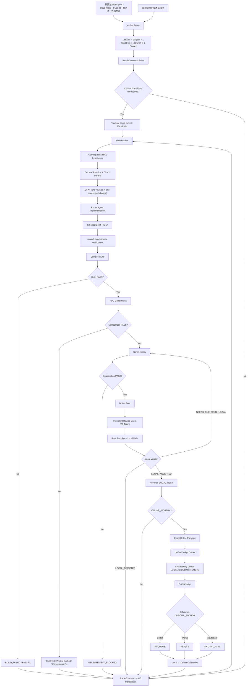
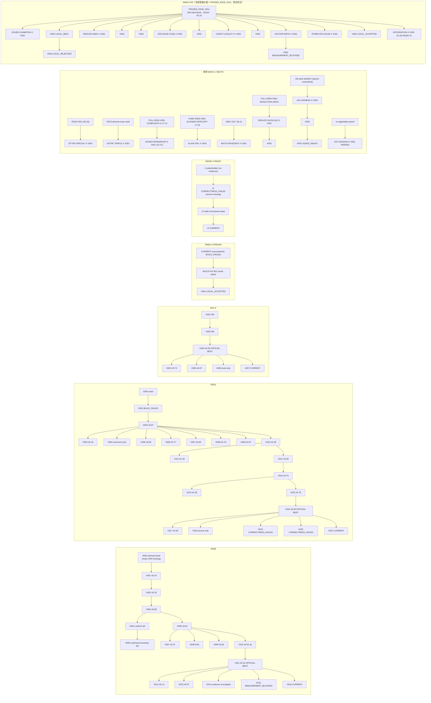
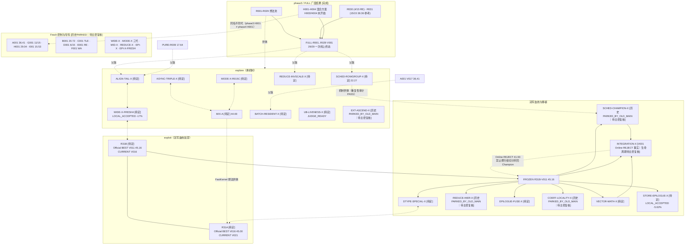

# 技术路线图

三张图：(a) 项目实验总流程；(b) 实际 Route/Revision 血缘（只用 source-meta / ledger 里的直接父子关系，版本号大小不构成父子证据）；(c) 技术路线空间（各系列之间 exploit / explore、共享机制与冲突）。

来源：`归档/历史控制文件/route-exploration-map.md`、`归档/历史控制文件/main1-revision-ledger.tsv`、`归档/历史控制文件/main2-r2-route-registry.md`、`调度/当前任务.tsv`、各 `本地实验/<ROUTE>/<REV>/source-meta.json`。

---

## (a) 项目实验总流程

> 抄自 `归档/历史控制文件/route-exploration-map.md` §1（canonical 实验流程），在入口补上「研究池 → 3–5 个假设」，并保留 Track-A / Track-B 双轨与校准回流。

补充规则（来自 `next-round-plan.md` / `main2-r2-route-registry.md`）：

- Agent 在 Main 给出终局决定前不得开启下一条 revision，也不得自行提交 Online。
- 在线名额稀缺：一周期只提交 `ONLINE_WORTHY`，且一次一个，由统一 Judge Owner 提交。
- 当前双轨分工：Track-A 收掉当前 Candidate（资格化、补测），Track-B 只做本路线研究，产出 3–5 个候选假设。

---

## (b) 实际 Route / Revision 血缘

> 只画 source-meta / ledger 记录的 `direct_parent`。**V00N → V00N+1 不是默认关系**：例如 `SCHED-CHAMPION-X V002` 的直接父版是 `FROZEN_R31B_V011` 而不是 V001；`MIX-A V005/V006/V007` 都直接挂在 V003 上；`R31B V009/V010` 挂在 V006 而不是 V008。

血缘要点（防止把版本序当成父子）：

| 事实 | 依据 |
|---|---|
| `SCHED-CHAMPION-X V002` 的直接父版是 `FROZEN_R31B_V011`，不是 V001 | `本地实验/SCHED-CHAMPION-X/V002/source-meta.json` `direct_parent` |
| `REDUCE-HIER-X V001/V002/V003` 都直接挂 FROZEN 基线 | 三个 `source-meta.json` `DIRECT_PARENT=FROZEN_R31B_V011` |
| `STORE-EPILOGUE-X V001/V002` 都直接挂 FROZEN 基线 | 两个 `source-meta.json` `parent_source_sha=a8c19a19…` |
| `VECTOR-MATH-X V002` 父版是 V001 | `本地实验/VECTOR-MATH-X/V002/source-meta.json` |
| `MIX-A V004/V005/V006/V007` 全部直接挂 V003 | ledger `DIRECT_PARENT` 列 |
| `R31B V009/V010` 直接挂 V006（不是 V008）；`V012/V013` 挂 V011 | ledger + `main1-route-selection.md` 血缘段 |
| `R31A V011` 挂 V010、`V013` 挂 V012、`V016` 挂 V015、`V017–V021` 挂 V016 | 同上 |
| `WIDE-X-FRESH4` 链条是 `CURRENT → BUILD-FIX-001 → V001` | ledger `DIRECT_PARENT` |
| `MODE-X-R015C` 是 `r2 → r3 → r4`，r1 只是编号占位、无证据 | ledger `REVISION_CLASSIFICATION=MISSING_NOT_REVISION` |
| `INTEGRATION-X V001` 挂 FROZEN 基线，REJECT 后血缘回到 FROZEN 基线 | `main2-r2-route-registry.md` MAIN DECISION 2026-09-27 |

---

## (c) 技术路线空间图

按「机制轴」组织：同一列共享机制，箭头表示供体/继承/冲突。`[exploit]` 在冠军血统上加深，`[explore]` 换机制，`[完成]` 是 phase3/FULL 的一次性广度结果，`[暂停]` 是已记录的暂停状态，`[待定]` 只有建议、规划层未决定。

### 共享机制与已知冲突清单

| 机制轴 | 涉及路线 | 关系 |
|---|---|---|
| 32B 行组 / 行所有权 | FULL-R012 → SCHED-ROWGROUP-X → SCHED-CHAMPION-X | 供体链；`NON_DUPLICATION_AUDIT=PASS`（FROZEN 基线里没有该机制） |
| 归约拓扑（ReduceSum / 树 / 跨距） | FULL-R006/R007/R011 → REDUCE-INVSCALE-X、REDUCE-HIER-X | 两条不同父系：前者挂 FULL-R006，后者挂 FROZEN 基线；registry 明确 REDUCE-HIER-X 不以老 V002 为父 |
| 尾块 / 对齐拷贝 | FULL-R009/R010/R012 → ALIGN-TAIL-X、MODE-X-R015C、MIX-A、DTYPE-SPECIAL-X | `STORE-H1` 因与该轴撞车被拒；aligned DataCopy 想法需跨路线去重 |
| 多行 DMA | FULL-R015、R015 想法 → MODE-X-R015C、BATCH-RESIDENT-X | `STORE-H2(a)` 因 R015 冲突被砍 |
| 参数驻留 / gamma-bias 局部性 | FULL-R014 → BATCH-RESIDENT-X、COEFF-LOCALITY-X、A001 | COEFF-LOCALITY-X 从 FROZEN 基线另起，不继承 BATCH-RESIDENT-X |
| 同步 / 流水（MTE2-V-MTE3） | FULL-R013 → ASYNC-TRIPLE-X；MIX-A 的 SyncVToMTE2 移除 | 双 Main ownership 冲突：MAIN-1 同名副本 `COLLISION_FROZEN`；EPI-PIPE-3 也与 ASYNC 相邻 |
| dtype 专用路径 | DTYPE-SPECIAL-X vs R31A 的 affine/Rsqrt、R31B 低精度宽行 | registry 禁止 MAIN-2 造 dtype 专用轴 |
| 输出 / 尾部算术 | EPILOGUE-FUSE-X、STORE-EPILOGUE-X、EPI-X-FRESH | 同属输出侧但机制不同：算术融合 vs 回写合并；`EPI-FUSE-1` 是已做过的 SCALE-FOLD 重复 |
| 小胜无法迁移 | SCHED 33x100 -4.4%、VECTOR 中形状 -14% → INTEGRATION-X 官方 -3.23 | 校准记 `FALSE_POSITIVE`，本地小胜不保证 Official 上升 |
| MAIN-1 Wave-2 当前组合 | SYNC-TOPOLOGY-CHAMPION-X、CASE47-SMALL-CLUSTER-CHAMPION-X、CASE14-INTRAROW-PARALLELISM-CHAMPION-X、SELECTIVE-FASTPATH-CHAMPION-X、TINY-FIXED-OVERHEAD-CHAMPION-X | Planning 于 2026-10-03 批准的五条 Route。CASE47、CASE14、FASTPATH 与 TINY 的 Track-B 已交回并由 Main 记录为 NEEDS_MORE_EVIDENCE；Official case 输入映射缺失；没有新 Revision 或成绩。SYNC V001 当前需调整 Parent ASC module 注册方式。旧 STORE/EPI/SMALLMID 状态见下方。 |

### MAIN-1 Wave-2 Portfolio (2026-10-03)

| Route | Planning state | Branch / worktree | Current evidence |
|---|---|---|---|
| SYNC-TOPOLOGY-CHAMPION-X | CONTINUE | `w2/m1/sync-topology` / `worktrees/w2/m1/sync-topology` | Candidate Build/Correctness previously passed. Main attempt RUN_ID `...210858Z`: Configure PASS; Parent ASCPLUGIN `Unknown kernelInfo`, unresolved `__origin__` symbols; no executable, new Correctness, Local score, or timing. Next harness fix follows the direct-source CMake pattern; review before immediate retry. |
| CASE47-SMALL-CLUSTER-CHAMPION-X | CONTINUE | `w2/m1/case47-small-cluster` / `worktrees/w2/m1/case47-small-cluster` | Track-B commit `2404d4e4`; Main review `NEEDS_MORE_EVIDENCE`. H2/H5 duplicate, H3 unsupported by current interface, H4 overlaps earlier wide-tile work; H1 needs Judge case4/case7 shape and dtype. No performance hypothesis selected. |
| CASE14-INTRAROW-PARALLELISM-CHAMPION-X | CONTINUE | `w2/m1/case14-intrarow-parallelism` / `worktrees/w2/m1/case14-intrarow-parallelism` | Track-B review `NEEDS_MORE_EVIDENCE`; H1 overlaps R008/C001 same-row D-slice, H2-H4 duplicate existing axes. Exact case metadata, C001 source/TLE log, raw profile and workspace ABI evidence remain unavailable. |
| SELECTIVE-FASTPATH-CHAMPION-X | CONTINUE_RESEARCH_ONLY_FOR_ONE_RESEARCH_CYCLE | `w2/m1/selective-fastpath` / `worktrees/w2/m1/selective-fastpath` | Track-B commit `5f669c30`; Main review `NEEDS_MORE_EVIDENCE`. STORE V003 Official 44.38 is below V011 45.16; Local gains compare with STORE V002. Judge input mapping is missing; visible TINY mechanisms differ at source level, workload overlap remains unknown. No Revision. |
| TINY-FIXED-OVERHEAD-CHAMPION-X | CONTINUE | `w2/m1/tiny-fixed-overhead` / `worktrees/w2/m1/tiny-fixed-overhead` | Track-B commit `990a6a37`; Main review `NEEDS_MORE_EVIDENCE`; five hypotheses, none selected. Official case1/3/5 shape, dtype, dispatch, and timer boundary remain unknown. |

All three new Route worktrees use Direct Parent `线上结果/R31B/V011/submission.asc`, SHA `a8c19a1972207acc67e3fb0cd393cc70b0a4b183d1eaf5610edf80c2879b15e3`. Official case results retain time/score but not input metadata; same time band alone does not establish a shared kernel path. No performance implementation may start until exact shape/path facts are available and Main records `MAIN_SELECTED=YES`.

Closed by the 2026-10-03 Planning state, with branches and V001 evidence retained:

| Route | Classification | Current source reference |
|---|---|---|
| STORE-EPILOGUE-W2-X | `PARKED_BY_BASELINE_OR_ENVIRONMENT_BLOCK` | STORE V002, restore record commit `53d9f04b` |
| EPI-ARITH-CHAMPION-W2-X | `PARKED_BY_BASELINE_OR_ENVIRONMENT_BLOCK` | R31B V011, restore record commit `d9c08342` |
| SMALLMID-DATAFLOW-CHAMPION-X | `CORRECTNESS_REJECTED` at BF16 D2049 | R31B V011, restore record commit `351be0cd` |

Their local linked worktrees were removed after confirming clean status, no ignored artifacts, no active route process or lease. Their branches remain available.

---

## 附：图与表的对应

| 图 | 对应表 |
|---|---|
| (a) 流程 | `技术路线/技术路线总表.md` 第十节「决定状态口径」；流程细节见 `归档/历史控制文件/project-experiment-playbook.md` |
| (b) 血缘 | `技术路线/全版本记录.tsv` 的 `DIRECT_PARENT` / `OFFICIAL_ANCHOR` 列 |
| (c) 空间 | `技术路线/路线成绩表.tsv` 的 `技术类别` / `执行Agent建议` / `Planning最终决定` 列 |
