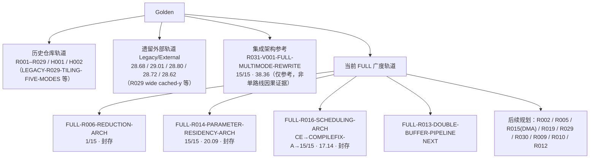

> 本文件是本地仓库当前状态唯一权威入口；历史 README、调研总结、workbuddy memory、对话归档不得覆盖本文件。

# 当前状态

- 日期：2026-09-18
- 分支：`chore/canonicalize-2026-09-18`（自 `main` @ `dfa0af0` 创建；本地 HEAD `97a9f1e`，cleanup checkpoint 提交）
- 数据口径：下表全部为上游确认的线上（CANNJudge）结果。线上是最终依据；本地推算、对话转述、旧文档均不得改写本表。

## 一、线上已确认结果总表

| 路线 / 版本 | 线上结果 | Official Score | 提交时间 | 状态 |
| --- | --- | --- | --- | --- |
| B0-PURE-V001 | 15/15 | 17.52 | — | 已确认 |
| PURE-R012-V001-32B-ROWGROUP | 15/15 | 21.37 | — | 已确认 |
| PURE-R009-V001-ALIGNED-DATACOPY | 15/15 | 17.64 | — | 已确认 |
| PURE-R010-V001-MANUAL-TAIL | 15/15 | 17.37 | — | 已确认 |
| R031-V001-FULL-MULTIMODE-REWRITE | 15/15 | 38.36（Official） | — | 已确认；仅作集成架构参考，不作为任何单路线的因果证据 |
| FULL-R006-V001-REDUCTION-ARCH | 执行 1/15（Case1 Pass，Case2–15 WA） | 无有效分 | — | 该路线广度已封存（breadth frozen） |
| FULL-R014-V001-PARAMETER-RESIDENCY-ARCH | 15/15 | 20.09（Official） | 2026/09/18 00:24:36 | 已封存（frozen） |
| FULL-R016-V001-SCHEDULING-ARCH | 首次 Compile Error → COMPILEFIX-A 后 15/15 | 17.14（Official） | 2026/09/18 02:20:54 | 已封存（frozen） |
| FULL-R013-V001-DOUBLE-BUFFER-PIPELINE-ARCH | 候选源码在上游，尚无首次有效线上结果 | — | — | **NEXT（下一条广度）** |

## 二、命名口径（必须遵守）

- 历史编号 R013 / R014 / R016 / R006 与 `FULL-*` 代是不同路线，禁止混用、禁止互相继承成绩。
- 本仓库旧 R029（官方 Tiling 五模式）今后一律写作 **LEGACY-R029-TILING-FIVE-MODES**。
- 外部旧 R029（wide cached-y，28.68 / 29.01）属于 **LEGACY / EXTERNAL**，禁止与未来的 `FULL-R029-WIDE-CACHED-ROW` 混淆。
- 旧 R016 官方分 28.72 属于外部/历史轨道，**不等于** `FULL-R016` 的 17.14。
- H001 / V005 是本仓库独立的实验轨道（混合方案），**不是**当前 FULL 线上主线。
- 遗留外部官方分 28.68 / 29.01 / 28.80 / 28.72 / 28.62 一律标注为 legacy external evidence，只作历史对照。

## 三、当前 FULL 广度顺序（R013 之后）

1. FULL-R013-DOUBLE-BUFFER-PIPELINE ← 当前 NEXT
2. FULL-R002-RETAINED-Y
3. FULL-R005-LARGE-TILE
4. FULL-R015-MULTI-ROW-DDMA（源码/目录名使用 FULL-R015-MULTI-ROW-DMA）
5. FULL-R019-NORMALIZATION
6. FULL-R029-WIDE-CACHED-ROW
7. FULL-R030-WIDE-PARAM-REUSE
8. FULL-R009-COPY-CENTRIC
9. FULL-R010-TAIL-CENTRIC
10. FULL-R012-ALIGNMENT-ROWGROUP

规则：禁止在全部主要 FULL V001 首次有效结果完成之前，开做任何 FULL 路线的 V002 / V003。

## 四、本地缺口（本仓库当前没有的东西）

- `FULL-R014`、`FULL-R016` 的线上结果快照：本地缺失，等待上游交接包。
- `FULL-R013` 候选源码：本地缺失，**必须先收到上游交接包**才能开始 R013。
- B0 / PURE / FULL-* 各版本源码：本仓库没有独立源码文件；相关记录只存在于 `调研/归档/外部对话-ChatGPT编译并修复/原始记录/对话全文.md`（未提交时代的内容已在 cleanup checkpoint 中入库）。
- 多数官方分没有绑定 submission id，也没有绑定 git commit；详见 [代码与结果溯源](代码与结果溯源.md)。

## 五、Golden 轨道图

## 六、阅读顺序

本目录五份权威文档的阅读顺序见 [文档/README](README.md)：当前状态 → 路线树 → 实验纪律 → CANNJudge流程 → 代码与结果溯源。
