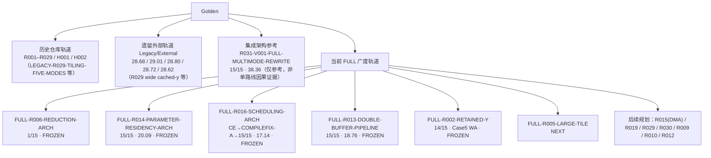

> 本文件是本地仓库当前状态唯一权威入口；历史 README、调研总结、workbuddy memory、对话归档不得覆盖本文件。

# 当前状态

- 日期：2026-09-18
- 分支：`exp/full-r002-retained-y-v001`（自同步提交 `f27c02980018d213b9e367a7522bc97aa2f0556a` 派生）
- 数据口径：下表全部为已保存证据的线上（CANNJudge）结果。线上是最终依据；本地推算、对话转述、旧文档均不得改写本表。
- 资源规则：只有服务器 `AVAILABLE_DISK < 15G` 才停止新增编译、构建、NPU 实验、profiling、测试数据生成和新路线实验；文件系统使用率百分比不参与停止判定。

## 一、线上已确认结果总表

| 路线 / 版本 | 线上结果 | Official Score | 提交时间 | 状态 |
| --- | --- | --- | --- | --- |
| B0-PURE-V001 | 15/15 | 17.52 | 2026/09/17 19:52:39 | DONE |
| PURE-R012-V001-32B-ROWGROUP | 15/15 | 21.37 | 2026/09/17 20:39:00 | DONE / FROZEN |
| PURE-R009-V001-ALIGNED-DATACOPY | 15/15 | 17.64 | 2026/09/17 20:47:53 | DONE / FROZEN |
| PURE-R010-V001-MANUAL-TAIL | 15/15 | 17.37 | 2026/09/17 21:33:52 | DONE / FROZEN |
| R031-V001-FULL-MULTIMODE-REWRITE | 15/15 | 38.36（Official） | 2026/09/17 17:26:33 | DONE；仅作集成架构参考，不作为任何单路线的因果证据 |
| FULL-R006-V001-REDUCTION-ARCH | 执行 1/15（Case1 Pass，Case2–15 WA） | 无有效分 | — | FROZEN；该路线广度已停止 |
| FULL-R014-V001-PARAMETER-RESIDENCY-ARCH | 15/15 | 20.09（Official） | 2026/09/18 00:24:36 | DONE / FROZEN |
| FULL-R016-V001-SCHEDULING-ARCH | 首次 Compile Error → COMPILEFIX-A 后 15/15 | 17.14（Official） | 2026/09/18 02:20:54 | DONE / FROZEN |
| FULL-R013-V001-DOUBLE-BUFFER-PIPELINE-ARCH | 15/15 | 18.76（Official） | 2026/09/18 11:42:29（UTC+8） | DONE / FROZEN |
| FULL-R002-V001-RETAINED-Y-ARCH | 14/15（Case 5 Wrong Answer） | 无 | 2026/09/18 15:19:20（UTC+8） | EXECUTABLE_FAIL / FROZEN |

## 二、命名口径（必须遵守）

- 历史编号 R013 / R014 / R016 / R006 与 `FULL-*` 代是不同路线，禁止混用、禁止互相继承成绩。
- 本仓库旧 R029（官方 Tiling 五模式）今后一律写作 **LEGACY-R029-TILING-FIVE-MODES**。
- 外部旧 R029（wide cached-y，28.68 / 29.01）属于 **LEGACY / EXTERNAL**，禁止与未来的 `FULL-R029-WIDE-CACHED-ROW` 混淆。
- 旧 R016 官方分 28.72 属于外部/历史轨道，**不等于** `FULL-R016` 的 17.14。
- H001 / V005 是本仓库独立的实验轨道（混合方案），**不是**当前 FULL 线上主线。
- 遗留外部官方分 28.68 / 29.01 / 28.80 / 28.72 / 28.62 一律标注为 legacy external evidence，只作历史对照。

## 三、当前 FULL 广度顺序（R013 之后）

1. FULL-R002-RETAINED-Y ← EXECUTABLE_FAIL / FROZEN
2. FULL-R005-LARGE-TILE ← 当前 NEXT
3. FULL-R015-MULTI-ROW-DDMA（源码/目录名使用 FULL-R015-MULTI-ROW-DMA）
4. FULL-R019-NORMALIZATION
5. FULL-R029-WIDE-CACHED-ROW
6. FULL-R030-WIDE-PARAM-REUSE
7. FULL-R009-COPY-CENTRIC
8. FULL-R010-TAIL-CENTRIC
9. FULL-R012-ALIGNMENT-ROWGROUP

规则：禁止在全部主要 FULL V001 首次有效结果完成之前，开做任何 FULL 路线的 V002 / V003。

## 四、上游导入与当前缺口

- 上游线上快照已保存至 `实验/online/upstream-2026-09-18/`，包含 10 份 exact 源码、13 份结果 JSON 和 `UPSTREAM_STATE.json`；快照内容后续不得直接修改。
- FULL-R013 V001 候选为 `提交/单方案/FULL-R013-DOUBLE-BUFFER-PIPELINE/V001/kernel.txt`，与上游 R013 源码逐字节一致，SHA-256 为 `8e00792c69af079f99f83bd57be1ac74c6c4c560c44ed2f0bf1b544ef88db9f7`；本阶段未修改候选，线上结果已归档。
- R031 的 `38.36` 仍是集成架构参考，不归因于任何独立 FULL 路线；历史 R013 / R014 / R016 / R029、H001/V005 与 Legacy/External 继续按原目录保留。
- FULL-R013 线上快照位于 `实验/online/FULL-R013-DOUBLE-BUFFER-PIPELINE/V001/6aacb325b0477ec41e1707d2/`，包含源码、原始结果 JSON、清单和 15 点结果说明；其提交绑定 SHA-256、Git commit 和 submission ID。
- FULL-R002 线上快照位于 `实验/online/FULL-R002-RETAINED-Y/V001/6aace5f8b0477ec41e33e210/`，包含源码、原始结果 JSON、结构化报告、清单和 15 点结果说明；其提交绑定 SHA-256、Git commit 和 submission ID。第 5 点 Wrong Answer，路线标记为 `EXECUTABLE_FAIL / FROZEN`。
- FULL-R002 V001 候选 SHA-256 为 `00c1a86043e924a96a79d0976a51dd1a065cce71614484b09569814f7a2a782c`，Git commit 为 `85dcb890a816c5578d2d9c04e1285930160fb7ba`。
- 线上结果没有提供大多数历史 submission id，也没有绑定产生该分数时的 git commit；FULL-R016 初始 Compile Error 没有编译日志，FULL-R006 的对齐原因仍是未验证假设。详见 [代码与结果溯源](代码与结果溯源.md)。

## 五、Golden 轨道图

## 六、阅读顺序

本目录五份权威文档的阅读顺序见 [文档/README](README.md)：当前状态 → 路线树 → 实验纪律 → CANNJudge流程 → 代码与结果溯源。
