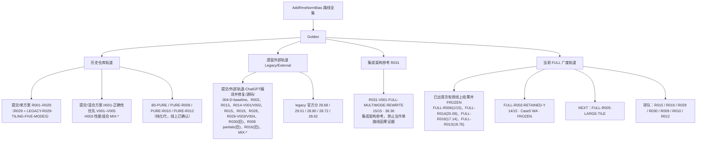

# 路线树

本文件给出全仓库路线编号的统一树形视图。分数与状态以 [当前状态](当前状态.md) 为唯一权威；本文件只负责“谁属于哪条轨道、编号怎么叫”。

## 四条 Golden 轨道

## 命名规则（同名不同代，必须区分）

| 写法 | 含义 | 禁止事项 |
| --- | --- | --- |
| `FULL-Rxxx-…` | 当前广度轨道，每条 V001 都是一次实质性架构重写 | 与任何旧同号路线互抄成绩 |
| `LEGACY-R029-TILING-FIVE-MODES` | 本仓库旧 R029（官方 Tiling 五模式资料） | 禁止再用裸 `R029` 指代它 |
| `LEGACY/EXTERNAL` 旧 R029 | 外部 wide cached-y（28.68 / 29.01） | 禁止与 `FULL-R029-WIDE-CACHED-ROW` 混淆 |
| 旧 R016（28.72） | 外部/历史轨道 | 禁止写成 `FULL-R016` 的成绩 |
| 旧 R013 / R014 / R006 | 外部/历史轨道 | 均 ≠ `FULL-R013` / `FULL-R014` / `FULL-R006` |
| `H001 / V005` | 本仓库混合方案实验轨道 | 禁止当作 FULL 线上主线 |
| `B0-PURE / PURE-Rxxx` | 纯化代线上版本 | 单独成组，不并入 FULL |

## 当前 FULL 广度队列（依次出首次有效线上结果）

见 [当前状态 · 第三节](当前状态.md)。要点：

- FULL-R013 已取得 15/15、Official Score 18.76，并在 `实验/online/FULL-R013-DOUBLE-BUFFER-PIPELINE/V001/6aacb325b0477ec41e1707d2/` 保存完整结果。
- FULL-R002 已取得一次 executable online result：14/15，Case 5 Wrong Answer；完整结果、SHA、Git commit 和 submission id 位于 `实验/online/FULL-R002-RETAINED-Y/V001/6aace5f8b0477ec41e33e210/`，路线标记为 `EXECUTABLE_FAIL / FROZEN`。
- 当前 NEXT 为 `FULL-R005-LARGE-TILE`。
- 每条 FULL 路线在全部主要 V001 首次有效结果完成前，不开 V002/V003。
- FULL-R015 的对外名称是 `FULL-R015-MULTI-ROW-DDMA`，目录与源码使用 `FULL-R015-MULTI-ROW-DMA`。
- 新路线实验只在 `AVAILABLE_DISK >= 15G` 时继续；文件系统使用率百分比不参与停止判定。

## 当前导入快照

- 线上快照：`实验/online/upstream-2026-09-18/`，10 份源码、13 份结果和 `UPSTREAM_STATE.json`。
- FULL-R013 V001 候选：`提交/单方案/FULL-R013-DOUBLE-BUFFER-PIPELINE/V001/kernel.txt`；当前 NEXT 为 `FULL-R002-RETAINED-Y`。
- R013 SHA-256：`8e00792c69af079f99f83bd57be1ac74c6c4c560c44ed2f0bf1b544ef88db9f7`。
- FULL-R002 V001 候选：`提交/单方案/FULL-R002-RETAINED-Y/V001/kernel.txt`；SHA-256：`00c1a86043e924a96a79d0976a51dd1a065cce71614484b09569814f7a2a782c`；当前 NEXT 为 `FULL-R005-LARGE-TILE`。
- 在全部主要 FULL V001 完成前，禁止 V002、V003、pairwise mix 和 final multimode。

## 已封存路线（有首次有效线上结果，不再扩展）

| 路线 | 线上结果 | 说明 |
| --- | --- | --- |
| FULL-R006-REDUCTION-ARCH | 1/15（Case1 Pass，Case2–15 WA） | 广度封存 |
| FULL-R014-PARAMETER-RESIDENCY-ARCH | 15/15 · 20.09 | 2026/09/18 00:24:36 提交 |
| FULL-R016-SCHEDULING-ARCH | CE → COMPILEFIX-A → 15/15 · 17.14 | 2026/09/18 02:20:54 提交；CE 后修复仍算同一路线 V001 |
| FULL-R013-DOUBLE-BUFFER-PIPELINE | 15/15 · 18.76 | submission `6aacb325b0477ec41e1707d2`；SHA、Git commit、完整 15 点位于 `实验/online/FULL-R013-DOUBLE-BUFFER-PIPELINE/V001/6aacb325b0477ec41e1707d2/` |
| FULL-R002-RETAINED-Y | 14/15，Case 5 Wrong Answer | submission `6aace5f8b0477ec41e33e210`；SHA、Git commit、完整 15 点位于 `实验/online/FULL-R002-RETAINED-Y/V001/6aace5f8b0477ec41e33e210/`；路线广度封存 |
