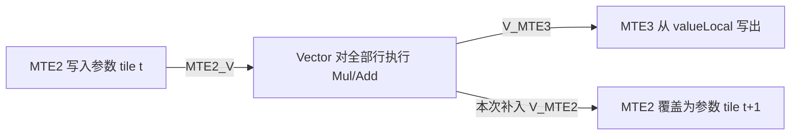

# W4-R13：参数暂存区复用的单点诊断

## 本次结果：DIAG-PARAM-REUSE-01

2026-10-08，本次 fresh context 已完成真实源码修改、server3 构建和五次精度诊断。
唯一变化为：在 `ProcessWideFp32FullCacheRows` 中，仅当 `tile>0`，在参数
`Load` 前调用现有 `SyncVToMTE2()`。两个失败输入在同一设备上的 Parent 均失败，
诊断版均通过；未变化的 `1x8192` 控制项也通过，且与此前保存的 Parent 输出逐位相同。
这支持参数消费与下一次 MTE2 覆盖之间缺少顺序是本次故障的原因。

本次属于 `RESEARCH_EXECUTED_VARIANT`，确实编辑并执行了 kernel；没有建立性能版，
没有 Local 成绩，也没有正式提交。该依赖在早期 R31B 已经存在，本次不把它登记为新的
性能机制。性能版本下一可用编号仍为 V001，未使用。

身份：`AGENT_ID=01a119e0-8718-7fe3-921a-3edab7743bcb`，SLOT-2；
分支 `w4/r13-wide-fp32-cache-tail-x`；工作树
`/Users/sunyiyang/Desktop/Project/cann/worktrees/w4/R13-wide-fp32-cache-tail-x`；
接手提交 `91e891a2a266ecb2b870afead3c3aa0fd94b67ac`，接手时无未提交改动。
当前结果的提交号以本文件所属提交及最终回执为准。

## producer → consumer → reuse

以下行号指未改动的 `线上结果/R31B/V011/submission.asc`。

| 阶段 | 对象、位置与顺序 |
|---|---|
| 实际分派 | D>8192、FP32：Init L69–80 分配缓存；Process L163–169、L1847–1853 调用 FullCacheRows。1x8192 走窄行控制路径。 |
| pass1 / 倒数 | xBuf_/residualBuf_ 先存输入，再作平方与归约工作区；L2135、L2157 的 V→MTE2 同步覆盖这些阶段。reduction 和行倒数计算原样保留。 |
| 参数生产 | L2179–2180 的 gammaLocal/biasLocal 分别取自 xBuf_/residualBuf_；L2191–2192 的 Load 以 MTE2 写这两个区。 |
| 参数就绪 | L2193 的 MTE2_V 保证参数写入先于本 tile 的 Vector 使用。 |
| 参数消费 | L2203 的 Mul 读取 gamma，L2205 的 Add 读取 bias；同一参数 tile 供本批全部行使用。 |
| 下一次覆盖 | 下一次 tile 迭代仍向同一个 xBuf_/residualBuf_ 起点加载 gamma/bias；需要前述 Vector 读取先完成。 |
| 现有输出等待 | L2184/L2188 为 MTE3_V；L2224–2226 的 Store 读取 valueLocal，不读取参数暂存区。这个等待没有表达 MTE2 必须等待参数消费的关系。 |
| 本次干预 | 在原 L2191 前增加四行，仅对 tile>0 调用 SyncVToMTE2；第一 tile 仍使用原 L2157 的顺序。输出等待与两层行循环全部保留。 |



`SyncVToMTE2` 在 L3415–3419 已定义为同一 V_MTE2 事件的 Set/Wait。
本循环内没有仍待消费的 V_MTE2 分配事件；输出队列使用 V_MTE3/MTE3_V，保持原样。
server3 SDK `impl/kernel_tpipe_impl.h` L665–673 的 `ReadSpmBuffer` 也在 MTE2
覆盖 UB 前使用 V_MTE2，再用 MTE2_V 连接随后的计算。对应只读节选保存在
`parent-tail-probe/evidence/param-reuse-01/api-evidence.txt`。

源码中的旧注释把输出称作仍引用参数暂存区，与 Store 的实际 valueLocal 参数不符。
本次以具体读写位置和事件方向作判断，没有按注释扩大改动，也没有改用通用全流水等待。

## DUPLICATE_AUDIT：已有依赖，新因果证据

`MECHANISM=parameter staging consume-before-overwrite`。

| 已读历史 | 本轴结论 |
|---|---|
| 本 Route / 91e891a2 | 只有 Parent 探测；没有性能版本或本次诊断源码。 |
| W3 R2 / 6321ad44，V001–V040 | 40 份目标函数的代码与 Parent 相同；未发现本次位置的依赖变化。 |
| W3 R4 / ce6c6dc5，V001–V031 | 31 份目标函数代码相同；旧表 V013 不作为末版。 |
| W3 R5 / 1efa0863，V001–V028 | 28 份目标函数代码相同。 |
| R31B V002–V005 | 同一 FullCacheRows 的每个参数 tile 结束处已有 SyncVToMTE2。 |
| R31B V006–V015 | V006 输出队列变化删除了旧的每 tile SyncVToMTE2；V011 沿用这一顺序。V009/V012 有额外输入或参数双槽结构，未作为本次单点版本复用。 |
| R31B V016/V017 | 本工作树保存的 FullCacheRows 代码与 V011 相同。 |
| R031、R31A、MIX | 已读旧源码没有当前 FullCacheRows 实现；R31A V026 的 CachedRows 为 gamma/bias 分别释放后预取下一 tile，机制已有，不在本次重做。 |
| STORE V001–V003 | 已有整行或分块写出；没有本次 V011 参数加载前的单点恢复。 |
| EPILOGUE-ARITH V001/V002 | 已有整行缩放提前执行、gamma-first Axpy；本次没有改变这些算术因素。EPILOGUE-FUSE 只取得旧机制记录，未宣称完整覆盖其源码。 |
| W4 R01/R02/R08/R09/R10/R11 | 已提交 Candidate 的 FullCacheRows 代码相同；R09 96044629 的真实变化位于另一 FP16 路径 L3346。 |
| R05 / 61e0aa28 | 已读 PARAM-OUTPUT-LAYOUT-STUDY.md；确认同一对缓冲的真实参数消费者，没有把它当成因果实测。 |

上述跨分支源码均通过本工作树的 Git 对象读取；旧 R031/R31A/R31B、MIX、STORE
材料来自本工作树的归档。V005→V006 的函数差异明确显示依赖被删除。
因此 `MATCH_FOUND=YES_HISTORICAL_DEPENDENCY`；`WHY_NEW_OR_DUPLICATE` 是依赖本身
已有历史，本次增加当前 V011 的四行隔离干预及同设备 reference 对照。
`NEW_PERFORMANCE_REVISION=NO`。

## 构建、独立 reference 与实际输出

复用 `parent-tail-probe` 的现有 CMake、runner_ref.inc、local_types.h 和构建脚本，
没有改变输入生成、reference、容差、tile、ownership、分配、reduction 或输出形式。
新增目标 `w4r13_ref_reuse_probe` 使用保存的完整 `param_reuse_source.asc`。
对 Parent 的源码差异仅为上述四行。CMake 入口此次同时重建了 Parent 目标；旧输出、
旧构建失败和旧成功记录全部保留，未删除构建目录。

Compile：2026-10-08 05:19:22–05:19:47 UTC，退出码 0，两个目标均完成链接。
有原 runner 的 GM_ADDR 属性及 printf 宽度格式警告，没有本次构建失败。
日志为 `parent-tail-probe/evidence/param-reuse-01/compile-01.log`。

Correctness：2026-10-08 05:20:31–05:20:58 UTC。顺序为 Parent 9216 → 诊断 9216
→ Parent 10240 → 诊断 10240 → 诊断 8192。增加两次当前 Parent 运行，用于同设备
因果对照；此前三组输出和分析直接复用，没有扩展输入矩阵。

每个输出均独立比较原 runner 的 FP32 reference 与复用分析函数的 FP64 reference，
逐元素要求 `abs_error <= 1e-4 + 1e-4*abs(reference)`。所有输出的非有限值数量为 0。

| FP32 shape | 本次 Parent 超差：前8192 / 尾部 | 诊断超差：前8192 / 尾部 | 诊断最大绝对误差，FP64 reference | 原 runner 返回码：Parent / 诊断 |
|---|---:|---:|---:|---|
| 1x8192 | 复用旧结果：0 / 无尾部 | 0 / 无尾部 | 5.01749850e-7 | 未重跑 / 0 |
| 1x9216 | 5119 / 256 | 0 / 0 | 4.62491319e-7 | 3 / 0 |
| 1x10240 | 7166 / 1024 | 0 / 0 | 5.51814769e-7 | 3 / 0 |

原 FP32 runner 的诊断最大绝对误差依次为 1.66893e-6、3.33786e-6、4.76837e-6，
三项也全部通过。另一份先将 x+residual 舍入到 FP32 的参考计算仍为小误差。
`1x8192` 的完整诊断输出与旧 Parent 输出逐位相同。

本次 Parent 的尾部也出现错误，旧运行的尾部超差数为 0；旧数字没有被覆盖。
这说明错误位置随执行条件变化，不能把“只错前8192”当成固定性质，也不能把
末 tile 参数误用模型当成所有错误元素的唯一解释。四行干预在本次三组输入上消除了
超差；未据此宣称其他宽度、其他 dtype、完整多行或多批范围都已正确。

## 设备与计时边界

SSH=`cann-server3`，host=`hwnput3`，user=`lelinfeng`，device=1；构建 SoC 为
Ascend910B3 / dav-2201，CANN 8.5.0.alpha002。远端仍使用
`/home/data4t2/lelinfeng/cann/server_runs/W4-R13/parent-tail-probe/`。
本进程沿用 `/usr/lib/aarch64-linux-gnu/libstdc++.so.6` 的 LD_PRELOAD；没有改服务器库或服务。
运行前后 FREE_HBM 为 52428–56360 MB，AICore 为 0–15%，AIVector 为 0–11%，
load1 为 54.87–73.35。负载只作运行背景，没有等待独占设备。

参数均为 rows=1、dtype=0、warmup=0、samples=1、blocks=1、gap_sec=0、batch_n=1。
这里 blocks 是 runner 采样块数；实际 kernel blockCount 由现有 run_kernel 按一行输入得到 1。
单次启动的 device_us / host_wall_us 原样保留：

| 运行 | device_us | host_wall_us |
|---|---:|---:|
| Parent 1x9216 | 109399 | 109688 |
| 诊断 1x9216 | 138885 | 139279 |
| Parent 1x10240 | 134818 | 135110 |
| 诊断 1x10240 | 115326 | 115613 |
| 诊断 1x8192 | 113752 | 114063 |

这些数值含首次启动条件，每项只有一个样本。未执行 Parent same-binary 稳定性或正式
交错性能采样；两个宽行 Parent 对 reference 失败，控制项不经过变化位置。因此
`LOCAL_SCORE=NONE`、`LOCAL_DELTA=NONE`、`CURRENT_LOCAL_BEST=NONE`，不接受性能提升。
本次新增性能版 0、有效 Local 0、连续有效无改善贡献 0。

## 本次文件、事件与停止位置

实际修改均限于本工作树 `研究/W4-R13/`：本 RESULT.md、parent-tail-probe/CMakeLists.txt；
新增 param_reuse_source.asc、runner_ref_reuse.asc、run_param_reuse_server3.sh、
analyze_param_reuse.py，以及 evidence/param-reuse-01 下完整输出、前后设备状态、
命令与返回码、原始计时、编译日志、SDK 节选和 reference-analysis.json。
五个二进制输出包含 Parent 失败样本；没有删除或覆盖旧证据。

事件：`W4-R13-PARAM-REUSE-20261008`；实际研究变体 `DIAG-PARAM-REUSE-01`。
发布 ROUTE_RESEARCH_EVENT、ROUTE_EVENT 与明确标注研究类型的 VERSION_RECORD_EVENT，
不登记为 V001 性能版。`OFFICIAL_SCORE=NONE`、`ONLINE_STATE=PAUSED`、`PUSH=NO`。
接手时读取的 main@285e7b4c 已登记本 Route 及上次研究；下方旧 STATE_SYNC_GAP
只保留为旧回执，本次事件等待 Record 同步。共享记录、规则和 Dashboard 未修改。

05:21:59 UTC 的 final-process-state.txt 记录两个目标均已生成，pgrep 返回 1，
`RUNNING_DEVICE_OPERATION=NONE`。所有五次运行和构建命令都已结束；没有定时或后台循环。

本次最小因果诊断已完成。剩余同轴动作是先证明最后参数 tile 到下一 batch pass1 的
xBuf_/residualBuf_ 再使用顺序（Parent L2235–2245 → L2125–2126），再由后续同 Route
任务选择一个有来源的最小多批输入。本次只有一行，不能验证该边界；不继续扩展矩阵。
D40000 partial 容量仍是未处理的另一条轴，reduction、tile 和 ownership 均未改动。
交还槽位由 Main 处理；没有关闭、合并或替换 Route。

---

## 之前的 Parent 尾部探测（91e891a2，原记录）

本次占槽完成研究结论，未创建性能 Candidate 或性能版本。`1×9216`、`1×10240` FP32 的 Parent 均未通过 reference；两个尾部区都通过，错误出现在前面的整 tile。当前证据支持继续研究 gamma/bias 暂存区的复用顺序，不能宣布性能提升，也不能据此认定所有宽行输入均有问题。

## 实测结果

Parent 为本树 `线上结果/R31B/V011/submission.asc`，内容未修改；与 `w4/r10-active-core-d-aware-x:本地实验/W4-R10/V001/parent.asc` 的文本对比无差异。实际执行位置为 server3 `/home/data4t2/lelinfeng/cann/server_runs/W4-R13/parent-tail-probe/`。

| FP32 shape | 整 tile 超差数 | 尾部超差数 | 整行最大绝对误差（双精度 reference） | 结果 |
|---|---:|---:|---:|---|
| 1×8192 | 0 / 8192 | 无尾部 | 5.01750e-7 | PASS，控制项 |
| 1×9216 | 5631 / 8192 | 0 / 1024 | 1.20398729 | FAIL |
| 1×10240 | 7165 / 8192 | 0 / 2048 | 1.10208545 | FAIL |

容差为现有 runner 的 `atol=1e-4, rtol=1e-4`。原 runner 的 FP32 reference 与独立双精度 reference 得到相同超差数量；另一份先把 `x+residual` 舍入为 FP32 的参考计算仍有相同量级误差。两个尾部区最大绝对误差分别为 `3.36605e-7`、`5.51815e-7`，未发现非有限值。

这些是本轮新实测的研究尺寸，不是 Official shape。执行参数均为 `device=4, rows=1, dtype=0, warmup=0, samples=1, blocks=1, gap_sec=0, batch_n=1`。计时处于首次启动条件，原始值保留作诊断，不能作为稳定性结论或 Local 成绩。

硬件与环境：`hwnput3`、`lelinfeng`、Ascend910B3 / dav-2201、CANN `8.5.0.alpha002`。三次执行前 `FREE_HBM_MB=6553`，HBM 使用率 90%，AICore/AIVector 快照均为 0%；系统 load1 约 59.75–64.23。完整前后快照、命令、退出码和原始输出在 `parent-tail-probe/evidence/`。

## 新的可证伪线索

输出数据可部分由后一个参数 tile 解释：

| shape / 元素索引 | 实际值 | 正确 reference | 改用末 tile 对应 gamma/bias 后的值 | 与实际值的差 |
|---|---:|---:|---:|---:|
| 1×9216 / 700 | 2.78834248 | 1.58435519 | 2.78834255，参数列 8892 | 7.25087e-8 |
| 1×10240 / 1400 | 2.52721858 | 1.42513313 | 2.52721837，参数列 9592 | 2.05688e-7 |

这支持参数暂存区提前被下一次 MTE2 写入的假设，尚未通过单变化实验确认因果。

精确源码位置均在 Parent：

- `:2179`、`:2180`：gamma/bias 使用 `xBuf_`、`residualBuf_`。
- `:2183`、`:2187`：现有等待为 `MTE3_V`。
- `:2191`、`:2192`：同一暂存区加载下一 tile 的 gamma/bias。
- `:2203`、`:2205`：Vector 仍以这些暂存区作为乘加输入。
- `:2128`、`:2224`：FP32 直接把值写入保留区，并从保留区输出；该路径没有可直接删除的独立尾部拷贝。

`D=40000` 仅作源码推算：`:1293` 的容量选择给出 tile=2048、缓存行数=1，从而需要 20 个 partial；`:79` 只分配每行 16 个位置，`:2133` 以 tile 编号写入。该输入的目标支持范围未确认，本轮未运行。`D=36736` 超出现有原样 runner 的宽度上限 32768，本轮未运行。未取得设备端字段快照；tile 和缓存行数属于源码推导值。

## DUPLICATE_AUDIT

`MECHANISM=unchanged Parent tail-path/reference probe`。

`SEARCHED_HISTORY`：本分支无已提交 R13 实验；读取 `w3/m1/record-owner:调度/当前任务.tsv` 的 R13 行；W3 R2 至 V040（`6321ad44`）、R4 至 V031（`ce6c6dc5`）、R5 至 V028（`1efa0863`）的版本历史及相关结果；R031 集成记录、R31A/R31B、MIX、STORE/EPILOGUE 的相关记录；`m2/reduce-hier` 的 V001–V005；相关 W4 入口只通过 Git 对象读取。

`MATCH_FOUND`：partial-sum lifetime 已有 REDUCE-HIER-X V001，其他归约变体见 V002–V005；整行归一化提前执行已有 EPILOGUE-ARITH V001，合并行内写出已有 STORE-H2B。未把这些机制重新包装为本轮性能版本。旧记录对 staging initialization 的笼统描述没有在本轮转化为新 Candidate。

`WHY_NEW_OR_DUPLICATE`：旧 R13 行明确列出两个新尾部尺寸尚未实测；本轮增加了实际运行输出、整 tile/尾部分区误差及末 tile 参数误用模型。没有重测既有 `1×16384/1×32768` 失败项，没有重新展开归约结构。

## 构建与证据入口

当前唯一构建目标为 `w4r13_ref_parent_probe`，使用 `CMakeLists.txt`、`runner_ref_parent.asc`、`runner_ref.inc`、`local_types.h` 和远端未改动的 `parent_source.asc`。来源为 R10 V001 的完整 ASC executable 链路。对 runner 仅增加末次输出的二进制保存，没有改输入、reference、容差或 Parent 算法。

`compile-01.log` 至 `compile-05.log` 保留失败输出，`compile-06.log` 为成功构建。首次启动因 HCC 自带 libstdc++ 缺少 `GLIBCXX_3.4.29` 而未进入 NPU；失败日志保留。成功运行仅为本进程指定系统 `/usr/lib/aarch64-linux-gnu/libstdc++.so.6`，未修改服务器库或服务。

`abi.h`、`parent_kernel.asc`、`path_kernel.asc`、`runner.cpp` 是失败包装的保留材料，不在当前 CMake 目标中，也没有作为设备探测结果使用。

`analyze_outputs.py` 复用已保存输出生成 `evidence/reference-analysis.json`。三个 `*-output.bin` 保留完整输出，`*-raw.tsv` 保留原 runner 的全部诊断计时。原仓库忽略 `.bin`，因此只对这三个明确文件作显式暂存，不改忽略规则。

## 事件与交接

```text
ROUTE_RESEARCH_EVENT
EVENT_ID=W4-R13-PARENT-TAIL-20261008
ROUTE=W4-R13
REVISION=NONE
DIRECT_PARENT=R31B V011
PERFORMANCE_REVISIONS_ADDED=0
COMPILE=PASS (compile-06)
CORRECTNESS=FAIL (1x9216, 1x10240); CONTROL=PASS (1x8192)
LOCAL_SCORE=NONE
LOCAL_DELTA=NONE
CURRENT_LOCAL_BEST=NONE
STAGNATION_COUNTER=0
OFFICIAL_SCORE=NONE
ONLINE_STATE=PAUSED
PUSH=NO
BRANCH=w4/r13-wide-fp32-cache-tail-x
STATUS=RESEARCH_RESULT_READY
RUNNING_DEVICE_OPERATION=NONE
VERSION_RECORD_EVENT=NONE (no performance revision)
```

`STATE_SYNC_GAP`：旧调度行使用 V001 只读分析标签；本轮接管分支没有对应性能提交。本次继续按研究事件记录，不补造 V001 性能事实。最终 commit 与提交后状态以同轮回执为准。

下一动作：先与 W4-R09 最新事实核对 `:2191` 前对 gamma/bias 暂存区复用的 `V_MTE2` 依赖是否已实测；若未覆盖，在同一 ASC 探测链路内只做这一处正确性诊断，分别报告 Parent 和诊断版本对 reference 的结果。该动作不更改归约、tile 宽度、所有权或输出形式。当前证据尚不足以认定该处同步就是唯一根因；精度可用前不采 Candidate 性能。

本轮只修改 `研究/W4-R13/`；Parent、共享 TSV、规则、Dashboard、其他 Route 工作树及服务均未修改。远端所有本轮设备命令已结束，未创建持久后台任务。
