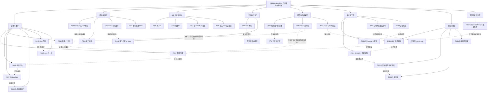
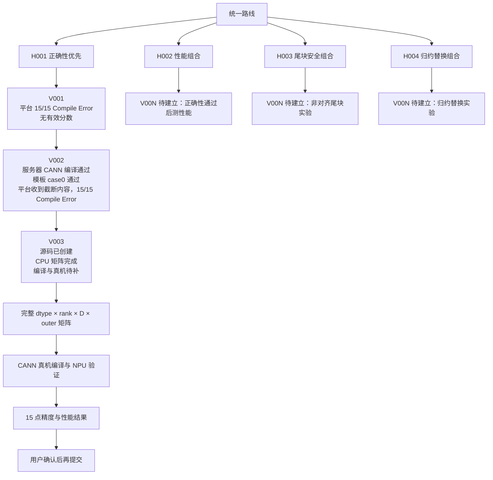
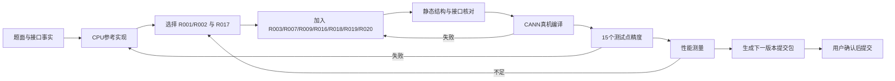
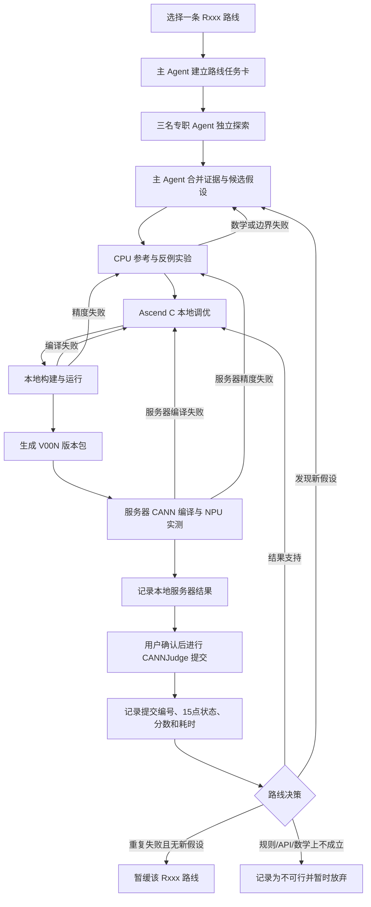
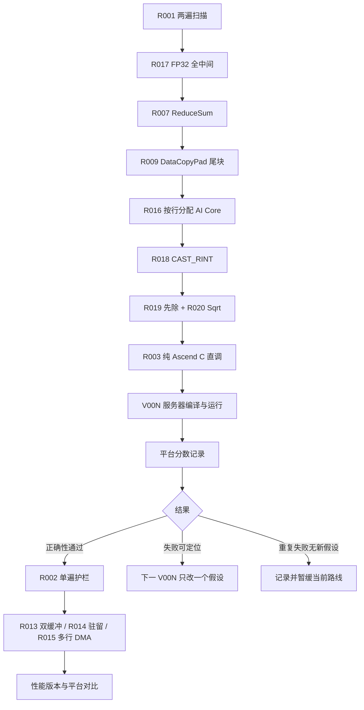

# 三份汇总技术路线去重与提交目录对照评估

## 1. 结论

本文件核对以下三份历史汇总：

- `调研/归档/汇总1/技术路线总报告.md`
- `调研/归档/汇总2/技术路线总报告.md`
- `调研/归档/汇总3/技术路线总报告.md`

结论如下：

1. 现有 `提交/单方案/R001–R026` 已覆盖三份报告中的主要实现、精度、尾块、并行、构建、验证和性能路线。
2. 三份报告的 `Rxxx` 不是稳定编号。同一个编号在不同报告中可能代表不同路线，例如汇总1 的 `R003` 是 FP32 全中间，汇总2 的 `R003` 是低精度中间，汇总3 的 `R003` 是纯 Ascend C 直调。因此本次按照技术思想和原始名称去重，不能按编号直接合并。
3. 汇总2 单独列出的“标量同步削减”和“官方 Tiling 五模式与 UB 空间模型”，以及汇总1/汇总2中出现、汇总3未单独编号的“GPU/DSL 迁移参考”，在当前提交目录中没有独立入口。本轮补齐为 `R027–R029`。
4. 去重后形成 29 条路线记录。这里的“路线目录”同时承载四类内容：可进入 Kernel 的实现组件、性能优化轴、只用于否定或对照的路线、验证与提交支撑路线。它们不都能单独作为 CANNJudge 上传文件。

## 2. 去重规则

- 以核心技术思想为主键，不使用三个报告中的 `Rxxx` 编号作为主键。
- 相同思想的不同 tile 大小、D 分界、API 变体、同步方式和适用条件合并到同一目录，在说明中保留变体。
- 能在同一个 `kernel.asc` 中叠加、但解决的问题不同的策略分开保存。例如 FP32 中间、两遍扫描、尾块处理和按行分核可以组合，但各自仍有独立实验轴。
- 仅在一个汇总中出现的路线也保留目录。若路线属于否决、研究参考或验证支撑，目录仍建立，但明确标注其用途，避免被误当作可提交实现。
- 历史汇总原文保留，不改写其中的编号；本文件和 `提交/单方案/路线索引.md` 提供当前目录编号到历史编号的映射。

## 3. 统一路线清单

| 当前目录 | 统一名称 | 类别 | 汇总1 | 汇总2 | 汇总3 | 评估与提交含义 |
| --- | --- | --- | --- | --- | --- | --- |
| `R001-两遍扫描` | 两遍扫描 | 计算与融合 | R001 | R001 | R001 | 通用正确性骨架，可与精度、尾块、分核路线组合 |
| `R002-单遍y驻留` | 单遍 y 驻留 UB | 计算与融合 | R002 | R002 | R002 | 小 D 性能路径，超出 UB 预算时回退 R001 |
| `R003-纯AscendC直调` | 纯 Ascend C 直调单文件 | 编译与提交形态 | R013 | R022 | R003 | 唯一提交载体，不代表计算算法本身 |
| `R004-低精度中间计算` | 低精度中间计算 | 精度对照/否决 | R004 | R003 | R004 | 保留反例，禁止作为默认提交路线 |
| `R005-大Tile` | 大 tile | UB 分块与流水 | R005 | R012 | R005 | 性能候选，必须受 UB 和归约计数约束 |
| `R006-分块归约` | 小 tile、分块归约与累加顺序 | UB 分块与归约 | R006 | R013、R021 | R006 | 大 D 的稳健实现，累加顺序作为同目录变体 |
| `R007-ReduceSum` | ReduceSum 归约 | 归约与数学 | R011 | R004 | R007 | 首版归约候选，需真机确认计数上限和临时区 |
| `R008-Tile跨核` | 按 tile 跨核分配 | 并行与核分配/否决 | R008 | R018 | R008 | 保留否决证据，默认不进提交 |
| `R009-DataCopyPad尾块` | DataCopyPad 尾块 | 搬运与尾块 | R009 | R007 | R009 | D 非 32 倍数的首选尾块路径，需真机哨兵验证写回 |
| `R010-手工尾块` | 手工尾块 | 搬运与尾块 | R010 | R008 | R010 | DataCopyPad 不适用或被证伪时的后备路径 |
| `R011-手工向量归约` | 手工向量归约 | 归约与数学 | R012 | R005 | R011 | 性能候选，参数和舍入顺序需要真机验证 |
| `R012-32B行块对齐` | 32B 行块对齐与写回防护 | 搬运与并行 | R007 变体 | R010 | R012 | 非对齐多核写回的安全实验轴 |
| `R013-双缓冲` | 双缓冲流水 | UB 分块与流水 | R002 变体 | R015 | R013 | 性能候选，小问题规模可能反而增加开销 |
| `R014-GammaBias驻留` | gamma/bias 驻留 | UB 分块与融合 | R001/R002 变体 | R014 | R014 | 减少重复搬运，受 D 和 UB 空间约束 |
| `R015-多行合并DMA` | 多行合并 DMA 与对齐双轨 | 搬运与流水 | R009 变体 | R009、R011 | R015 | 大 outer 小 D 的性能包装，可组合 R009 |
| `R016-按行分配AI Core` | 按行分配 AI Core | 并行与核分配 | R007 | R017 | R016 | 推荐分核方式，避免同行跨核归约 |
| `R017-FP32全中间` | FP32 全中间计算 | 精度与数据类型 | R003 | R019 | R017 | 所有可提交计算路线的强制前提 |
| `R018-CAST_RINT输出` | CAST_RINT 输出舍入 | 精度与数据类型 | R003 实施要点 | R020 的 M8 | R018 | 输出转换路线，需与题面 golden 对齐 |
| `R019-Divs先除` | Divs 先除 | 归一化数值路径 | R015 | R020 | R019 | CPU 证据优先的默认归一化路径 |
| `R020-Sqrt归一化` | Sqrt、Rsqrt 与 epsilon 路径 | 归一化数值路径 | R015 | R020 | R020 | Sqrt+先除首选，Rsqrt 只作为性能候选 |
| `R021-CANN9构建链路` | CANN 9.0.0 环境与构建链路 | 编译与环境 | 支撑内容 | R024 | R021 | 真机实验支撑，不是 Kernel 算法 |
| `R022-自动代码生成` | 自动代码生成工具参考 | 编译与工具参考 | R014 邻域 | R023 | R022 | 研究参考，不能替代题面要求的直调 `kernel.asc` |
| `R023-工程规范` | 工程规范与接口防错 | 编译与接口 | R013 实施要点 | R025 | R023 | 进入所有提交版本的编译规范 |
| `R024-CPU验证矩阵` | CPU 同链验证矩阵 | 验证支撑 | R016 | R025 | R024 | 排除数学链路问题，不能代替 NPU 证据 |
| `R025-提交通道完整性` | 提交通道与版本管理 | 提交支撑 | R016 | R026 | R025 | 上传文件完整性、平台回读和结果记录 |
| `R026-性能测量` | 性能测量与 profiling | 性能验证 | 支撑内容 | R027 | R026 | 只有真机测量后才能形成性能结论 |
| `R027-GPU迁移参考` | GPU/CUDA/Triton/DSL 迁移参考 | 研究参考 | R014 | R023 | §4 仅参考 | 只迁移数据流和数值思想，不能直接搬运 GPU 指令模型 |
| `R028-标量同步削减` | 标量同步削减 | 归约与同步优化 | 相关变体 | R006 | 相关讨论 | 与 R007/R011/R015 组合的性能实验轴，单独留档 |
| `R029-官方Tiling五模式` | 官方 Tiling 五模式与 UB 空间模型 | Tiling 决策框架 | R001/R002/R005 变体 | R016 | 官方模式变体 | 作为运行时分档参考，直调题目中不能直接套用 tiling 结构体 |

## 4. 三份报告逐份核对

### 4.1 汇总1

汇总1 在 §4 将 14 条基础路线和新增的归一化、验证路线归并为 `R001–R016`。它的特点是把很多实现组件压缩成较少的主路线：

- `R001–R014` 覆盖两遍/单遍、精度、tile、分核、尾块、归约、直调和 GPU 迁移参考。
- `R015` 将 Divs、Muls、Rsqrt 放在一个归一化路径下；本次拆到当前 `R019` 和 `R020`，因为除法形式和开方形式是可以分别替换、分别测量的两个实验轴。
- `R016` 将 CPU 验证和平台提交核验合在一起；本次对应 `R024` 和 `R025`，因为二者的输入、证据和失败原因不同。
- 32B 行块对齐、双缓冲、gamma/bias 驻留等内容在正文中作为变体出现，已映射到当前独立目录。

判断：汇总1 与当前提交分类的技术边界一致，但其编号粒度较粗，不能直接作为提交目录编号。

### 4.2 汇总2

汇总2 在 §5 展开为 `R001–R027`，内容最细，新增或单独强调：

- 标量同步削减；
- 官方 Tiling 五模式与 UB 空间模型；
- 归约分块与累加顺序；
- 输出舍入、环境链路、提交通道和 profiling。

其中 `R003`、`R004` 等编号与汇总1和汇总3发生语义错位。例如汇总2 的 `R003` 是低精度中间，汇总3 的 `R003` 是纯 Ascend C 直调。当前目录以名称为准，已把汇总2 的 27 个条目全部映射到 `R001–R029`，并为其中 3 个缺失入口补建目录。

判断：汇总2 的覆盖最完整；它把“算法路线”和“实验/工程路线”放在同一列表中，当前保留这种覆盖，但在目录说明中区分用途。

### 4.3 汇总3

汇总3 在 §4–§5 使用 `R001–R026`，基本与当前原有 26 个目录一一对应：

- 它将纯 Ascend C 直调放在 `R003`，与当前目录完全一致。
- 它将 GPU/DSL 迁移列为“不作为实现路线编号”的参考内容；由于汇总1和汇总2都明确写成路线或候选，本次补建 `R027-GPU迁移参考`，并标注为研究参考。
- 它将官方五模式挂到 `R001/R002/R005` 变体中；汇总2把它单独列为路线，本次补建 `R029-官方Tiling五模式`，用于保存该方法框架的独立证据和实验计划。

判断：汇总3 最接近原有提交目录的编号顺序，但仍需用本文件补足跨报告路线和语义映射。

## 5. 路线是否能进入提交

### 5.1 可以作为 Kernel 组件组合

推荐候选的核心组合为：

```text
R003 纯 Ascend C 直调
  + R001 两遍扫描（大 D 主路径）
  + R002 单遍 y 驻留（小 D 护栏路径，可选）
  + R006 分块归约
  + R007 ReduceSum 或 R011 手工向量归约（二选一后真机比较）
  + R009 DataCopyPad 尾块
  + R016 按行分配 AI Core
  + R017 FP32 全中间
  + R018 CAST_RINT 输出
  + R019 Divs 先除 + R020 Sqrt 路径
```

这些路线解决的问题不同，可以落在同一个提交文件的不同函数、分支或参数路径中。组合后仍需控制源码体量，避免为每个报告变体复制一套完整函数。

### 5.2 只适合作为替换或对照

- `R004-低精度中间计算`：已有 CPU 反例，不进入默认候选。
- `R008-Tile跨核`：直调缺少可靠跨核同步和归约载体，保留否决记录。
- `R010-手工尾块`：只有 R009 在目标机器上不适用时才切换。
- `R011-手工向量归约`：与 R007 竞争归约实现，需真机比较精度和耗时。
- `R019-Divs先除` 与 `R020-Sqrt归一化`：当前推荐 Sqrt+FP32 向量 Div；Rsqrt/Muls 只能在独立实验过阈值后替换。

### 5.3 研究或验证支撑路线

`R021–R029` 中，环境、工程规范、CPU 矩阵、提交通道和 profiling 用于形成证据链；GPU 迁移、自动生成和官方 Tiling 用于提取思路或安排分档。它们的目录存在是为了资料完整和实验可追溯，不代表都应复制进 `kernel.asc`。

## 6. 当前目录补齐记录

本轮新增：

```text
提交/单方案/R027-GPU迁移参考/
提交/单方案/R028-标量同步削减/
提交/单方案/R029-官方Tiling五模式/
```

每个新目录包含一个路线说明文件，写明历史汇总位置、当前用途、可组合关系和实验状态。原有 `R001–R026` 目录未删除、未改名、未复制；版本文件仍按 `V001`、`V002`、`V003` 进入对应路线目录。

## 7. 当前 V002 的路线归属

依据 `提交/混合方案/H001-正确性优先/V002/kernel.asc` 和既有版本记录，V002 主要使用：

- `R001` 两遍扫描及多分支路径；
- `R003` 纯 Ascend C 直调载体；
- `R006` 分块处理和 `R007` ReduceSum；
- `R009` DataCopyPad 尾块；
- `R014` gamma/bias 驻留的部分路径；
- `R015` 多行/流水相关路径；
- `R016` 按行分配；
- `R017` FP32 归约和中间链的主要部分；
- `R020` Sqrt；
- `R023` 工程规范中的 64 位寻址和同步处理。

V002 仍出现 `Muls(y, 1/rms)`、多套宽行函数和输出转换差异，因而不能把它标为已经采用 `R019` 的先除路径，也不能据此宣称 15 个测试点通过。V003 已在 `H001` 下单独记录变更，平台结果仍以 CANNJudge 返回为准。

### 7.1 当前 V003 的路线归属

V003 采用 R001 两遍扫描、R006 分块归约、R007 ReduceSum、R009 DataCopyPad、R012 32B 行组、R016 按行组分配、R017 FP32 全中间、R018 `CAST_RINT` 输出、R019 先除语义、R020 Sqrt 和 R023 工程规范。910B 不支持 `Divs` 灵活标量接口，V003 先读出 FP32 `rms`，再用普通 FP32 向量 `Div` 完成 `y / rms`。

本地 CPU 参考矩阵已完成；服务器文件系统使用率为 98%，V003 尚未同步、编译或运行，不能把当前状态写成 CANN/NPU 通过。

## 8. 覆盖结论

- 覆盖：三份报告出现的独立技术思想、否决路线、支撑路线和新增路线均有当前目录映射。
- 去重：同一思想的编号错位、变体和跨报告重复已在统一表中合并；关键的不同机制仍保持分开。
- 提交关系：`提交/混合方案/` 保存实际组合版本；`提交/单方案/` 保存每条路线的独立材料和版本，不要求每条路线都单独上传。
- 证据状态：三份报告中的 CPU、源码和平台记录照原文保留；本次目录整理没有增加真实 NPU 精度或性能证据。

## 9. 本文件的后续用途

从本节开始，本文件作为三份汇总报告去重后的统一路线与实验总记录。后续每条路线的执行方式、路线之间的组合关系、版本改动、编译结果、精度结果、性能结果和平台提交结果都追加在这里。

记录规则：

- 三份汇总报告是输入材料；本文件中的 `R001–R029` 是去重后的统一路线编号。
- `Rxxx` 描述技术路线，`Hxxx` 描述多路线组合，`Vxxx` 描述该组合的版本。
- 每次实验必须记录路线编号、版本号、输入范围、代码位置、执行命令、结果、失败原因和下一步。
- CPU 模拟、普通编译、CANN 编译、真实 NPU 精度、真实 NPU 性能和 CANNJudge 结果分开记录，不能相互替代。
- 研究参考或否决路线保留在路线树中，但不能直接当作可提交代码。

## 10. 去重后的统一技术路线树

这棵树展示三份报告如何汇合为统一路线，以及路线如何组合到混合方案。路线节点中的编号、名称和状态与上方统一路线清单一致。



### 10.1 混合方案与版本树



对应目录关系：

```text
三份汇总去重评估.md
├── 统一路线清单：R001–R029
├── 统一技术路线树：类别、组合、替换和否决关系
├── 版本与实验记录：H001/V001、H001/V002、H001/V003
└── 后续实验追加区
    ├── 路线执行记录
    ├── 真机验证记录
    └── CANNJudge 结果记录
```

## 11. 每条统一路线的执行方式

| 路线 | 执行方式 | 适用与切换 | 必要产出 |
| --- | --- | --- | --- |
| `R001-两遍扫描` | 第一遍在 Kernel 内计算 `y=x+residual`、FP32 平方和与归约；第二遍重读数据，完成均方、epsilon、开方、归一化、gamma/bias 和输出。 | 大 `D` 或单遍 UB 空间不足时使用；作为默认正确性骨架。 | CPU 对照、CANN 编译、三 dtype 与尾块误差表。 |
| `R002-单遍y驻留` | 将当前 tile 的 `y` 以 FP32 暂存在 UB，完成归约后直接做归一化和仿射输出，减少一次 GM 重读。 | 先按 `D≤4096` 作为候选分档；UB 不足或误差异常时回到 R001。 | UB 预算表、与 R001 的误差和耗时对比。 |
| `R003-纯AscendC直调` | 按题面直调接口组织 `kernel.asc`，保留 `run_kernel`、Kernel 启动、dtype 分支和最后一维展平；核心计算全部放在 Ascend C Kernel。 | 所有可上传版本的代码载体；不能加入 Host 代算或固定输出。 | 文件首尾、入口、括号、编译日志和平台回读。 |
| `R004-低精度中间计算` | 仅在 CPU 参考程序中保留 16 bit 中间累加，作为精度反例与否决对照。 | 不进入默认提交；只有对比实验需要时执行。 | 反例输入、误差表和不采用结论。 |
| `R005-大Tile` | 调整 tile 元素数，逐档计算输入、FP32 暂存、归约临时区和输出的 UB 占用，再在真机测量 DMA 与计算时间。 | 正确性版本通过后执行；UB 超限或性能下降时撤销该档。 | 每档 UB 预算、编译结果、耗时和峰值资源。 |
| `R006-分块归约` | 将最后一维拆成小块，各块转 FP32 后求平方和，再按固定顺序合并部分和。 | 大 `D`、单 tile 无法容纳时使用；块大小先按不超过 4096 的候选验证。 | 分块边界误差、累加顺序记录和真机结果。 |
| `R007-ReduceSum` | 使用 Ascend C 官方归约接口完成块内平方和，按实际 API 处理临时区、同步和结果读取。 | 首版归约候选；若真机行为或计数形态不满足，再与 R011 对比。 | API 版本、参数形态、同步方式和误差结果。 |
| `R008-Tile跨核` | 仅做隔离实验：让不同 AI Core 处理 tile，并记录跨核归约或同步所需机制。 | 当前保留为否决路线，默认不采用。 | 失败条件、缺失机制和不采用结论。 |
| `R009-DataCopyPad尾块` | 读取尾块时显式右侧补零，计算仍按真实 `D`，写回时只写有效元素并用相邻行哨兵观察越界影响。 | 非 32 倍数 `D` 的首选路径；写回语义异常时切换 R010。 | D=1/31/33/67/127/129 等用例的哨兵和误差记录。 |
| `R010-手工尾块` | 采用手工 mask、精确字节搬运或显式填充处理最后一块，单独保留完整块快路径。 | 只有 R009 在目标环境不适用或被真机证伪时启用。 | 尾块实现、越界哨兵、编译和逐元素比较。 |
| `R011-手工向量归约` | 使用向量加法折叠、块内归约或 `WholeReduceSum` 等方式构造平方和，保持 FP32 累加。 | 作为 R007 的替换与性能候选，不能只凭资料结论切换。 | 与 R007 的精度、同步次数、耗时和资源对比。 |
| `R012-32B行块对齐` | 根据 `D×sizeof(dtype)` 计算行块大小，使每个并发写回块尽量满足 32B 边界约束，再分配给 AI Core。 | 非对齐多行并发写回时使用；先验证安全性，再评估并行损失。 | 行块计算、相邻行哨兵、多核结果和耗时。 |
| `R013-双缓冲` | 使用 `BUFFER_NUM=2` 交替执行 GM 搬入、计算和 GM 写回，记录 Pipe/TQue 的占用与同步。 | 正确性闭环后测量；小问题规模出现额外开销时回退单缓冲。 | 单/双缓冲的编译、误差、Kernel 耗时和 UB 占用。 |
| `R014-GammaBias驻留` | 当 gamma/bias 能放入 UB 时驻留并复用；不能完整驻留时按 tile 搬运，不改变广播语义。 | 小 `D` 或大 `outer` 的带宽候选；受 UB 空间限制。 | UB 分配、访存次数、广播误差和耗时。 |
| `R015-多行合并DMA` | 对多行输入或输出进行合并搬运，保留对齐快路径和尾块慢路径，观察行间 padding 是否污染有效数据。 | 大 `outer`、小 `D` 的性能候选；先通过 R009 的安全用例。 | 多行非对齐结果、DMA 参数、耗时和资源记录。 |
| `R016-按行分配AI Core` | 将展平后的 `outer` 行按核均分，处理尾核余数，行基址和偏移使用 64 位计算。 | 默认并行方式；覆盖 `outer<核数`、接近核数和远大于核数。 | 每核行范围、边界输出和三档并行耗时。 |
| `R017-FP32全中间` | 输入转 FP32，在加法、平方、归约、均值、epsilon、开方、归一化和 gamma/bias 阶段保持 FP32，最后才转回输出 dtype。 | 所有默认提交路线的精度前提。 | 三 dtype、极小/极大值、epsilon 和误差表。 |
| `R018-CAST_RINT输出` | 输出阶段使用与题面 golden 对齐的 RINT 舍入方式，将 FP32 结果转换回 FP16/BF16/FP32。 | 低精度输出必须单独验证；不能用截断替代。 | 舍入边界样本、逐元素差异和平台结果。 |
| `R019-Divs先除` | 归一化阶段保持 `y/rms` 的先除语义；910B 不支持 `Divs` 灵活标量接口，V003 使用普通 FP32 向量 `Div`，并与 `Muls(y,1/rms)` 分开做 CPU 和真机对比。 | 当前 CPU 证据优先的除法路径；目标设备编译和完整 dtype 数据仍待补。 | 两种路径的逐元素差异、编译状态和耗时。 |
| `R020-Sqrt归一化` | 按 `sqrt(mean(y²)+epsilon)` 计算 rms，再与 R019 组合；将 Rsqrt 作为独立变体测量。 | 首版优先 Sqrt+FP32 向量 Div；Rsqrt 只有在精度和性能都满足时才考虑。 | epsilon、平方根、除法的误差和耗时。 |
| `R021-CANN9构建链路` | 在服务器加载目标 CANN 9.0 环境，记录 `bisheng/ccec/msopgen/npu-smi`、SoC、实验目录和构建命令，再编译对应版本。 | 仅使用服务器专用实验目录；不把系统工具链版本直接当作比赛版本。 | 环境快照、编译日志、产物路径和返回码。 |
| `R022-自动代码生成` | 读取自动生成工具和样例，提取调度、Tiling 或 API 组织思路，不直接复制生成器产物。 | 仅作研究参考，不能替代题面要求的直调 `kernel.asc`。 | 迁移关系、差异、依赖和不采用原因。 |
| `R023-工程规范` | 每次版本提交前核对入口、类型、括号、标识符、64 位寻址、同步、尾块参数和文件完整性。 | 作用于所有版本；发现编译问题时先回到对应路线。 | 静态核对清单、首尾内容和编译错误原文。 |
| `R024-CPU验证矩阵` | 用独立参考实现覆盖 FP16/BF16/FP32、2D/3D/4D、不同 `D`、`outer`、epsilon、gamma/bias 广播和尾块。 | CANN 编译前用于排除数学链路问题；不能替代 NPU 结果。 | 输入配置、最大绝对误差、最大相对误差和通过状态。 |
| `R025-提交通道完整性` | 在平台编辑器全量替换后回读首行、末行和 `run_kernel`，保存提交编号与 15 点状态；上传前确认内容没有截断。 | 每次 CANNJudge 操作都执行；最终上传仍等待用户确认。 | 提交编号、页面结果、错误文本和本地版本对应关系。 |
| `R026-性能测量` | 在真机预热后重复运行，分别记录 Kernel 和端到端耗时；同时记录共享 NPU 负载，区分环境影响。 | 正确性全过后执行；性能不足时返回 UB、归约或并行路线。 | 测量次数、均值/波动、NPU 状态和路线结论。 |
| `R027-GPU迁移参考` | 对照 CUDA/Triton 等实现提取数据流、融合顺序和分块思想，再映射到 Ascend C API。 | 只迁移算法与数据流思想，不搬运 GPU 指令、线程模型或库调用。 | 差异表、可迁移部分、不可迁移部分和风险。 |
| `R028-标量同步削减` | 在已正确版本上减少标量读回或同步次数，每次只改变一个同步点并与原版本逐点对比。 | 只进入性能实验；任意误差或时序问题出现时立即回到上一版本。 | 同步次数、误差、耗时和回退结论。 |
| `R029-官方Tiling五模式` | 将官方五种 Tiling 思路转化为 `D`、`outer`、UB 和核数的运行时分档，记录每档使用的 Kernel 路径。 | 作为分档框架和研究资料；直调题目不能直接套用不匹配的 Tiling 结构。 | 分档表、选择条件、映射路线和真机结果。 |

## 12. 当前版本与提交记录

| 版本 | 所属组合 | 本版路线 | 已完成内容 | 平台/服务器结果 | 当前结论 |
| --- | --- | --- | --- | --- | --- |
| `V001` | `H001-正确性优先` | R003、R001、R007、R009、R016、R017、R018、R020、R023 | 首次直调候选上传 | 提交编号 `6aa37d942d3dd2c5ae7da586`；15/15 `Compile Error`；无有效分数 | 平台错误集中在 `pipe_` 标识符和相关解析位置，未进入精度测试。 |
| `V002` | `H001-正确性优先` | 在 V001 基础上加入 R006、R014、R015 等候选路径 | 已形成 `kernel.asc`；服务器 CANN 9.0 编译通过；模板 FP16 `case0` 通过 | 平台提交编号 `6aa388bd2d3dd2c5ae81372f`；平台收到异常截断内容，15/15 `Compile Error`；服务器 case0 最大绝对误差 `0.0009765625` | 服务器单案例通过不能代表 15 点通过；平台结果不能用于判断完整本地文件。 |
| `V003` | `H001-正确性优先` | R001、R006、R007、R009、R012、R016、R017、R018、R019、R020、R023 | 源码、变更说明、结果摘要和 CPU 矩阵已落盘 | 尚未编译、测量或提交；服务器空间使用率 98% | 等待资源条件后完成 CANN 编译、三 dtype 边界数据和性能测量。 |

版本目录与记录位置：

```text
提交/混合方案/H001-正确性优先/
├── V001/
│   ├── kernel.asc
│   └── 结果.md
├── V002/
│   ├── kernel.asc
│   ├── 变更说明.md
│   └── 结果.md
└── V003/
    ├── kernel.asc
    ├── 变更说明.md
    └── 结果.md
```

### 12.1 后续版本记录模板

新增版本或路线实验时，在本文件追加以下字段；没有证据的字段写“未执行”或“无法确认”，不留空白：

```markdown
### V00N / H00N 或 R00N

- 记录日期：
- 所属方案：
- 路线编号：
- 代码位置：
- 实验目的：
- 修改文件：
- 修改内容：
- 输入范围：dtype / rank / D / outer / epsilon / 广播
- 构建环境：CANN / SoC / 工具路径
- 构建命令与结果：
- CPU 参考结果：
- CANN 编译结果：
- NPU 精度结果：
- NPU 性能结果：
- CANNJudge 提交编号：
- 15 个测试点结果：
- 失败原因或限制：
- 是否生成下一版：
- 下一步实验：
```

### 12.2 当前后续执行顺序



本文件后续只追加真实发生的路线与版本记录；不把计划状态写成已执行结果，也不在这里保存凭据、完整平台授权信息或无关构建产物。

## 13. 每条路线的完整探索闭环

`Rxxx` 是独立探索单元。无论路线最终进入混合方案、作为单方案实验，还是被判定为研究参考，都按同一套流程建立任务卡、产生版本、保存本地结果，并记录是否继续。



### 13.1 每一轮的输入与产出

| 阶段 | 输入 | 必须产出 | 停止条件 |
| --- | --- | --- | --- |
| 路线建卡 | `Rxxx` 名称、三份报告原始位置、当前状态 | 路线目标、假设、适用范围、失败条件、验收指标 | 任务卡字段不完整时不进入编码 |
| 多 Agent 探索 | 官方资料、开源实现、历史实验、题面接口 | 三份独立结果：依据、候选实现、反例、未确认事项 | 资料来源不足或与题面不匹配时返回缺口 |
| 证据合并 | 三份 Agent 结果 | 采用假设、备选假设、明确不采用项、单个实验问题 | 结论相互冲突且没有实验区分时暂停编码 |
| CPU 参考 | 独立参考实现、边界矩阵 | 数值结果、反例、dtype/rank/D/outer 覆盖表 | 参考链不稳定或结果无法复现时回到证据合并 |
| 本地 Ascend C 调优 | 通过 CPU 的单个假设、唯一源码工程 | 代码改动、编译入口、UB/访存推算、版本候选 | 本机无 CANN 时只做静态和 CPU 辅助验证，不能写成真机结果 |
| 本地构建运行 | 当前版本源码和可用 CANN 环境 | 编译日志、运行日志、误差、耗时和资源状态 | 编译或运行失败时先记录失败点，不进入打包 |
| 版本打包 | 本地构建通过的源码 | `V001/V002/V003` 版本目录、变更说明、结果记录 | 首行、末行、入口和文件内容不完整时不打包 |
| 服务器实测 | 版本包、目标 CANN、可用 NPU | SoC、工具链、NPU 状态、15点结果、性能结果 | 环境版本未记录或资源状态不明时只能标记未确认 |
| 平台提交 | 用户确认、已核对版本包 | 提交编号、15点状态、平台分数、耗时和页面证据 | 未获用户确认时停止在待提交状态 |
| 路线决策 | 本地、服务器、平台三类结果 | 继续、迭代、暂缓或暂时放弃及其依据 | 证据不足时保持未确认，不强行下结论 |

### 13.2 路线和版本的目录关系

```text
调研/总结.md                         # 路线任务卡、执行方式、版本和结果总记录
        |
        +-- Rxxx 路线任务卡
        |       |
        |       +-- 提交/单方案/Rxxx-名称/V00N/
        |       |       +-- kernel.asc 或路线材料
        |       |       +-- 变更说明.md
        |       |       +-- 结果.md
        |       |
        |       +-- 提交/混合方案/Hxxx-名称/V00N/
        |       |       +-- 组合后的提交文件
        |       |       +-- 变更说明.md
        |       |       +-- 结果.md
        |       |
        |       +-- 实验/V00N/
        |               +-- 构建/
        |               +-- 数据/
        |               +-- 日志/
        |               +-- 结果.md
        |
        +-- 下一轮 Rxxx/V00N+1
```

源码工程仍保持唯一。版本目录保存对应版本的提交文件和结果，不能复制出第二套工程；本地服务器实验只使用对应版本的实验目录。

## 14. 每条路线的多 Agent 探索方案

每次开始一条新路线或一个路线变体时，由主 Agent 建立一张任务卡，再并行安排三名专职 Agent。三名 Agent 先独立提取证据，主 Agent 再统一合并，避免一个 Agent 的推断直接成为项目事实。

### 14.1 固定分工

| 角色 | 单一职责 | 输入 | 输出 | 不负责 |
| --- | --- | --- | --- | --- |
| 主 Agent | 定义问题、合并结果、选择一个可测假设、落版本和作路线决策 | 题面、三份报告、三份 Agent 结果 | 路线任务卡、版本变更、统一结果 | 不用没有证据的多数意见替代实验 |
| Agent-1：资料与接口 | 读取官方 API、样例、版本说明，确认接口和硬件适用范围 | 对应 `Rxxx` 的来源和 CANN 文档 | API 证据表、版本差异、不可用条件 | 不改源码、不代替 NPU 实测 |
| Agent-2：数值与 CPU | 建立或复用参考计算，寻找精度、尾块和 dtype 反例 | 题面公式、golden、测试矩阵 | CPU 结果、反例、容差和覆盖缺口 | 不判断硬件性能、不修改提交文件 |
| Agent-3：Kernel 与性能 | 把已确认假设映射到 Ascend C，估算 UB/搬运/并行，并在服务器执行实验 | Agent-1/2 结果、当前源码版本、实验环境 | Kernel 候选、构建日志、NPU 误差和耗时 | 不擅自切换路线、不上传平台 |

### 14.2 Agent 任务卡

```markdown
### Rxxx / V00N 路线探索任务卡

- 路线名称：
- 三份报告原始位置：
- 当前路线状态：
- 本轮唯一假设：
- 预期改善：正确性 / 编译 / 尾块 / 精度 / 性能
- 适用范围：dtype / rank / D / outer / epsilon / 广播
- Agent-1 必读资料与输出：
- Agent-2 必读资料与输出：
- Agent-3 必读资料与输出：
- 主 Agent 采用结论：
- 不采用的候选及原因：
- 本地源码改动范围：
- 本地构建命令与结果：
- 本地运行输入、误差和耗时：
- 服务器 CANN/SoC/NPU 结果：
- 版本包位置：
- CANNJudge 提交编号、15点状态、分数和耗时：
- 本轮路线决策：继续 / 迭代 / 暂缓 / 暂时放弃
- 下一轮唯一实验问题：
```

### 14.3 单轮实验约束

- 一个版本只验证一个主要假设；若同时改变归约、尾块和并行，无法判断结果来源，下一轮应拆开。
- Agent-3 修改源码前，主 Agent 必须确认 Agent-1 的接口范围和 Agent-2 的 CPU 结果已落盘。
- 同一源码文件不允许由多个 Agent 同时改写；Agent 只返回补丁建议或独立候选，主 Agent 负责合并。
- 线上提交只使用已经在服务器完成构建和运行的版本包；平台提交由用户确认后执行。
- 平台出现编译错误时，先对提交内容、首尾、入口和编码完整性做内容回读，再判断是否属于路线问题。

## 15. 路线可行性判断与暂缓规则

路线判断必须看完整证据链，不能只看一次平台分数。默认将“多次”定义为至少两个采用不同假设的独立版本；如果两次失败实际属于同一个上传内容问题，不能计作两次技术失败。

| 状态 | 判定条件 | 处理方式 |
| --- | --- | --- |
| `继续` | CPU 参考成立；服务器能编译运行；精度达到题面；平台能运行且分数或耗时符合目标 | 保留路线，进入下一轮局部性能调优 |
| `迭代` | 失败点已经定位，并且存在一个可验证的新假设 | 创建新的 `V00N`，只改变该假设并重新走完整闭环 |
| `暂缓` | 至少两个独立版本在服务器或平台的同一关键环节失败，且当前没有新的可验证假设 | 停止继续消耗提交次数，保留全部日志，切换其他路线 |
| `暂时放弃` | 违反比赛规则、题面接口无法承载、核心 API 在目标 CANN 上明确不可用，或 CPU 反例证明算法无法满足精度 | 标记路线不可行，保留反例和证据，后续只有出现新环境或新机制时才重新启用 |
| `性能不适合` | 正确性和编译均通过，但多轮服务器与平台测量均没有竞争力 | 不称为算法错误；将路线降为正确性参考或性能对照 |
| `提交通道问题` | 本地服务器通过，平台为编译错误，但平台收到的文件与本地版本不一致或内容未完整回读 | 暂不否定路线，重新生成版本包并先完成内容回读 |

### 15.1 “路线不可行”的证据要求

满足以下条件后，才可把一条路线写为“暂时放弃”：

1. 已明确记录路线编号、版本号、源码位置和本轮唯一假设。
2. 至少有两次独立版本实验，不能只是重复上传同一份文件。
3. 每次实验都有本地 CPU/静态结果、服务器 CANN/NPU 结果或明确的环境限制记录。
4. 若进入平台，每次都有提交编号、15 点状态、分数或编译文本。
5. 失败原因已经归类为数学、接口、编译、精度、尾块、性能或提交内容问题。
6. 主 Agent 已确认当前失败可以归因于路线本身，且没有尚未测试的新假设。

以下情况不能直接宣布路线不可行：

- 只有一次平台 `Compile Error`，但没有确认平台收到的完整代码。
- 服务器工具链版本、SoC 或 NPU 资源没有记录。
- 只运行了模板 `case0`，没有覆盖题面要求的 dtype、rank、D 和 outer。
- 只看分数下降，没有分离代码改动、测试点失败和共享 NPU 负载影响。
- 只因为某一条 API 写法失败，就推断整个数学或数据流路线不可用。

## 16. 版本记录的最小完整字段

后续每完成一次版本修改、一次本地运行、一次服务器实验或一次平台提交，都在本文件对应的路线记录中追加一条，不用空泛的“已完成”代替证据。

```markdown
### Rxxx / Hxxx / V00N

- 日期与时间：
- 路线阶段：资料 / CPU / 本地 CANN / 服务器 NPU / 平台提交 / 性能
- 本轮唯一假设：
- 上一版本：
- 修改文件与行数：
- 修改内容：
- 本地命令：
- 本地构建结果：
- 本地输入范围：dtype / rank / D / outer / epsilon / 广播
- 本地误差与耗时：
- 服务器主机、CANN、SoC、NPU 编号：
- 服务器构建结果：
- 服务器误差与耗时：
- 提交包路径：
- CANNJudge 提交编号：
- 15 个测试点结果：
- 平台分数与耗时：
- 失败分类：
- 证据位置：
- 路线决策：继续 / 迭代 / 暂缓 / 暂时放弃
- 下一轮实验问题：
```

### 16.1 当前执行优先级



上图是当前 H001 正确性优先组合的实验顺序，不代表每条路线都已经通过。每个 `Rxxx` 都要先独立完成本节闭环，再决定是否并入组合版本。
