# AddRmsNormBias 路线评测结果

## 文档用途

本文件是路线评测结果总索引。路线编号、分类和组合关系沿用
`调研/总结.md` 的统一路线树，不重新定义路线编号。

本文件只记录每条路线当前最优版本、实际实验状态、平台提交结果和日志位置。
29 条路线的最高有效平台分与当前最佳证据另见 `调研/路线最高分.md`。
详细代码放在 `提交/`，研究结论放在 `调研/`，环境实验原始日志放在服务器项目目录的 `实验/`。

## 日志保存位置

服务器 3 是 CANN 编译和 NPU 运行的实验位置。每个版本使用自己的实验目录：

```text
/home/data4t2/lelinfeng/cann/
└── 实验/
    └── V00N/
        └── 路线-Rxxx-变体名称/
            ├── 日志/
            │   ├── 环境快照.log
            │   ├── 编译.log
            │   ├── 运行.log
            │   ├── 资源.log
            │   └── 命令.txt
            ├── 精度结果.md
            ├── 性能结果.md
            └── 结果.md
```

混合方案使用组合编号：

```text
/home/data4t2/lelinfeng/cann/实验/V00N/混合-H00N-组合名称/
```

本地只保存结果摘要、版本文件和日志索引，不复制整份服务器日志。每次结果必须同时指向：

| 内容 | 位置 |
| --- | --- |
| 提交代码 | `提交/单方案/Rxxx-名称/V00N/` 或 `提交/混合方案/H00N-名称/V00N/` |
| 版本说明 | 对应版本目录下的 `变更说明.md` |
| 结果摘要 | 对应版本目录下的 `结果.md` |
| 原始编译和运行日志 | 服务器项目目录的 `实验/V00N/.../日志/` |
| 统一路线结果 | 本文件 |
| 统一路线和组合树 | `调研/总结.md` |

## 存储控制

每次服务器实验开始前和结束后记录：

```bash
df -h /home/data4t2/lelinfeng/cann
du -sh /home/data4t2/lelinfeng/cann/*
```

日志只保留文本命令、返回码、误差、耗时和资源摘要，不保存完整张量、核心转储或重复终端输出。实验不复制 CANN 工具链、模型权重或其他项目构建目录，只记录公共工具链路径。

当可用空间低于 `20G` 或项目所在文件系统使用率达到 `98%` 时，暂停新增大规模构建、数据生成和并行实验，先记录资源状态并汇报。不得删除其他用户文件、公共工具链、模型权重或已有实验结果；只允许清理本项目产生且确认无引用的临时文件。

## 结果状态

统一使用以下状态：

- `未开始`
- `CPU 已验证`
- `CANN 编译已验证`
- `真实 NPU 精度已验证`
- `真实 NPU 性能已验证`
- `CANNJudge 已提交`
- `结果待补充`
- `无法判断：环境或测试不足`
- `不可行：有明确失败证据`

服务器编译或运行完成，只能说明对应层级已经完成，不能直接推导出 CANNJudge 分数。
平台分数必须以网页提交结果为准。

## 最新结果树

下面的 Mermaid 树是本文件的唯一主结果视图，沿用 `调研/总结.md` 的分类并覆盖全部 `R001–R029` 支线。
每个路线节点下挂该路线的版本链；没有版本时保留“暂无版本”节点。相同的混合版本可以从多个路线节点连接，但物理代码文件仍只有一份。
后续每完成一个变体，就在对应 `Rxxx` 节点下新增 `V00N`，并把旧版本保留为链上的历史节点。

```mermaid
flowchart TD
    ROOT[AddRmsNormBias 最新路线评测结果]
    ROOT --> ALG[计算与数学]
    ROOT --> MOVE[搬运与尾块]
    ROOT --> TILE[UB 分块与流水]
    ROOT --> PAR[并行与核分配]
    ROOT --> PREC[精度与数据类型]
    ROOT --> BUILD[编译与提交形态]
    ROOT --> VALID[验证与性能]

    ALG --> R001[R001 两遍扫描]
    R001 --> R001V2[H001/V002\nCANN 编译通过\ncase0 通过\n完整矩阵待补充]
    R001V2 --> R001V3[H001/V003\n源码已创建\nCPU 矩阵完成\n真机验证待补]
    ALG --> R002[R002 单遍 y 驻留]
    R002 --> R002N[暂无版本\n小 D 性能候选]
    ALG --> R006[R006 分块归约]
    R006 --> R006V3[H001/V003\nFP32 分块归约\nCPU 参考完成\n真机验证待补]
    ALG --> R007[R007 ReduceSum]
    R007 --> R007V3[H001/V003\nReduceSum\nCPU 参考完成\n真机验证待补]
    ALG --> R011[R011 手工向量归约]
    R011 --> R011N[暂无版本]
    ALG --> R019[R019 Divs 先除]
    R019 --> R019V3[H001/V003\nFP32 向量 Div 先除\nCPU 参考完成\n真机验证待补]
    ALG --> R020[R020 Sqrt 归一化]
    R020 --> R020V3[H001/V003\nSqrt + FP32 向量 Div\nCPU 参考完成\n真机验证待补]

    MOVE --> R009[R009 DataCopyPad 尾块]
    R009 --> R009V3[H001/V003\nDataCopyPad 尾块\nCPU 形状矩阵完成\n真机验证待补]
    MOVE --> R010[R010 手工尾块]
    R010 --> R010N[暂无版本]
    MOVE --> R012[R012 32B 行块对齐]
    R012 --> R012V3[H001/V003\n32B 行组分配\n源码已创建\n真机验证待补]
    MOVE --> R015[R015 多行合并 DMA]
    R015 --> R015N[暂无版本]

    TILE --> R005[R005 大 tile]
    R005 --> R005N[暂无版本]
    TILE --> R013[R013 双缓冲]
    R013 --> R013N[暂无版本]
    TILE --> R014[R014 gamma/bias 驻留]
    R014 --> R014V2[H001/V002\n部分路径]
    TILE --> R029[R029 官方 Tiling 五模式]
    R029 --> R029N[暂无版本\n研究分档框架]

    PAR --> R008[R008 Tile 跨核]
    R008 --> R008N[暂无版本\n默认不采用]
    PAR --> R016[R016 按行分配 AI Core]
    R016 --> R016V3[H001/V003\n按行组分配 AI Core\n源码已创建\n多核结果待补]

    PREC --> R004[R004 低精度中间]
    R004 --> R004N[CPU 反例\n不进入默认提交]
    PREC --> R017[R017 FP32 全中间]
    R017 --> R017V3[H001/V003\nFP32 全中间\nCPU 矩阵完成\n真机验证待补]
    PREC --> R018[R018 CAST_RINT]
    R018 --> R018V3[H001/V003\n最终目标 dtype 转换\nCPU 参考完成\n真机验证待补]

    BUILD --> R003[R003 纯 Ascend C 直调]
    R003 --> R003V1[H001/V001\n平台 Compile Error]
    R003V1 --> R003V2[H001/V002\n平台旧提交内容截断]
    BUILD --> R021[R021 CANN 9.0 构建链路]
    R021 --> R021V2[V002\n服务器 CANN 编译通过]
    BUILD --> R022[R022 自动代码生成参考]
    R022 --> R022N[暂无版本\n仅研究参考]
    BUILD --> R023[R023 工程规范]
    R023 --> R023V2[H001/V002\ntpipe 与 64 位寻址]

    VALID --> R024[R024 CPU 验证矩阵]
    R024 --> R024V3[H001/V003\n主矩阵 324 用例\n严格通过 319\nBF16 边界差异已记录]
    VALID --> R025[R025 提交记录]
    R025 --> R025V1[H001/V001\n15/15 Compile Error]
    R025V1 --> R025V2[H001/V002\n15/15 Compile Error\n无有效分数]
    VALID --> R026[R026 性能测量]
    R026 --> R026N[暂无性能结论]
    VALID --> R028[R028 标量同步削减]
    R028 --> R028N[暂无版本]

    REF[研究参考与对照]
    ROOT --> REF
    REF --> R027[R027 GPU/CUDA/Triton 迁移参考]

    H[H001 正确性优先]
    ROOT --> H
    H --> V1[V001\n15/15 Compile Error\n无有效分数]
    V1 --> V2[V002\n服务器 CANN 编译通过\n模板 case0 通过\n平台旧提交内容截断]
    V2 --> V3[V003\n源码已创建\nCPU 矩阵完成\n编译与真机待补]

    R003 -.提交载体.-> V3
    R001 -.当前参考版本.-> V3
    R006 -.当前参考版本.-> V3
    R007 -.当前参考版本.-> V3
    R009 -.当前参考版本.-> V3
    R012 -.当前参考版本.-> V3
    R016 -.当前参考版本.-> V3
    R017 -.当前参考版本.-> V3
    R018 -.输出转换.-> V3
    R019 -.归一化除法.-> V3
    R020 -.当前参考版本.-> V3
    R023 -.工程规范.-> V3

    V2 -.日志索引.-> LOG[/home/data4t2/lelinfeng/cann/实验/V002/日志/]
    V3 -.结果归档.-> RESULT[本文件调研/结果.md]
```



## 当前版本节点索引

树中版本节点对应以下文件和日志位置：

- `H001/V001`：`提交/混合方案/H001-正确性优先/V001/结果.md`；平台 15/15 `Compile Error`。
- `H001/V002`：`提交/混合方案/H001-正确性优先/V002/结果.md`；服务器日志目录为 `/home/data4t2/lelinfeng/cann/实验/V002/日志/`，已知运行日志为 `V002-运行-case0-加载环境.log`。
- `H001/V003`：`提交/混合方案/H001-正确性优先/V003/结果.md`；本地 CPU 参考已完成，服务器目录尚未创建，未执行 CANN 编译、NPU 精度和性能测量。

## 路线推进与更新规则

```text
选择当前 Rxxx
→ 读取该路线的全部变体和反例
→ 3 个 Agent 围绕同一 Rxxx 分工验证
→ 每个变体创建独立 V00N
→ 编译、运行、精度和性能对照
→ 独立 Agent 确认没有遗漏变体
→ 连续实验没有稳定提升
→ 更新本树的 Rxxx 版本链和日志索引
→ 再进入下一条 Rxxx
```

路线未达到停止条件时，不能只因为某一个版本运行成功就切换路线。路线因空间不足、NPU 被占用、测试缺失或任务中断时，保留当前状态为 `无法判断：环境或测试不足`，恢复后继续当前路线。

每次更新路线节点时必须同步写入：版本号、代码路径、实验状态、最优结果、停止原因、日志路径和下一步路线。表格只用于必要的字段模板，路线结果以本 Mermaid 树为准。

## 单路线版本记录模板

新增单路线版本时，在对应 `Rxxx` 行下补充版本，并在本节追加一行：

```markdown
| Rxxx | V00N | 代码路径 | 实验结果路径 | 精度 | 性能 | 平台分数 | 状态 |
```

每次记录必须能追溯到服务器的编译日志、运行日志、资源快照和结果摘要。没有执行的项目写 `未执行`，资源不足或测试缺失写 `无法判断：环境或测试不足`。

## 结果更新顺序

```text
服务器记录环境
→ 编译当前版本
→ 运行路线测试矩阵
→ 保存日志和结果摘要
→ 更新本文件对应路线节点
→ 选择该路线当前最优版本
→ 用户确认后进行网页提交
→ 回写提交编号、15 个测试点和平台分数
```

官方分数和本地性能必须分栏记录。服务器 case0 通过、CANN 编译通过或 CPU 通过，都不能单独写成平台整体通过。
