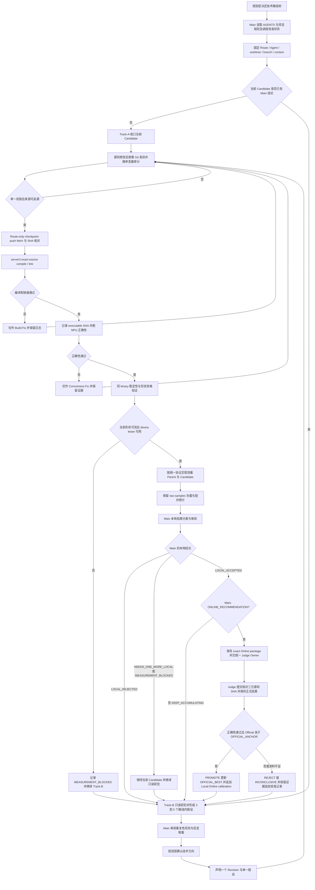

# 实验总则

本文件是当前有效规则；与归档旧规则冲突时以本文件为准。

本文件融合原 `归档/历史控制文件/project-experiment-playbook.md`，规定路线治理、职责分工、Local-first 流程、证据留存与结果判定。操作细节分见同目录 `执行约定.md`、`本地性能测试规范.md`、`Git工作流程.md`、`服务器实验规范.md`、`线上提交规范.md`。

## 迁移后目标路径

重构后正式主线在仓库根目录：

```text
项目规则/     本目录，全部有效规则
技术路线/     路线总表、路线图、路线成绩表.tsv、全版本记录.tsv
调度/         当前任务.tsv、线上候选.tsv、本地线上校准.tsv、服务器设备使用.tsv
本地实验/     原 本地实验，逐 Revision 本地证据
线上结果/     原 线上结果，逐 Revision 正式提交证据
研究/         原 研究，路线内假设研究
```

原 `归档/历史控制文件/*.md` 是本规则的来源，迁移后不再是入口；成绩与分数只看 `技术路线/` 与 `线上结果/` 的正式记录，本目录任何文件都不得写入具体分数。

## 执行入口

任何 Route 操作前按顺序读取：

1. 根目录 `AGENTS.md`
2. `项目规则/实验总则.md`（本文件）
3. `项目规则/执行约定.md`
4. `项目规则/本地性能测试规范.md`
5. 当前 `调度/当前任务.tsv`、`调度/线上候选.tsv`、`调度/本地线上校准.tsv`、`调度/服务器设备使用.tsv`
6. 若是具体 Route：该 Route 的研究记录与当前 Revision 目录

禁止只依赖聊天记忆。Main 与 Route Agent 以 canonical 仓库和上述共享控制文件为事实来源。

## A. 路线治理权限

规划层（Planning / Review Layer）统一决定技术路线树，以及路线的 `KEEP`、`MERGE`、`PARK`、`REPLACE`、新开与关闭。

- Route Agent 与 Codex Main 都**不得**自行决定：`PARK` / `CLOSE` / `ABANDON` / `MERGE` / `REPLACE`、新增正式 Route、释放正式 Route slot。
- 两者只能报告事实、提出建议、提交证据与风险说明。
- 发现 ownership 冲突时，只暂停受影响路线并报告 `OWNERSHIP_CONFLICT`，不影响其他路线。

发现路线级决策需求时，写清楚实验数、正确性进展、本地信号、信息增量与线上结果，交给规划层裁定。

## B. 职责分工

| 角色 | 职责 | 不得做 |
|---|---|---|
| Planning / Review Layer（外部） | 路线池、选路、继续/暂停/合并/替换/关闭、新路线、Explore/Exploit 布局、是否送线上 | — |
| Codex Main | 调度、差异审阅、Git 集成、证据登记、源码溯源、本地结果分类、线上候选准备、统一 Judge 协调、路线建议 | 不编辑 Candidate 的 `.asc`、`.cpp`、`.h`、`.hpp`、CMake、Kernel、runner、host wrapper |
| Route Agent | 实现自己的 Candidate、编译、Correctness、Local performance、Build/Correctness Fix、Track-B 研究、下一轮假设 | 不改共享调度状态、不改其他路线源码、不自行提交线上 |

Main 审阅 Direct Parent、父源码 SHA、Candidate SHA、diff、单假设范围、正确性、executable 身份、本地可比性、负载质量、来源与重复状态。只有 `SINGLE_CHANGE_AUDIT=PASS` 才能进入是否送线上的判断。

## C. Route 隔离与长期归属

```text
1 Route = 1 Agent = 1 worktree = 1 branch = 1 context
```

- Agent 只操作自己的路线，不读取或修改未授权路线的 Candidate，不与其他 Agent 共用可写 Candidate 工作树。
- 同一路线后续 Revision 由原 Agent 继续。
- 只有原 Agent 确认不可恢复时，replacement worker 才继承同一路线、工作树、分支、Revision 与证据；这不算新路线，不得借机换路线。
- 旧 Agent 不直接转去无关路线；Child 不得选择替代路线。

## D. Track-A / Track-B

```text
TRACK-A: 当前实验 —— 保持当前 Candidate 不变，收口当前 Candidate
TRACK-B: 下一假设研究 —— 只读、长周期
```

- Track-A：核实父版本与来源，完成构建、正确性、可比测量与 Main Review；在 Main 给出明确结论前，不做新的性能 Revision、不引入新 donor、不改 Candidate kernel。
- Track-B：路线内只读研究，形成 3–5 个确实不同的后续假设，记录 MECHANISM、BOTTLENECK、EXPECTED_SHAPES、WHY_IT_MAY_HELP、WHY_IT_MAY_FAIL、ASCEND_FEASIBILITY、UB/CORE/DMA_IMPACT、SYNC_IMPACT、PRECISION_RISK、DUPLICATE_CHECK、MINIMAL_OFAT_DIFF、EXPECTED_LOCAL_PROBES。按成熟度分类（`READY_FOR_MAIN_REVIEW` / `NEEDS_MORE_EVIDENCE` / `DUPLICATE` / `INFEASIBLE`），不按分数分类。
- Candidate 等设备或等 Judge 时 Track-B 继续，Agent 不进入空转。
- Main 一次只批准一个假设。研究不改变评分权限：本地百分比永远不是 Official Score，只有统一 Judge Owner 可以提交线上。
- 路线级 `KEEP / PARK / MERGE / REPLACE` 仍由规划层决定。

## E. Local-first 流程

```text
Current Validated Local Best（或该路线合格起点）
  → Single Hypothesis（Revision 声明，见 执行约定.md）
  → Agent Code
  → Compile
  → Link
  → Targeted NPU Correctness
  → Local Measurement（见 本地性能测试规范.md）
  → Child Handoff
  → Main Review
  → 本地结论分类
  → 是否 ONLINE_WORTHY / KEEP_ACCUMULATING
```

非计时状态各自独立保留：`BUILD`、`CORRECTNESS`、`EXECUTABLE_IDENTITY` 分别记 `PASS` / `FAIL` / `INCOMPLETE` 或 `MISSING`。只有计时阶段允许出现 `MEASUREMENT_BLOCKED`，原因是设备负载或形状资格不可用。

## F. 结果判定

### 本地结论

每个性能 Revision 必须单独形成 server3 本地结论，不得沿用相邻版本结论，也不得从线上成绩反推本地结果。合格枚举：

| 结论 | 含义 |
|---|---|
| `LOCAL_ACCEPTED` | 来源身份、compile、link、correctness、same-binary 与有效配对测量全部通过，改善稳定且超过该形状噪声范围；只有它可推进 `LOCAL_BEST` |
| `LOCAL_REJECTED` | 正确性已通过，但配对测量显示稳定性能退化；下一个独立性能 Revision 回到此前 `LOCAL_BEST` |
| `NEEDS_ONE_MORE_LOCAL` | 方向混合、证据不足或差异落在噪声范围内；保持当前 Candidate，不叠加新性能变化 |
| `MEASUREMENT_BLOCKED` | 设备、负载、same-binary 稳定性或身份不满足测量条件；必须带 `BLOCK_REASON`、`DATE`、`SHAPE`、`DEVICE`、`SAME_BINARY_RESULT`、`RETRY_REQUIRED` |
| `CORRECTNESS_FAILED` | 目标 NPU correctness 失败 |
| `BUILD_FAILED` | server3 compile 或 link 失败 |
| `INVALID_SOURCE_IDENTITY` | 源码与被测或构建对象身份无法对应 |

没有结论记 `NOT_COMPLETE`；不得用未定义的 `PENDING` 代替结论。不把缺少测量当作零收益。负载污染的数据保留为污染证据，不用于强性能结论。

### 三个独立引用

每条路线分别维护 `OFFICIAL_BEST`、`LOCAL_BEST`、`CURRENT_CANDIDATE`。只有 `LOCAL_ACCEPTED` 推进 `LOCAL_BEST`；每次接受都保留直接父子关系，构成可累积的 Local Best chain。`OFFICIAL_ANCHOR` 是最近一次已 `PROMOTE` 的 Official Best。

- 本地：每个 Revision 只与自己的 `DIRECT_PARENT` 配对比较。
- 线上：每个线上结果只与该次提交记录的 `OFFICIAL_ANCHOR` 比较。

### 是否送线上

两级判定：Codex Main 只做 **ONLINE_RECOMMENDATION**（`WORTHY` / `NOT_WORTHY`，即原 ONLINE_WORTHY/KEEP_ACCUMULATING），记录理由；Planning / Review Layer 做 **ONLINE_DECISION**（`APPROVED` / `HOLD`）。只有 APPROVED 才允许 Judge Owner 提交。两类触发：单一 Revision 出现明显、稳定且超过噪声的突破；或连续 `LOCAL_ACCEPTED` 形成可信 Local Best 链、累计改善相对最近 `OFFICIAL_ANCHOR` 已值得线上验证。判断须考虑测量噪声、历史 Local/Online 校准、形状覆盖与收益方向一致性，**不设脱离数据的固定百分比阈值**。具体提交流程见 `线上提交规范.md`。

## G. 证据留存

- 失败、Rejected、Inconclusive、工具失败与来源身份不一致的实验全部保留：源码、父版本差异、声明、构建/链接/正确性日志、executable 身份、raw timing、设备快照、handoff 与 Main Review。
- 本地证据放 `本地实验/<ROUTE>/<REVISION>/`，线上证据放 `线上结果/<ROUTE>/<REVISION>/`，路线研究放 `研究/<ROUTE>/`。每个 Revision 目录只写一次，不覆盖已产生证据的版本。
- 有编译、正确性、本地测量或 Main Review 证据的 Revision，必须有永久目录，版本号不得被覆盖。
- 最小留存清单见 `执行约定.md`。

## H. 共享状态与多 Main 协作

以下为多 Main 共享状态（迁移后路径）：

```text
调度/当前任务.tsv
调度/线上候选.tsv
调度/本地线上校准.tsv
调度/服务器设备使用.tsv
```

- 其他 Main 更新非本 Main 路线时接受最新值，不覆盖。
- 本 Main 路线 ownership 被改时，记录 `OWNERSHIP_CONFLICT` 并只暂停受影响路线；其他路线状态与设备字段不覆盖，不停止无关路线。
- 修改共享状态前重新读取最新 HEAD 与文件内容，只做最小行级改动，且只能改本 Main 所有路线的行；不整体重新生成共享文件。
- Route 分支推送与共享控制提交分开进行。

## I. 中文总流程


